# Awesome GPT Image 2.5 Prompts 🎨

[English](README.md) | [简体中文](README_zh.md)

**Creative image prompts and workflows, curated by SeeAPI.**

Explore GPT Image 2.5 ideas for character stickers, product visuals, miniature worlds, GIF assets, and stop-motion-style scenes. Copy a prompt, make it your own, and explore new creative directions.

This collection will grow with regular additions of prompt examples, generated images, and practical reproduction notes.

**5 creative workflows · 104 standalone prompts · Updated September 24, 2026**

⭐ Star this collection to save it for your next creative project.

## 🖼️ Featured Examples

| Pixel Art GIF | Minecraft Skin | Bedroom Redesign |
| :---: | :---: | :---: |
| Animated result | Before → After | Before → After |
| [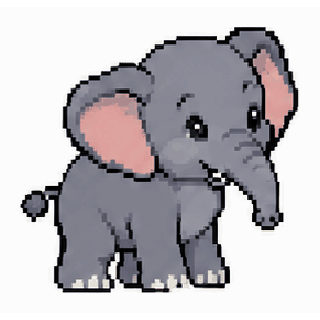](#c01-pixel-art-character-gif-by-seeapi) | [](assets/p41-minecraft-skin-from-reference/reference.png) [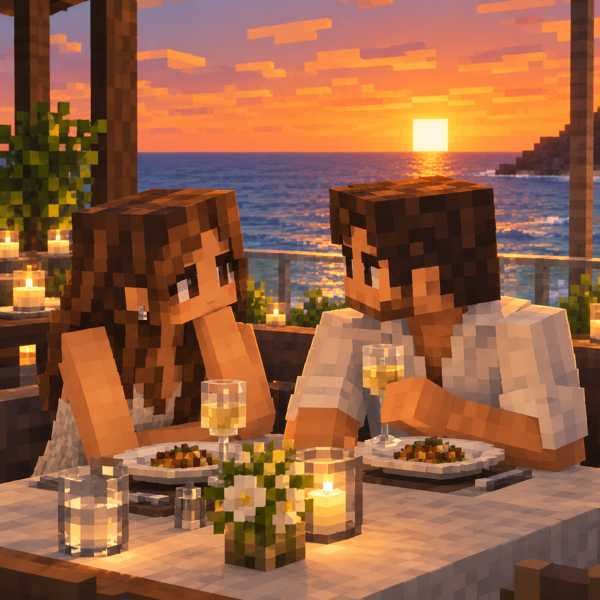](assets/p41-minecraft-skin-from-reference/result.png) | [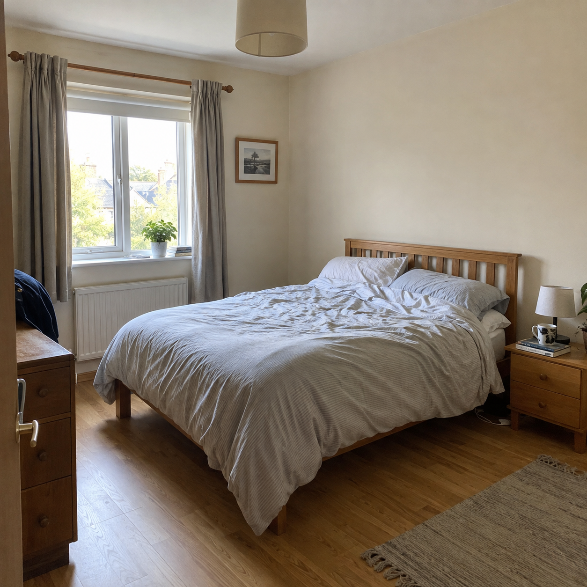](assets/p42-bedroom-redesign/reference.png) [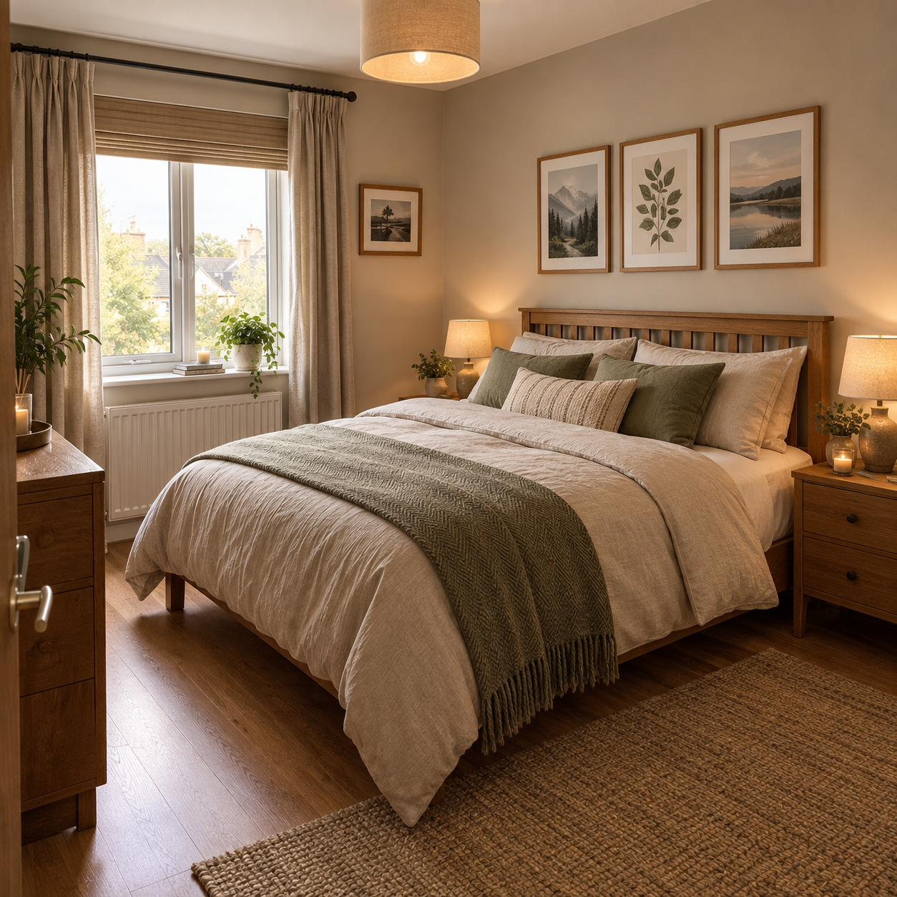](assets/p42-bedroom-redesign/result.png) |
| Text → image → GIF | Image → image | Image → image |
| [Prompt & steps](#c01-pixel-art-character-gif-by-seeapi) | [Full prompt](#p41-minecraft-skin-from-a-reference) | [Full prompt](#p42-bedroom-redesign-from-your-photo) |


## 📖 Contents

**Repository Guide**

- [🖼️ Featured Examples](#-featured-examples)
- [🧭 Choose Your Model](#-choose-your-model)
- [📝 Sources, Reuse & Maintenance](#-sources-reuse--maintenance)
- [🙏 Acknowledgments](#-acknowledgments)

**Prompt Categories**

- [📷 Portraits & Photography](#-portraits--photography)
- [🧸 Characters & Playful Creations](#-characters--playful-creations)
- [🛍️ Products & Branding](#-products--branding)
- [🎨 Posters & Artistic Styles](#-posters--artistic-styles)
- [🏡 Home & Interior Design](#-home--interior-design)
- [📊 Infographics & Practical Design](#-infographics--practical-design)
- [🎬 GIF & Video Workflows](#-gif--video-workflows)

## 🧭 Choose Your Model

OpenAI's GPT Image 2.5 family includes **GPT Image 2.5 Sunburst** and **GPT Image 2.5 Flare**. Both accept text and images and produce still images. The recommendations below are separate from the provenance of the example assets.

| Comparison | GPT Image 2.5 Sunburst | GPT Image 2.5 Flare |
|---|---|---|
| Main strength | Image generation and precise editing | Fast, high-quality everyday generation |
| Choose when | Editing precision is your priority | Generation speed is your priority |
| Input | Text and images | Text and images |
| Output | Still images | Still images |
| API model ID | `gpt-image-2.5-sunburst` | `gpt-image-2.5-flare` |
| Official reference | [OpenAI documentation](https://developers.openai.com/api/docs/models/gpt-image-2.5-sunburst) | [OpenAI documentation](https://developers.openai.com/api/docs/models/gpt-image-2.5-flare) |

<a id="-browse-by-category"></a>
<a id="-prompt-directory"></a>

<a id="-portraits--photography"></a>

## 📷 Portraits & Photography

<a id="p54-cinematic-modern-mafia-boss-portrait"></a>

### 📌 1.1. Cinematic Modern Mafia Boss Portrait

#### 👀 Preview

[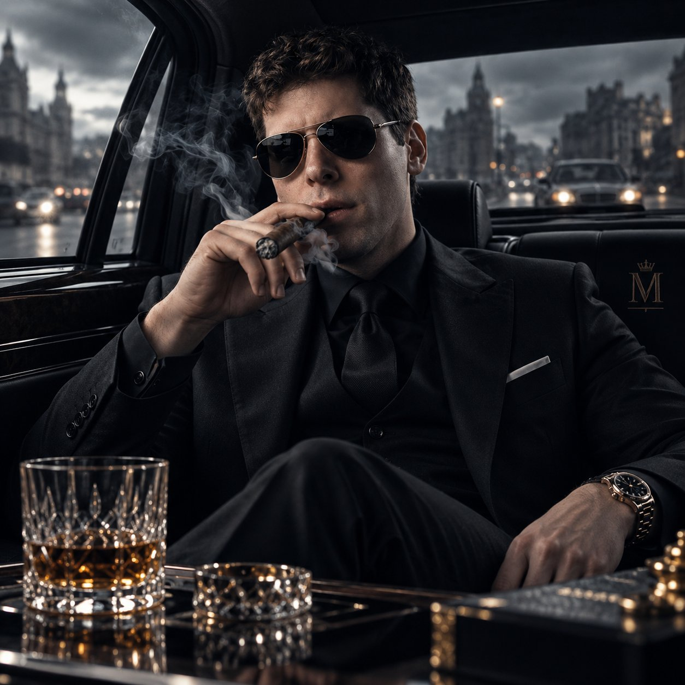](assets/p54-cinematic-modern-mafia-boss-portrait/source-example-01.jpg)

#### 👇 Workflow

`Face reference → cinematic portrait`

#### 🔖 Full Prompt

```text
Create a hyper-realistic, cinematic portrait of me (use uploaded face) as a modern mafia boss. I’m sitting in a luxury black car, wearing a black suit and tinted aviator sunglasses, smoking a thick cigar. Cold, fearless expression. Background: moody sky + blurred city/street for noir feel. Cool tones, high contrast. Sharp details on face & smoke. Style: 8K, movie-poster quality, shallow depth of field 1:1
```

<sub>(by [@john_my07](https://x.com/john_my07/status/2099745210196738366)) · [Source: X](https://x.com/john_my07/status/2099745210196738366)</sub>

<a id="p49-soft-hijab-beauty-portrait"></a>

### 📌 1.2. Soft Hijab Beauty Portrait

#### 👀 Preview

[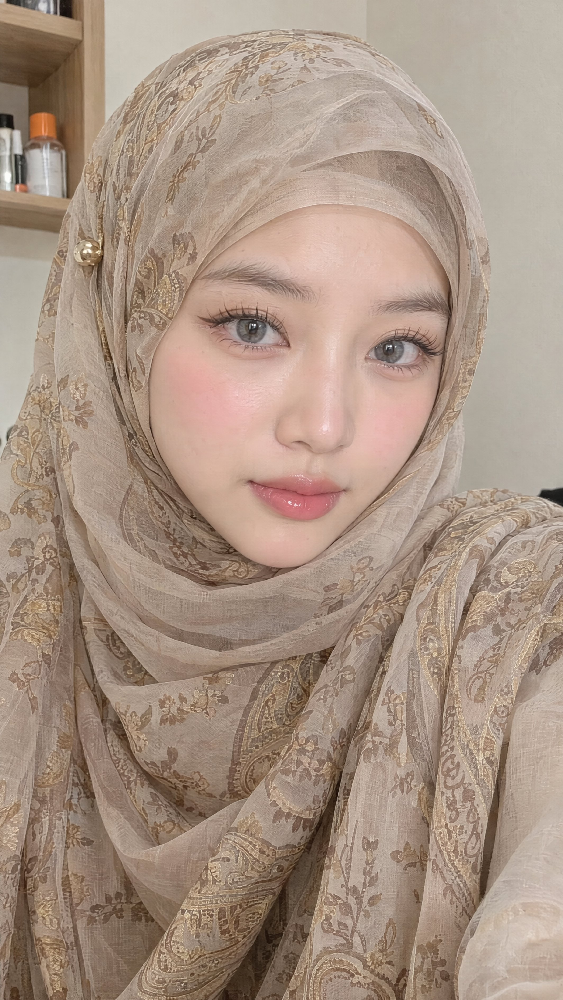](assets/p49-soft-hijab-beauty-portrait/source-example-01.jpg)

#### 👇 Workflow

`Text → beauty portrait`

#### 🔖 Full Prompt

```text
A close-up portrait of a young East Asian woman with fair, smooth porcelain skin and a soft, even complexion. She has large, almond-shaped light gray-blue eyes with long, dark, defined eyelashes and subtle eyeliner. Her eyebrows are slender and neatly shaped. She wears natural, dewy makeup with a soft pink blush on the cheeks and glossy, slightly plump rose-pink lips. She looks directly at the camera with a calm, gentle, slightly reserved expression.

She is wearing a sheer, lightweight hijab in muted beige, taupe, and champagne tones with an intricate paisley and floral pattern in gold and brown. The fabric is draped loosely and layered around her head and shoulders, covering all of her hair. A small gold spherical pin or brooch is visible on the left side of the hijab near her temple. The fabric has a soft, slightly translucent quality with gentle folds and texture.

The background is an indoor setting with a light-colored wall and a wooden shelf visible in the upper left, holding a few bottles (one with an orange cap). Soft, natural indoor lighting creates a warm, flattering glow on her face with no harsh shadows.

Photorealistic, high-detail beauty portrait, shallow depth of field, soft focus on the background, elegant and modest styling.
```

<sub>(by [@woleswoosh](https://x.com/woleswoosh/status/2099774470374502450)) · [Source: X](https://x.com/woleswoosh/status/2099774470374502450)</sub>

<a id="p47-y2k-queen-of-the-women-s-kingdom"></a>

### 📌 1.3. Y2K Queen of the Women's Kingdom

#### 👀 Preview

[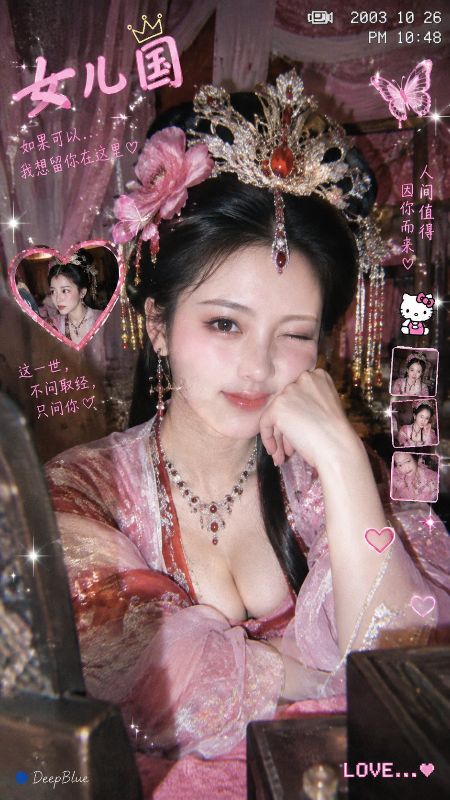](assets/p47-y2k-queen-of-the-women-s-kingdom/source-example-01.jpg)

#### 👇 Workflow

`Text → Y2K portrait`

#### 🔖 Full Prompt

```text
Y2K non-mainstream style × early digital aesthetic × contrasting cuteness × Queen of the Women's Kingdom
```

<sub>(by [@DeepBlueX0](https://x.com/DeepBlueX0/status/2099303054797606998)) · [Source: X](https://x.com/DeepBlueX0/status/2099303054797606998) · English translation by SeeAPI</sub>

<a id="p46-atmospheric-dressing-room-fashion-portrait"></a>

### 📌 1.4. Atmospheric Dressing-Room Fashion Portrait

#### 👀 Preview

[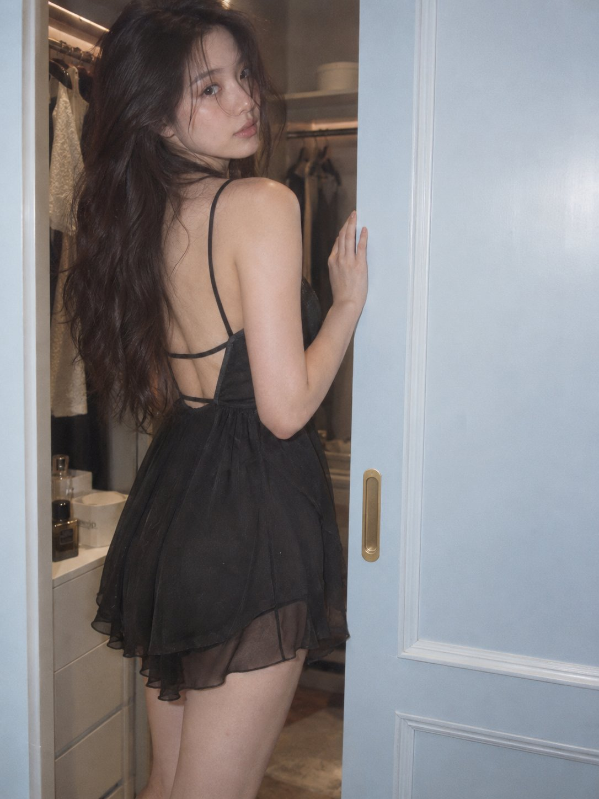](assets/p46-atmospheric-dressing-room-fashion-portrait/source-example-01.jpg)

#### 👇 Workflow

`Text → fashion portrait`

#### 🔖 Full Prompt

```text
A candid, atmospheric back-view fashion portrait of an adult East Asian woman pausing inside a partially opened dressing-room doorway, composed in a 3:4 vertical aspect ratio. The image feels like an intimate personal-diary photograph taken spontaneously by a friend: slightly imperfect, softly hazy, understated, fashionable, and emotionally suggestive without looking staged or commercially polished.

The woman stands left of center with her back facing the camera. The camera is positioned close behind her at approximately waist height, framing her from the top of her head to the middle of her thighs. One edge of the doorway enters the foreground and partially encloses the composition, creating the feeling of observing a fleeting private moment. The frame is subtly asymmetrical with generous pale negative space on the right.

Her body faces into the wardrobe while her shoulders remain relaxed. Her left hand rests loosely on the edge of the sliding door, with naturally curved fingers. Her weight settles onto one leg, creating a gentle, unforced curve through her posture. She turns her head back over her left shoulder, revealing only part of her face through loose strands of hair. Her expression is quiet and slightly distant, with soft direct eye contact and relaxed closed lips.

She has a delicate oval face, softly tapered jawline, dark almond-shaped eyes, naturally straight eyebrows, a slender nose, and muted rose-pink lips. Her makeup is minimal and lived-in: lightweight natural foundation, soft brown eyeliner, separated lashes, faint cheek color, and a sheer satin lip tint.

Her long dark espresso-brown hair falls freely down her back in loose, irregular waves. The volume is natural and slightly tousled, with flattened areas, overlapping sections, fine flyaways, and individual strands. Several soft strands drift across her cheek and partially cover one eye. The hair appears touchable and casually styled rather than salon-perfect.

She wears a refined black silk-chiffon mini dress designed as evening fashion rather than lingerie. The dress has narrow shoulder straps, a softly structured fitted bodice, a low open back with two delicate horizontal silk straps, and a lightweight skirt falling from the waist in loose translucent layers. An opaque black silk lining provides complete coverage beneath the outer chiffon, while only the floating skirt edges and side layers transmit light. The fabric has a soft matte finish, fine weave, natural wrinkles, gentle movement, and delicate handmade seams.

The dressing room is sparse and softly blurred: a pale powder-blue sliding door with white molding and a narrow brushed-gold handle, a warm gray-beige wardrobe interior, several slim horizontal rails, and the edge of a simple white drawer unit. The environment remains quiet and uncluttered, allowing the dark figure and pale architectural shapes to define the frame.

Cool window light from outside the room mixes with dim warm ambient light from within the wardrobe. A weak direct compact-camera flash gently lifts her face, shoulder, hand, and the edges of the black chiffon while leaving the background slightly underexposed. The mixed lighting creates creamy skin, pale lavender-gray shadows, softened blacks, faint pink warmth in the highlights, and subtle falloff toward the corners.

Captured with a small premium compact camera and a 35mm-equivalent lens, close handheld perspective, slightly off-level framing, shallow depth of field, gentle focus falloff, mild highlight halation, restrained direct-flash character, subtle motion softness in a few hair strands, and fine visible grain. The photograph feels casual yet carefully observed, like a quiet late-evening fashion snapshot saved from a private social-media story.

Hyperrealistic photography. Authentic human skin with visible pores, fine peach fuzz, natural tonal variation, slight redness around the knuckles and shoulder, subtle skin compression, and small realistic imperfections. Hair rendered strand by strand with genuine gravity, irregular separation, flyaways, and soft reflected light. Silk chiffon rendered with real weave, layered transparency, opaque lining, natural weight, soft creases, unfinished movement, and delicate edge stitching. Low-contrast analog color, gentle sensor grain, soft flash bloom, slight lens vignette, muted powder blue, warm gray, creamy ivory, and deep soft black. Intimate, effortless, dreamy, tasteful, naturally imperfect, and convincingly photographic.
```

<sub>(by [@johnAGI168](https://x.com/johnAGI168/status/2099160929418031152)) · [Source: X](https://x.com/johnAGI168/status/2099160929418031152)</sub>

<a id="p45-natural-4k-photo-restoration"></a>

### 📌 1.5. Natural 4K Photo Restoration

#### 👀 Preview

[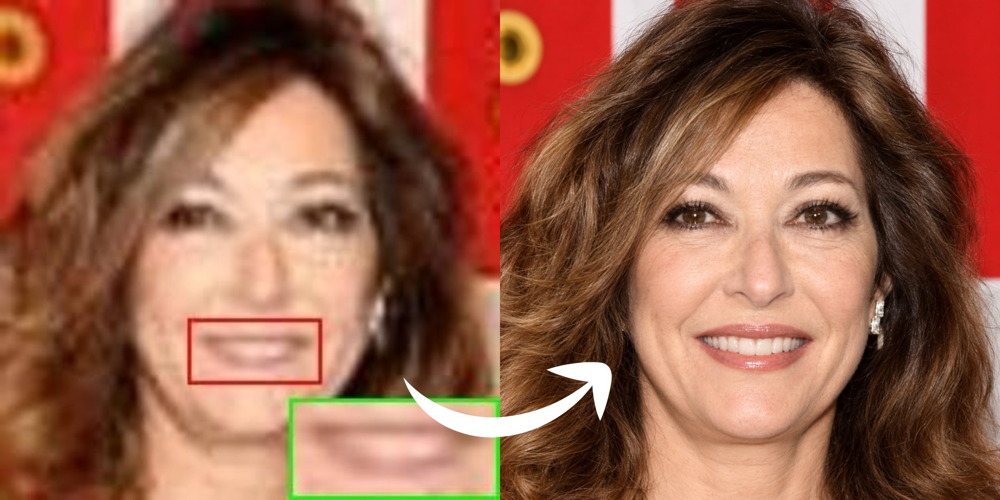](assets/p45-natural-4k-photo-restoration/source-example-01.jpg)

#### 👇 Workflow

`Photo reference → restored photo`

#### 🔖 Full Prompt

```text
upscale this image to 4K. preserve every detail. make it look natural and raw. remove editing marks and artifacts.
```

<sub>(by [@ViralOps_](https://x.com/ViralOps_/status/2098774775934198214)) · [Source: X](https://x.com/ViralOps_/status/2098774775934198214)</sub>

<a id="p38-candid-mont-saint-michel-travel-portrait"></a>

### 📌 1.6. Candid Mont-Saint-Michel Travel Portrait

#### 👀 Preview

[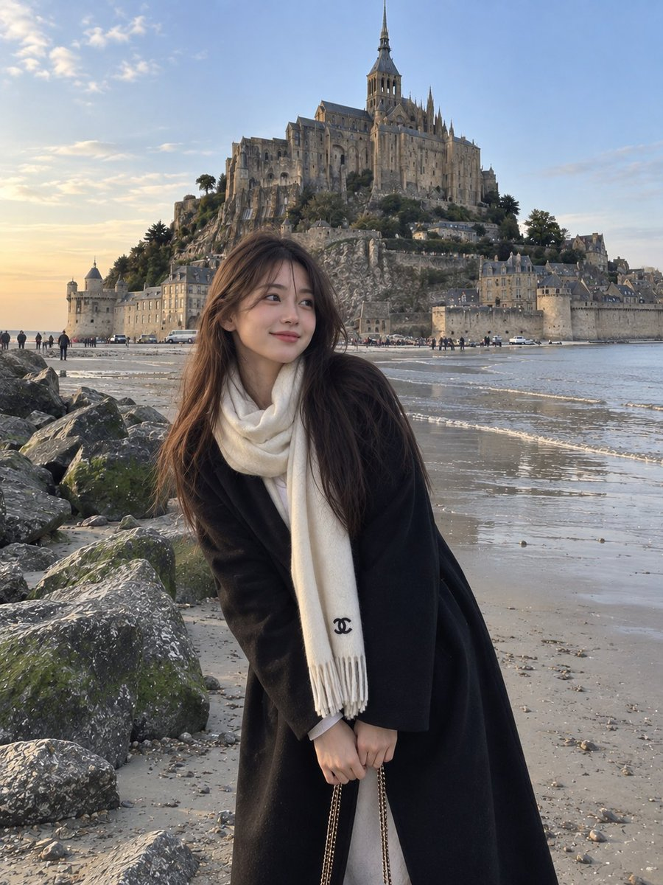](assets/p38-candid-mont-saint-michel-travel-portrait/source-example-01.jpg)

#### 👇 Workflow

`Portrait reference → styled portrait`

#### 🔖 Full Prompt

```text
Use the uploaded portrait as the identity reference for the main person. Preserve their recognizable face, age, skin tone, gender presentation, hairstyle, and body proportions. Do not replace their identity with a generic model or impose a different ethnicity, gender, or body type.

Create a photorealistic candid travel portrait of this person on a sandy shoreline beside moss-covered rocks, with Mont-Saint-Michel’s historic abbey, stone walls, and tidal flats behind them. Keep the referenced hairstyle and facial features, with a natural warm smile toward the camera.

Dress the person in a long oversized black coat over a light outfit, a soft cream-white scarf without logos, and an understated shoulder bag. Hands rest casually in the coat pockets. Show the person in the foreground and the abbey clearly in the background. Soft evening light, pale blue sky, realistic fabric and skin texture, subtle smartphone aesthetic, gentle color grading, natural proportions, vertical 3:4 composition. No invented brand emblems or text.
```

<sub>(by [@saniaspeaks_](https://x.com/saniaspeaks_/status/2097532595814940683)) · [Source: X](https://x.com/saniaspeaks_/status/2097532595814940683) · Reference adaptation by SeeAPI</sub>

<a id="p37-realistic-iphone-cafe-portrait"></a>

### 📌 1.7. Realistic iPhone Cafe Portrait

#### 👀 Preview

[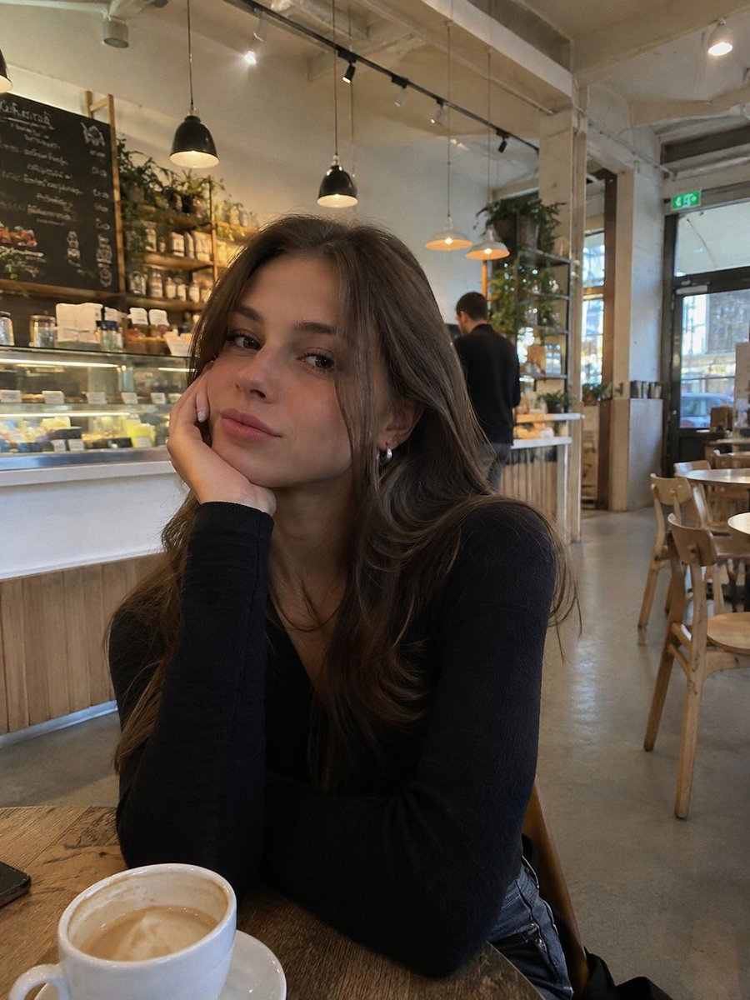](assets/p37-realistic-iphone-cafe-portrait/source-example-01.jpg)

#### 👇 Workflow

`Portrait reference → styled portrait`

#### 🔖 Full Prompt

```text
Use the uploaded portrait as the identity reference for the main person. Preserve their recognizable face, age, skin tone, gender presentation, hairstyle, and body proportions. Do not replace their identity with a generic model or impose a different ethnicity, gender, or body type.

Create a realistic iPhone-style candid photo of this person in [cafe setting], wearing [outfit] and [simple action]. Natural available light, realistic skin texture, casual smartphone framing, believable hands and contact with furniture, restrained depth of field, and everyday colors. No beauty-filter face, changed body shape, added foreground people, text, or watermark.
```

<sub>(by [@blueemi99](https://x.com/blueemi99/status/2097602273085931662)) · [Source: X](https://x.com/blueemi99/status/2097602273085931662) · Reference adaptation by SeeAPI</sub>

<a id="p36-dreamy-high-angle-qipao-portrait"></a>

### 📌 1.8. Dreamy High-Angle Qipao Portrait

#### 👀 Preview

[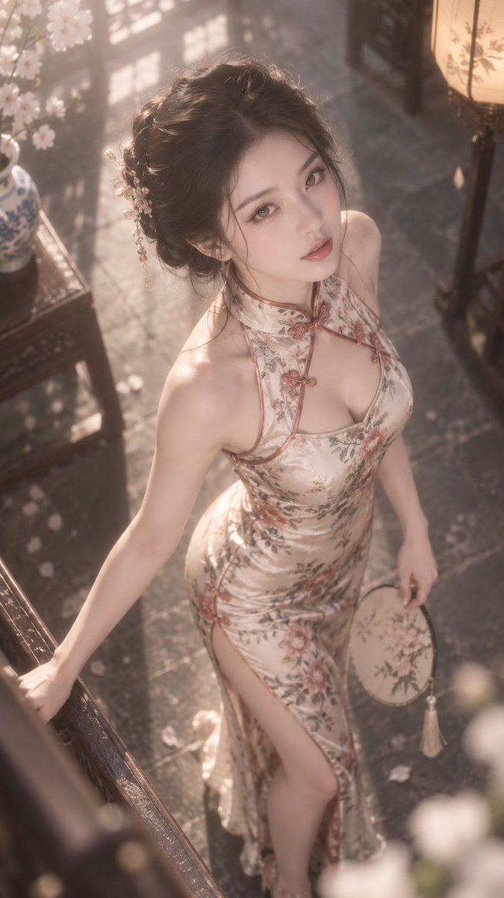](assets/p36-dreamy-high-angle-qipao-portrait/source-example-01.jpg)

#### 👇 Workflow

`Portrait reference → styled portrait`

#### 🔖 Full Prompt

```text
Use the uploaded portrait as the identity reference for the main person. Preserve their recognizable face, age, skin tone, gender presentation, hairstyle, and body proportions. Do not replace their identity with a generic model or impose a different ethnicity, gender, or body type.

Create a vertical 9:16 fashion portrait of this person wearing [qipao color and design], fitted naturally to their actual proportions. High-angle camera looking down, soft light bloom, dreamy background blur, refined [makeup style], and gentle elegant posing. Keep the face recognizable and sufficiently sharp. Do not impose a taller or slimmer body, reshape the eyes, or change gender presentation. No text or watermark.
```

<sub>(by [@BubbleBrain](https://x.com/BubbleBrain/status/2097513469172129825)) · [Source: X](https://x.com/BubbleBrain/status/2097513469172129825) · Reference adaptation by SeeAPI</sub>

<a id="p35-monochrome-cybernetic-horror-portrait"></a>

### 📌 1.9. Monochrome Cybernetic Horror Portrait

#### 👀 Preview

[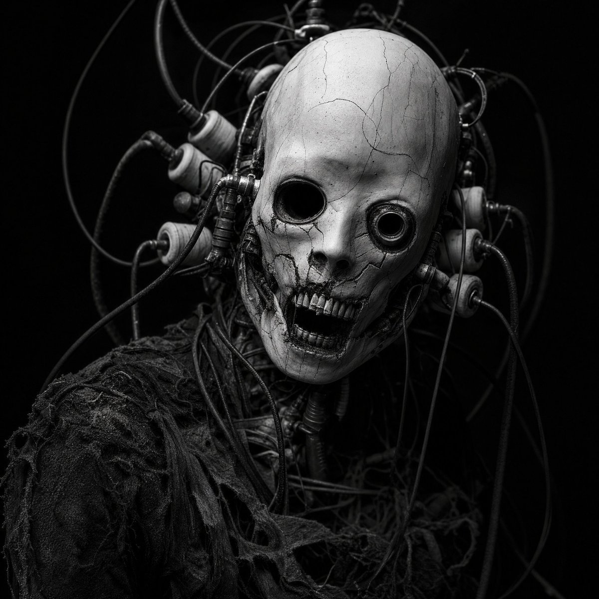](assets/p35-monochrome-cybernetic-horror-portrait/source-example-01.jpg)

#### 👇 Workflow

`Portrait reference → styled portrait`

#### 🔖 Full Prompt

```text
Use the uploaded portrait as the identity reference for the main person. Preserve their recognizable face, age, skin tone, gender presentation, hairstyle, and body proportions. Do not replace their identity with a generic model or impose a different ethnicity, gender, or body type.

Transform the portrait into a monochrome cybernetic horror photograph. Keep the person recognizable through their facial structure and expression; use cracked porcelain-white prosthetic surfaces and recessed metallic details around the eyes without replacing the head or changing facial proportions. Surround the head with black cables and industrial coil attachments, and use tattered dark fabric clothing. Dramatic low-key light, deep black background, high-contrast monochrome, tactile practical-effects detail, 85mm portrait lens, shallow depth of field. No extra person, enlarged eyes, unrelated face, or text.
```

<sub>(by [@meng_dagg695](https://x.com/meng_dagg695/status/2097558679956664521)) · [Source: X](https://x.com/meng_dagg695/status/2097558679956664521) · Reference adaptation by SeeAPI</sub>

<a id="p29-caramel-suit-studio-portrait"></a>

### 📌 1.10. Caramel Suit Studio Portrait

#### 👀 Preview

[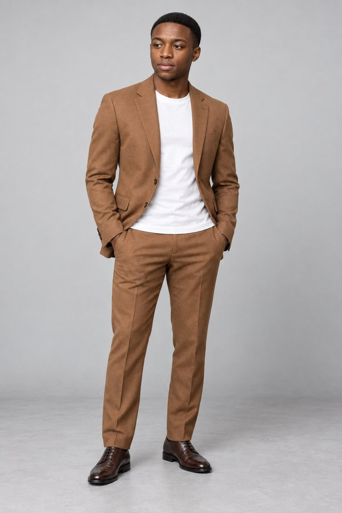](assets/p29-caramel-suit-studio-portrait/source-example-01.jpg)

#### 👇 Workflow

`Portrait reference → styled portrait`

#### 🔖 Full Prompt

```text
Use the uploaded portrait as the identity reference for the main person. Preserve their recognizable face, age, skin tone, gender presentation, hairstyle, and body proportions. Do not replace their identity with a generic model or impose a different ethnicity, gender, or body type.

Create a photorealistic full-body studio portrait. Dress the referenced person in a warm caramel-brown tailored single-breasted blazer and matching straight-cut trousers, a plain white crew-neck T-shirt, and polished dark brown leather lace-up shoes. Fit the outfit to their existing body proportions. Preserve their hair and facial hair rather than imposing a new haircut or clean-shaven face.

Both hands rest naturally inside the trouser pockets, shoulders relaxed, posture upright, feet comfortably spaced, gaze slightly away from the camera. Plain light-gray studio background and seamless floor, soft diffused light, realistic skin and fabric folds, crisp facial detail, subtle contact shadows. Full-body head-to-shoes framing, eye-level camera, editorial fashion photography, vertical 2:3 composition. No new accessories or text.
```

<sub>(by [@abs_uiux](https://x.com/abs_uiux/status/2098216202870964315)) · [Source: X](https://x.com/abs_uiux/status/2098216202870964315) · Reference adaptation by SeeAPI</sub>

<a id="p17-1969-outdoor-festival-crowd"></a>

### 📌 1.11. 1969 Outdoor Festival Crowd

#### 👀 Preview

[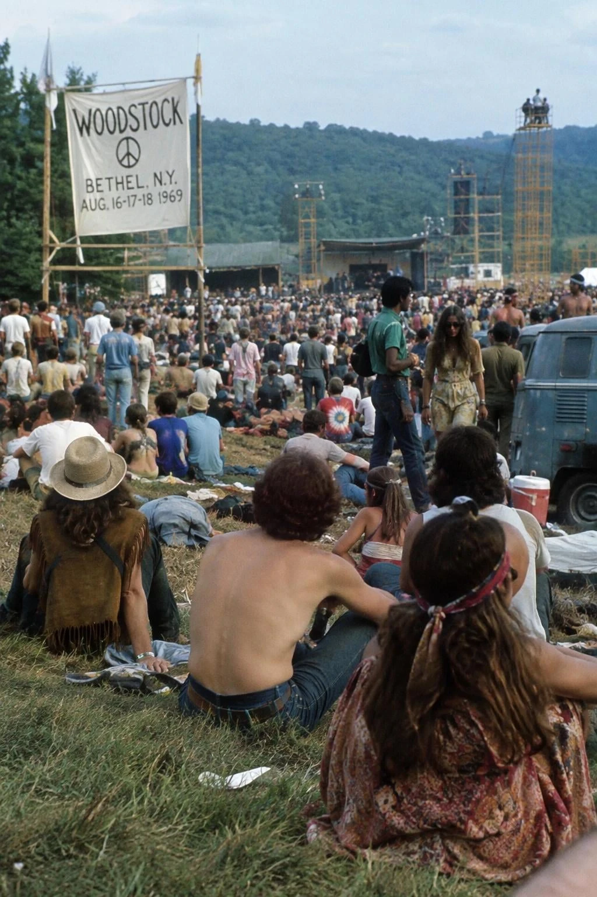](assets/p17-1969-outdoor-festival-crowd/source-example-01.webp)

[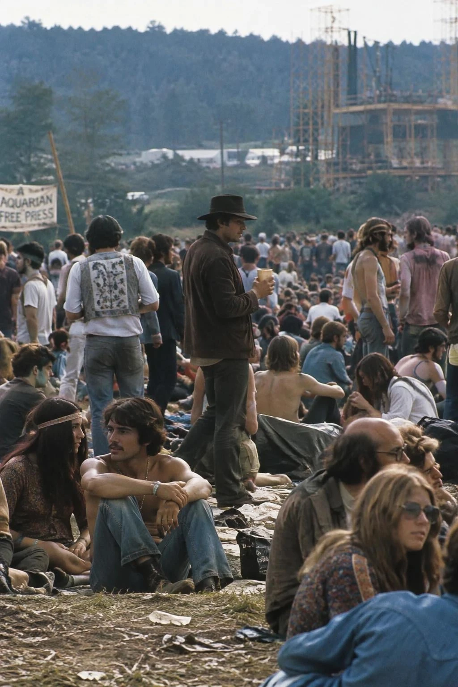](assets/p17-1969-outdoor-festival-crowd/source-example-02.webp)

#### 👇 Workflow

`Text → image`

#### 🔖 Full Prompt

```text
Create a realistic outdoor crowd scene in Bethel, New York on August 16, 1969.
Photorealistic, period-accurate clothing, staging, and environment.
```

<sub>[Source: Reddit](https://www.reddit.com/r/ChatGPT/comments/1wcatvx/gpt_image_25_prompt_guide_2026_13_8_rules_and_8/)</sub>

<a id="p13-candid-sailor-portrait"></a>

### 📌 1.12. Candid Sailor Portrait

#### 👀 Preview

[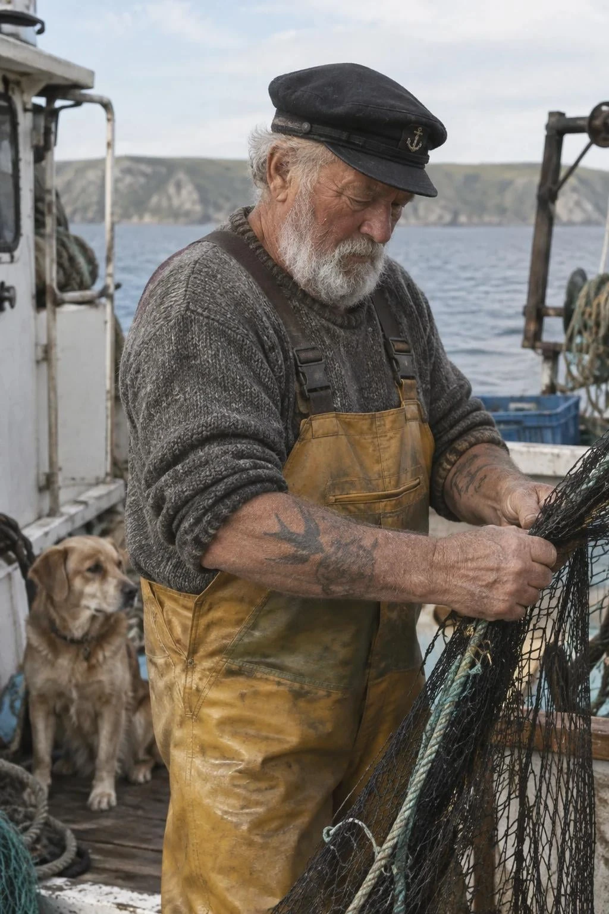](assets/p13-candid-sailor-portrait/source-example-01.webp)

#### 👇 Workflow

`Portrait reference → styled portrait`

#### 🔖 Full Prompt

```text
Use the uploaded portrait as the identity reference for the main person. Preserve their recognizable face, age, skin tone, gender presentation, hairstyle, and body proportions. Do not replace their identity with a generic model or impose a different ethnicity, gender, or body type.

Create a photorealistic candid photograph of this person on a small fishing boat, calmly adjusting a net while a dog sits nearby on the deck. Dress them in [practical sailing outfit]. Preserve existing skin texture and age rather than adding wrinkles or tattoos. Eye-level medium portrait, 50mm lens, soft coastal daylight, shallow depth of field, 35mm film grain, natural colors, worn materials, and an unposed everyday mood. No heavy retouching.
```

<sub>[Source: Reddit](https://www.reddit.com/r/ChatGPT/comments/1wcatvx/gpt_image_25_prompt_guide_2026_13_8_rules_and_8/) · Reference adaptation by SeeAPI</sub>

<a id="p12-cinematic-subway-motion-portrait"></a>

### 📌 1.13. Cinematic Subway Motion Portrait

#### 👀 Preview

[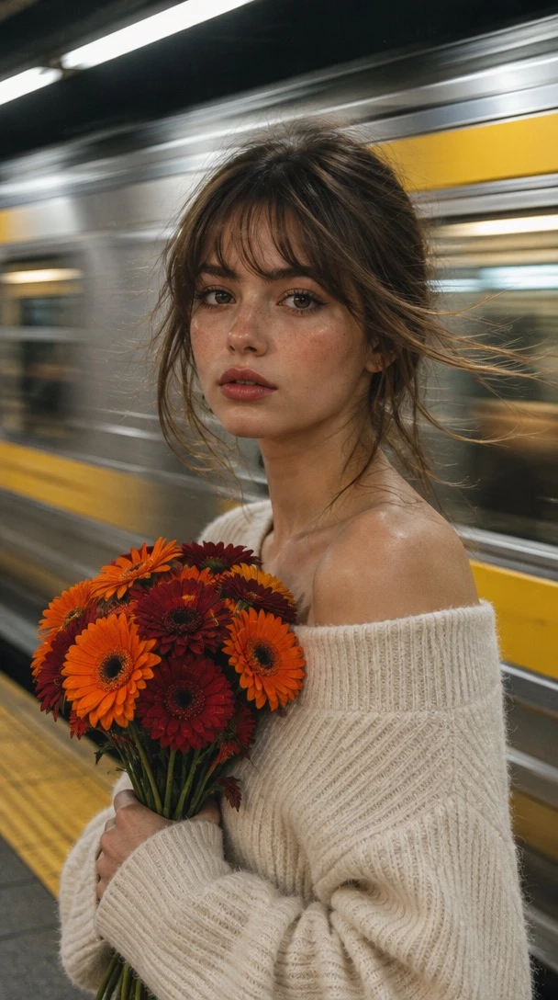](assets/p12-cinematic-subway-motion-portrait/source-example-01.webp)

#### 👇 Workflow

`Portrait reference → styled portrait`

#### 🔖 Full Prompt

```text
Use the uploaded portrait as the identity reference for the main person. Preserve their recognizable face, age, skin tone, gender presentation, hairstyle, and body proportions. Do not replace their identity with a generic model or impose a different ethnicity, gender, or body type.

Create a cinematic portrait of this person standing still on a subway platform as a silver and yellow train rushes behind them in horizontal motion blur. Keep the face sharp with a calm expression. Dress the person in [outfit] and have them hold [bouquet or prop]. Preserve their hair while allowing a few strands to move naturally in the passing air. Blend cool overhead station light with warm skin highlights, shallow depth of field, realistic skin texture, and subtle film grain.
```

<sub>[Source: SeeAPI](https://www.aiimage.net/prompts/) · Reference adaptation by SeeAPI</sub>

<a id="p10-1980s-retro-film-portrait"></a>

### 📌 1.14. 1980s Retro Film Portrait

#### 👀 Preview

[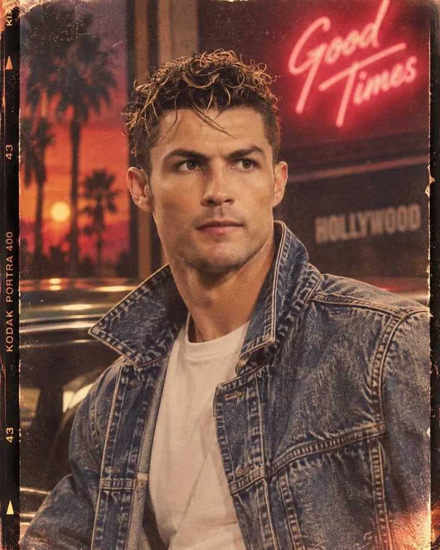](assets/p10-1980s-retro-film-portrait/source-example-01.webp)

[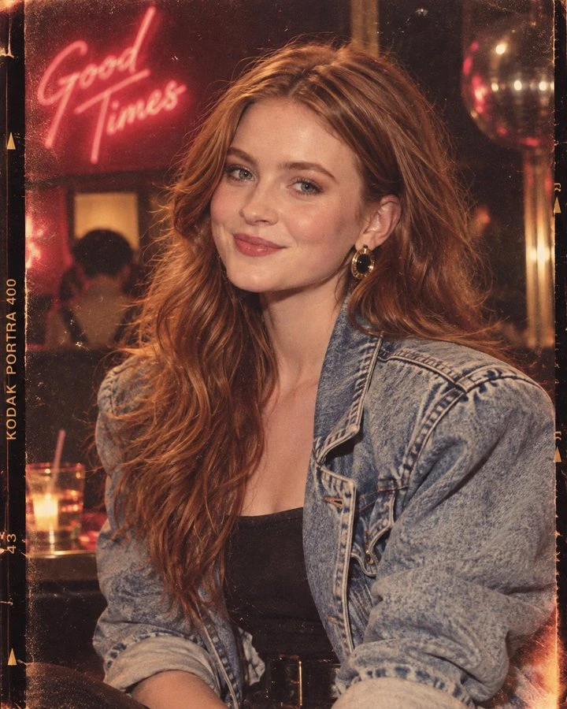](assets/p10-1980s-retro-film-portrait/source-example-02.webp)

[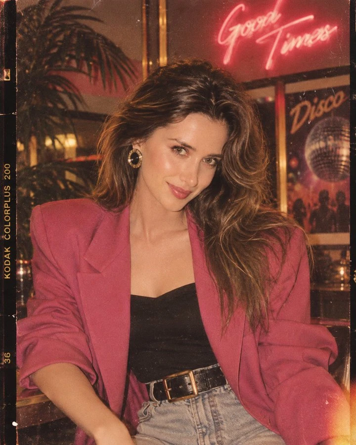](assets/p10-1980s-retro-film-portrait/source-example-03.webp)

[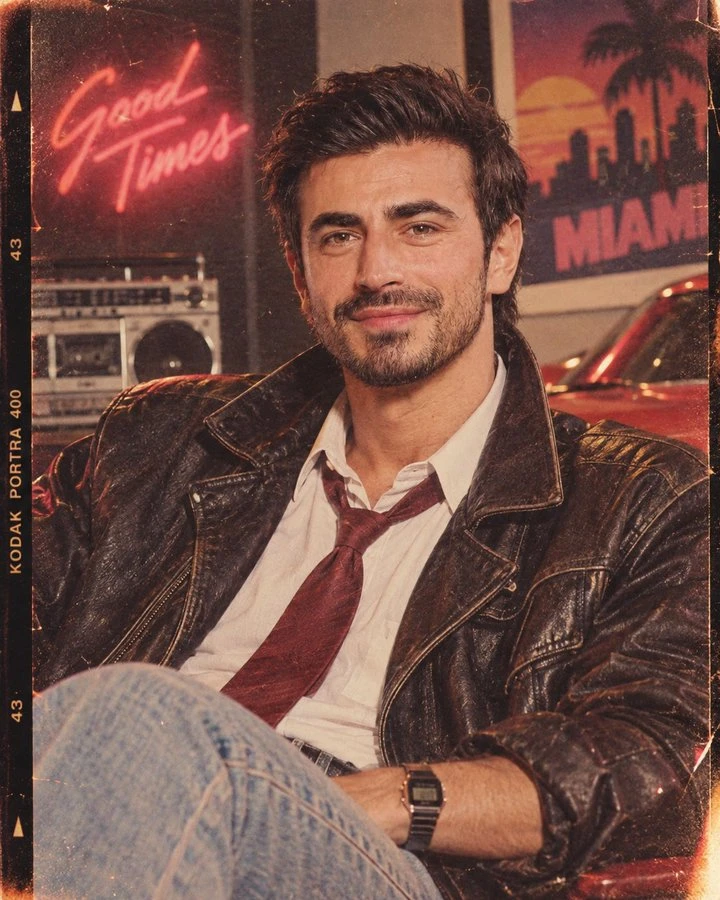](assets/p10-1980s-retro-film-portrait/source-example-04.webp)

#### 👇 Workflow

`Person reference → retro portrait`

#### 🔖 Full Prompt

```text
Create an authentic 1980s retro-vintage portrait in a 4:5 vertical aspect ratio, using the provided person as the exact facial reference. Preserve their identity, facial structure, recognizable features, skin tone, and natural expression with high accuracy—do not alter or beautify the face.

Give the subject a classic 1980s hairstyle and stylish period-accurate fashion with bold silhouettes, authentic textures, and effortless vintage attitude. Compose the portrait naturally with a strong editorial feel, keeping the subject as the clear focal point.

Capture the image as if shot on a 35mm analog film camera, with realistic film grain, subtle dust and texture, gentle softness, natural skin detail, slight color fading, and authentic analog imperfections. Use warm nostalgic color grading, soft neon highlights, subtle ambient glow, and direct on-camera flash to create the distinctive look of an iconic 1980s photograph.

Keep the lighting cinematic yet believable, with soft shadows, realistic highlights, natural contrast, and a slightly imperfect film exposure. The final image should feel genuinely photographed in the 1980s—not digitally recreated, with a timeless, nostalgic, fashionable, and effortlessly cool atmosphere.
```

<sub>(by [@Goodmanprotocol](https://x.com/Goodmanprotocol/status/2097954772586557873)) · [Source: X](https://x.com/Goodmanprotocol/status/2097954772586557873)</sub>

<a id="p57-candid-camera-roll-grid"></a>

### 📌 1.15. Candid Camera Roll Grid

#### 👀 Preview

[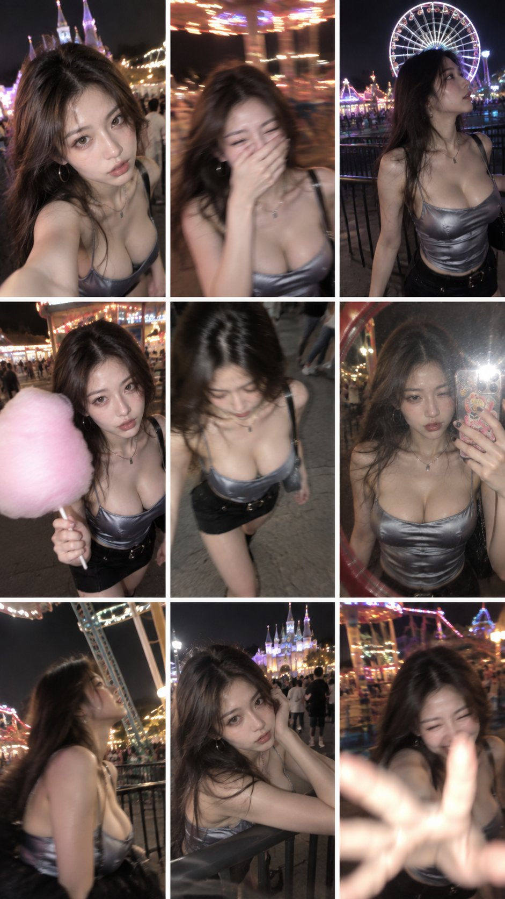](assets/p57-candid-camera-roll-grid/source-example-01.jpg)

[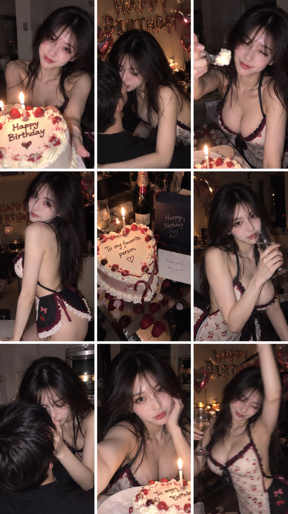](assets/p57-candid-camera-roll-grid/source-example-02.jpg)

[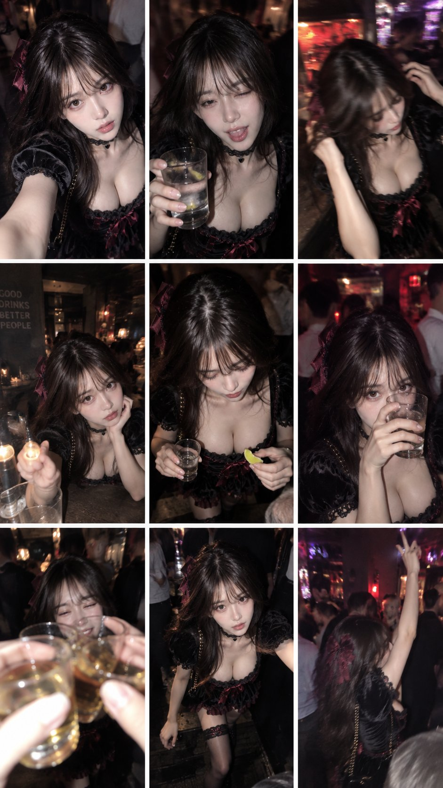](assets/p57-candid-camera-roll-grid/source-example-03.jpg)

#### 👇 Workflow

`Theme → 3×3 candid camera-roll grid`

#### 🔖 Full Prompt

```text
Generate a set of amateur, failed candid photos around the theme of [XXX], shot on a phone, with a private camera-roll feel, arranged in a 3×3 grid, 9:16.
```

<sub>(by [@MrLarus](https://x.com/MrLarus/status/2099871480112652453)) · [Source: X](https://x.com/MrLarus/status/2099871480112652453)</sub>

<a id="p59-concert-stage-bunny-costume"></a>

### 📌 1.16. Concert Stage Bunny Costume

#### 👀 Preview

[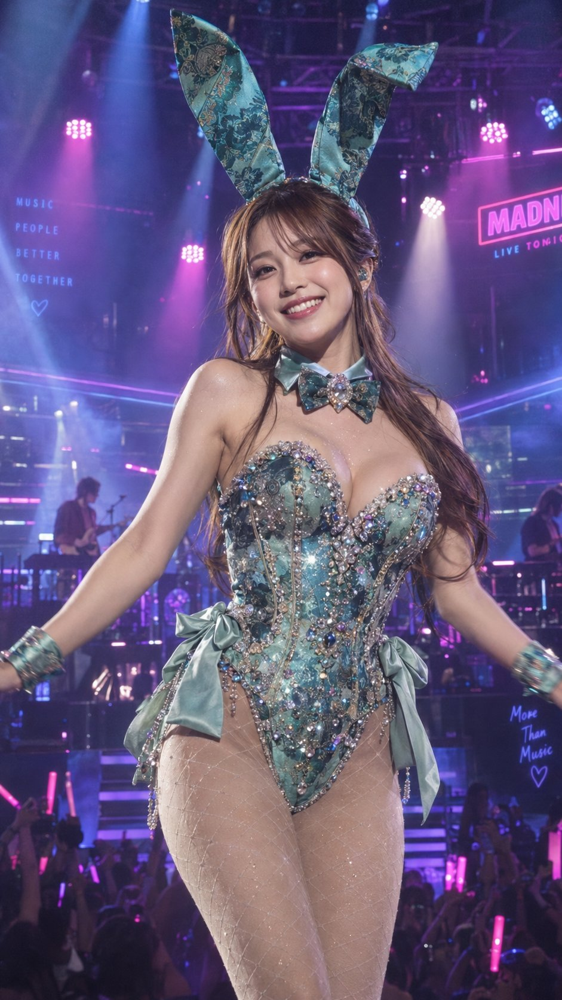](assets/p59-concert-stage-bunny-costume/source-example-01.jpg)

#### 👇 Workflow

`Text → cinematic concert-stage portrait`

#### 🔖 Full Prompt

```text
A cinematic anamorphic still photograph captured live on stage — a dynamic medium hero composition of an East Asian performer in an elaborate theatrical stage costume dancing in the center of an energetic live venue, the camera positioned at eye level in a centered vertical framing capturing her radiant smile and charismatic stage presence in an M4 concert performance register.

The performer has warm chestnut-brown hair styled with soft side-swept bangs framing her luminous face and cascading down her back. Her fair skin radiates a healthy stage glow with fine, natural pore texture, subtle subsurface scattering, and a light performance sheen along her collarbones and shoulders under the spotlights. She wears an ornate tall rabbit-ear theatrical headpiece crafted from textured turquoise-and-emerald jacquard fabric, paired with a matching aqua satin collar and crystal-brooch bow tie. Her costume is a dazzling couture stage performance leotard corset featuring a rich mottled watercolor pattern of teal, seafoam, and emerald with shimmering metallic sequins, accented by elaborate silver crystal beading and rhinestone piping sculpting the sweetheart neckline and corset lines, finished with delicate mint satin side-ribbon bows at the hip line. She wears sheer diamond-pattern stage performance tights across her legs. Captured mid-dance with arms lightly extended in graceful motion, her dark almond eyes sparkle with joyful energy, looking straight into the camera with a bright, captivating smile.

The environment is an electrifying live concert venue and nightclub stage filled with theatrical atmosphere — overhead lighting trusses, honeycomb LED light banks, and horizontal neon laser beams slicing through dense purple and magenta stage haze in the background. Faint colorful neon venue signage and stage structures glow softly in the deep background, dissolved into creamy atmospheric blur, creating rich depth and spatial immersion around the central stage.

The lighting is driven by authentic concert gaffer physics — bright, clean white-and-cyan follow-spots from the front sculpt her face, glittering costume crystals, and turquoise fabric with brilliant specular highlights and sparkle, while vibrant magenta, neon purple, and ultraviolet stage washes from behind cast a vivid, luminous rim light across her shoulders and hair. Volumetric atmospheric haze suspended throughout the air catches the stage laser beams as visible shafts of colored light, seamlessly integrating the performer into the pulsating live stage ambience.

Captured with a wide-latitude digital cinema look on a fast 50mm anamorphic prime lens at T2.0 with light diffusion filtration softening the vibrant neon highlights, in an M4 concert performance register. Authentic stage concert color grade with deep violet shadows, saturated neon rim lights, and natural skin tones preserved cleanly under the frontal follow-spot. Mild kinetic operator energy and subtle natural motion blur on the dancing fingertips, paired with fine theatrical 35mm film grain across the entire frame. Real photographic frame captured on a real cinema camera, real anamorphic lens, real sequined brocade fabric, real rhinestone beading, real human performer, real stage trusses and concert haze — no CGI, no rendered look, no digital cleanliness, no plastic surfaces, no AI smoothness, no skin smoothing, no glow, no halation bloom that reads as artificial, no glossy highlights.
```

<sub>(by [@johnAGI168](https://x.com/johnAGI168/status/2100090276576407848)) · [Source: X](https://x.com/johnAGI168/status/2100090276576407848)</sub>

<a id="p60-intimate-hallway-pov-portrait"></a>

### 📌 1.17. Intimate Hallway POV Portrait

#### 👀 Preview

[](assets/p60-intimate-hallway-pov-portrait/source-example-01.jpg)

#### 👇 Workflow

`Text → intimate hallway POV portrait`

#### 🔖 Full Prompt

```text
Style direction: An intimate moment of getting ready before going out
Scene direction: Entryway / beside a full-length mirror
Outfit direction: Misty-pink fitted short-sleeve lounge dress or date dress
Mood tags: Gentle, mature, approachable, attentive, sweet
Body direction: Naturally curvy, full figure
Emphasis on body contours: Strong
Camera direction: The woman stands very close to the camera, leaning toward it, raising both hands toward the lens as though straightening her boyfriend's collar or smoothing his clothes; afterward she lifts her eyes to look into the camera
Aspect ratio: 9:16
Interaction focus: The camera occupies the boyfriend's position, creating a clear romantic POV; the close distance also naturally shows the contours of her shoulders, neck, bust, and waist.
```

<sub>(by [@liyue_ai](https://x.com/liyue_ai/status/2100152524884058399)) · [Source: X](https://x.com/liyue_ai/status/2100152524884058399) · English translation by SeeAPI</sub>

<a id="p61-mirror-sculpture-street-portrait"></a>

### 📌 1.18. Mirror Sculpture Street Portrait

#### 👀 Preview

[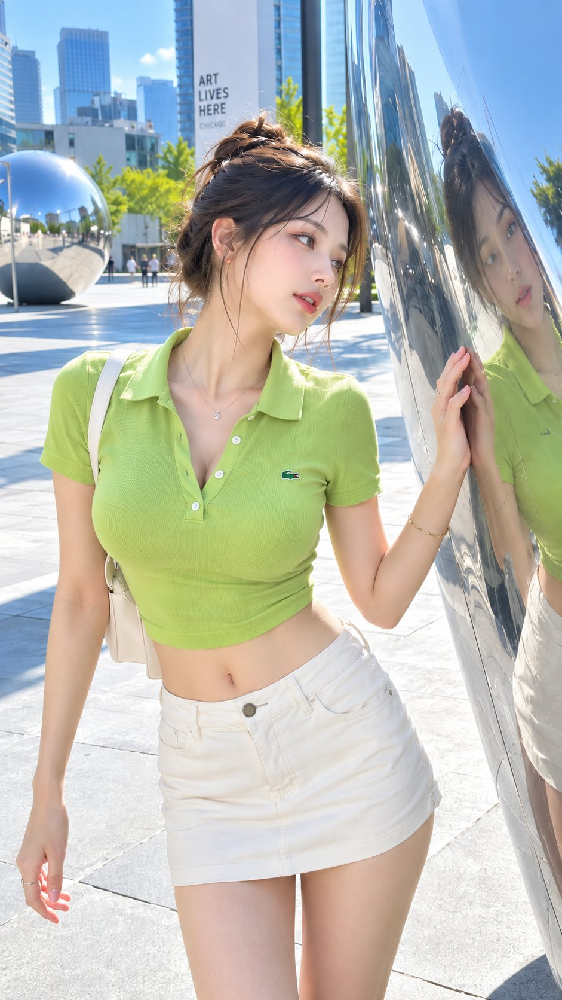](assets/p61-mirror-sculpture-street-portrait/source-example-01.jpg)

#### 👇 Workflow

`Text → daylight street portrait by a mirror sculpture`

#### 🔖 Full Prompt

```text
Photography style: Bright daytime CCD lifestyle photo with crisp highlights
Portrait direction: Urban art and fashion lifestyle photograph
Setting: Modern public art plaza / large mirrored stainless-steel sculpture / pale gray pavement / minimalist open space
Outfit: Lime-green fitted cropped polo shirt + cream-white low-rise fitted short skirt
Mood tags: Cool, playful, fashionable, bright, design-conscious
Facial features: Refined, fresh and understated
Body: Light and slender
Emphasis on body contours: Strong
Framing: From the upper body to the thighs
Pose: Stand beside the mirrored sculpture, lightly touching the metal surface with one hand; turn slightly toward your own reflection
Lighting: Bright natural light on a clear day + clean, neutral fill reflected from the mirrored metal
Filter: Bright, crisp green-and-white CCD colors + clear highlights + stable black levels + subtle grain + very slight sharpening
Aspect ratio: 9:16
Additional requirements: The mirrored sculpture must remain a geometric background, without complex distorted human reflections; keep the subject's bust and waist contours clear. The overall image should feel like a casual city snapshot rather than an art-studio shoot.
```

<sub>(by [@liyue_ai](https://x.com/liyue_ai/status/2100123514745536819)) · [Source: X](https://x.com/liyue_ai/status/2100123514745536819) · English translation by SeeAPI</sub>

<a id="p63-golden-hour-beach-selfie"></a>

### 📌 1.19. Golden Hour Beach Selfie

#### 👀 Preview

[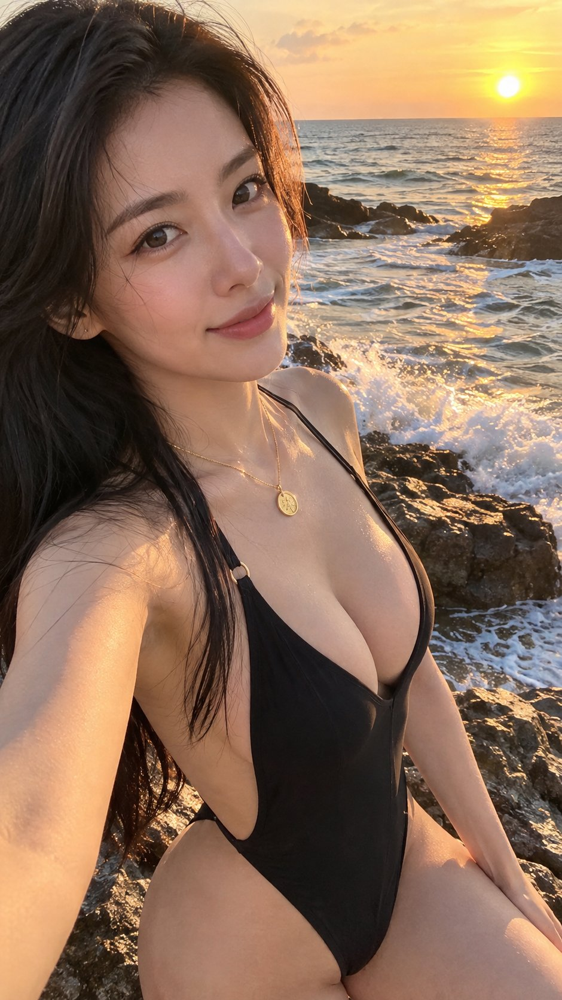](assets/p63-golden-hour-beach-selfie/source-example-01.jpg)

#### 👇 Workflow

`Text → golden-hour beach selfie`

#### 🔖 Full Prompt

```text
A beautiful East Asian woman with long black hair takes a selfie by the sea, wearing a black high-cut one-piece swimsuit and a gold coin-pendant necklace. Golden hour at sunset, waves striking the rocks, warm side lighting, realistic photographic texture, delicate skin detail, body turned slightly toward the camera.
```

<sub>(by [@shitunote](https://x.com/shitunote/status/2099846900031852562)) · [Source: X](https://x.com/shitunote/status/2099846900031852562) · English translation by SeeAPI</sub>

<a id="p64-lavender-bedroom-portrait"></a>

### 📌 1.20. Lavender Bedroom Portrait

#### 👀 Preview

[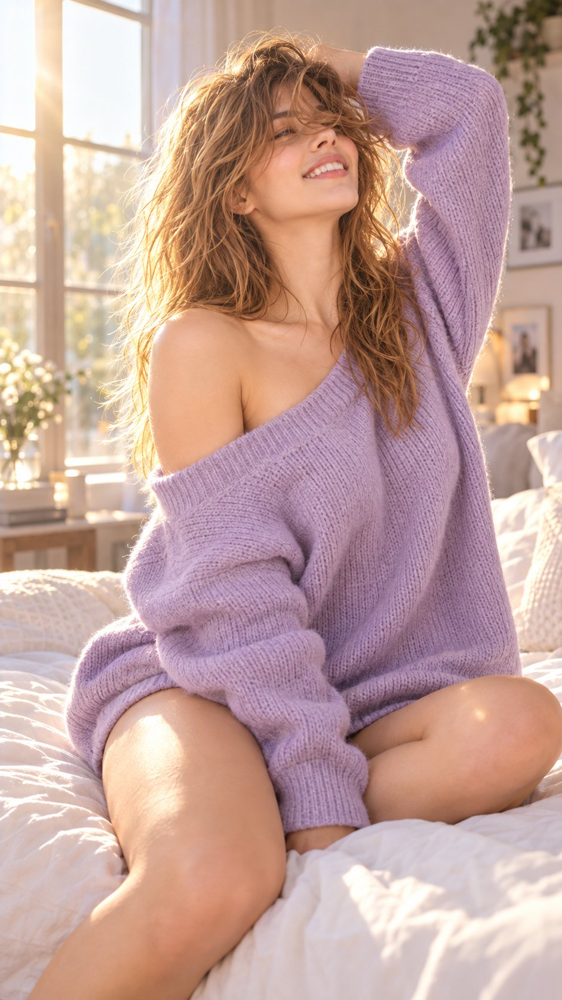](assets/p64-lavender-bedroom-portrait/source-example-01.jpg)

#### 👇 Workflow

`Portrait reference → lavender bedroom portrait`

#### 🔖 Full Prompt

```text
Hyper-realistic IMAX-level Netflix-style cinematic portrait, 9:16 vertical. Use the uploaded image as the primary identity reference and preserve her exact facial identity, proportions, and defining features. Create a beautiful woman wearing an oversized lavender off-shoulder knit sweater, sitting on a white bed in a bright cozy bedroom. Soft white bedding surrounds her, with a large window on the left filling the room with warm sunlight. She sits slightly sideways on the bed, with her upper body leaning gently backward. Her left arm is raised above her head, hand resting in her hair, while her other arm hangs naturally along her side. Her shoulders are relaxed, one shoulder exposed by the loose sweater. Her head is tilted upward and slightly back, eyes mostly hidden behind loose strands of hair, with a wide natural smile showing her teeth. Long tousled wavy hair with a loose natural center part, voluminous texture, messy face-framing strands falling across her forehead and eyes, with soft waves cascading over her shoulders and down her back. Fair luminous porcelain skin with a bright ivory to light beige tone and a neutral-cool undertone, naturally illuminated by the warm sunlight. Strong golden backlight from the window creates glowing highlights around her hair and shoulders, soft lens flare, bright airy highlights, and gentle shadows. Warm pastel color grading with soft lavender, creamy white, and golden tones, dreamy high-key lighting, subtle glow, natural skin texture, shallow depth of field, soft romantic editorial photography.
Negative prompt: changed identity, distorted face, deformed hands or fingers, bad anatomy, unnatural pose, text or watermark.
```

<sub>(by [@imGopalTiwari](https://x.com/imGopalTiwari/status/2100744113503052078)) · [Source: X](https://x.com/imGopalTiwari/status/2100744113503052078)</sub>

<a id="p65-snowy-mountain-plaid-scarf-portrait"></a>

### 📌 1.21. Snowy Mountain Plaid-Scarf Portrait

#### 👀 Preview

[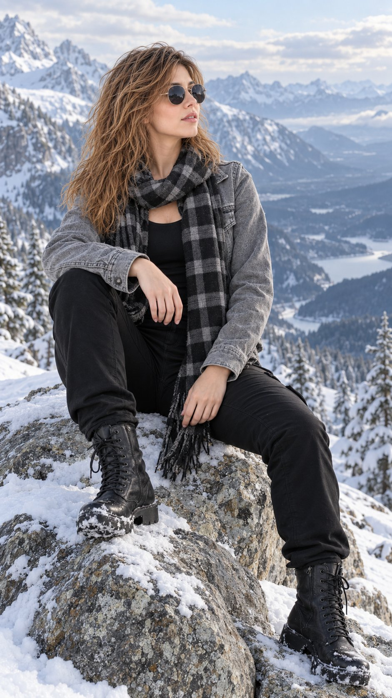](assets/p65-snowy-mountain-plaid-scarf-portrait/source-example-01.jpg)

#### 👇 Workflow

`Portrait reference → snowy mountain portrait`

#### 🔖 Full Prompt

```text
Hyper-realistic IMAX-level Netflix-style cinematic portrait, 9:16 vertical. Use the uploaded image as the primary identity reference and preserve her exact facial identity, proportions, and defining features. Create a beautiful woman wearing a black fitted top, gray denim jacket, black pants, black lace-up boots, round dark sunglasses, and a black-and-gray checkered scarf wrapped loosely around her neck. She is sitting confidently on a large rugged snow-covered mountain rock, surrounded by vast snowy mountains and dense snow-covered pine forests. She sits with one knee raised high in front of her and the other leg bent downward along the rock, both boots firmly resting on the rock. One hand rests naturally on her raised knee while the other rests on her opposite thigh. Her torso is upright with a slight relaxed lean, shoulders natural, and her head tilted slightly upward and turned toward the side, with a calm confident expression. Long thick wavy hair styled in a voluminous swept-back look, with textured waves, lifted roots, natural movement, and a few loose strands framing her face. Fair luminous porcelain skin with a bright ivory to light beige tone and a neutral-cool undertone, natural skin texture and soft realistic highlights. Soft cold daylight illuminates her face and clothing, with gentle highlights and cool shadows across the snowy landscape. Cool blue-gray winter color grading, muted tones, soft atmospheric haze, realistic snow and rock textures, shallow depth of field, cinematic mountain photography.
Negative prompt: changed identity, distorted face, deformed hands or fingers, bad anatomy, unnatural pose, text or watermark.
```

<sub>(by [@imGopalTiwari](https://x.com/imGopalTiwari/status/2100698813539492223)) · [Source: X](https://x.com/imGopalTiwari/status/2100698813539492223)</sub>

<a id="p68-towel-wrapped-makeup-frame-reconstruction"></a>

### 📌 1.22. Towel-Wrapped Makeup Frame Reconstruction

#### 👀 Preview

[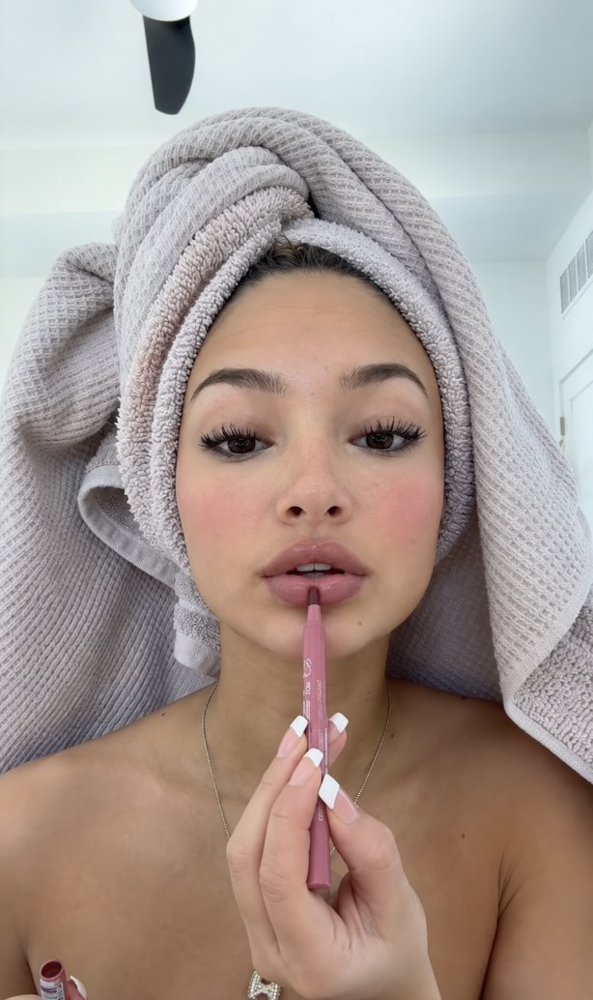](assets/p68-towel-wrapped-makeup-frame-reconstruction/source-example-01.jpg)

#### 👇 Workflow

`Reference frame → makeup-video reconstruction`

#### 🔖 Full Prompt

```text
{
  "prompt_type": "photorealistic_image_reconstruction",
  "objective": "Recreate the supplied reference image as closely as possible while completely removing and ignoring all on-screen text, playback controls, progress bars, icons, timestamps, and other video UI elements. Preserve the underlying photographic scene, subject, pose, facial expression, styling, lighting, environment, framing, proportions, and material textures.",
  "reference_priority": {
    "overall_composition": "extremely high",
    "subject_placement": "extremely high",
    "facial_structure": "extremely high",
    "towel_shape_and_texture": "extremely high",
    "hand_position": "extremely high",
    "lip_pencil_position": "extremely high",
    "lighting": "extremely high",
    "background_geometry": "high",
    "color_palette": "high",
    "micro_texture": "high",
    "ui_elements": "ignore_completely"
  },
  "canvas": {
    "orientation": "portrait",
    "aspect_ratio": "approximately 704:1130",
    "framing": "vertical smartphone-camera composition",
    "crop": "tight close-up extending from the top of the towel/head-wrap to the upper chest and shoulders",
    "edge_behavior": {
      "left_edge": "narrow black vertical border visible outside the main portrait area",
      "right_edge": "very narrow dark/black edge outside the main portrait area",
      "top_edge": "small amount of pale background above the towel",
      "bottom_edge": "cropped at the upper torso/chest area"
    },
    "important": "Do not reproduce any screenshot controls, text, icons, timestamps, progress indicators, or playback buttons."
  },
  "scene_description": {
    "setting": "bright, minimalist, modern bathroom or clean dressing-room interior",
    "visual_mood": "soft, intimate, casual beauty-routine selfie",
    "time_of_day": "daytime or bright daylight-balanced interior",
    "overall_style": "authentic modern smartphone beauty video frame, highly photorealistic, softly beauty-filtered but still natural",
    "environmental_complexity": "minimal and uncluttered",
    "background_focus": "soft and slightly out of focus compared with the woman's face"
  },
  "subject": {
    "person": {
      "description": "adult woman",
      "pose": "facing directly toward the camera in a relaxed seated or reclined position",
      "orientation": "frontal portrait",
      "head_alignment": "centered with minimal natural tilt",
      "body_visibility": "head, neck, shoulders, upper chest, and one or both hands visible",
      "expression": "calm, relaxed, subtly pouty, neutral-to-soft beauty-tutorial expression",
      "gaze": "looking toward the camera"
    },
    "skin": {
      "base_tone": "light-to-medium warm beige with a soft golden undertone",
      "texture": "very smooth and evenly toned, consistent with a subtle social-media beauty filter",
      "finish": "soft luminous skin with gentle natural highlights",
      "blemishes": "minimal",
      "pores": "subtle and softened rather than highly detailed",
      "blush": "visible diffuse rosy-pink blush on the apples of both cheeks",
      "undertone": "warm and healthy",
      "contrast": "low-to-moderate"
    },
    "face": {
      "shape": "soft oval face",
      "forehead": "smooth and moderately broad",
      "cheeks": "full, softly rounded cheeks",
      "jaw": "softly tapered jawline",
      "chin": "small, rounded chin",
      "symmetry": "natural high facial symmetry",
      "proportions": "delicate youthful-looking facial proportions"
    },
    "eyes": {
      "shape": "large almond-shaped eyes",
      "color": "deep dark brown",
      "orientation": "frontal and directed toward the camera",
      "upper_lashes": {
        "length": "very long",
        "density": "high",
        "curl": "strong upward curl",
        "appearance": "clearly enhanced beauty-makeup eyelashes"
      },
      "lower_lashes": "subtle and less pronounced",
      "eyelids": "softly defined",
      "eye_makeup": "minimal dark definition around the lash line",
      "under_eye": "smooth, softly brightened, no strong dark circles",
      "catchlights": "subtle soft light reflections"
    },
    "eyebrows": {
      "shape": "full, gently arched brows",
      "color": "dark brown",
      "density": "medium-full",
      "styling": "cleanly groomed but natural",
      "texture": "soft individual hair detail"
    },
    "nose": {
      "shape": "small delicate nose",
      "bridge": "smooth and softly defined",
      "tip": "rounded and subtle",
      "lighting": "gentle highlight along bridge and tip",
      "contour": "very subtle natural contour"
    },
    "lips": {
      "shape": "full, plush lips",
      "upper_lip": "defined cupid's bow",
      "lower_lip": "fuller and rounded",
      "position": "slightly parted and gently pursed",
      "color": "muted rosy mauve nude",
      "finish": "soft satin with slight natural gloss",
      "makeup": "subtle lip liner and muted pink-nude color",
      "action": "lip liner is being applied directly to the center/lower portion of the lips"
    }
  },
  "hair": {
    "visibility": "hair is almost entirely concealed",
    "style": "hair wrapped completely inside a large towel turban",
    "visible_hair": "only a very small amount, if any, near the forehead/hairline",
    "instruction": "Do not expose long loose hair around the shoulders."
  },
  "head_towel": {
    "type": "large bath towel wrapped into a voluminous turban",
    "material": "thick woven cotton with pronounced waffle-knit texture",
    "primary_color": "warm pale gray-beige / greige",
    "texture": {
      "pattern": "fine repeating square/waffle weave",
      "definition": "clearly visible but softened by smartphone-camera processing",
      "surface": "matte and absorbent cotton"
    },
    "structure": {
      "top": "large rounded layered folds piled above the head",
      "front": "thick rolled edge framing the forehead",
      "left_side": "large outward-folding towel mass extending behind the left side of the head",
      "right_side": "longer towel section falling downward along the right side of the face and shoulder",
      "rear": "substantial layered towel volume behind the head",
      "folds": "multiple overlapping organic folds and twisted layers",
      "silhouette": "wide, rounded, oversized towel silhouette surrounding the upper head"
    },
    "color_variation": "subtle tonal differences between overlapping folds, with slightly pink-beige and cool-gray variations",
    "lighting_response": "soft highlights on raised waffle ridges and gentle shadows inside folds"
  },
  "secondary_towel_or_fabric": {
    "description": "additional soft gray towel-like fabric visible around the sides/back of the head and behind the shoulders",
    "material": "plush absorbent terry or textured cotton",
    "color": "light neutral gray",
    "purpose": "adds layered towel volume around the head"
  },
  "hands": {
    "visibility": "hands prominently visible in the lower-center foreground",
    "skin_tone": "matching the warm beige/golden complexion of the subject",
    "position": "one hand or both hands hold the cosmetic pencil vertically in front of the mouth",
    "gesture": "delicate precision beauty-makeup application",
    "fingers": {
      "shape": "slender feminine fingers",
      "pose": "relaxed but controlled around the pencil",
      "anatomy": "natural human finger proportions",
      "instruction": "No extra fingers, merged fingers, distorted joints, or malformed hands."
    },
    "nails": {
      "length": "medium-long",
      "shape": "soft square / squared-off",
      "color": "opaque clean white",
      "finish": "smooth glossy manicure",
      "detail": "subtle specular reflections on nail surfaces"
    }
  },
  "cosmetic_pencil": {
    "type": "slim lip-liner pencil",
    "position": "almost perfectly vertical, extending upward from the lower center of the image toward the lips",
    "tip_location": "touching or nearly touching the center/lower lip",
    "body_color": "dusty rose, muted pink, mauve-pink",
    "finish": "matte to satin",
    "shape": "slender cylindrical cosmetic pencil",
    "visible_length": "substantial section extends downward into the hand",
    "branding": "small indistinct light-colored cosmetic markings may appear on the body, but no readable text",
    "interaction": "actively outlining or applying color to the lower lip"
  },
  "jewelry": {
    "necklace": {
      "type": "very thin delicate chain",
      "color": "silver or pale metallic",
      "placement": "around the neck and partially visible over the upper chest",
      "pendant": {
        "description": "small delicate metallic charm",
        "shape": "compact rounded or letter-like charm",
        "position": "centered low on the visible neck/chest area",
        "appearance": "bright metallic highlights with slight sparkle"
      }
    }
  },
  "upper_body": {
    "clothing": "bare shoulders and upper chest",
    "pose": "relaxed shoulders",
    "skin_rendering": "smooth but naturally dimensional",
    "lighting": "soft frontal light with mild shadowing beneath chin and around collarbones",
    "composition": "shoulders extend toward both lower corners of the frame"
  },
  "background": {
    "walls": {
      "color": "very pale cool white with a subtle blue-gray cast",
      "finish": "smooth painted wall",
      "detail": "clean minimalist architecture"
    },
    "ceiling_fan": {
      "visibility": "partial fan visible near the upper center-left region",
      "description": "white or very pale ceiling fan housing with one dark gray/black blade descending into the frame",
      "focus": "slightly soft because it is outside the main focal plane"
    },
    "air_vent": {
      "position": "upper-right background",
      "description": "rectangular white HVAC or air-return vent with narrow horizontal slats",
      "appearance": "subtle, clean, geometric",
      "focus": "slightly softened"
    },
    "door_or_architecture": {
      "position": "far right background",
      "description": "minimal white architectural edge or door frame",
      "visibility": "partial",
      "detail_level": "soft and unobtrusive"
    },
    "background_depth": "shallow depth with background softly blurred while remaining recognizable"
  },
  "camera": {
    "device_style": "modern smartphone front-facing camera",
    "lens": "wide selfie lens approximately 24-28mm full-frame equivalent",
    "perspective": "close facial selfie perspective with mild wide-angle characteristics",
    "camera_height": "roughly eye level",
    "camera_distance": "approximately arm's length",
    "orientation": "vertical portrait",
    "focus_point": "eyes and central face",
    "sharpness": "face sharp, background moderately softened",
    "depth_of_field": "moderately shallow",
    "stabilization": "stable frame",
    "image_quality": "high-resolution modern smartphone image",
    "processing": "subtle computational photography and beauty-filter smoothing"
  },
  "lighting": {
    "primary_source": "large diffused frontal window or soft artificial daylight source",
    "direction": "front and slightly above",
    "quality": "very soft",
    "contrast": "low",
    "shadows": "gentle, diffuse, no hard-edged shadows",
    "skin_highlights": "soft highlights on forehead, nose, cheeks, and lips",
    "towel_lighting": "slightly brighter highlights along raised woven ridges",
    "background_lighting": "cool pale ambient illumination",
    "color_temperature": "cool-neutral daylight with warm skin rendering",
    "overall_effect": "flattering, clean, soft beauty-video lighting"
  },
  "color_palette": {
    "dominant_colors": [
      "pale cool white",
      "warm light gray",
      "beige",
      "greige",
      "soft rosy pink",
      "dusty mauve",
      "warm golden skin"
    ],
    "saturation": "moderately low",
    "contrast": "low-to-moderate",
    "highlights": "creamy and soft",
    "shadows": "gentle and slightly lifted",
    "skin_color_priority": "natural warm skin must remain distinct from the cool background",
    "towel_color_priority": "neutral warm gray-beige"
  },
  "beauty_processing": {
    "style": "subtle social-media beauty filter",
    "skin_smoothing": "moderate-to-high",
    "blemish_reduction": "high",
    "facial_shape_adjustment": "minimal",
    "eye_enhancement": "subtle",
    "lash_enhancement": "visible",
    "blush_enhancement": "moderate",
    "lip_enhancement": "subtle",
    "overall_result": "polished but believable smartphone beauty footage",
    "avoid": "extreme face reshaping, plastic skin, unrealistic symmetry, or artificial CGI skin"
  },
  "composition_geometry": {
    "subject_center": "approximately centered horizontally",
    "face_position": "face occupies the central middle portion of the frame",
    "eyes": "located around the upper-middle third",
    "towel_top": "extends into the upper quarter of the frame",
    "mouth": "located near the vertical center",
    "hands": "occupy the lower-center foreground",
    "pencil": "creates a nearly vertical central visual line",
    "shoulders": "fill the lower left and lower right regions",
    "negative_space": "limited, intimate close-up framing",
    "symmetry": "mostly symmetrical frontal composition with natural asymmetry in towel folds and hands"
  },
  "fine_details": {
    "skin": "soft realistic texture with subtle tonal variation",
    "lashes": "individual lash clusters visible",
    "brows": "fine hair texture visible",
    "lips": "subtle natural lip texture beneath the makeup",
    "nails": "clean glossy white surfaces",
    "towel": "individual woven ridges and loops visible",
    "necklace": "tiny metallic reflections",
    "pencil": "small printed cosmetic markings without readable lettering",
    "background": "faint architectural details without distracting clutter"
  },
  "photographic_style": {
    "genre": "casual luxury beauty/self-care smartphone portrait",
    "realism": "extreme photorealism",
    "image_character": "authentic paused frame from a beauty video",
    "retouching": "soft computational beauty processing",
    "texture": "clean but not sterile",
    "dynamic_range": "high",
    "sharpness": "moderately sharp on face and hands",
    "compression": "subtle smartphone/social-media compression character"
  },
  "negative_prompt": [
    "text",
    "captions",
    "subtitles",
    "watermarks",
    "logos",
    "play button",
    "pause button",
    "progress bar",
    "timeline",
    "timestamp",
    "video controls",
    "UI overlays",
    "social media icons",
    "interface elements",
    "different person",
    "different facial proportions",
    "different pose",
    "different towel style",
    "loose long hair",
    "dark towel",
    "bright colored towel",
    "red lipstick",
    "dark lipstick",
    "heavy contouring",
    "dramatic eyeliner",
    "eyeglasses",
    "sunglasses",
    "earrings",
    "extra jewelry",
    "extra people",
    "extra hands",
    "extra fingers",
    "missing fingers",
    "deformed hands",
    "elongated fingers",
    "incorrect nail color",
    "pointed nails",
    "red nails",
    "lipstick tube instead of lip pencil",
    "horizontal composition",
    "landscape photography",
    "full body",
    "profile view",
    "three-quarter profile",
    "dramatic pose",
    "hard flash",
    "strong shadows",
    "warm orange lighting",
    "dark environment",
    "busy bathroom",
    "mirror-dominant composition",
    "studio fashion editorial",
    "cinematic photography",
    "CGI",
    "3D render",
    "illustration",
    "anime",
    "plastic skin",
    "over-smoothed skin",
    "uncanny face",
    "excessive HDR",
    "extreme bokeh",
    "overly sharpened pores"
  ],
  "final_instruction": "Generate a single highly photorealistic vertical image matching the reference composition as closely as possible. Preserve the same centered frontal facial framing, oversized textured beige-gray towel turban with layered folds, warm smooth skin, rosy cheeks, long dark eyelashes, full muted pink nude lips, white glossy manicure, vertical dusty-pink lip pencil touching the lower lip, delicate silver necklace, bare shoulders, pale cool bathroom background, partial ceiling fan at the top, and rectangular air vent in the upper-right background. Remove and ignore every text element, timestamp, playback button, progress line, and all other interface graphics. The result should look like the clean underlying video frame with no UI overlay."
}
```

<sub>(by [@neverfilmed](https://x.com/neverfilmed/status/2100670687489020274)) · [Source: X](https://x.com/neverfilmed/status/2100670687489020274)</sub>

<a id="p69-summer-ice-cream-selfie"></a>

### 📌 1.23. Summer Ice-Cream Selfie

#### 👀 Preview

[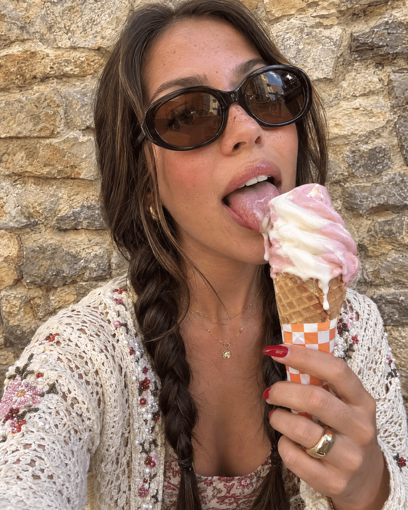](assets/p69-summer-ice-cream-selfie/source-example-01.png)

#### 👇 Workflow

`Text → candid summer ice-cream selfie`

#### 🔖 Full Prompt

```text
A candid close-up selfie of a young woman standing outdoors against a rustic natural stone wall, playfully licking a melting ice cream cone, tongue out catching a drip, mouth open in a fun candid moment. She holds the cone up in one hand in a checkered paper wrapper, wearing chunky oversized rounded black-framed sunglasses with brown-tinted lenses. She has long dark-brown hair styled in two loose braids with small black hair ties, soft strands framing her face. Her makeup is warm and natural with a rosy flush and glossy lips, and she has long red-manicured nails, a chunky gold ring, and layered fine gold chain necklaces.

She wears a delicate crochet/knit cardigan embellished with floral beadwork, seed beads and small pearls, over a patterned top. The ice cream cone is in sharp focus in the foreground — a waffle cone with a swirl of white vanilla and pink strawberry soft-serve, dripping and melting down the sides, in an orange-and-white checkered paper holder.

Warm, bright, natural Mediterranean daylight in soft shade, giving an even warm glow with gentle shadows. The background is a rustic honey-and-grey natural stone brick wall, softly lit, filling the frame behind her.

Facial structure: Youthful oval face with soft cheeks, full lips, a straight nose, strong brows, and a warm sun-kissed Mediterranean complexion.

Camera & realism: Shot on a phone front camera, natural selfie perspective with slight closeness. Authentic smartphone photo quality — subtle grain, true-to-life warm color, natural dynamic range, no heavy filter. Highly realistic skin with visible natural texture — pores, faint freckles, soft peach-fuzz, subtle unevenness and a natural glow from the daylight — so it reads as a real candid photo rather than retouched or airbrushed. Shallow natural depth of field with the ice cream and face sharpest, stone wall softly behind. Warm, playful, European-summer mood
```

<sub>(by [u/imagine_ai](https://www.reddit.com/r/ImagineAiArt/comments/1wi79wi/gpt_image_25_flare_is_this_actually_the_best_ai/)) · [Source: Reddit](https://www.reddit.com/r/ImagineAiArt/comments/1wi79wi/gpt_image_25_flare_is_this_actually_the_best_ai/)</sub>

<a id="p70-y2k-lounge-fashion-portrait"></a>

### 📌 1.24. Y2K Lounge Fashion Portrait

#### 👀 Preview

[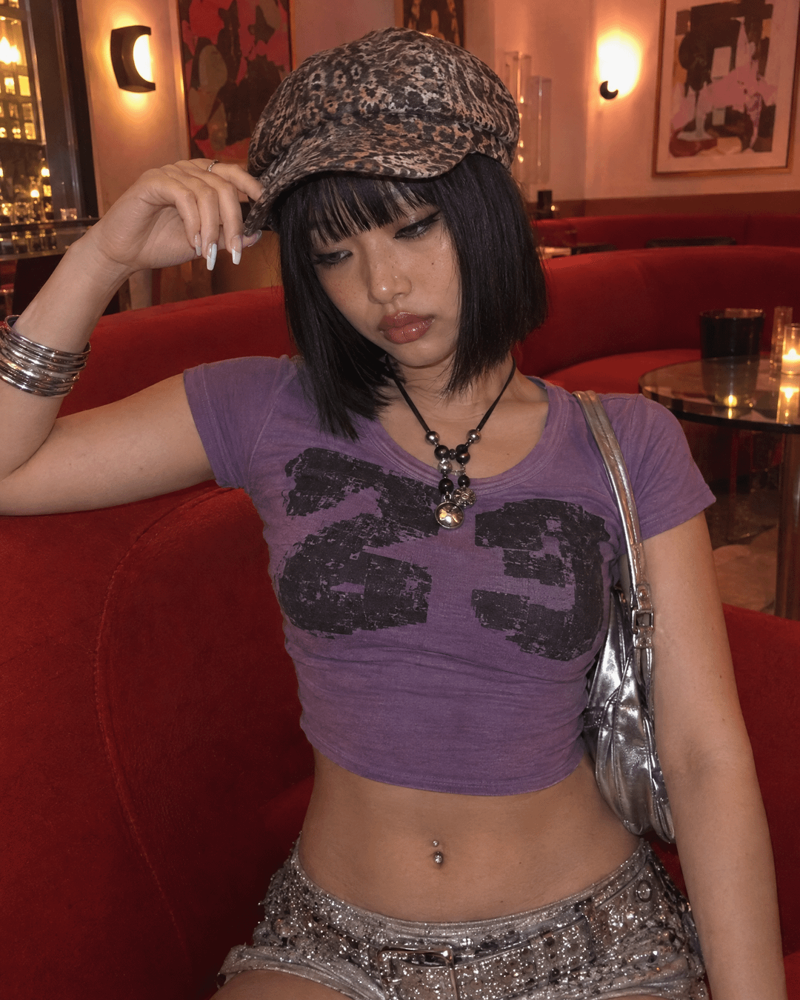](assets/p70-y2k-lounge-fashion-portrait/source-example-01.png)

#### 👇 Workflow

`Text → Y2K lounge fashion portrait`

#### 🔖 Full Prompt

```text
A candid photo of a young East Asian woman taken by someone else at a natural eye-level angle, seated indoors in a stylish warm-toned lounge/bar, framed from the hips up. She poses with one hand raised to touch the brim of her hat, elbow out, head tilted down and slightly to the side with a cool, sultry, pouty expression, eyes half-lowered, glossy lips. She has a sleek jet-black chin-length bob with blunt straight bangs falling over her forehead and eyes, and wears a soft snakeskin/leopard-print newsboy baker-boy cap.The outfit is a Y2K-inspired look: a fitted purple short-sleeve crop tee with a large bold black graphic number print on the chest (generic numerals, no logos), exposing her midriff with a navel piercing, paired with a low-rise rhinestone-embellished belt/skirt in silver. She wears a chunky beaded pendant cord necklace with grey and white beads, stacked chunky silver bangles on one wrist, long pale-tipped nails, and carries a metallic silver shoulder bag on a thin strap. The background is a warm, dimly lit retro interior — a curved bright-red sofa, a glass table, abstract framed art on the walls, glowing wall lights and a warm peachy-pink glow, softly out of focus. Warm ambient indoor lighting, soft shadows, moody stylish lounge atmosphere.Camera & texture: Shot on iPhone (rear camera) indoors, authentic candid smartphone photo, fine sensor grain and digital noise, warm indoor color cast, natural smartphone dynamic range with soft highlights, slight softness, no filter.Skin realism (critical): Highly detailed true-to-life human skin that looks real, never waxy, never plastic, never smooth or CGI-like. Skin shows natural imperfections — visible pores across the nose, cheeks and forehead, fine peach-fuzz vellus hairs, subtle uneven skin tone, faint freckles and small beauty marks, a few tiny blemishes and natural warmth, soft under-eye texture with real fine lines, a natural soft sheen on the cheekbones, nose, midriff and arms with matte areas
```

<sub>(by [u/imagine_ai](https://www.reddit.com/r/ImagineAiArt/comments/1wi79wi/gpt_image_25_flare_is_this_actually_the_best_ai/)) · [Source: Reddit](https://www.reddit.com/r/ImagineAiArt/comments/1wi79wi/gpt_image_25_flare_is_this_actually_the_best_ai/)</sub>

<a id="p71-candid-street-food-bite"></a>

### 📌 1.25. Candid Street-Food Bite

#### 👀 Preview

[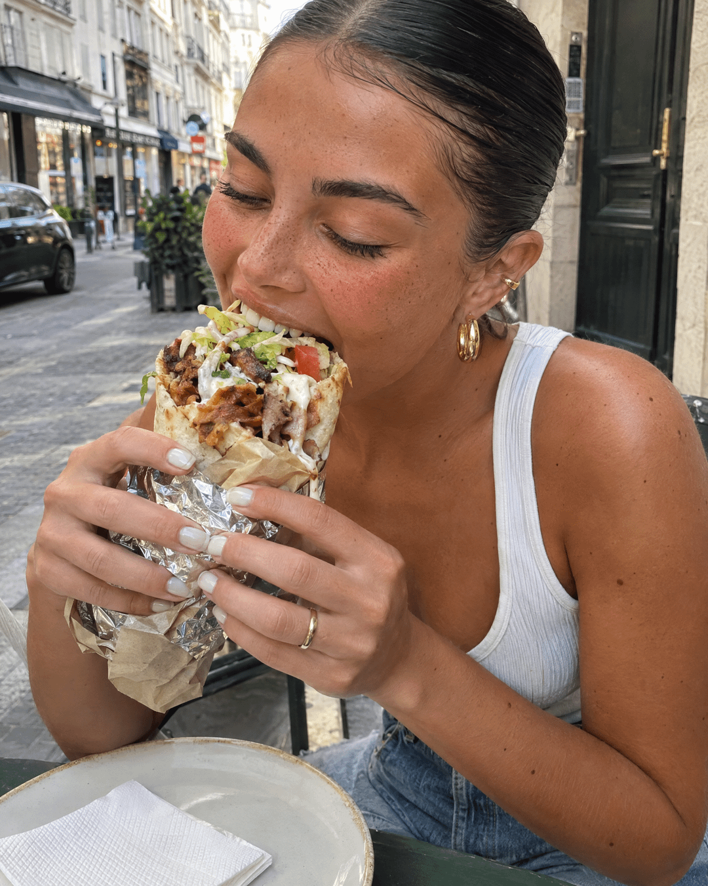](assets/p71-candid-street-food-bite/source-example-01.png)

#### 👇 Workflow

`Text → candid street-food portrait`

#### 🔖 Full Prompt

```text
A candid photo of a young woman taken by someone else, seated at a small round outdoor café table on a city street, leaning down and forward with her mouth open wide about to take a big bite of a loaded kebab/gyro wrap held in both hands, wrapped in foil and white paper. Her eyes are lightly closed and her expression is joyful and eager mid-bite — a fun, unposed, real candid moment. She has dark hair slicked back tightly into a sleek low bun/ponytail, with small face-framing baby hairs, wearing gold ear-cuff and chunky gold hoop/drop earrings. Her makeup is soft and natural with defined brows and a glossy lip, and she has a natural sun-kissed complexion with light freckles and beauty marks across her shoulders and chest.

She wears a yellow ribbed strappy tank top and denim jeans, with pale neutral manicured nails and a gold ring. On the table is a beige speckled ceramic plate, a folded stack of yellow and teal paper napkins, and a pair of folded sunglasses. The overloaded wrap is in sharp focus — pita/flatbread stuffed with shaved döner meat, crispy fried pieces, fresh green lettuce, tomato and sauces.

Warm, bright, natural daytime light on a European city street, soft natural shadows. The background shows a blurred street scene — a parked car, shopfronts with signage, a doorway and pavement, all softly out of focus.

Facial structure: Youthful oval face with defined cheekbones, full lips, strong groomed brows, a straight nose, and a warm sun-kissed complexion.

Camera & realism: Shot on a phone rear camera, natural candid perspective. Authentic smartphone photo quality — subtle grain, true-to-life warm color, natural dynamic range, no heavy filter. Highly realistic skin with visible natural texture — pores, freckles and beauty marks on the shoulders and face, soft peach-fuzz, subtle unevenness and a natural sheen from the daylight — so it reads as a real candid photo rather than retouched or airbrushed. Shallow natural depth of field with the wrap and face sharpest, background blurred. Warm, fun, spontaneous street-food mood
```

<sub>(by [u/imagine_ai](https://www.reddit.com/r/ImagineAiArt/comments/1wi79wi/gpt_image_25_flare_is_this_actually_the_best_ai/)) · [Source: Reddit](https://www.reddit.com/r/ImagineAiArt/comments/1wi79wi/gpt_image_25_flare_is_this_actually_the_best_ai/)</sub>

<a id="p77-natural-bedroom-ugc-selfie"></a>

### 📌 1.26. Natural Bedroom UGC Selfie

#### 👀 Preview

[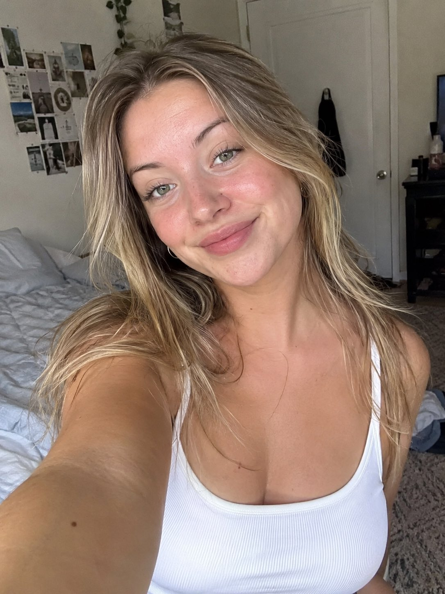](assets/p77-natural-bedroom-ugc-selfie/source-example-01.jpg)

#### 👇 Workflow

`Text → natural bedroom UGC selfie`

#### 🔖 Full Prompt

```text
{
  "prompt_type": "photorealistic_female_ugc",

  "subject": {
    "person": "white adult woman in her 20s",
    "appearance": "naturally attractive, relatable and approachable",
    "expression": "genuine, spontaneous and natural",
    "body_language": "relaxed and unposed",
    "skin": "realistic fair-to-light skin with visible pores, natural texture and subtle imperfections"
  },

  "scene": {
    "environment": "realistic everyday setting",
    "background": "lived-in environment with natural details and subtle imperfections",
    "atmosphere": "casual, personal and unstaged"
  },

  "clothing": {
    "style": "casual everyday clothing",
    "appearance": "modern, comfortable and relatable",
    "texture": "realistic fabric folds and wrinkles",
    "branding": "no visible logos or recognizable brands"
  },

  "hair": {
    "style": "natural contemporary hairstyle",
    "texture": "realistic individual strands",
    "appearance": "slightly imperfect and naturally arranged"
  },

  "camera": {
    "device": "modern smartphone",
    "perspective": "natural smartphone perspective",
    "framing": "medium close-up or medium shot",
    "composition": "slightly imperfect handheld framing",
    "focus": "natural smartphone autofocus",
    "image_quality": "high-resolution smartphone photography",
    "lens": "natural smartphone wide-angle lens"
  },

  "lighting": {
    "source": "natural available light",
    "quality": "soft and realistic",
    "shadows": "natural directional shadows",
    "avoid": [
      "studio lighting",
      "professional beauty lighting",
      "dramatic cinematic lighting"
    ]
  },

  "ugc_characteristics": {
    "authenticity": "extremely high",
    "style": "raw, casual, spontaneous and relatable",
    "camera_feel": "handheld smartphone capture",
    "commercial_feel": "minimal",
    "social_media_feel": "native to TikTok and Instagram",
    "imperfections": "subtle natural imperfections in framing, lighting and environment"
  },

  "realism": {
    "skin": "photorealistic",
    "anatomy": "accurate human anatomy",
    "hands": "realistic hands and fingers"
  },

  "negative_prompt": [
    "product",
    "product packaging",
    "logos",
    "brand names",
    "advertisement",
    "commercial photography",
    "studio photography",
    "fashion editorial",
    "CGI",
    "3D render",
    "cartoon",
    "anime",
    "plastic skin",
    "waxy skin",
    "unrealistic anatomy",
    "extra fingers",
    "deformed hands",
    "text",
    "captions",
    "watermarks",
    "graphics",
    "artificial posing"
  ],

  "final_generation_instruction": "Generate a single photorealistic UGC-style image of a white adult woman that looks like an authentic smartphone capture for TikTok or Instagram. Make her feel like a real creator rather than a model. Prioritize natural facial expression, realistic skin texture, believable anatomy, casual clothing, natural lighting, imperfect handheld framing and a lived-in environment. The final image should feel spontaneous, relatable and native to social media. Do not include any product, brand, logo, advertisement graphics or commercial elements."
}
```

<sub>(by [@Daniloecom](https://x.com/Daniloecom/status/2101403775164674440)) · [Source: X](https://x.com/Daniloecom/status/2101403775164674440)</sub>

<a id="p78-candid-gym-deadlift-photo"></a>

### 📌 1.27. Candid Gym Deadlift Photo

#### 👀 Preview

[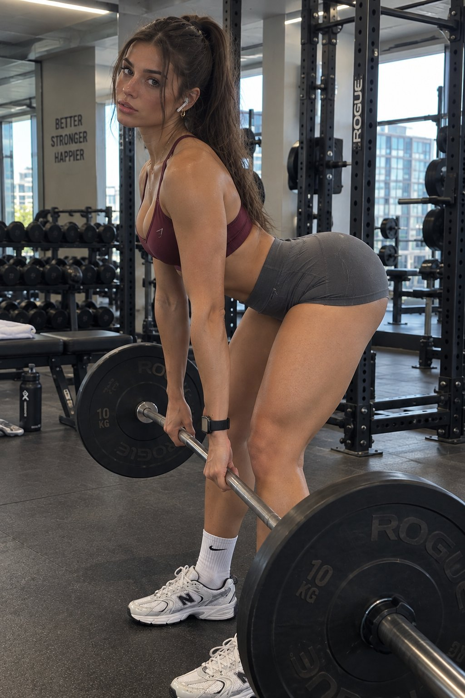](assets/p78-candid-gym-deadlift-photo/source-example-01.jpg)

#### 👇 Workflow

`Text → candid gym workout photo`

#### 🔖 Full Prompt

```text
{
  "prompt": {
    "type": "ultra_photorealistic_lifestyle_fitness_photography",
    "objective": "Generate a single extremely realistic high-resolution fitness photograph of a fictional young adult woman exercising inside a real contemporary gym. The image should feel naturally sexy, confident and feminine without looking staged, explicit or artificial. It must look like a genuine smartphone photograph casually taken during a workout, not AI-generated artwork, CGI, commercial fitness advertising or an over-retouched photoshoot. Prioritize believable anatomy, imperfect natural skin, realistic fabric behavior, authentic gym lighting, subtle asymmetry, physically correct equipment and ordinary photographic imperfections.",
    "image_format": {
      "orientation": "portrait",
      "aspect_ratio": "approximately 2:3",
      "framing": "vertical full-body to three-quarter-body fitness photograph",
      "resolution": "very high resolution",
      "composition_priority": "extremely high",
      "photographic_authenticity_priority": "maximum"
    },
    "subject": {
      "count": 1,
      "presentation": "young adult woman",
      "age_appearance": "clearly adult, approximately mid twenties",
      "appearance": {
        "physique": "athletic feminine physique with naturally developed glutes and legs, toned abdomen, moderately defined shoulders and arms, realistic waist-to-hip proportions and visible evidence of regular strength training without exaggerated bodybuilding proportions",
        "body_realism": [
          "subtle natural asymmetry between left and right sides",
          "realistic muscle tension from the exercise",
          "small natural skin folds caused by movement",
          "no impossible hourglass proportions",
          "no artificial extreme waist reduction",
          "no exaggerated breast or glute proportions"
        ],
        "skin": {
          "tone": "warm lightly tanned natural skin",
          "texture": "visible realistic pores and subtle skin texture",
          "details": [
            "tiny variations in skin tone",
            "very subtle redness from physical activity",
            "minor natural imperfections",
            "faint visible veins in appropriate areas",
            "slight natural sheen from workout perspiration",
            "subtle compression marks where clothing contacts the skin"
          ],
          "avoid": "perfect waxy skin, plastic texture, excessive smoothing or artificial beauty-filter appearance"
        },
        "hair": {
          "color": "rich dark brown",
          "length": "long",
          "style": "loosely tied high ponytail",
          "condition": "slightly messy from exercising",
          "details": [
            "individual strands visible",
            "small loose strands around forehead and temples",
            "natural flyaways",
            "slight unevenness rather than perfect salon styling"
          ]
        },
        "face": {
          "expression": "relaxed, confident and subtly flirtatious without exaggerated posing",
          "gaze": "looking toward the camera with a natural slightly intense expression",
          "mouth": "lips naturally relaxed and very slightly parted",
          "makeup": "minimal realistic gym makeup, subtle mascara, natural brows and muted nude-pink lips",
          "facial_structure": "attractive but believable adult face with natural proportions",
          "realism": [
            "minor facial asymmetry",
            "natural under-eye texture",
            "realistic nasolabial contours",
            "subtle skin texture on forehead and cheeks",
            "no perfectly mirrored features"
          ]
        }
      },
      "exercise": {
        "type": "Romanian deadlift with a barbell",
        "moment": "captured near the lower-middle portion of the repetition while the subject is hinging at the hips",
        "execution": {
          "feet": "approximately hip-width apart and firmly planted on the rubber flooring",
          "knees": "slightly bent in a realistic Romanian deadlift position",
          "hips": "pushed backward naturally",
          "spine": "neutral and anatomically plausible",
          "torso": "leaned forward due to the hip hinge while maintaining realistic posture",
          "barbell": "held close to the legs around mid-shin to just below knee level",
          "shoulders": "slightly pulled back and stable",
          "hands": "gripping the bar naturally at approximately shoulder width",
          "head": "slightly raised and turned enough for the subject to glance toward the camera"
        },
        "pose_character": "athletic and functional first, with the natural hip-hinge position creating a flattering silhouette without turning into an unrealistic pin-up pose"
      }
    },
    "clothing": {
      "top": {
        "type": "minimal fitted athletic sports bra",
        "color": "deep burgundy / wine red",
        "cut": "low-to-moderate athletic scoop neckline",
        "fit": "snug supportive compression fit",
        "straps": "thin-to-medium athletic shoulder straps",
        "back": "minimal racerback-inspired athletic construction",
        "fabric": "matte technical stretch material",
        "details": [
          "realistic stitching",
          "small seams",
          "slight natural fabric tension",
          "very small tonal logo or no visible branding"
        ]
      },
      "bottom": {
        "type": "very fitted high-waisted seamless gym shorts",
        "color": "dark charcoal gray",
        "length": "short upper-thigh athletic length",
        "waist": "high-rise ribbed compression waistband",
        "fit": "form-fitting contour style with realistic compression",
        "fabric": "matte seamless stretch knit",
        "details": [
          "subtle ribbed texture",
          "natural fabric tension",
          "realistic creases around the hip joints",
          "slight compression around thighs",
          "subtle center and contour seams",
          "no impossible painted-on texture"
        ]
      },
      "socks": {
        "type": "white athletic crew socks",
        "height": "mid-calf",
        "condition": "slightly worn but clean",
        "texture": "visible cotton ribbing and minor natural wrinkles"
      },
      "shoes": {
        "type": "flat-soled women's gym training shoes",
        "color": "white and off-white with muted gray details",
        "design": "practical strength-training silhouette",
        "condition": "clean but visibly used",
        "details": [
          "minor sole wear",
          "slightly uneven lace tension",
          "real textile mesh",
          "stitching",
          "small floor dust marks"
        ]
      },
      "accessories": {
        "headphones": {
          "type": "compact wireless in-ear earbuds",
          "color": "white",
          "details": "small and understated"
        },
        "watch": {
          "type": "fitness smartwatch",
          "position": "left wrist",
          "color": "black",
          "details": "slightly reflective screen with no readable interface text"
        },
        "jewelry": {
          "type": "small thin hoop earrings",
          "appearance": "subtle and believable"
        }
      }
    },
    "barbell": {
      "type": "standard Olympic barbell",
      "position": "held close to the legs during the Romanian deadlift",
      "plates": {
        "quantity": "one moderate-sized plate per side",
        "style": "black commercial rubber bumper plates",
        "weight_markings": "subtle and not necessarily readable"
      },
      "details": [
        "realistic knurling",
        "metal sleeves",
        "minor scratches from normal gym use",
        "physically correct plate thickness",
        "correct bar straightness and perspective"
      ]
    },
    "gym_environment": {
      "location": "real upscale urban commercial gym",
      "overall_style": "modern industrial minimalist strength-training area",
      "atmosphere": "active but not crowded, believable and slightly imperfect rather than pristine showroom-like",
      "floor": {
        "material": "dark charcoal rubber flooring",
        "texture": "fine speckled rubber texture",
        "condition": "minor shoe marks and normal gym wear",
        "details": "visible seams between flooring sections"
      },
      "walls": {
        "materials": [
          "warm off-white painted concrete",
          "dark metal",
          "large mirror panels"
        ],
        "condition": "clean but realistically used",
        "decoration": "minimal"
      },
      "windows": {
        "type": "large industrial floor-to-ceiling windows",
        "frames": "black metal",
        "lighting": "soft natural daylight entering from the side",
        "glass": "realistic slight reflections and subtle smudging",
        "view": "modern urban buildings outside"
      },
      "ceiling": {
        "style": "exposed industrial ceiling",
        "color": "dark charcoal",
        "details": [
          "HVAC ducts",
          "electrical conduit",
          "support beams",
          "linear LED fixtures",
          "small recessed lights"
        ]
      }
    },
    "gym_equipment": {
      "power_racks": {
        "position": "rear and side background",
        "type": "heavy black steel commercial racks",
        "details": [
          "uprights",
          "holes",
          "J-hooks",
          "safety arms",
          "stored plates"
        ]
      },
      "dumbbells": {
        "position": "background",
        "type": "commercial black rubber dumbbells",
        "arrangement": "imperfectly aligned along a multi-level rack",
        "realism": "minor wear and believable metallic reflections"
      },
      "benches": {
        "position": "background edges",
        "type": "black adjustable gym benches",
        "details": "subtle upholstery creases and metal support frames"
      },
      "weight_plates": {
        "position": "storage pegs and plate trees",
        "appearance": "slightly used black plates with minor surface wear"
      },
      "additional_details": [
        "water bottle partially visible in the background",
        "small gym towel on a distant bench",
        "cable handles hanging naturally",
        "no unnaturally perfect equipment arrangement"
      ]
    },
    "mirrors": {
      "presence": true,
      "position": "large mirror panels behind and slightly to one side of the subject",
      "reflection_behavior": "physically consistent with actual camera and subject positions",
      "reflection_quality": "slightly darker and fractionally softer than direct view",
      "details": [
        "correct reflected gym equipment",
        "correct reflected lighting",
        "no duplicate limbs",
        "no impossible alternative pose",
        "no impossible camera reflection"
      ]
    },
    "composition": {
      "subject_position": "slightly right of center",
      "body_coverage": "almost full body visible",
      "exercise_visibility": "barbell and complete hip-hinge position clearly readable",
      "visual_emphasis": "face, waist-to-hip silhouette, leg tension and athletic movement",
      "foreground": "subtle portion of rubber flooring with enough space around feet and barbell",
      "background": "recognizable gym interior with realistic depth but not distracting",
      "visual_hierarchy": [
        "subject's face and gaze",
        "natural athletic silhouette",
        "Romanian deadlift movement",
        "burgundy sports bra and charcoal shorts",
        "barbell",
        "gym equipment and windows"
      ],
      "camera_angle": "around hip-to-waist height relative to standing subject",
      "camera_position": "approximately three-quarter front-side angle rather than perfectly frontal",
      "camera_distance": "approximately 2.5 to 3.5 meters from subject",
      "framing_character": "slightly casual, as though another person quickly photographed the workout rather than precisely composing a fashion campaign"
    },
    "camera_characteristics": {
      "device": "modern flagship smartphone main camera",
      "lens": "approximately 28mm full-frame equivalent",
      "aperture_behavior": "smartphone-like natural depth of field rather than artificial DSLR portrait blur",
      "focus": "subject's torso and face sharply focused",
      "background_focus": "slightly softer due to distance but still clearly recognizable",
      "depth_of_field": "moderately deep",
      "dynamic_range": "realistic smartphone HDR",
      "exposure": "slightly imperfect but well-balanced natural exposure",
      "white_balance": "mostly neutral with slightly warm skin rendering",
      "sharpness": "high natural detail but not digitally crunchy",
      "noise": "very subtle fine sensor noise in darker regions",
      "lens_distortion": "small realistic wide-angle distortion near frame edges",
      "chromatic_aberration": "extremely subtle and only where physically plausible",
      "motion": "tiny natural motion softness in loose hair strands while face and torso remain sharp",
      "processing": "minimal computational photography look",
      "avoid": [
        "cinematic grading",
        "commercial studio lighting",
        "unrealistic edge sharpening",
        "fake depth-map blur",
        "perfectly uniform skin exposure"
      ]
    },
    "lighting": {
      "primary_source": "natural daylight from large side windows",
      "secondary_source": "existing neutral-white overhead gym lighting",
      "direction": "side-front daylight creating gentle body contouring",
      "quality": "soft but not flat",
      "contrast": "moderate and realistic",
      "face": "naturally lit with slight shadow variation",
      "body": "soft highlights across shoulders, abdomen and legs caused by real overhead and window light",
      "skin_specularity": "very subtle realistic post-workout sheen",
      "shadows": [
        "contact shadows under shoes",
        "soft shadow beneath barbell",
        "natural shadow between limbs",
        "subtle facial shadows",
        "equipment shadows consistent with ceiling lights"
      ],
      "avoid": [
        "beauty dish lighting",
        "strong rim lighting",
        "neon RGB lighting",
        "orange-and-teal cinema grading",
        "perfect symmetrical light",
        "unrealistic glowing skin",
        "overexposed windows"
      ]
    },
    "photographic_realism": {
      "goal": "The viewer should initially assume this is a normal real photograph uploaded by a fitness creator rather than generated imagery.",
      "required_imperfections": [
        "slightly asymmetric framing",
        "minor fabric wrinkles",
        "subtle skin texture",
        "natural hair flyaways",
        "tiny lighting inconsistencies",
        "minor equipment wear",
        "small rubber floor scuffs",
        "non-perfect shoe placement",
        "slight variation in muscle tension",
        "natural facial asymmetry",
        "realistic hand pressure on the bar"
      ],
      "avoid_ai_signatures": [
        "hyper-perfect face",
        "identical repeating dumbbells",
        "perfectly spaced equipment",
        "impossible reflections",
        "melting background objects",
        "random unreadable wall typography",
        "fake logos",
        "overly glossy surfaces",
        "uniform pore texture",
        "overly smooth legs",
        "overly dramatic body proportions"
      ]
    },
    "anatomical_requirements": {
      "hands": [
        "exactly five fingers per hand",
        "natural finger spacing",
        "thumb positioned correctly around bar",
        "correct wrist alignment",
        "no fused fingers"
      ],
      "legs": [
        "realistic knee structure",
        "correct calf and thigh proportions",
        "both feet connected naturally to floor",
        "no duplicated or distorted joints"
      ],
      "torso": [
        "natural ribcage dimensions",
        "realistic waist",
        "physically plausible spinal posture",
        "no twisted torso geometry"
      ],
      "face": [
        "two symmetrical but naturally non-identical eyes",
        "normal teeth if visible",
        "realistic ears",
        "correct hairline"
      ]
    },
    "fine_details": [
      "individual hair strands near temples",
      "tiny droplets or subtle perspiration along hairline",
      "natural eyebrow hairs",
      "slight texture on lips",
      "very subtle veins on hands",
      "realistic fingernails",
      "barbell knurling",
      "minor metal scratches",
      "fabric knit visible in shorts",
      "sports bra stitching",
      "sock ribbing",
      "shoe mesh",
      "shoelace fibers",
      "rubber floor granularity",
      "minor dust near equipment",
      "mirror edge seams",
      "subtle fingerprints or smudging on distant mirror",
      "window reflections",
      "small highlights on gym hardware"
    ],
    "color_palette": {
      "dominant": [
        "burgundy",
        "dark charcoal",
        "black",
        "white",
        "warm natural skin tones",
        "soft neutral gray"
      ],
      "secondary": [
        "cool daylight blue",
        "brushed steel",
        "muted city colors"
      ],
      "saturation": "natural and restrained",
      "contrast": "moderate",
      "grading": "minimal realistic smartphone color processing"
    },
    "negative_prompt": [
      "AI generated appearance",
      "CGI",
      "3D render",
      "illustration",
      "anime",
      "cartoon",
      "digital painting",
      "plastic skin",
      "porcelain skin",
      "airbrushed skin",
      "beauty filter",
      "perfectly smooth skin",
      "overly glossy skin",
      "exaggerated hourglass figure",
      "impossibly narrow waist",
      "oversized breasts",
      "exaggerated buttocks",
      "unnatural hip width",
      "elongated legs",
      "shortened limbs",
      "extra arms",
      "extra legs",
      "extra hands",
      "extra fingers",
      "missing fingers",
      "fused fingers",
      "warped hands",
      "broken wrists",
      "deformed knees",
      "warped feet",
      "floating shoes",
      "floating barbell",
      "bent barbell",
      "asymmetric weight plates",
      "duplicated gym equipment",
      "repeating dumbbell patterns",
      "warped racks",
      "warped mirrors",
      "incorrect reflections",
      "duplicate person in mirror",
      "fisheye distortion",
      "extreme low angle",
      "extreme wide angle",
      "heavy portrait blur",
      "fake bokeh",
      "cinematic lighting",
      "studio lighting",
      "RGB neon lights",
      "teal-orange grading",
      "excessive HDR",
      "oversharpening",
      "excessive contrast",
      "motion blur across face",
      "grainy low-quality image",
      "watermark",
      "random text",
      "unreadable wall text",
      "fake brand logos",
      "perfect showroom gym",
      "unnatural exercise form",
      "stiff model pose",
      "explicit nudity",
      "transparent clothing",
      "wardrobe malfunction",
      "pornographic framing"
    ],
    "identity_handling": {
      "instruction": "Create a completely fictional adult woman. Do not reproduce or imitate the recognizable identity of any real person."
    },
    "priority_order": [
      "1. The result must look like an actual real-world smartphone gym photograph",
      "2. Preserve believable adult human anatomy and exercise biomechanics",
      "3. Create a naturally attractive and sexy fitness aesthetic without explicit presentation",
      "4. Preserve realistic imperfect skin, hair, fabric and equipment details",
      "5. Make the Romanian deadlift position anatomically and mechanically plausible",
      "6. Preserve realistic burgundy sports bra and charcoal fitted shorts",
      "7. Use ordinary natural gym lighting instead of cinematic or studio lighting",
      "8. Preserve physically correct mirrors, shadows and reflections",
      "9. Include subtle real-world imperfections that reduce the AI-generated appearance",
      "10. Avoid all common AI artifacts in hands, equipment, background geometry and textures"
    ]
  },
  "output": {
    "style": "extremely photorealistic authentic fitness photography",
    "quality": "maximum",
    "detail": "maximum",
    "human_realism": "maximum",
    "skin_realism": "maximum",
    "anatomical_accuracy": "maximum",
    "exercise_accuracy": "very high",
    "environment_realism": "maximum",
    "photographic_authenticity": "maximum",
    "ai_artifact_suppression": "maximum",
    "retouching_level": "minimal"
  }
}
```

<sub>(by [@cartelfather](https://x.com/cartelfather/status/2101400765772542021)) · [Source: X](https://x.com/cartelfather/status/2101400765772542021)</sub>

<a id="p79-two-woman-fitness-selfie-reconstruction"></a>

### 📌 1.28. Two Woman Fitness Selfie Reconstruction

#### 👀 Preview

[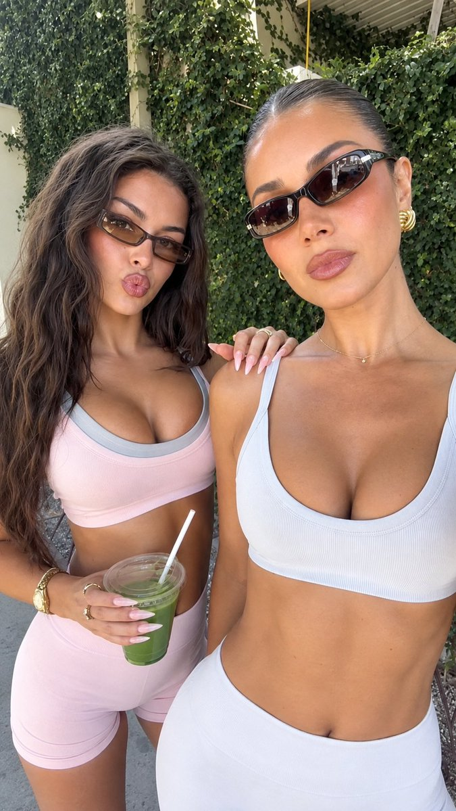](assets/p79-two-woman-fitness-selfie-reconstruction/source-example-01.jpg)

#### 👇 Workflow

`Reference photo → two-woman fitness selfie reconstruction`

#### 🔖 Full Prompt

```text
{
  "prompt_type": "photorealistic_reference_image_reconstruction",
  "goal": "Recreate the supplied reference photograph as closely as possible, matching the composition, two-person arrangement, facial expressions, body positioning, clothing, accessories, background foliage, camera perspective, natural lighting, colors, proportions, and smartphone-photo aesthetic. Completely ignore and remove all text, interface elements, buttons, icons, timestamps, watermarks, captions, borders, and any other screen graphics.",
  "reference_fidelity": {
    "target": "extremely high visual similarity",
    "priority_order": [
      "overall composition and crop",
      "positions and scale of both subjects",
      "facial expressions and head angles",
      "hair shapes and colors",
      "eyewear",
      "clothing silhouettes and colors",
      "hand placement and manicures",
      "green drink and straw",
      "background greenery and architecture",
      "lighting and color grading",
      "fine material and skin detail"
    ]
  },
  "canvas": {
    "orientation": "portrait",
    "aspect_ratio": "approximately 736:1307",
    "framing": "tight vertical smartphone selfie photograph",
    "crop_style": "upper-body to mid-thigh/full partial-body framing",
    "camera_distance": "very close, approximately arm's length",
    "camera_height": "slightly above chest level and angled downward just a little",
    "composition": "two adult women standing very close together, occupying nearly the entire frame",
    "edge_behavior": {
      "top": "small amount of background visible above both heads",
      "left": "left woman's hair and body extend close to frame edge",
      "right": "right woman's shoulder and torso extend close to frame edge",
      "bottom": "right woman's pants and left woman's legs extend toward the bottom border"
    }
  },
  "scene": {
    "setting": "sunny outdoor patio, garden, or residential courtyard",
    "atmosphere": "warm upscale casual summer lifestyle setting",
    "visual_style": "authentic high-end smartphone social-media photograph rather than studio photography",
    "background": {
      "dominant_element": "dense dark green leafy hedge or climbing vegetation",
      "architecture": {
        "visible": true,
        "description": "cream/light beige stucco or concrete vertical structure partially concealed by foliage",
        "details": [
          "vertical pale structural post",
          "light wall surface",
          "subtle roof or pergola structure near upper right",
          "dark horizontal/wood-like architectural element"
        ]
      },
      "vegetation": {
        "type": "dense broadleaf greenery",
        "color": "deep natural green with lighter sunlit leaves",
        "density": "very high",
        "focus": "slightly softer than subjects"
      },
      "ground": {
        "appearance": "light gray or pale stone/concrete patio",
        "visibility": "mostly obscured by subjects, visible in lower background"
      }
    }
  },
  "subjects": {
    "count": 2,
    "both_are": "adult women",
    "interaction": "standing closely together for a casual selfie/fashion-lifestyle photo",
    "mood": "playful, confident, relaxed, summery"
  },
  "right_subject": {
    "position": "foreground right, larger and closer to camera",
    "scale": "dominant subject occupying approximately 55-60 percent of visible image width",
    "body_visibility": "head, shoulders, torso, abdomen, hips, and upper portion of high-waisted pants visible",
    "pose": {
      "orientation": "facing camera almost directly",
      "head": "slightly tilted toward viewer's left",
      "shoulders": "relaxed and open",
      "torso": "front-facing with a slight natural rotation",
      "right_arm": "mostly outside or along edge of frame",
      "left_arm": "near center-left region, hand resting over the other woman's shoulder",
      "posture": "upright and relaxed"
    },
    "face": {
      "shape": "soft oval with defined cheekbones and tapered lower face",
      "skin": {
        "tone": "warm medium tan / golden beige",
        "finish": "smooth, luminous, lightly sun-kissed",
        "texture": "natural fine texture softened by smartphone processing",
        "highlights": "warm highlights across forehead, cheeks, nose, and upper chest"
      },
      "expression": "subtle pout with lips gently pursed, calm confident expression",
      "gaze": "directly toward camera",
      "eyes": {
        "visibility": "mostly obscured by sunglasses",
        "makeup": "subtle polished eye makeup around exposed areas"
      },
      "brows": "dark, groomed, defined",
      "nose": "straight, softly defined",
      "lips": {
        "shape": "full and defined",
        "color": "muted pink-nude / soft mauve",
        "finish": "satin to slightly glossy",
        "expression": "slight kissy pout"
      },
      "cheeks": "softly bronzed with faint warm blush"
    },
    "hair": {
      "color": "dark brown to nearly black",
      "style": "sleek, tightly pulled-back hairstyle",
      "length": "long but mostly gathered away from face",
      "part": "clean center or slightly off-center part",
      "finish": "smooth and glossy",
      "texture": "fine smooth strands with subtle individual detail",
      "silhouette": "close to scalp near crown and pulled toward back"
    },
    "eyewear": {
      "type": "narrow futuristic wraparound sunglasses",
      "frame": "dark metallic or glossy black",
      "lens": "dark smoked brown-black reflective lenses",
      "shape": "elongated angular cat-eye / shield hybrid",
      "size": "medium width, relatively narrow vertical height",
      "position": "low enough to clearly frame upper face but completely cover eyes",
      "reflection": "subtle bright outdoor reflections visible on lenses",
      "style": "fashion-forward early-2000s-inspired rectangular sunglasses"
    },
    "clothing": {
      "top": {
        "type": "fitted cropped athletic tank / sports-bra-style top",
        "color": "very pale icy blue-white / cool lavender-white",
        "neckline": "wide rounded scoop neckline",
        "straps": "medium-width athletic straps",
        "fit": "snug and body-contouring",
        "length": "cropped just below bust",
        "material": "stretch athletic fabric with fine ribbed texture",
        "finish": "matte with subtle fabric highlights"
      },
      "bottom": {
        "type": "high-waisted fitted leggings or yoga pants",
        "color": "matching very pale blue-white / cool lavender-white",
        "rise": "very high waist",
        "fit": "close-fitting through waist and hips",
        "surface": "smooth stretch fabric with subtle ribbed construction",
        "waistband": "wide and supportive",
        "silhouette": "clean fitted athletic line"
      }
    },
    "jewelry": {
      "earrings": {
        "type": "large gold hoop earrings",
        "shape": "rounded thick hoops",
        "finish": "warm polished gold",
        "visibility": "clearly visible on side closest to camera"
      },
      "necklace": {
        "type": "very delicate short gold chain",
        "pendant": "tiny minimalist pendant",
        "placement": "low on upper chest"
      }
    },
    "manicure": {
      "hand": "the hand resting on the other woman's shoulder",
      "nails": {
        "length": "long",
        "shape": "long almond / tapered stiletto-almond",
        "color": "pale neutral pink or soft nude",
        "finish": "high gloss",
        "appearance": "well-manicured, elegant"
      },
      "rings": {
        "quantity": "one or a few delicate rings",
        "material": "silver or gold",
        "style": "minimal"
      }
    }
  },
  "left_subject": {
    "position": "behind and to the left of foreground woman",
    "scale": "slightly smaller due to being farther from camera",
    "body_visibility": "head, shoulders, torso, waist, shorts, and upper-to-mid thighs visible",
    "pose": {
      "orientation": "facing camera",
      "head": "slightly tilted",
      "shoulders": "relaxed",
      "left_arm": "lower and partially cropped",
      "right_arm": "near center/right with hand interacting visually with foreground woman",
      "posture": "casual and slightly angled"
    },
    "face": {
      "shape": "soft youthful oval",
      "skin": {
        "tone": "warm medium tan / golden beige",
        "finish": "smooth and softly luminous",
        "texture": "natural but subtly beauty-filtered"
      },
      "expression": "playful exaggerated kissy lips / duck-face pout",
      "gaze": "toward camera",
      "eyes": {
        "visibility": "visible through tinted sunglasses",
        "appearance": "dark eyes with subtle eye makeup"
      },
      "brows": "dark and defined",
      "nose": "small and softly contoured",
      "lips": {
        "shape": "full and prominent",
        "color": "muted rosy pink",
        "finish": "soft satin",
        "expression": "strong puckered kiss expression"
      }
    },
    "hair": {
      "color": "dark brown",
      "style": "long, voluminous, loose hair",
      "length": "past shoulders, extending down toward waist/hips",
      "texture": "soft waves with natural body",
      "part": "slightly off-center",
      "appearance": "full, slightly tousled, glossy",
      "face_framing": "multiple loose strands and thick sections frame cheeks and jaw",
      "volume": "high around sides of head"
    },
    "eyewear": {
      "type": "small narrow rectangular sunglasses",
      "frame": "dark brown/black",
      "lens": "warm brown smoked translucent lenses",
      "shape": "slightly cat-eye / rectangular",
      "position": "centered across eyes",
      "style": "retro-futuristic narrow fashion sunglasses"
    },
    "clothing": {
      "top": {
        "type": "fitted cropped tank / sports-bra top",
        "color": "soft pale blush pink",
        "trim": "contrasting light cool-gray piping or trim around neckline and straps",
        "neckline": "rounded scoop",
        "fit": "tight and supportive",
        "length": "cropped above waist",
        "material": "stretch athletic fabric",
        "finish": "matte with subtle rib texture"
      },
      "bottom": {
        "type": "high-waisted fitted biker shorts",
        "color": "matching pale blush pink",
        "length": "mid-thigh",
        "fit": "tight body-contouring silhouette",
        "material": "smooth stretchy athletic fabric",
        "waistband": "high and wide",
        "wrinkles": "subtle natural fabric tension around hips and thighs"
      }
    },
    "accessories": {
      "watch_or_bracelet": {
        "position": "left wrist",
        "type": "chunky gold watch or stacked bracelet",
        "finish": "polished gold",
        "appearance": "bright metallic highlights"
      },
      "rings": {
        "style": "minimal delicate rings",
        "finish": "gold"
      }
    },
    "drink": {
      "type": "clear plastic cup of green beverage",
      "position": "held in front of lower torso",
      "beverage": "bright natural green smoothie, matcha, or pressed green drink",
      "cup": {
        "material": "transparent plastic",
        "shape": "medium-to-large cylindrical takeaway cup",
        "lid": "clear domed or flat plastic lid",
        "condensation": "subtle moisture on exterior",
        "color_detail": "green drink dominates interior"
      },
      "straw": {
        "color": "white",
        "type": "straight plastic straw",
        "position": "rises diagonally upward from cup toward the upper-right",
        "visibility": "clearly visible"
      },
      "grip": {
        "hand": "left subject's hand wrapped naturally around the cup",
        "fingers": "slender",
        "nails": "long pale pink/nude glossy nails"
      }
    }
  },
  "interaction_between_subjects": {
    "distance": "very close, shoulders and upper arms nearly touching",
    "foreground_hand": "right subject's hand rests casually across or near left subject's shoulder",
    "body_overlap": "right subject overlaps part of left subject's torso",
    "social_context": "close friends posing together for a casual fashion/lifestyle selfie",
    "pose_relationship": "coordinated but spontaneous"
  },
  "background": {
    "vegetation": {
      "description": "dense leafy hedge covering most of the upper and central background",
      "colors": [
        "deep forest green",
        "medium natural green",
        "olive green",
        "muted sage green"
      ],
      "lighting": "mixed shade with small patches of warm sunlight",
      "texture": "many overlapping small and medium leaves",
      "depth": "moderate"
    },
    "architecture": {
      "wall": "warm off-white or beige",
      "vertical_pillar": "pale beige structural column at upper-left/center",
      "roof_structure": "partial slatted pergola/awning visible upper-right",
      "background_detail": "subtle and not distracting"
    },
    "ground": {
      "material": "light gray stone/concrete",
      "texture": "slightly rough",
      "lighting": "softly illuminated"
    }
  },
  "lighting": {
    "source": "natural outdoor daylight",
    "style": "bright but softened sunlight filtered through nearby foliage",
    "direction": "front-right and slightly above camera",
    "quality": "soft directional daylight with some dappled highlights",
    "skin_rendering": "warm, luminous, flattering",
    "hair_highlights": "subtle warm highlights on loose strands",
    "clothing_highlights": "soft bright highlights on white/pale fabric",
    "background": "slightly darker foliage creates separation around faces",
    "shadows": "soft and realistic, no harsh flash shadows",
    "color_temperature": "warm-neutral daylight"
  },
  "camera": {
    "device": "modern smartphone front-facing camera",
    "lens": "mildly wide selfie lens",
    "focal_length_equivalent": "approximately 24-28mm",
    "perspective": "close wide-angle portrait with slight natural edge stretching",
    "orientation": "vertical",
    "camera_position": "held above or around eye/chest height",
    "distance": "arm's length or slightly longer selfie distance",
    "focus": "both women's faces reasonably sharp, foreground subject slightly sharper",
    "depth_of_field": "moderate, background softly softened but still recognizable",
    "image_quality": "high-resolution smartphone photograph",
    "processing": "subtle HDR, smooth skin processing, moderate clarity, natural colors",
    "stabilization": "very stable handheld image",
    "motion_blur": "minimal"
  },
  "composition": {
    "foreground_subject": "large on right half of frame",
    "background_subject": "slightly smaller on left half of frame",
    "faces": {
      "right_subject": "upper-right quadrant",
      "left_subject": "upper-left quadrant",
      "vertical_level": "faces approximately aligned but foreground woman's head slightly higher"
    },
    "bodies": {
      "right_subject": "torso dominates lower-right",
      "left_subject": "torso and shorts occupy lower-left"
    },
    "drink": "green cup anchors lower-middle-left region",
    "hands": "one hand near center/top of left subject's shoulder, one hand around green drink",
    "negative_space": "very little negative space due to tight selfie framing",
    "visual_balance": "two faces and two contrasting pastel outfits form the main visual focus"
  },
  "clothing_materials": {
    "right_outfit": {
      "texture": "fine ribbed athletic knit",
      "stretch": "smooth body-contouring stretch",
      "surface": "matte satin"
    },
    "left_outfit": {
      "texture": "fine athletic knit",
      "stretch": "soft and fitted",
      "surface": "matte with subtle sheen"
    }
  },
  "color_grading": {
    "overall": "warm, lightly pastel, natural social-media aesthetic",
    "skin": "warm golden beige",
    "whites": "slightly cool",
    "pink": "soft blush pink",
    "green": "rich natural leafy green",
    "contrast": "moderate",
    "saturation": "moderate",
    "highlights": "slightly warm",
    "shadows": "cooler muted greens and grays",
    "black_levels": "natural, not crushed"
  },
  "beauty_processing": {
    "strength": "moderate",
    "skin_smoothing": "moderate-to-high",
    "blemish_reduction": "moderate",
    "eye_enhancement": "subtle",
    "facial_shape_changes": "none or minimal",
    "lip_definition": "subtle",
    "overall": "polished smartphone/social-media beauty look while remaining photorealistic"
  },
  "micro_details": {
    "skin": "subtle natural pores and tonal variation remain visible",
    "hair": "fine individual strands visible around face and shoulders",
    "sunglasses": "realistic reflections of sky/architecture",
    "gold_jewelry": "tiny sharp specular highlights",
    "nails": "glossy reflections and realistic curvature",
    "athletic_fabric": "fine rib texture and realistic tension folds",
    "drink": "transparent reflections, green liquid depth, slight condensation",
    "leaves": "individual leaf shapes and overlapping shadows",
    "background_structure": "subtle architectural edges and texture"
  },
  "photographic_character": {
    "genre": "luxury casual lifestyle / fashion influencer selfie",
    "realism": "extreme photorealism",
    "camera_feel": "authentic smartphone capture",
    "retouching": "light-to-moderate",
    "avoid": "studio editorial appearance",
    "desired_result": "looks like an actual spontaneous photograph taken outdoors by one of the subjects"
  },
  "negative_prompt": [
    "text",
    "captions",
    "subtitles",
    "watermarks",
    "logos",
    "social media UI",
    "buttons",
    "play icons",
    "pause icons",
    "progress bar",
    "timestamps",
    "interface elements",
    "screen overlays",
    "extra people",
    "third person",
    "different number of subjects",
    "child",
    "teenager",
    "different pose",
    "different camera angle",
    "wide landscape composition",
    "cropped heads",
    "cropped faces",
    "missing hands",
    "extra hands",
    "extra fingers",
    "deformed fingers",
    "anatomical distortion",
    "duplicate limbs",
    "unnatural body proportions",
    "different hairstyles",
    "short hair on left subject",
    "loose hair on right subject",
    "missing sunglasses",
    "oversized sunglasses",
    "round sunglasses",
    "clear sunglasses",
    "different clothing colors",
    "dark clothing",
    "long sleeves",
    "jackets",
    "coats",
    "jeans",
    "skirts",
    "different drink",
    "no drink",
    "cup without straw",
    "metal cup",
    "glass wine goblet",
    "busy city background",
    "indoor environment",
    "night scene",
    "studio backdrop",
    "flash photography",
    "dramatic cinematic lighting",
    "extreme bokeh",
    "fisheye distortion",
    "cartoon",
    "anime",
    "illustration",
    "3D render",
    "CGI",
    "plastic skin",
    "uncanny faces",
    "over-smoothed skin",
    "excessive HDR",
    "oversaturated colors",
    "unrealistic reflections"
  ],
  "final_generation_instruction": "Generate one highly photorealistic vertical smartphone selfie that matches the reference composition as closely as possible. Two adult women stand very close together outdoors against a dense leafy green hedge and pale architectural background. The foreground woman on the right is closer to the camera, wearing a pale icy blue-white fitted cropped athletic top and matching high-waisted leggings, narrow dark wraparound sunglasses, large gold hoop earrings, and delicate gold jewelry. Her hair is sleek and pulled back, her lips are gently pursed, and her right-side presence dominates the frame. Her manicured hand rests casually on the other woman's shoulder. The woman on the left stands slightly behind, wearing a pale blush-pink cropped athletic tank with cool-gray trim and matching high-waisted biker shorts, narrow brown-tinted rectangular sunglasses, and long loose dark wavy hair. She holds a clear cup containing a vivid green drink with a white straw. Both have long glossy almond-shaped manicures and warm naturally bronzed skin. Preserve the intimate selfie perspective, natural daylight, realistic skin, subtle beauty processing, leafy background, pale athletic fabrics, jewelry reflections, and casual social-media lifestyle aesthetic. Remove and ignore all text, buttons, UI elements, timestamps, watermarks, and interface graphics."
}
```

<sub>(by [@jasonugc](https://x.com/jasonugc/status/2101372937353965940)) · [Source: X](https://x.com/jasonugc/status/2101372937353965940)</sub>

<a id="p80-sepia-reference-portraits"></a>

### 📌 1.29. Sepia Reference Portraits

#### 👀 Preview

[](assets/p80-sepia-reference-portraits/source-example-01.jpg)

[](assets/p80-sepia-reference-portraits/source-example-02.jpg)

[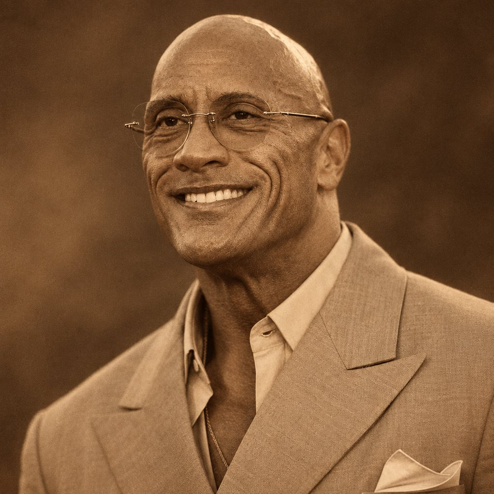](assets/p80-sepia-reference-portraits/source-example-03.jpg)

[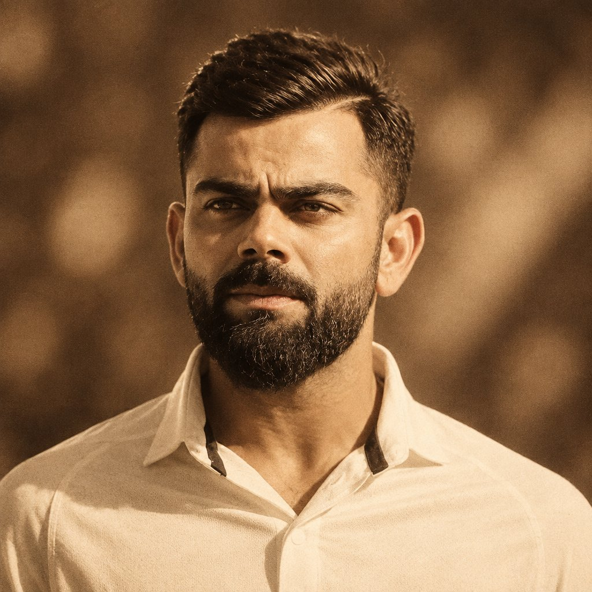](assets/p80-sepia-reference-portraits/source-example-04.jpg)

#### 👇 Workflow

`Person reference → sepia portrait`

#### 🔖 Full Prompt

```text
Sepia portrait of the person in the attached reference image, preserving their facial features, identity, hairstyle, skin tone, and proportions. Classic warm brown sepia tones, soft directional lighting, subtle film grain, rich shadows, timeless vintage photography aesthetic, natural skin texture, elegant composition, shallow depth of field, highly detailed, photorealistic, cinematic, sharp focus
```

<sub>(by [@shushant_l](https://x.com/shushant_l/status/2101567556268310657)) · [Source: X](https://x.com/shushant_l/status/2101567556268310657)</sub>

<a id="p81-playful-plaza-finger-point-portrait"></a>

### 📌 1.30. Playful Plaza Finger Point Portrait

#### 👀 Preview

[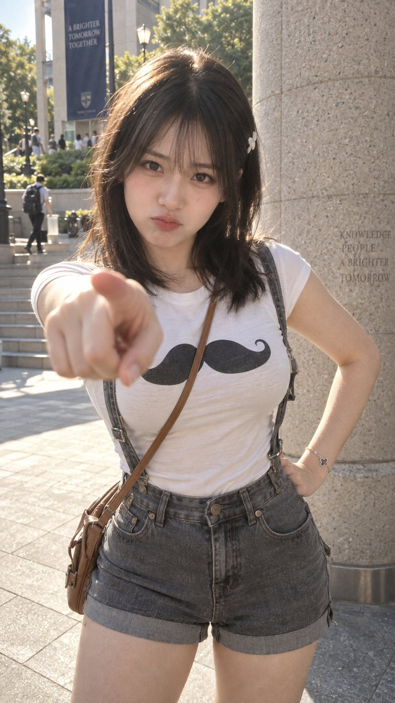](assets/p81-playful-plaza-finger-point-portrait/source-example-01.jpg)

#### 👇 Workflow

`Text → playful plaza street portrait`

#### 🔖 Full Prompt

```text
A cinematic candid 35mm street photograph captured on location — an engaging medium hero composition of an exceptionally attractive 20-year-old East Asian collegiate woman on a sunlit urban plaza, the camera positioned straight-on at chest level capturing her breathtaking youthful beauty and playful charm as she points her right index finger teasingly directly toward the camera lens in an M1 cinematic narrative register.

The woman is a strikingly gorgeous 20-year-old young adult with refined, sweet East Asian facial features, soft radiant cheeks with a delicate peach flush, and large, captivating dark almond eyes gazing directly into the lens. Her soft, plump rose-tinted lips are pressed into an adorable, subtle micro-pout with her upper lip slightly puckered in a sweet, endearing expression of playful feigned annoyance. She has silky, shoulder-length dark espresso hair with neat, airy straight-across fringe bangs framing her lovely face, adorned with a miniature white hairpin above her left ear, with soft strands catching the warm afternoon light. She possesses a remarkably curvaceous, feminine hourglass figure with a prominent, full bust and a tiny, slender waistline. She wears a snug, form-fitting tight white stretch-cotton baby tee that hugs her voluptuous bustline and narrow waist neatly, featuring a distinct cartoon black handlebar mustache print centered across her chest. A tan leather crossbody bag strap stretches diagonally across her torso, naturally accentuating her striking feminine contours. Her shirt is neatly tucked into high-waisted, fitted washed-gray denim suspender shorts that sit snugly at her waist, styled with slender denim suspenders over her shoulders. Her right arm extends directly toward the camera with her index finger pointing at the lens in dramatic optical foreshortening, while her left hand rests confidently on her hip, showing a slender silver clover bracelet on her wrist.

The setting is a modern outdoor architectural entrance on a bright afternoon — a massive circular beige granite pillar rises directly beside her, with smooth stone pavement beneath her feet and outdoor steps leading up to landscaped green shrubs in the softly blurred background, providing an authentic urban campus/city setting.

The lighting is governed by clean, warm natural afternoon sunlight — a bright directional sunlight source from above and camera-right casts brilliant golden rim light and luminous highlights along the top of her dark hair and shoulders, while clear ambient daylight fills her face and white shirt smoothly with balanced, flattering illumination, beautifully highlighting her feminine curves and enchanting facial expression.

Captured with a wide-latitude digital cinema look on a fast 35mm wide-angle prime lens at wide aperture T2.0, rendering crisp focus across her eyes, fringe bangs, subtle pout, and fitted t-shirt, while naturally softening the reaching foreground index finger and blurring the background architecture into smooth circular bokeh. Daylight film emulation with warm, luminous skin tones, crisp clean whites, and deep rich blacks in the mustache print and denim, finished with fine, organic 35mm theatrical film grain across the frame. Real photographic frame captured on a real cinema camera, real wide-angle lens, real tight fitted cotton tee, real denim fabric, real leather strap, real gorgeous 20-year-old East Asian woman, real sunlit urban plaza — no CGI, no rendered look, no digital cleanliness, no plastic surfaces, no AI smoothness, no skin smoothing, no child features, no exaggerated distorted pout, no glow, no halation bloom that reads as artificial, no glossy highlights.
```

<sub>(by [@johnAGI168](https://x.com/johnAGI168/status/2101552625669833159)) · [Source: X](https://x.com/johnAGI168/status/2101552625669833159)</sub>

<a id="p85-y2k-street-fashion-portrait"></a>

### 📌 1.31. Y2K Street Fashion Portrait

#### 👀 Preview

[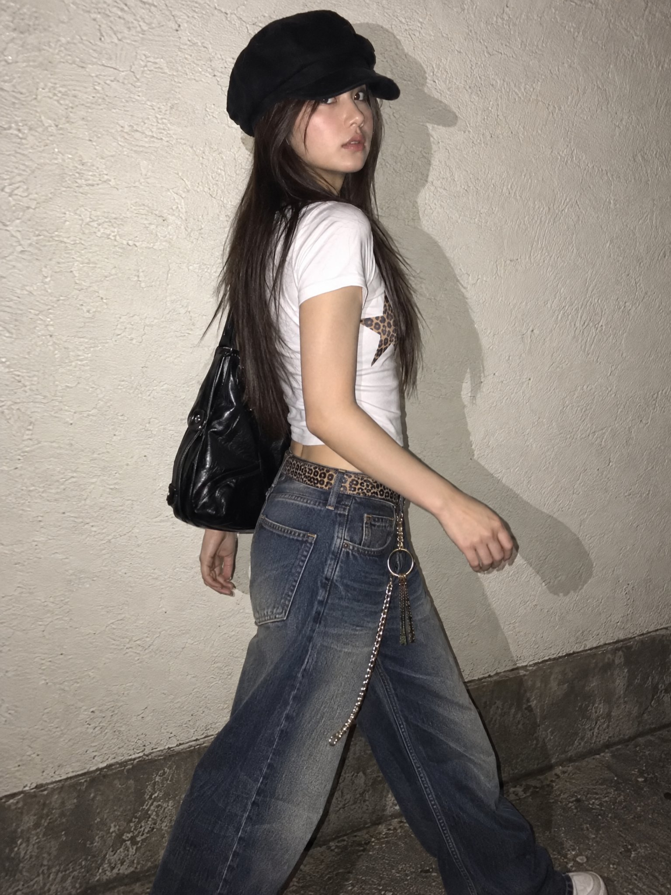](assets/p85-y2k-street-fashion-portrait/source-example-01.jpg)

#### 👇 Workflow

`Prior portrait reference → candid Y2K street pose`

#### 🔖 Full Prompt

```text
ULTRA-REALISTIC NATURAL SMARTPHONE PHOTOGRAPH, vertical 3:4, candid Y2K street-style fashion portrait of the young pretty Japanese woman. <<<d1ec9c33a3e14a5dbbef4f3088b4ad5f>>>, standing against the textured off-white plaster wall background.

Keep identical: her long straight dark-brown hair falling naturally over her shoulders with soft strands framing her face, her structured black newsboy/baker-boy cap, her fitted plain white cropped short-sleeve baby tee with the large leopard-print five-point star graphic on the chest, her low-rise oversized dark-blue baggy jeans with realistic faded denim washes, the leopard-print belt/waistband at her waist, the long decorative metal chain with large circular metal ring and dangling strap details, and the large black shoulder bag.

COMPLETELY NEW POSE — distinctly different from all previous versions: she is caught mid-stride in a casual walking motion, her body turned approximately three-quarters toward the camera, head turned back over her left shoulder to glance at the camera with a cool, effortless expression — lips slightly parted, eyes relaxed and direct. Her weight is shifting forward onto her right foot, left leg stepping back, creating natural mid-walk movement in her baggy denim. Her right arm swings naturally forward with a relaxed bent elbow, while her left arm trails back slightly with the black shoulder bag shifting naturally with her motion. Her hair falls loosely with subtle movement suggesting the walking stride. The overall stance reads as a candid, unposed street-fashion catch — a completely different body orientation, weight distribution, and head direction than either previous reference pose.

Direct on-camera flash photography creating a distinct realistic shadow of her body and cap on the textured wall behind her. Authentic early-2000s point-and-shoot or compact digital camera feel. RAW smartphone aesthetic, realistic skin texture, individual hair strands, accurate hands and fingers, natural body proportions, detailed denim texture, realistic leather bag, authentic metal reflections, visible wall texture, direct flash, subtle grain, slightly imperfect exposure, nostalgic Y2K fashion photography, no beauty filter, no plastic skin, no CGI appearance, no excessive retouching, vertical 3:4 composition
```

<sub>(by [@saniaspeaks_](https://x.com/saniaspeaks_/status/2101878359282036998)) · [Source: X](https://x.com/saniaspeaks_/status/2101878359282036998)</sub>

<a id="p88-bangkok-night-market-street-photograph"></a>

### 📌 1.32. Bangkok Night Market Street Photograph

#### 👀 Preview

[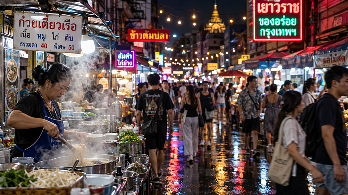](assets/p88-bangkok-night-market-street-photograph/source-example-01.png)

#### 👇 Workflow

`Text → Bangkok night-market photograph`

#### 🔖 Full Prompt

```text
A wide-angle photograph of a busy night market in Bangkok, shot at eye level with a 35mm lens. Steam rising from a noodle stall in the foreground, string lights overhead, a crowd of about fifteen people moving through the frame at different distances, wet pavement reflecting neon signage in Thai script. Shallow depth of field on the foreground vendor, everything behind falling gradually out of focus.
```

<sub>(by [Jim Clyde Monge](https://generativeai.pub/i-tested-gpt-image-2-5-and-compared-it-against-gpt-image-2-5-on-pollo-ai-87a8bb375ce2)) · [Source: Generative AI](https://generativeai.pub/i-tested-gpt-image-2-5-and-compared-it-against-gpt-image-2-5-on-pollo-ai-87a8bb375ce2)</sub>

<a id="p92-night-train-window-portrait"></a>

### 📌 1.33. Night Train Window Portrait

#### 👀 Preview

[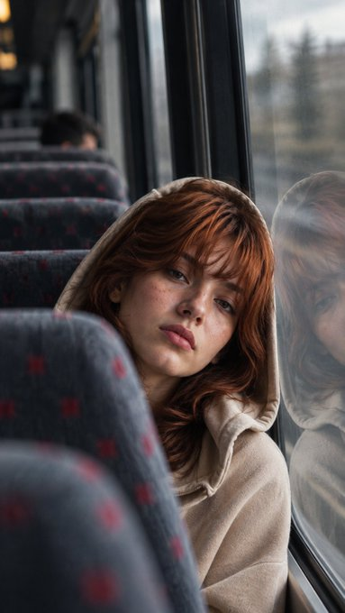](assets/p92-night-train-window-portrait/source-example-01.jpg)

#### 👇 Workflow

`Text → cinematic train-window portrait`

#### 🔖 Full Prompt

```text
Create a photorealistic cinematic portrait photograph of a young adult woman sitting alone by the window of a modern intercity train.

COMPOSITION:
Vertical 9:16 portrait frame. Camera positioned from the aisle, slightly behind the seat in front of her, looking diagonally toward the window seat. A large blurred train seat dominates the lower-left foreground, creating strong depth and framing the subject. The woman is positioned in the center-right of the frame, partially hidden behind the foreground seat. Her reflection is clearly visible in the train window on the right.

SUBJECT:
Young adult woman with fair skin, natural freckles, soft facial features, medium-length copper-red hair with messy natural bangs falling across her forehead. Her hair is slightly tousled and imperfect, with individual strands visible. She has light blue-gray eyes, natural eyebrows, subtle eyelashes, soft pink natural lips and a completely natural face with no heavy makeup.

She is wearing a loose beige/taupe hoodie with the hood resting around the back of her head and shoulders. The hoodie has realistic soft fabric texture and natural folds.

POSE AND EXPRESSION:
She is sitting beside the window, leaning slightly toward the aisle and looking directly toward the camera with a quiet, tired, introspective expression. Her head is tilted slightly downward and toward the foreground seat. Relaxed posture, lips gently closed, subtle melancholy mood. Natural candid moment, not posing for the camera.

TRAIN INTERIOR:
Realistic modern European-style train interior. Dark charcoal-gray fabric seats with small scattered red geometric patterns. Multiple rows of seats extend into the background. The foreground seat is very close to the camera and heavily out of focus. Another passenger is barely visible far in the background, also heavily blurred.

WINDOW:
Large train window immediately beside the woman. The glass has subtle reflections and slight smudges. Her face and upper body appear as a soft but recognizable reflection in the window. Outside the window is an indistinct muted urban/rural landscape, completely blurred because of the moving train.

LIGHTING:
Soft natural daylight entering through the train window from the right side. Warm, slightly golden daylight illuminates her face and copper hair while the train interior remains darker and subdued. Gentle cinematic contrast, soft shadows, realistic skin highlights, subtle reflected light from the window.

CAMERA:
Professional cinematic photography, 50mm lens, approximately f/1.8, shallow depth of field. Focus precisely on the woman's eyes and face. Foreground seat and background passenger strongly blurred. Natural perspective, realistic optical depth, subtle lens compression.

COLOR AND MOOD:
Muted cinematic color grading with warm copper/orange tones in the hair and beige hoodie contrasted against cool dark blue-gray train seats and window tones. Soft filmic contrast, slightly desaturated colors, natural skin tones, subtle grain, atmospheric and intimate feeling.

REALISM:
Ultra-photorealistic, authentic candid photography, realistic skin pores and freckles, individual hair strands, realistic fabric texture, physically accurate reflections in glass, natural imperfections, realistic train materials, true photographic depth of field, no artificial beauty retouching.

NEGATIVE PROMPT:
cartoon, anime, illustration, CGI, 3D render, plastic skin, excessive makeup, perfect skin, beauty filter, oversharpening, unrealistic eyes, distorted face, extra fingers, deformed hands, duplicate person, duplicated reflection, incorrect reflection, artificial hair, glossy skin, studio lighting, fantasy train, text, watermark, logo, low resolution, excessive HDR, oversaturated colors
```

<sub>(by [@harboriis](https://x.com/harboriis/status/2102635863893307394)) · [Source: X](https://x.com/harboriis/status/2102635863893307394)</sub>

<a id="p94-luxury-suv-night-selfie-reconstruction"></a>

### 📌 1.34. Luxury SUV Night Selfie Reconstruction

#### 👀 Preview

[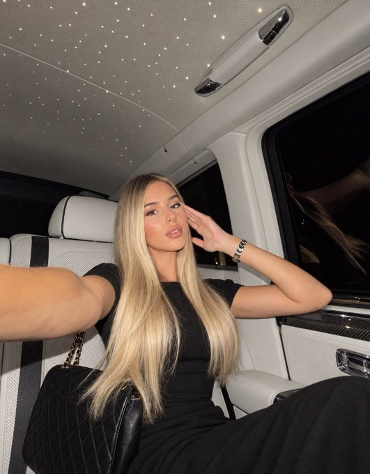](assets/p94-luxury-suv-night-selfie-reconstruction/source-example-01.jpg)

#### 👇 Workflow

`Photo reference → luxury-SUV night selfie reconstruction`

#### 🔖 Full Prompt

```text
Use the uploaded image as the sole visual authority. Recreate it as a highly photorealistic vertical nighttime smartphone selfie taken from the rear passenger seat of a white luxury SUV. Preserve the woman’s identity, facial proportions, expression, skin tone, very long center-parted blonde hair, natural soft-glam makeup, black dress, silver metal-link watch, seated pose, extended camera arm, raised hand beside her temple, fabric-covered bent knee, handbag, cabin layout, flash lighting, reflections, perspective, crop, and framing.

COMPOSITION
Use a wide-angle arm’s-length selfie perspective in portrait orientation, approximately 1108:1420. Keep generous ceiling space above the subject. Place her face slightly left of center, torso in the lower center, and raised knee in the lower-right foreground. Let the extended arm enter through the left edge and appear naturally enlarged by proximity. Preserve the bottom crop through the handbag, lap, and dress-covered leg; do not tighten the image into a headshot.

SUBJECT AND STYLING
Show an adult woman with warm light-to-medium golden-tan skin, a softly elongated oval face, muted brown-hazel almond eyes, softly arched ash-brown brows, a slender straight nose, full peachy rose-nude lips, visible natural pores, and restrained flash highlights. Her very long beige-golden blonde hair has champagne highlights, a near-center part, darker roots, mostly straight lengths with gentle bends, and natural strand separation. She wears a fitted, opaque matte black short-sleeved high-neck dress with realistic waist and lap folds. Keep her silver stainless-steel link watch beside her temple and a black quilted leather shoulder bag with a gold-toned chain near her hip. Do not add prominent earrings or other accessories.

POSE AND EXPRESSION
She reclines casually with one knee raised, looking directly into the lens with a calm, self-assured expression. Her lips are slightly parted, brows relaxed, and raised hand rests lightly beside the temple with anatomically correct fingers and wrist rotation. Maintain realistic shoulder connections, limb lengths, seated geometry, and wide-angle perspective.

VEHICLE INTERIOR
Reproduce white perforated leather seats and headrest with narrow black piping, an ivory perforated headliner scattered with warm-white fiber-optic starlights, a diagonal padded grab handle, a dark side window with faint hair and arm reflections, a pale upholstered pillar, glossy carbon-fiber trim, polished chrome details, a recessed rectangular door handle, and a broad white leather armrest. Keep the exterior nearly black. Do not add a second person, reflected face, visible phone, or bright outdoor scene.

LIGHTING AND CAMERA
Use direct nighttime phone flash from beside the lens, softened by the white cabin. Clearly illuminate the face, hair, arms, dress, and nearby upholstery while preserving deep shadows in the window and cabin recesses. Use neutral flash color with warm skin and starlights, controlled highlights, realistic low-light sensor texture, moderate smartphone sharpening, broad depth of field, and the visual character of a 24–28mm wide selfie lens. The result must look like a real high-resolution phone photograph, not a studio portrait.

Remove all text, buttons, icons, timestamps, watermarks, and interface graphics. Avoid beauty filters, waxy skin, excessive retouching, distorted anatomy, extra fingers, duplicated limbs, incorrect reflections, glossy satin fabric, low necklines, lace, straps, added logos, artificial bloom, CGI, 3D rendering, oversaturated color, extreme HDR, or invented cabin elements.
```

<sub>(by [@noneugc](https://x.com/noneugc/status/2102655295335936032)) · [Source: X](https://x.com/noneugc/status/2102655295335936032) · Reference adaptation by SeeAPI</sub>

<a id="p95-minimalist-kitchen-iphone-ugc-portrait"></a>

### 📌 1.35. Minimalist Kitchen iPhone UGC Portrait

#### 👀 Preview

[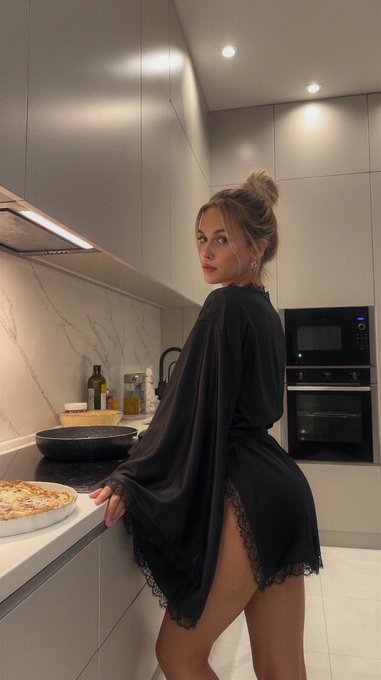](assets/p95-minimalist-kitchen-iphone-ugc-portrait/source-example-01.jpg)

#### 👇 Workflow

`Text → candid iPhone kitchen portrait`

#### 🔖 Full Prompt

```text
Create a photorealistic vertical iPhone lifestyle photograph of an attractive adult blonde woman standing in a modern minimalist apartment kitchen at night. The image should feel like a genuine handheld late-night snapshot rather than a professional fashion campaign.

SUBJECT
Show an adult woman in her mid-20s with fair, lightly sun-kissed skin, a softly defined oval face, full naturally pink lips, sculpted brows, and blue-green eyes. Her blonde hair has darker natural roots and is gathered into a loose, slightly messy high bun with a few wispy strands. Preserve realistic pores, fine facial hair, subtle tonal variation, and small natural imperfections. She wears a short black satin robe with delicate lace trim, loosely tied at the waist. Render the satin with restrained, physically believable reflections and natural folds.

POSE AND COMPOSITION
Frame a full-body vertical portrait from a natural handheld smartphone viewpoint around waist-to-chest height, approximately 2–3 meters from the subject. Place her near the center aisle between the left countertop and right built-in appliances. She stands in a relaxed contrapposto pose, body angled slightly away while turning her head back toward the camera. Keep generous negative space above her, showing the tall cabinets and recessed ceiling lights. Use a moderately wide 24mm-equivalent perspective and deep smartphone depth of field so both the woman and kitchen remain recognizable.

KITCHEN
Use a contemporary European minimalist interior with floor-to-ceiling matte greige cabinetry, warm off-white and cream surfaces, a white marble backsplash with delicate gray veining, a black induction cooktop, black frying pan, matte black curved faucet, built-in black microwave and oven, large light porcelain floor tiles, and clean architectural lines. Include believable everyday details: a freshly baked savory pie or quiche in a white ceramic dish in the lower-left foreground, a wooden board with baked bread or pastry, a dark green olive-oil bottle, small seasoning jars, and a clear soap dispenser. Keep the setting lived-in but uncluttered.

LIGHTING AND CAMERA
Light the scene with warm 3000–3500K recessed ceiling downlights and under-cabinet LEDs. Create soft directional illumination on the face, hair, robe, cabinets, backsplash, and countertop, with realistic darker areas beneath cabinets and around appliances. Emulate an iPhone 17 Pro Max main camera with a 24mm-equivalent lens at f/1.8, ISO 400, 1/60 second, natural auto exposure, controlled ceiling highlights, subtle computational sharpening, realistic indoor noise reduction, and warm neutral white balance. Use moderate natural contrast, subdued saturation, deep blacks, and minimal editing.

Avoid studio or editorial lighting, airbrushed or plastic skin, exaggerated anatomy, distorted hands, extra fingers, warped cabinets, bent architectural lines, floating objects, artificial fabric reflections, excessive bokeh, lens flares, heavy film grain, extreme HDR, overexposed lights, oversharpening, compression artifacts, text, watermarks, and logos.
```

<sub>(by [@cvcvta](https://x.com/cvcvta/status/2102600005693391324)) · [Source: X](https://x.com/cvcvta/status/2102600005693391324) · Reference adaptation by SeeAPI</sub>

<a id="p96-ducati-night-motorcycle-hero-portrait"></a>

### 📌 1.36. Ducati Night Motorcycle Hero Portrait

#### 👀 Preview

[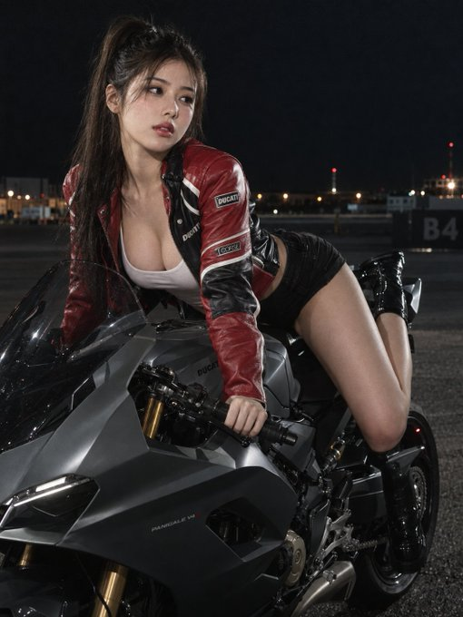](assets/p96-ducati-night-motorcycle-hero-portrait/source-example-01.jpg)

#### 👇 Workflow

`Text → cinematic night motorcycle portrait`

#### 🔖 Full Prompt

```text
A breathtaking cinematic 35mm night photograph — an intimate, alluring low-angle hero composition of an exceptionally gorgeous 20-year-old East Asian woman straddling a matte battleship-gray supersport motorcycle in an open asphalt lot at night, captured at eye level in an authentic M1 cinematic narrative register.

The woman possesses an extraordinarily beautiful, doll-like East Asian face with soft youthful cheeks, a delicate tapered chin, fair glowing porcelain skin with visible fine pore texture, and a faint peachy flush. Her dark brown hair is pulled tightly into a high, sleek ponytail that cascades down her back, with soft natural wisps and fine baby hairs framing her temples and forehead. Her large, dark almond eyes look slightly off-camera with a cool, captivating, and slightly aloof expression, paired with naturally glossy rose lips. She has a slender yet strikingly curvaceous figure. She wears a retro-chic cropped leather moto racing jacket in bold crimson-red and black with crisp white piping, left unzipped at the collar to reveal a snug fitted white scoop-neck camisole. She pairs it with high-waisted black shorts and black patent leather platform biker boots, with her long, bare porcelain legs creating a stunning sensual contrast against the dark mechanical motorcycle. She is posed leaning her torso forward across the fuel tank, her chest pressed close to the frame, left arm braced while her right hand grips the black clip-on handlebar, with one slender leg bent and raised high along the rear seat cowl in an effortlessly cool and alluring riding posture.

The motorcycle is a sleek, aggressive modern superbike finished in smooth matte battleship cement-gray, featuring sharp aerodynamic dual front headlights, a glossy black-tinted windscreen, and exposed mechanical engine components on the dark tarmac beneath. The deep nighttime background melts into soft, dark industrial textures with a few distant amber runway marker lights softly blurred into gentle bokeh.

The lighting is governed by clean, high-fashion nighttime flash physics — a crisp, flattering cool daylight-balanced key light from the front-left illuminates her porcelain face, collarbones, and bare legs with radiant, dewy clarity, while casting natural subtle shadows under her jaw and along the curves of her jacket, beautifully separating her luminous figure from the dark asphalt and matte gray motorcycle chassis without artificial bloom.

Captured with a wide-latitude digital cinema look on a fast 50mm vintage prime lens at wide aperture T1.8, rendering extreme optical sharpness across her eyes, eyelashes, individual hair strands, leather jacket stitching, and metallic bike hardware, while gracefully melting the dark background into smooth organic blur. Kodak daylight film emulation with rich saturated crimson reds, clean porcelain whites, velvety uncrushed blacks, and authentic skin warmth, finished with fine, organic 35mm theatrical film grain across the frame. Real photographic frame captured on a real cinema camera, real prime lens, real leather jacket, real high-performance superbike, real stunning 20-year-old East Asian human subject, real nighttime asphalt environment — no CGI, no rendered look, no digital cleanliness, no plastic surfaces, no AI smoothness, no skin smoothing, no fake 3D waxiness, no glow, no halation bloom that reads as artificial.
```

<sub>(by [@johnAGI168](https://x.com/johnAGI168/status/2102595053021483400)) · [Source: X](https://x.com/johnAGI168/status/2102595053021483400)</sub>

<a id="p97-rainy-bus-stop-multi-model-benchmark"></a>

### 📌 1.37. Rainy Bus Stop Multi-Model Benchmark

#### 👀 Preview

[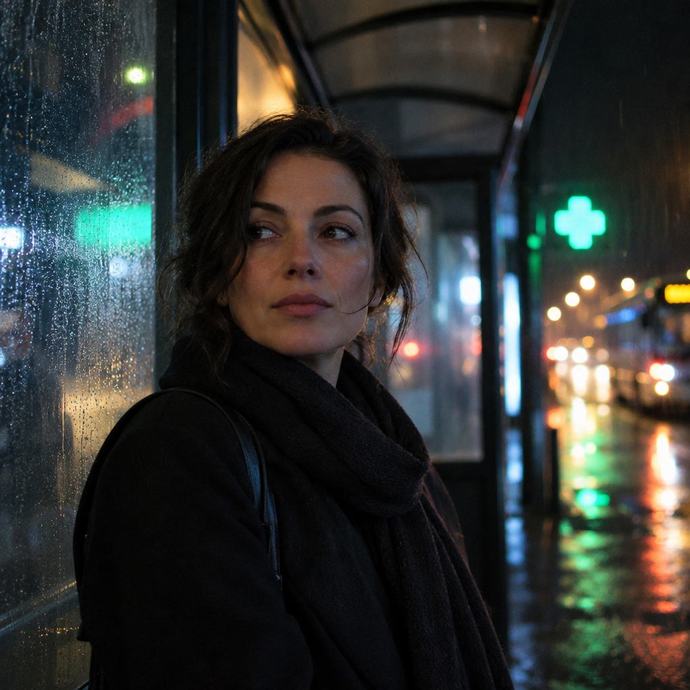](assets/p97-rainy-bus-stop-multi-model-benchmark/source-example-01.png)

[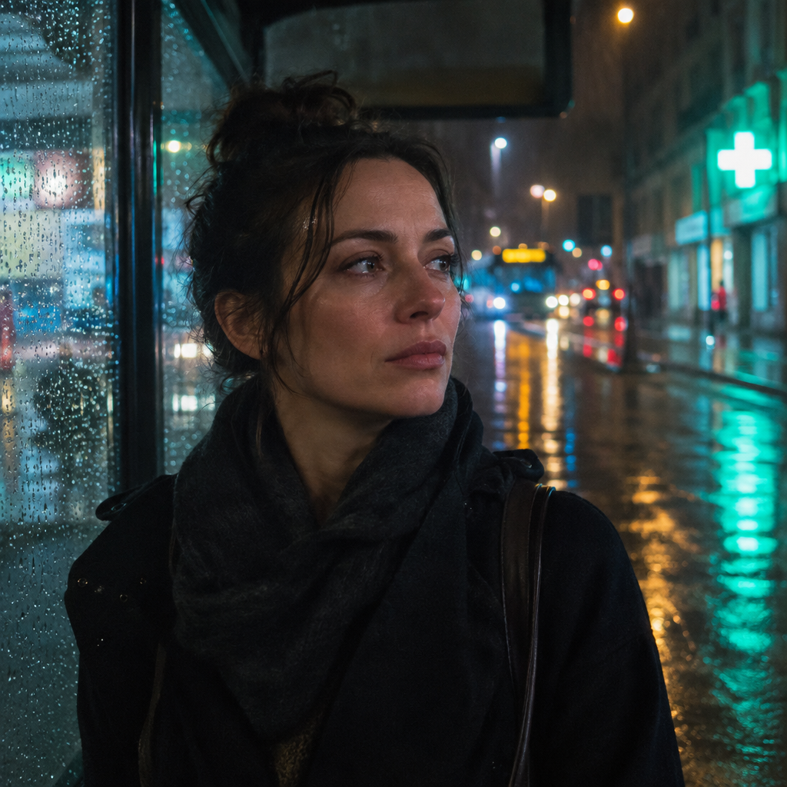](assets/p97-rainy-bus-stop-multi-model-benchmark/source-example-02.png)

#### 👇 Workflow

`One prompt → Sunburst and Flare comparison`

#### 🔖 Full Prompt

```text
Photoreal portrait of a woman in her 30s at a rainy bus stop at night, soft neon from a pharmacy sign, slight film grain, no text, no watermark
```

<sub>(by [u/kaboom-o](https://www.reddit.com/r/generativeAI/comments/1wmq8pj/same_prompt_five_image_models_rainy_busstop)) · [Source: Reddit](https://www.reddit.com/r/generativeAI/comments/1wmq8pj/same_prompt_five_image_models_rainy_busstop)</sub>

<a id="p98-y2k-k-pop-desktop-music-video-frame"></a>

### 📌 1.38. Y2K K-Pop Desktop Music Video Frame

#### 👀 Preview

[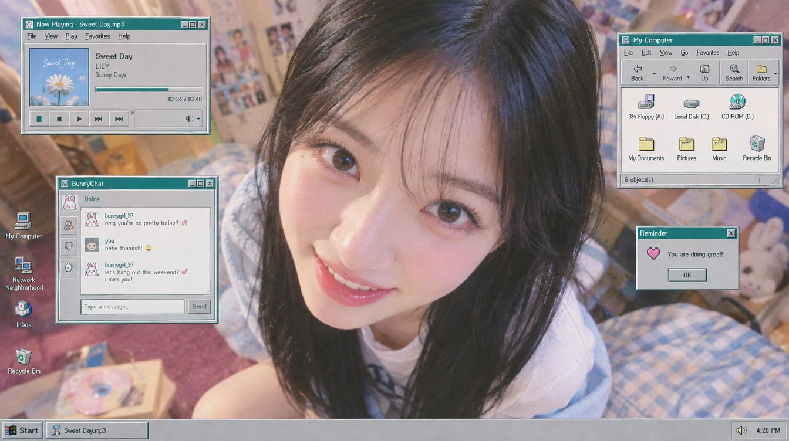](assets/p98-y2k-k-pop-desktop-music-video-frame/source-example-01.jpg)

#### 👇 Workflow

`Text → Y2K K-pop desktop-overlay music-video frame`

#### 🔖 Full Prompt

```text
16:9 widescreen, shot on 35mm film camera, solo shot, extreme close-up on face, steep high-angle shot looking down at a fresh-faced female K-pop idol alone in a room, long straight black hair with soft curtain bangs, natural dewy makeup, bright youthful "refreshing" concept (y2k retro aesthetic), casual homey styling, cozy bedroom setting, playful bright expression, eyes looking up toward camera, retro Windows 95 desktop UI overlay: multiple overlapping windows scattered across the frame (e.g. a media player window, a chat/messenger window, a file explorer window, a small pop-up dialog box), each window with classic teal title bar, pixelated icons, gray beveled borders, y2k desktop aesthetic, soft warm lighting, shallow depth of field bokeh, cinematic music video framing, subtle natural film grain, soft saturated pastel color grading, candid youthful nostalgic energy, no edgy/dark tones
```

<sub>(by [@2dalmat](https://x.com/2dalmat/status/2103018598486970642)) · [Source: X](https://x.com/2dalmat/status/2103018598486970642)</sub>

<a id="p103-dubai-car-identity-consistent-photo-collage"></a>

### 📌 1.39. Dubai Car Identity-Consistent Photo Collage

#### 👀 Preview

[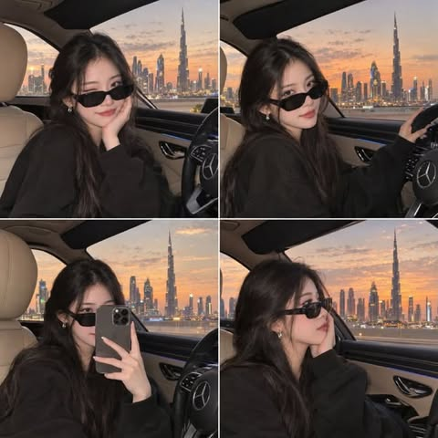](assets/p103-dubai-car-identity-consistent-photo-collage/source-example-01.jpg)

#### 👇 Workflow

`Text → identity-consistent four-panel Dubai car collage`

#### 🔖 Full Prompt

```text
Create a 2x2 four-panel cinematic photo collage featuring the EXACT SAME Korean-looking young woman in all four panels. Strong identity consistency: same face, same hairstyle, same black oversized sweatshirt, same sunglasses, same earrings, same makeup, same Mercedes car, same beige leather interior, same lighting, same time of day, and the same Dubai skyline with the Burj Khalifa visible through the windows.

She is sitting comfortably inside the car taking stylish photos/selfies. Each panel must show a DIFFERENT natural pose while everything else remains identical.

Panel 1: She rests her cheek on her hand and gives a playful wink toward the camera.
Panel 2: She turns slightly toward the camera with a soft confident expression, one hand near the steering wheel.
Panel 3: She holds her smartphone in front of her face while taking a selfie.
Panel 4: She looks toward the window with her hand gently touching her cheek.

Photorealistic luxury lifestyle photography, elegant Korean fashion aesthetic, realistic skin texture, natural facial expressions, cinematic sunset lighting, Dubai city lights beginning to glow, Burj Khalifa clearly visible in the background, premium social-media aesthetic, highly detailed, realistic camera photography, seamless 2x2 collage, perfect visual consistency across all four panels, no face changes, no outfit changes, no car changes, no background changes.
```

<sub>(by [@adam_x_____](https://www.threads.com/@adam_x_____/post/Ddl6A2-jccL/gpt-image-on-chat-gpt-prompt-create-a-x-four-panel-cinematic-photo-collage)) · [Source: Threads](https://www.threads.com/@adam_x_____/post/Ddl6A2-jccL/gpt-image-on-chat-gpt-prompt-create-a-x-four-panel-cinematic-photo-collage)</sub>

## 🧸 Characters & Playful Creations

<a id="p52-iphone-photos-day-in-the-life-camera-roll"></a>

### 📌 2.1. iPhone Photos Day-in-the-Life Camera Roll

#### 👀 Preview

[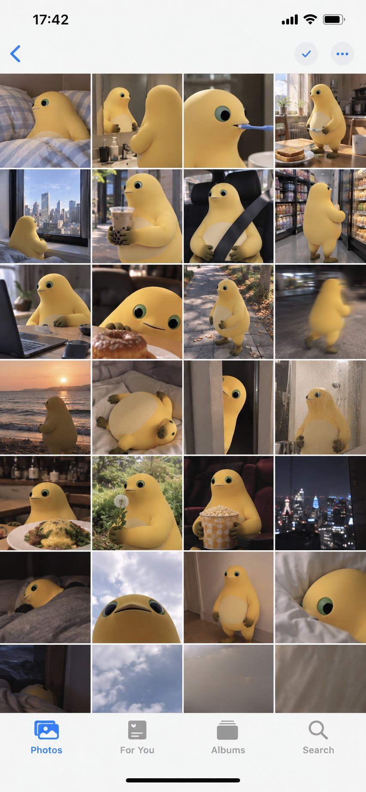](assets/p52-iphone-photos-day-in-the-life-camera-roll/source-example-01.jpg)

#### 👇 Workflow

`Subject reference → iPhone Photos camera-roll image`

#### 🔖 Full Prompt

```text
Use the uploaded image as the ONLY subject reference.

Create ONE vertical image that looks exactly like a screenshot of the iPhone Photos app, showing one full day of casual camera-roll photos featuring the exact subject from the uploaded reference.

SUBJECT CONSISTENCY
First identify the main subject in the uploaded image. It may be a person, anime character, pet, animal, plush toy, figurine, mascot, object, or other character.

Preserve the subject’s recognizable appearance, colors, proportions, facial features, hairstyle, clothing, accessories, markings, materials, and signature details consistently across every photo.

If the reference contains multiple views of the same subject, understand that they are different views of ONE subject, not multiple characters.

Do not redesign or replace the subject.

DAY-IN-THE-LIFE CAMERA ROLL
Imagine a believable full day for this exact subject based on its appearance, personality, style, and visual world.

Generate many different casual photos from morning to night, as if someone naturally photographed the subject throughout the day.

Automatically choose everyday situations that fit the uploaded subject, such as:
waking up, resting, eating, sitting by a window, traveling, walking outside, visiting cafés or shops, playing, working, relaxing at home, interacting with everyday objects, sunset moments, nighttime outings, and going to sleep.

The activities and environments should adapt naturally to the subject. Do not force human activities onto animals, toys, objects, or non-human characters when they would look unnatural.

Every thumbnail should show a different moment, composition, distance, pose, camera angle, lighting condition, or location.

Mix:
close-ups,
medium shots,
wide shots,
overhead photos,
back views,
detail shots,
slightly blurry movement shots,
imperfect handheld snapshots,
photos where the subject is partially cropped,
environmental photos related to the subject’s day.

The result should feel spontaneous and personal rather than like a professional photoshoot.

IPHONE PHOTOS APP LAYOUT
The FINAL IMAGE itself must look like a real full-screen iPhone Photos app screenshot.

Use a tall smartphone screenshot aspect ratio, approximately 9:19.5.

Create a dense camera-roll gallery using FOUR equal thumbnail columns, closely matching the standard iPhone Photos grid.

Include approximately 24–32 individual photo thumbnails visible on screen.

Use very thin white gaps between thumbnails.

The gallery should fill most of the screen vertically.

Include authentic iPhone Photos interface elements:
• white iOS interface background
• iPhone-style status bar at the top
• time on the upper left
• cellular/Wi-Fi/battery icons on the upper right
• simple navigation controls near the top
• four-column photo gallery
• bottom Photos app navigation bar
• Photos tab selected in blue
• other navigation icons shown in gray
• black home indicator at the very bottom

The UI must look like an actual screenshot of the Photos app, NOT a decorative frame, moodboard, contact sheet, scrapbook, poster, or generic collage.

PHOTO STYLE
Make each thumbnail feel like a genuine casual iPhone camera-roll photo.

Use natural everyday lighting, imperfect framing, realistic exposure variation, occasional motion blur, slight focus imperfections, spontaneous compositions, and believable environmental details.

Keep the same subject recognizable throughout the entire gallery while allowing natural changes in pose, expression, camera distance, and lighting.

If the uploaded reference is illustrated, animated, stylized, or 3D, preserve its original visual identity and style unless realistic photography is explicitly requested.

IMPORTANT
ONE final image only.
The entire output is ONE iPhone Photos app screenshot containing many different photos.
Exactly FOUR thumbnail columns.
Do not create a standalone collage without the iPhone interface.
Do not create multiple separate outputs.
Do not duplicate the exact same photo repeatedly.
Do not introduce unrelated characters or subjects.
Do not change the main subject’s design.
No captions, dates, labels, stickers, watermarks, or decorative text inside the photo thumbnails.
Only normal minimal iOS interface elements may appear.

9:16
```

<sub>(by [@Mayz1169](https://x.com/Mayz1169/status/2099479873027031442)) · [Source: X](https://x.com/Mayz1169/status/2099479395283214473) · Inspired by [@ikaretamenonui](https://x.com/ikaretamenonui/status/2099139951820742839)</sub>

<a id="p41-minecraft-skin-from-a-reference"></a>

### 📌 2.2. Minecraft Skin from a Reference

#### 👀 Preview

| Before | After |
|---|---|
| [](assets/p41-minecraft-skin-from-reference/reference.png) | [](assets/p41-minecraft-skin-from-reference/result.png) |

#### 👇 Workflow

`Person photo → Minecraft-style image`

#### 🔖 Full Prompt

```text
Transform the person in the uploaded photo into a Minecraft-style character while preserving their recognizable hairstyle, clothing colors, accessories, and key visual features. Convert the entire body into a clean blocky voxel structure with square geometry, pixelated textures, and classic Minecraft proportions. Keep the original pose and general composition. Make the character look like an authentic custom Minecraft skin rather than a realistic 3D person. Use crisp pixel details, simple shading, and clean block-based forms.
```

<sub>(by SeeAPI)</sub>

<a id="p33-expressive-meme-sticker-sheet"></a>

### 📌 2.3. Expressive Meme Sticker Sheet

#### 👀 Preview

[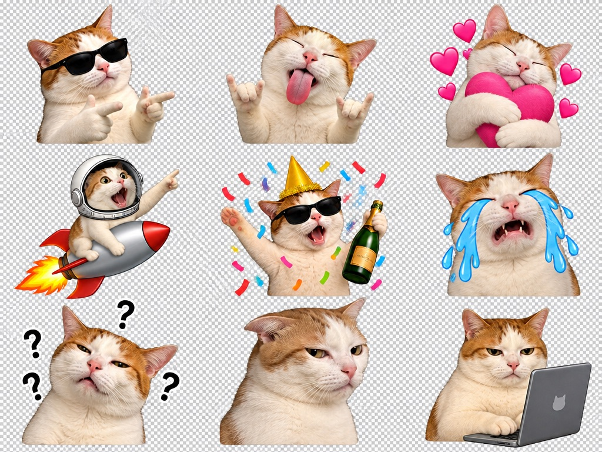](assets/p33-expressive-meme-sticker-sheet/source-example-01.jpg)

#### 👇 Workflow

`Character reference → sticker sheet`

#### 🔖 Full Prompt

```text
Create a Meme sticker pack based on the images attached, remixing with 😎😛💕🚀🥳. Use exaggerated internet-reaction expressions, including crying, confusion, shock, smugness, side-eye, and deadpan disbelief, with awkward poses, low-fi cutout textures, and absurd humor.


Create a single square(1:1) transparent sticker sheet with nine distinct stickers arranged in a 3×3 grid, each showing a different expression, pose, or reaction. Separate the stickers with wide, fully transparent gaps. No background, shadows, or overlapping elements.
```

<sub>[Source: SeeAPI](https://www.aiimage.net/prompts/)</sub>

<a id="p18-four-panel-pet-comic"></a>

### 📌 2.4. Four-Panel Pet Comic

#### 👀 Preview

[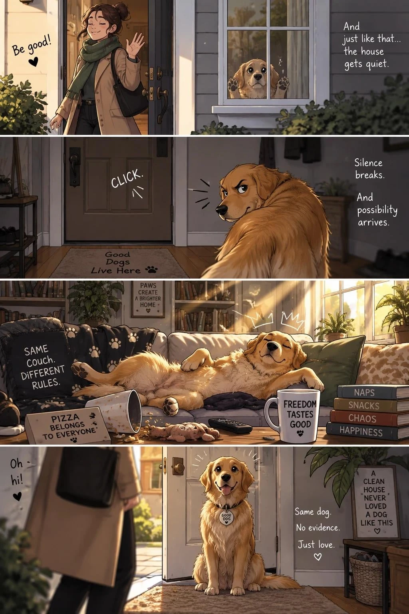](assets/p18-four-panel-pet-comic/source-example-01.webp)

#### 👇 Workflow

`Text → image`

#### 🔖 Full Prompt

```text
Create a short vertical comic-style reel with 4 panels.
Panel 1: The owner leaves through the front door. The pet is framed in the window behind them, small against the glass, eyes wide, paws pressed high, the house suddenly quiet.
Panel 2: The door clicks shut. Silence breaks. The pet slowly turns toward the empty house, posture shifting, eyes sharp with possibility.
Panel 3: The house transformed. The pet sprawls across the couch like it owns the place, crumbs nearby, sunlight cutting across the room like a spotlight.
Panel 4: The door opens. The pet is seated perfectly by the entrance, alert and composed, as if nothing happened.
```

<sub>[Source: Reddit](https://www.reddit.com/r/ChatGPT/comments/1wcatvx/gpt_image_25_prompt_guide_2026_13_8_rules_and_8/)</sub>

<a id="p11-character-dance-pose-grid"></a>

### 📌 2.5. Character Dance Pose Grid

#### 👀 Preview

[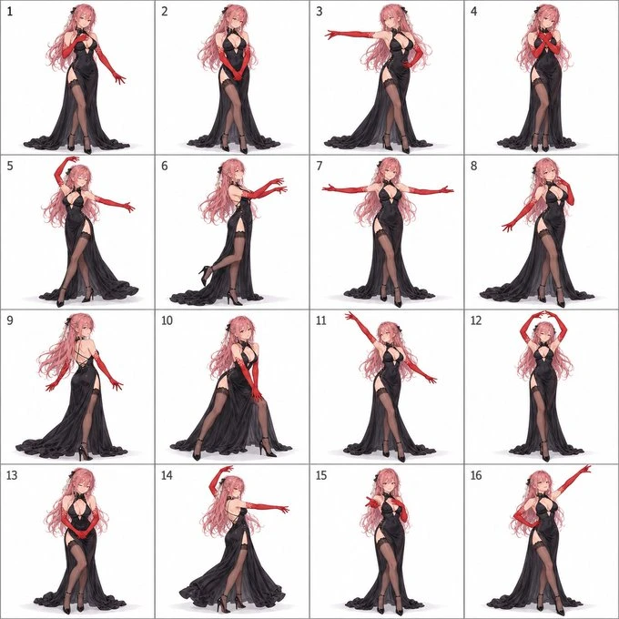](assets/p11-character-dance-pose-grid/source-example-01.webp)

#### 👇 Workflow

`Character reference → 16-panel dance pose sheet`

#### 🔖 Full Prompt

```text
@[Image 1] = Character reference. Use the uploaded image to identify the character’s appearance, outfit, proportions, art style, and personality, then create suitable original dance choreography.

Create ONE square dance reference sheet containing EXACTLY 16 equal panels arranged in a strict 4×4 grid. Separate the panels with thin, clean lines. Number them 1–16 in the upper-left corner, reading left to right, top to bottom. Each panel must show exactly one full-body depiction of the SAME character in a different dance pose.

CHARACTER CONSISTENCY
Preserve the reference character’s face, hairstyle, hair color, eyes, skin tone, body proportions, clothing, footwear, accessories, and signature details across all sixteen panels. Match the reference’s illustration style and rendering. Do not convert the character to chibi unless the reference is already chibi. If the reference contains multiple views, treat them as views of one character. Remove handheld props, weapons, and associated equipment so both hands are available for dancing.

ADAPT THE CHOREOGRAPHY
Infer a suitable dance style from the character’s visual personality, costume, and mobility. For example, a cheerful idol suits lively pop choreography; a streetwear character suits hip-hop and popping; a mystical character suits flowing ritual-inspired gestures; an elegant character in a long gown suits refined steps and graceful arm movements. Use these only as guidance and choose what best fits the uploaded character.

Design sixteen distinct, expressive poses that feel like one coherent dance sequence. Adapt the movement to the actual clothing and footwear: use controlled steps for long skirts or high heels, and more energetic footwork when the outfit allows it. Preserve the character’s personality through posture, facial expression, and gesture.

POSE SEQUENCE
Build a clear progression:
1: Characterful opening pose.
2–4: Establish the rhythm with introductory steps and gestures.
5–8: Develop the dance with varied arm shapes and weight shifts.
9–12: Add a controlled turn, directional change, or suitable highlight.
13–15: Return toward the front and build toward the finish.
16: A memorable finishing pose that suits the character.

Make neighboring poses physically connectable through natural movement. Vary arm height, silhouette, foot placement, torso direction, and weight distribution. Include mostly front-facing or three-quarter views, with a side or back-facing turn where appropriate. Avoid repeated poses or sixteen minor variations of the same stance.

COMPOSITION
Show the entire character in every panel, including hair tips, raised hands, accessories, flowing fabric, and footwear. Leave comfortable margins on all sides. Keep a consistent character scale and camera height throughout. Do not let any body part or costume element cross a panel border.

Use a plain white or subtle off-white background with a soft, unobtrusive ground shadow. Keep the character and choreography easy to read. Use polished linework and shading consistent with the uploaded reference.

QUALITY CONSTRAINTS
Maintain coherent anatomy and believable balance. Keep the face, outfit, and accessory placement consistent during turns. Let hair and fabric respond naturally to each movement without obscuring the pose. Preserve the outfit’s original coverage. Avoid physically impractical movements, accidental exposure, extra limbs, duplicated characters, cropped extremities, costume changes, and added props.

Only include the panel numbers 1–16. No title, captions, labels, speech bubbles, decorative scenery, or watermarks.

Final output: one complete, clearly readable 4×4 sheet of sixteen original dance poses tailored to the uploaded character.
```

<sub>(by [@renoiseai](https://x.com/renoiseai/status/2097959984265130436)) · [Source: X](https://x.com/renoiseai/status/2097959984265130436)</sub>

<a id="p06-portrait-reference-to-multi-view-sheet"></a>

### 📌 2.6. Portrait Reference to Multi-View Sheet

#### 👀 Preview

[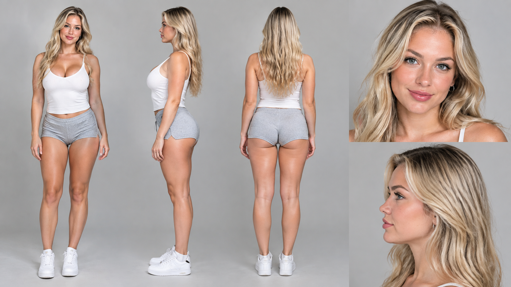](assets/p06-character-scenes/portrait-views-result.png)

#### 👇 Workflow

`Portrait reference → reference sheet (left 2/3: front / side / back full body; right 1/3: front / side face)`

#### 🔖 Full Prompt

```text
Use the uploaded portrait as the identity reference for one person. Create a single landscape character reference sheet with exactly five views of that same person. Preserve facial identity, age, gender presentation, skin tone, hairstyle, body proportions, and visible clothing details. If the portrait does not show the full outfit or body, use [outfit and footwear description] and infer unseen proportions conservatively; keep those choices consistent across every view.

Divide the canvas into two main regions. The LEFT TWO-THIRDS contains three equally sized, evenly spaced full-body views arranged horizontally: front view on the left, true side profile in the middle facing left, and back view on the right. Show the entire person from the top of the head to the soles of the shoes in each view, with aligned head and ground levels, identical scale, relaxed neutral standing poses, and a small safety margin. Keep arms slightly clear of the torso where anatomically appropriate so the silhouette and clothing remain readable.

The RIGHT ONE-THIRD contains two equally sized face close-ups stacked vertically: front-facing face at the top and a true side-profile face facing left at the bottom. Show the complete head, hair, ears where visible, and upper neck without clipping. Use a consistent close-up scale, neutral expression, and clear facial detail. These are the same person as the three full-body views, not additional characters.

Use a plain [background color] studio background, soft even lighting, and the same visual style as the uploaded reference. Keep camera perspective natural and proportions undistorted. Separate views with clean whitespace rather than drawn borders. Preserve outfit colors, hairstyle, and identity across all five views. No text, labels, grid lines, extra views, extra people, invented accessories, cropped feet, duplicated limbs, or three-quarter poses replacing the required front, side, and back views.
```

<sub>(by SeeAPI)</sub>

<a id="p02-collectible-figure-packaging"></a>

### 📌 2.7. Collectible Figure Packaging

#### 👀 Preview

[](assets/p02-collectible-figure-packaging/collectible-packaging-result.png)

#### 👇 Workflow

`Text / optional character reference → packaging image`

#### 🔖 Full Prompt

```text
Create a studio product photograph of an original collectible character toy called "[toy name]" inside a clear blister package on a [backing color] cardboard backing.

Use the uploaded person or character as the identity reference if provided; otherwise design a character based on [character description]. Preserve the reference's identifying features, anatomy, proportions, and colors. Use [outfit or surface details], retaining the reference appearance unless a change is explicitly requested.

Arrange exactly three accessories in separate compartments to the figure's right: [accessory 1], [accessory 2], and [accessory 3]. Keep the figure fully visible. Place the exact title "[toy name]" at the top in large, readable lettering. Use realistic molded plastic, controlled reflections, and soft studio shadows. No additional text or unrelated brand logos. Portrait composition.
```

<sub>(by SeeAPI)</sub>

<a id="p01-personalized-sticker-pack"></a>

### 📌 2.8. Personalized Sticker Pack

#### 👀 Preview

[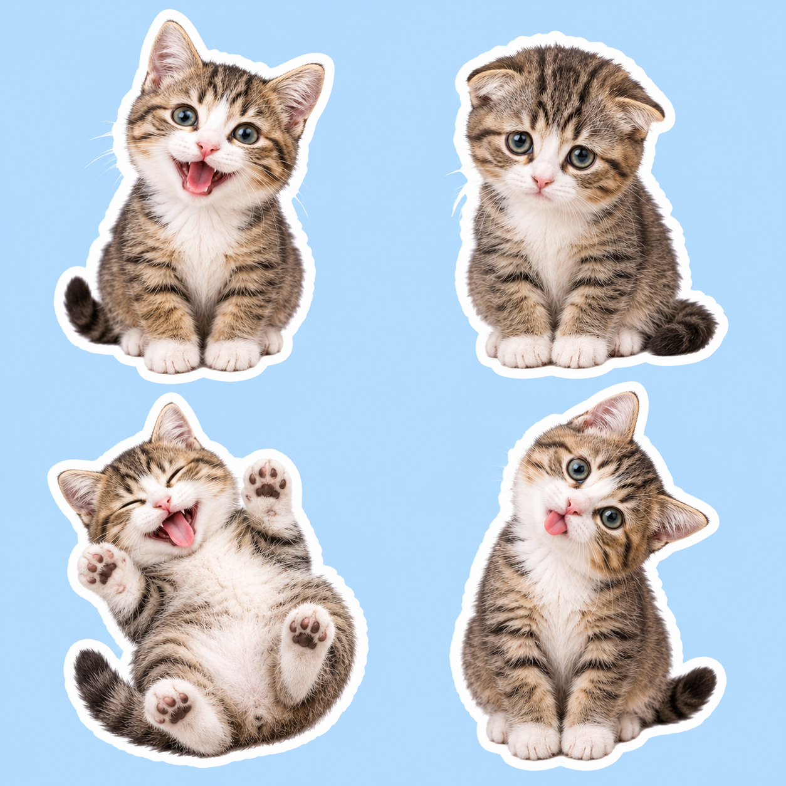](assets/p01-personalized-sticker-pack/character-stickers-result.png)

#### 👇 Workflow

`Character reference → sticker image`

#### 🔖 Full Prompt

```text
Using the uploaded person or character as the identity reference, create a clean 2-by-2 sticker sheet with four expressions: [expression 1], [expression 2], [expression 3], and [expression 4].

Preserve the subject's identity, anatomy, proportions, colors, clothing if present, and distinctive features. Adapt each expression and pose to the subject's anatomy without changing its species or gender presentation. Show the complete subject in each cell, with a thick white sticker outline and ample separation between stickers. Use a flat [background color] background so the silhouettes are easy to isolate. No captions, letters, decorative objects, or overlap between cells.
```

<sub>(by SeeAPI)</sub>

<a id="p56-raiden-shogun-in-a-film-scene"></a>

### 📌 2.9. Raiden Shogun in a Film Scene

#### 👀 Preview

[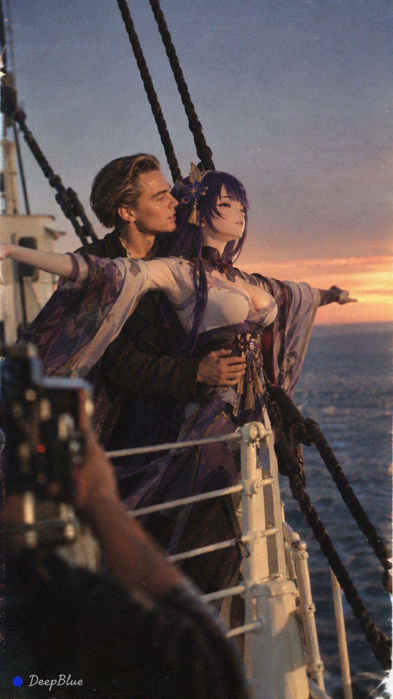](assets/p56-raiden-shogun-in-a-film-scene/source-example-01.jpg)

[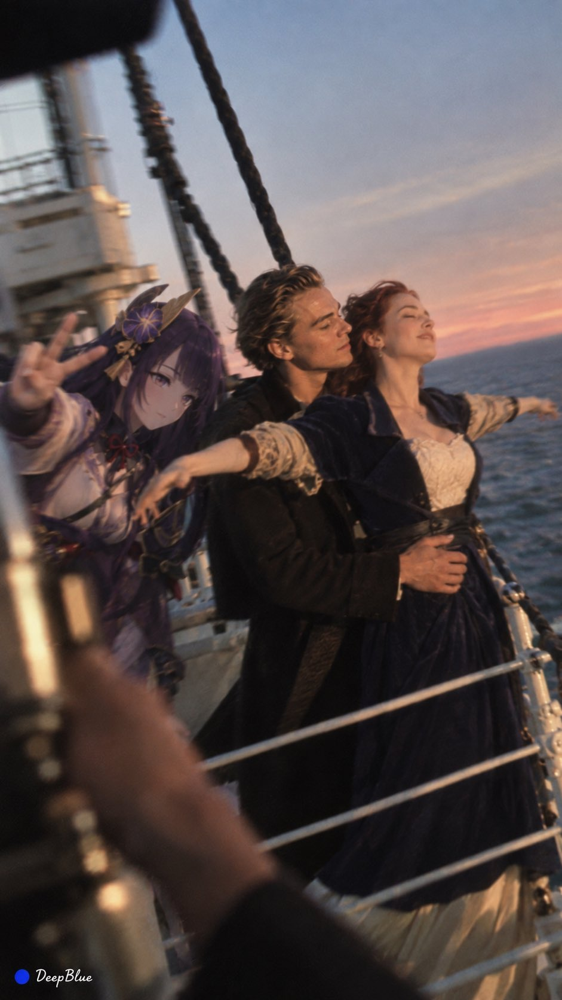](assets/p56-raiden-shogun-in-a-film-scene/source-example-02.jpg)

#### 👇 Workflow

`Film scene + Raiden Shogun → awkward vertical snapshot`

#### 🔖 Full Prompt

```text
Iconic scene from a classic film × Raiden Shogun integrated into the story as a third party × absurd yet plausible feeling × failed photo × vertical 9:16.
```

<sub>(by [@DeepBlueX0](https://x.com/DeepBlueX0/status/2100156601600782528)) · [Source: X](https://x.com/DeepBlueX0/status/2100156601600782528) · English translation by SeeAPI</sub>

<a id="p58-cat-expression-transfer"></a>

### 📌 2.10. Cat Expression Transfer

#### 👀 Preview

[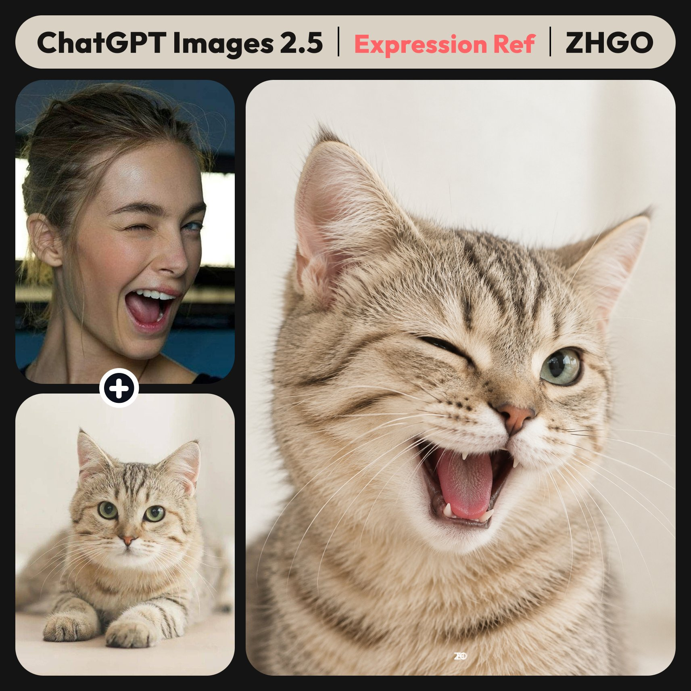](assets/p58-cat-expression-transfer/source-example-01.jpg)

[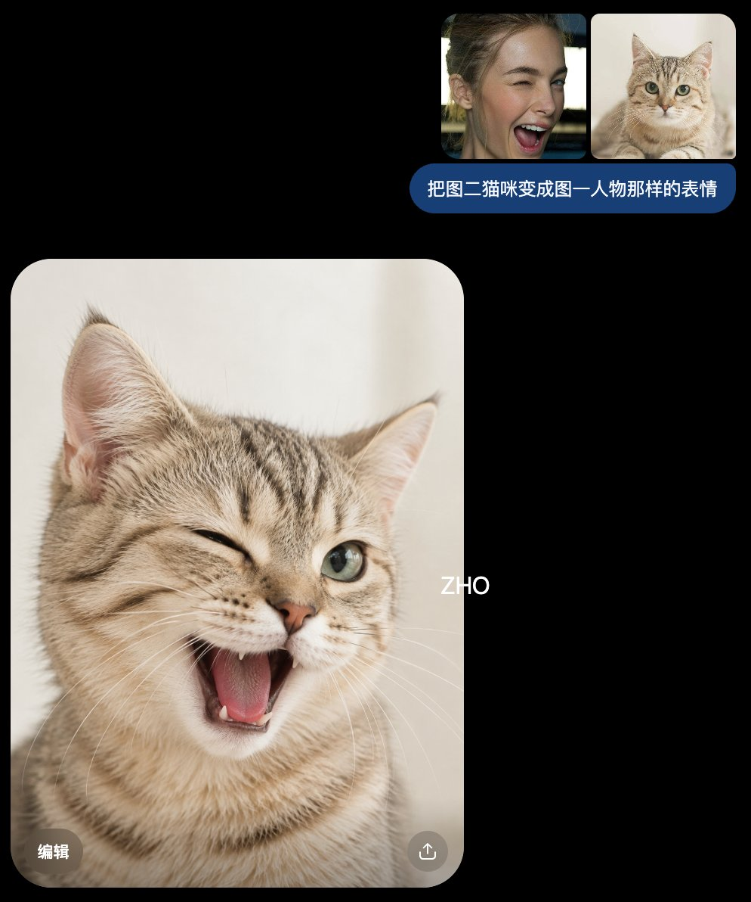](assets/p58-cat-expression-transfer/source-example-02.jpg)

#### 👇 Workflow

`Expression reference + cat reference → cat with transferred expression`

#### 🔖 Full Prompt

```text
Make the cat in image two have the same expression as in image one.
```

<sub>(by [@ZHO_ZHO_ZHO](https://x.com/ZHO_ZHO_ZHO/status/2099832996216135874)) · [Source: X](https://x.com/ZHO_ZHO_ZHO/status/2099832996216135874) · English translation by SeeAPI</sub>

<a id="p66-couch-potato-miniature-set"></a>

### 📌 2.11. Couch Potato Miniature Set

#### 👀 Preview

[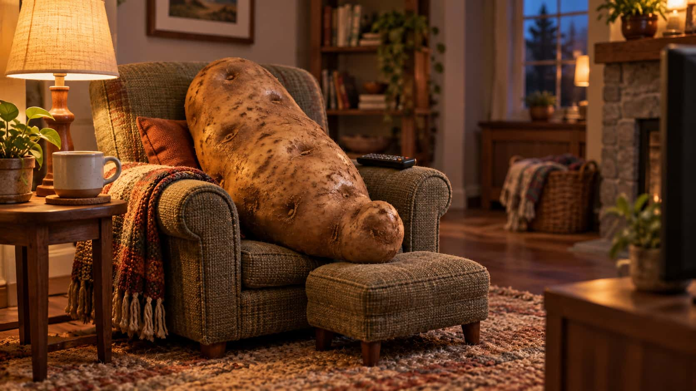](assets/p66-couch-potato-miniature-set/source-example-01.jpg)

#### 👇 Workflow

`Text → miniature couch potato scene`

#### 🔖 Full Prompt

```text
One oversized russet potato reclines in a tiny upholstered armchair, with its naturally knobbly lower half resting on an ottoman and a television remote beside it. Miniature set photography, eye-level view and warm evening lamplight, preserving realistic potato skin and a comfortably lazy posture in an unlettered living room.. 16:9 wide composition.
```

<sub>(by [@unrealpixels](https://x.com/unrealpixels/status/2100662656835420370)) · [Source: X](https://x.com/unrealpixels/status/2100662656835420370)</sub>

<a id="p83-cinema-pets-with-3d-glasses"></a>

### 📌 2.12. Cinema Pets with 3D Glasses

#### 👀 Preview

[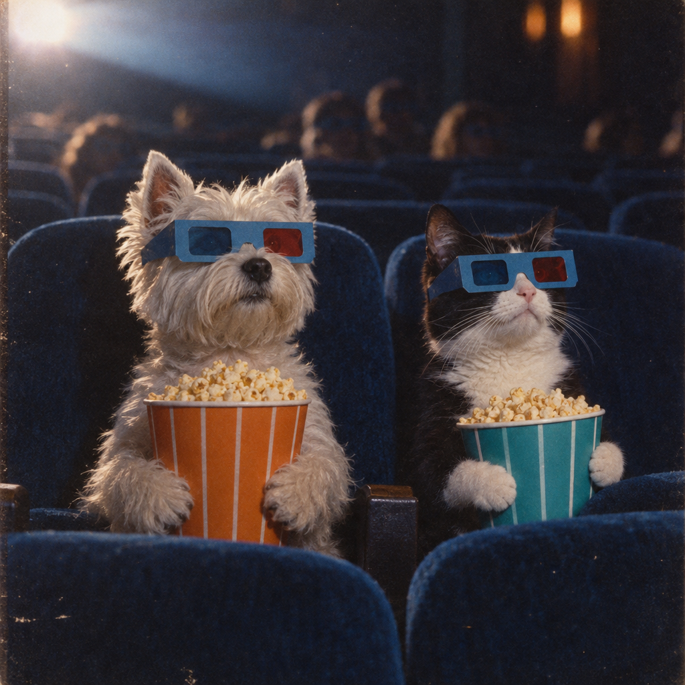](assets/p83-cinema-pets-with-3d-glasses/source-example-01.webp)

#### 👇 Workflow

`Text → nostalgic cinema pets photo`

#### 🔖 Full Prompt

```text
A West Highland White Terrier and a white-and-black cat sitting side by side in a dark movie theater, both wearing vintage blue cardboard 3D glasses, each holding a full bucket of buttered popcorn (warm orange bucket for the dog, teal bucket for the cat), deep blue velvet cinema seats filling the foreground and background rows, low-key screen light hitting their faces from the front-left, shallow depth of field, 1970s film photograph aesthetic, faded Kodak color, heavy grain and dust speckles, slightly soft focus, square 1:1 crop, centered symmetrical composition with both animals looking off-screen toward the screen, nostalgic and quietly humorous mood. Negative: modern digital sharpness, HDR, cartoon style, human hands, text, watermark, distorted eyes.
```

<sub>[Source: Clico](https://tryclico.com/gallery/double-feature)</sub>

<a id="p84-orochi-fashion-character-concept-sheet"></a>

### 📌 2.13. Orochi Fashion Character Concept Sheet

#### 👀 Preview

[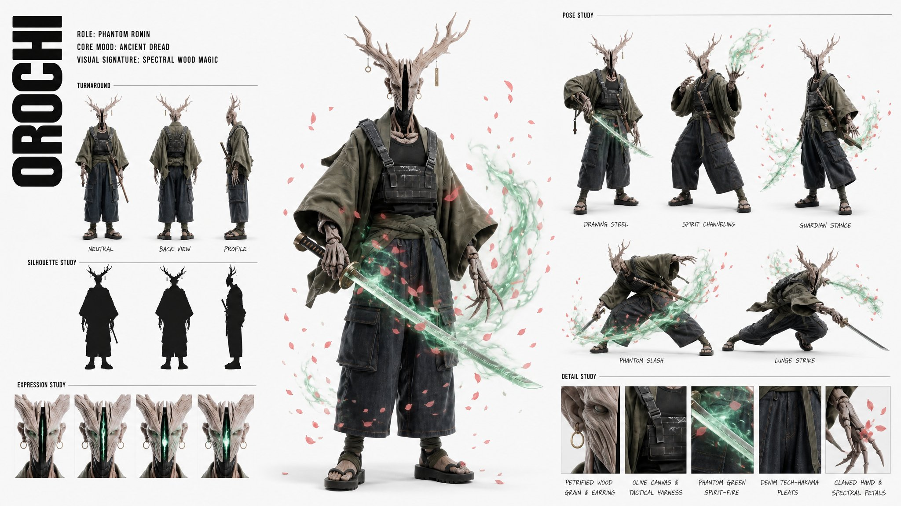](assets/p84-orochi-fashion-character-concept-sheet/source-example-01.jpg)

#### 👇 Workflow

`Character style reference + brief → concept sheet`

#### 🔖 Full Prompt

```text
Create a premium, modern high-fashion CHARACTER CONCEPT ART SHEET in a 16:9 widescreen layout on a pure white background. THE ATTACHED REFERENCE IMAGE DEFINES THE ART STYLE — treat it as a strict style bible and reproduce its exact rendering technique in every figure on this sheet.

[STYLE — MIRROR THE REFERENCE EXACTLY]: Replicate the reference image's rendering verbatim: hyper-realistic 3D CGI collectible-figurine render, physically-based rendering, octane-render-quality lighting, real material fidelity (fabric weave and drape, metal wear and oxidation, pore-level petrified wood micro-detail), identical overall lighting setup and material palette to the reference (light, clean, white-background studio photography — do NOT flatten or cel-shade it), soft studio lighting with a subtle rim light matching the reference. Every figure must look like it was rendered from the same 3D file, under the same studio lighting, as the reference image.

[STYLE PROHIBITIONS — ABSOLUTE]: no flat 2D cel-shading, no cartoon outlines, no lineart, no anime style, no painterly brushwork, no posterized flat color blocks, no low-poly or game-asset look, no plastic-toy sheen, no fused or malformed fingers. If the reference has photoreal materials, this sheet does too — never flatten them.

[PROPORTIONS]: Match the reference's exact body proportions in every figure — elongated fashion-illustration anatomy (9–10 heads tall, small head, long slender limbs, narrow waist) carried into photoreal rendering. Do not normalize proportions in the smaller studies.

[SUBJECT_DESCRIPTION]: Character named OROCHI. A tall humanoid entity made of petrified pale ash wood with branch-like horns, gold hoop earrings, and a void-slit face. Wearing an oversized draped olive-green techwear kimono jacket, tactical nylon chest harness, and dark indigo wide-leg tech-hakama denim trousers with chunky tactical sandals.

SUPERPOWERS VISIBLE: Hovering ethereal glowing crimson spectral sakura petals and phantom green spirit-fire swirling around his wooden claws and katana blade.

Layout Composition (Organize strictly into these sections):
1. LEFT PANEL: METADATA & TURNAROUND- Large, bold vertical typography of the character's Name "OROCHI" in a clean, heavy sans-serif condensed font.- Metadata Block: "ROLE: PHANTOM RONIN", "CORE MOOD: ANCIENT DREAD", and "VISUAL SIGNATURE: SPECTRAL WOOD MAGIC" in a clean sans-serif font.- MINI TURNAROUND: 3 small vertical figures — "neutral", "back view", "profile" — rendered in the identical reference style, full material fidelity even at small scale.- SILHOUETTE STUDY: 3 solid-black silhouettes matching the turnaround stances underneath.- EXPRESSION STUDY (Bottom Left): exactly 4 small close-up headshots showing subtle shifts in the spirit-fire glowing from his void-slit face.

2. CENTRAL PANEL: THE CENTERPIECE- One giant, dominant full-body figure in a cool, relaxed signature pose, maximum detail, rendered as a perfect style-match to the reference image, but with glowing crimson spectral leaves and green spirit-fire wrapping around his drawn katana.

3. RIGHT PANEL: MULTI-POSE & THEMATIC STUDIES- POSE STUDY: exactly 4 to 5 small-to-medium figures in dynamic combat stances (drawing blade, casting spirit fire, lunging), each with a small handwritten-style label underneath, all in the identical reference style.

4. BOTTOM RIGHT PANEL: DETAIL STUDY- Exactly 5 small square close-up crops highlighting: (1) petrified wood grain and gold hoop earring, (2) olive canvas jacket weave and tactical harness, (3) glowing phantom green spirit-fire on the katana blade, (4) denim tech-hakama pleats, (5) clawed wooden hand holding hovering crimson petals.- Each crop gets a clean handwriting-style label underneath.
```

<sub>(by [@itsPixieVerse](https://x.com/itsPixieVerse/status/2101905822888677714)) · [Source: X](https://x.com/itsPixieVerse/status/2101905822888677714)</sub>

<a id="p101-seven-miniature-clones-on-a-giant-hand"></a>

### 📌 2.14. Seven Miniature Clones on a Giant Hand

#### 👀 Preview

[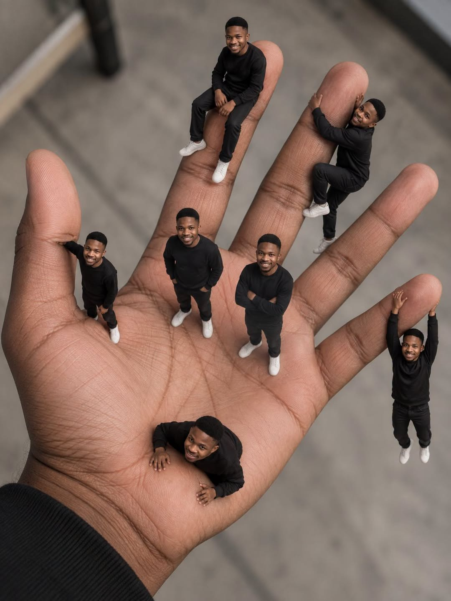](assets/p101-seven-miniature-clones-on-a-giant-hand/source-example-01.jpg)

#### 👇 Workflow

`Person reference → seven miniature clones on a giant hand`

#### 🔖 Full Prompt

```text
Use the uploaded person as the ONLY identity reference.
Create 7 pocket-sized miniature clones of the reference person interacting naturally with a giant adult open hand.
Arrange them in clearly different poses: two standing on the palm, one sitting naturally on a finger, one climbing a finger using both hands and feet, one hanging from a fingertip with their full body suspended, one carefully climbing over the edge of the palm, and one standing near the base of the thumb.
Capture from a dramatic top-down, high-angle perspective with an extreme sense of scale.
IDENTITY LOCK: Every clone must preserve the reference person’s exact face, facial proportions, eyes, nose, mouth, jawline, expression, pupil size, hairstyle and recognisable features. Keep the original dark clothing and appearance.
Every clone must have a complete, anatomically correct human body with normal proportions. Hands and feet must make believable physical contact with the giant hand.
No bodies fused into the hand, no wrapping around the wrist, no emerging from skin, no missing limbs, no duplicated limbs, no distorted anatomy.
Make them look like real miniature humans, not toys or figurines.
Photorealistic skin, individual hair strands, realistic fabric, believable gravity and gripping, detailed hand texture, natural contact shadows, cinematic lighting, shallow depth of field and premium macro photography.
```

<sub>(by [Chinonso Victor](https://www.facebook.com/61565779293097/posts/try-this-prompt-below-gpt-image-25/122211515222525976)) · [Source: Facebook](https://www.facebook.com/61565779293097/posts/try-this-prompt-below-gpt-image-25/122211515222525976)</sub>

<a id="p104-production-character-reference-sheet"></a>

### 📌 2.15. Production Character Reference Sheet

#### 👀 Preview

[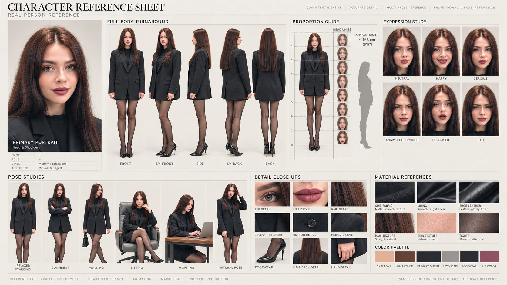](assets/p104-production-character-reference-sheet/source-example-01.jpg)

#### 👇 Workflow

`Character reference → production-ready character sheet`

#### 🔖 Full Prompt

```text
Create a premium production-ready character reference sheet using the uploaded image as the sole visual authority for the character.

## CORE PRIORITY — CHARACTER CONSISTENCY

The uploaded reference defines the character. Do not redesign or reinterpret the person.

Preserve the character's recognizable identity exactly, including:

* facial structure and proportions
* eyes, eye color and eye spacing
* eyebrows
* nose and lips
* jawline and face shape
* skin tone and age appearance
* hairstyle, hairline and hair volume
* body type and physical proportions
* height and overall silhouette
* clothing construction, fit and layering
* colors, patterns and graphics
* footwear
* jewelry and accessories
* distinctive marks or identifying details

The objective is one character shown from multiple angles, not multiple interpretations of the same character.

Before generating the board, establish a consistent internal model of the character's face, anatomy, silhouette, wardrobe, materials and proportions. Maintain those decisions across every panel.

## PRESENTATION

Create a single landscape 16:9 professional character-development board.

Style: high-end animation / game / visual-development production sheet.

Use:

* clean warm-neutral or off-white studio background
* sophisticated editorial grid
* precise alignment
* generous negative space
* subtle technical construction lines
* restrained labels
* consistent panel sizing
* polished professional rendering

The result should look like an actual production document used by a professional art or character-development team, not a collage of unrelated AI generations.

Avoid decorative elements that do not contribute to character documentation.

## 01 — PRIMARY IDENTITY PORTRAIT

Give the character one prominent portrait that establishes the canonical appearance.

Use a head-and-shoulders or three-quarter composition.

Show:

* accurate facial structure
* canonical hairstyle
* correct skin tone
* natural neutral expression
* correct clothing and visible accessories

This portrait should function as the visual reference point for the entire sheet.

## 02 — FIVE-VIEW TURNAROUND

Create a clean full-body turnaround of the exact same character.

Include:

Front
3/4 Front
Side Profile
3/4 Back
Back

Use the same neutral standing posture and consistent scale.

Maintain alignment of:

* top of head
* eyes
* shoulders
* chest
* waist
* hips
* knees
* ankles and feet

Every view must preserve the same anatomy, clothing construction, hairstyle, accessories, patterns and silhouette.

Do not introduce details that are not supported by the reference.

## 03 — FACIAL EXPRESSION SHEET

Create a compact expression study with approximately six expressions:

* neutral
* subtle happiness
* serious
* determined / angry
* surprised
* sad / emotional

The expressions may change naturally, but the underlying person must remain unmistakably identical.

Keep the same:

* facial proportions
* eye structure
* nose
* mouth shape
* jawline
* hairstyle
* head proportions

Favor believable facial acting over exaggerated cartoon deformation.

## 04 — CHARACTER POSE STUDIES

Show 4–6 full-body poses that reveal the character's natural personality and physical behavior.

Possible poses include:

* relaxed standing
* confident stance
* walking
* sitting
* interacting with an object
* distinctive dynamic pose

Keep the anatomy, clothing, accessories and silhouette consistent across every pose.

Do not allow pose variation to become character redesign.

## 05 — DESIGN DETAIL CALLOUTS

Add focused close-up panels for the most important design elements.

Prioritize details actually visible or clearly established in the reference, such as:

* hair and hairstyle
* facial details
* collar / neckline
* garment construction
* sleeves and seams
* footwear
* jewelry
* accessories
* logos, emblems or patterns
* important props
* distinctive textures

Present these as production callouts, not as decorative fashion photography.

## 06 — MATERIAL & SURFACE REFERENCES

Document the major materials present in the character design.

Include only relevant materials, such as:

* fabric
* leather
* denim
* metal
* silk
* knit
* plastic
* glass
* hair
* skin

Show their characteristic surface behavior, texture, reflectivity and construction.

Keep the material studies directly connected to the actual costume and character design.

## 07 — CHARACTER COLOR PALETTE

Add a compact professional palette extracted faithfully from the reference.

Organize it by role:

Skin
Hair
Primary clothing
Secondary clothing
Accent color
Accessories / materials

Do not introduce new colors simply to make the palette more visually interesting.

## 08 — PROPORTION & SILHOUETTE GUIDE

Add a subtle technical anatomy section beside the turnaround.

Include:

* overall character height
* head-to-body relationship
* shoulder and torso proportions
* major body alignment guides
* simplified silhouette
* key proportional landmarks

Keep this technical and understated.

The purpose is to help another artist reproduce the same character consistently.

## 09 — CANONICAL DESIGN LOCK

Treat the entire board as one unified source of truth.

Every panel must represent the same character.

Lock:

Identity — same face and recognizable features
Anatomy — same body structure and proportions
Hair — same hairstyle and hairline
Wardrobe — same garments and construction
Accessories — same placement and quantity
Colors — same palette
Silhouette — same recognizable shape
Details — same left/right elements and patterns

No unexplained variations between panels.

## VISUAL QUALITY

Aim for sophisticated professional visual-development quality:

* refined character rendering
* accurate anatomy
* realistic skin and hair
* believable material response
* crisp construction details
* controlled neutral studio lighting
* clean edges
* polished presentation
* strong visual hierarchy
* consistent rendering style

Lighting should be **soft, neutral and diagnostic**, allowing the character design and materials to be inspected clearly. Avoid dramatic cinematic lighting.

Use a restrained neutral studio environment rather than scenery.

## CAMERA & VIEW CONSISTENCY

Turnaround views should feel close to orthographic production references, with minimal perspective distortion.

Expression studies should maintain consistent head framing and camera distance.

Pose studies may use natural perspective, but the character's anatomy must remain accurate.

Avoid extreme lenses, fisheye distortion or dramatic camera angles that make proportions difficult to compare.

## LAYOUT RULES

Build the board as a coherent information system.

Prioritize:

1. identity portrait
2. turnaround
3. expressions
4. poses
5. design details
6. materials
7. color palette
8. proportion guide

Use consistent margins, spacing and alignment.

Do not overlap characters or panels.

Do not crop important anatomy.

Do not create unnecessary environmental backgrounds.

Every visual element should have a clear production purpose.

## FINAL FIDELITY CHECK

Before finalizing, verify that all panels depict the **same exact character**.

Check for:

* facial identity consistency
* matching eye shape and placement
* matching hairstyle and hairline
* consistent body proportions
* consistent height and silhouette
* identical clothing
* identical accessories
* correct left/right details
* consistent colors and patterns
* anatomically correct hands and limbs
* no unexplained additions or omissions

The final result should feel like a **single professionally designed character documented from multiple viewpoints**, with no visible identity drift.

## AVOID

Character redesign, beautification, identity changes, age changes, hairstyle changes, wardrobe changes, accessory changes, proportion drift, facial drift, inconsistent left/right details, duplicate accessories, missing clothing elements, extra fingers, malformed hands, extra limbs, distorted anatomy, random props, unrelated scenery, cinematic backgrounds, excessive visual effects, decorative clutter, watermarks, logos or cropped reference views.

Overall goal: create a highly polished, production-grade character model sheet that allows an artist, animator, game designer or creative team to reproduce the character accurately and consistently from any required angle.
```

<sub>(by [@HeyZoyaKhan](https://x.com/HeyZoyaKhan/status/2102455966369280388)) · [Source: X](https://x.com/HeyZoyaKhan/status/2102455966369280388)</sub>

## 🛍️ Products & Branding

<a id="p31-virtual-outfit-replacement"></a>

### 📌 3.1. Virtual Outfit Replacement

#### 👀 Preview

[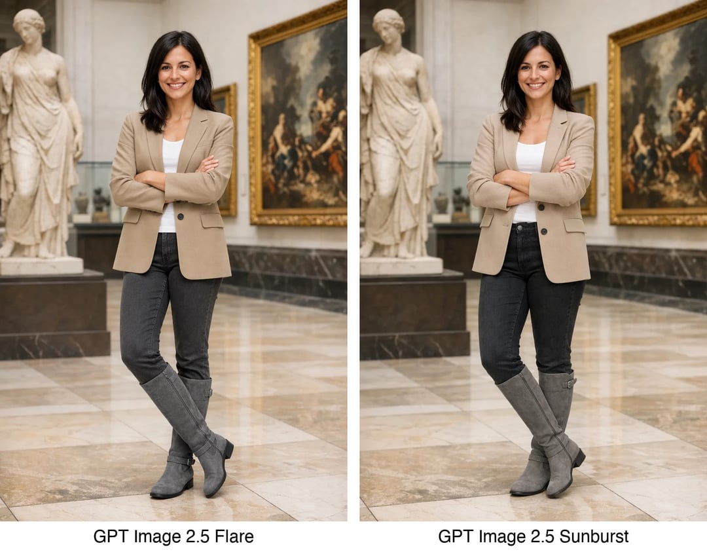](assets/p31-virtual-outfit-replacement/source-example-01.jpg)

#### 👇 Workflow

`Person reference + clothing references → outfit replacement`

#### 🔖 Full Prompt

```text
Use image 1 as the person reference and the remaining uploaded images as clothing references. Edit only the clothing worn by the person in image 1. Preserve their exact identity, face, age, skin tone, body proportions, gender presentation, expression, hairstyle, and pose. Fit the referenced garments naturally to their body and pose with realistic fabric behavior. Match the original lighting, shadows, and color temperature. Keep the background, camera angle, framing, and image quality unchanged. Do not add accessories, text, logos, or watermarks.
```

<sub>[Source: Reddit](https://www.reddit.com/r/ChatGPT/comments/1wcj1ud/gpt_image_25_prompt_guide_2026_23_9_official_edit/) · Reference adaptation by SeeAPI</sub>

<a id="p27-cereal-box-nutrition-panel"></a>

### 📌 3.2. Cereal Box Nutrition Panel

#### 👀 Preview

[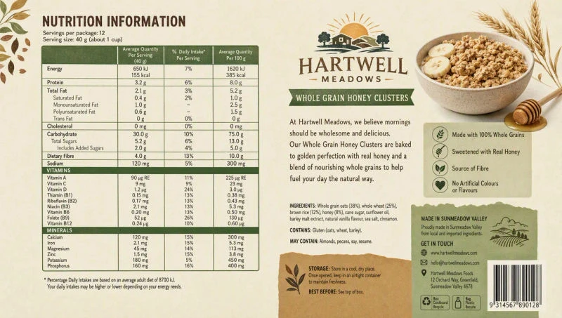](assets/p27-cereal-box-nutrition-panel/source-example-01.webp)

#### 👇 Workflow

`Text → image`

#### 🔖 Full Prompt

```text
A cereal box back panel, a full nutrition table with every figure legible
```

<sub>(Collected from [SeeAPI](https://www.aiimage.net/prompts/)) · [Source: SeeAPI](https://www.aiimage.net/prompts/)</sub>

<a id="p22-wine-label-with-tasting-notes"></a>

### 📌 3.3. Wine Label with Tasting Notes

#### 👀 Preview

[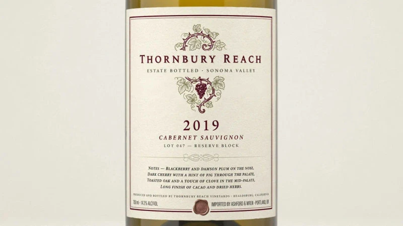](assets/p22-wine-label-with-tasting-notes/source-example-01.webp)

#### 👇 Workflow

`Text → image`

#### 🔖 Full Prompt

```text
A wine bottle label, estate name, vintage year, and four lines of tasting notes
```

<sub>(Collected from [SeeAPI](https://www.aiimage.net/prompts/)) · [Source: SeeAPI](https://www.aiimage.net/prompts/)</sub>

<a id="p21-vintage-toy-airplane-packaging"></a>

### 📌 3.4. Vintage Toy Airplane Packaging

#### 👀 Preview

[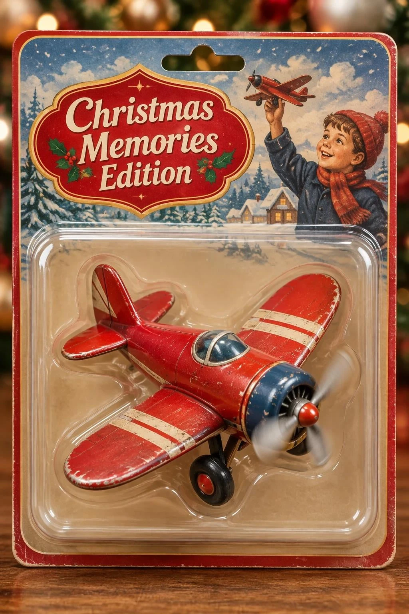](assets/p21-vintage-toy-airplane-packaging/source-example-01.webp)

[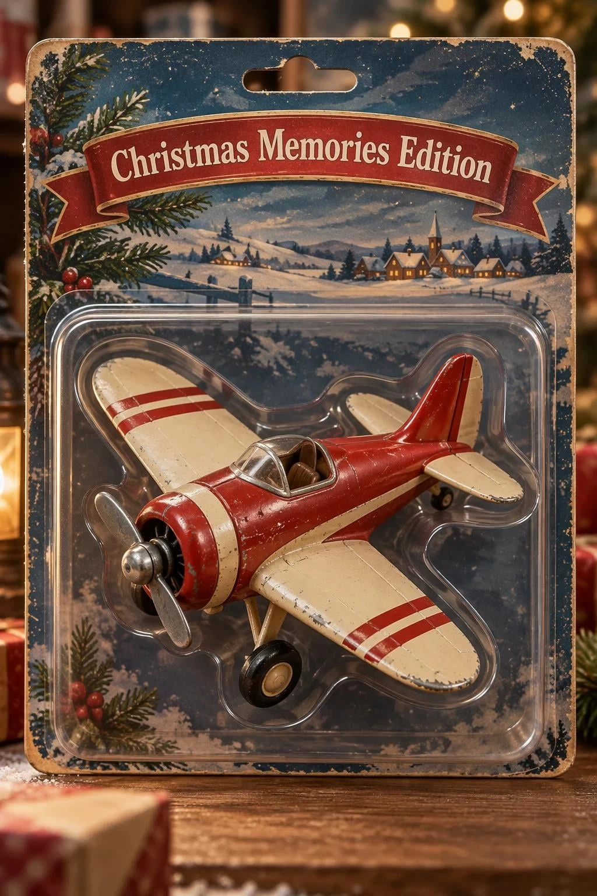](assets/p21-vintage-toy-airplane-packaging/source-example-02.webp)

#### 👇 Workflow

`Text → image`

#### 🔖 Full Prompt

```text
Create a collectible action figure of a vintage-style toy propeller airplane with rounded wings, a front-mounted spinning propeller, slightly worn paint edges, classic childhood proportions, designed as a nostalgic holiday collectible, in blister packaging.

Concept: A nostalgic holiday collectible inspired by the simple toy airplanes children used to play with during winter holidays. Evokes warmth, imagination, and childhood wonder.

Style: Premium toy photography, realistic plastic and painted metal textures, studio lighting, shallow depth of field, sharp label printing, high-end retail presentation.

Constraints:

Original design only

No trademarks

No watermarks

No logos

Include ONLY this packaging text (verbatim): "Christmas Memories Edition"
```

<sub>[Source: Reddit](https://www.reddit.com/r/ChatGPT/comments/1wcatvx/gpt_image_25_prompt_guide_2026_13_8_rules_and_8/)</sub>

<a id="p16-minimal-bakery-logo"></a>

### 📌 3.5. Minimal Bakery Logo

#### 👀 Preview

#### 👇 Workflow

`Text → image`

#### 🔖 Full Prompt

```text
Create an original, non-infringing logo for a company called Field & Flour, a local bakery.
The logo should feel warm, simple, and timeless. Use clean, vector-like shapes, a strong silhouette, and balanced negative space.
Favor simplicity over detail so it reads clearly at small and large sizes. Flat design, minimal strokes, no gradients unless essential.
Fully transparent background. Deliver a single centered logo with generous padding, clean alpha edges, and no solid backdrop, scenery, checkerboard, or watermark.
```

<sub>[Source: Reddit](https://www.reddit.com/r/ChatGPT/comments/1wcatvx/gpt_image_25_prompt_guide_2026_13_8_rules_and_8/)</sub>

<a id="p15-streetwear-campaign-with-exact-typography"></a>

### 📌 3.6. Streetwear Campaign with Exact Typography

#### 👀 Preview

[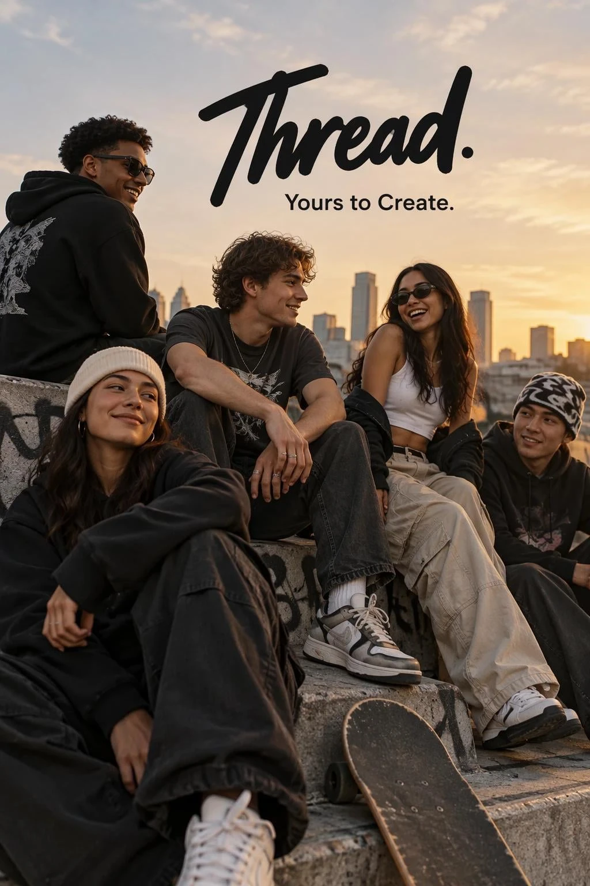](assets/p15-streetwear-campaign-with-exact-typography/source-example-01.webp)

#### 👇 Workflow

`Person references → streetwear campaign image`

#### 🔖 Full Prompt

```text
Use the uploaded person references to define the featured friends, one distinct person per reference. Preserve each person’s recognizable face, age, skin tone, gender presentation, hairstyle, and body proportions; never merge or swap identities. If only one portrait is uploaded, feature that person alone.

Create a polished streetwear campaign for "[brand name]". Show the referenced people hanging out naturally in [setting], wearing [streetwear styling]. Contemporary composition, energetic color direction, natural poses, and premium fashion photography. Render "[tagline]" exactly once and clearly in the layout. Do not render bracket characters. No additional people, extra text, watermarks, or unrelated logos.
```

<sub>[Source: Reddit](https://www.reddit.com/r/ChatGPT/comments/1wcatvx/gpt_image_25_prompt_guide_2026_13_8_rules_and_8/) · Reference adaptation by SeeAPI</sub>

<a id="p08-glass-material-remix"></a>

### 📌 3.7. Glass Material Remix

#### 👀 Preview

[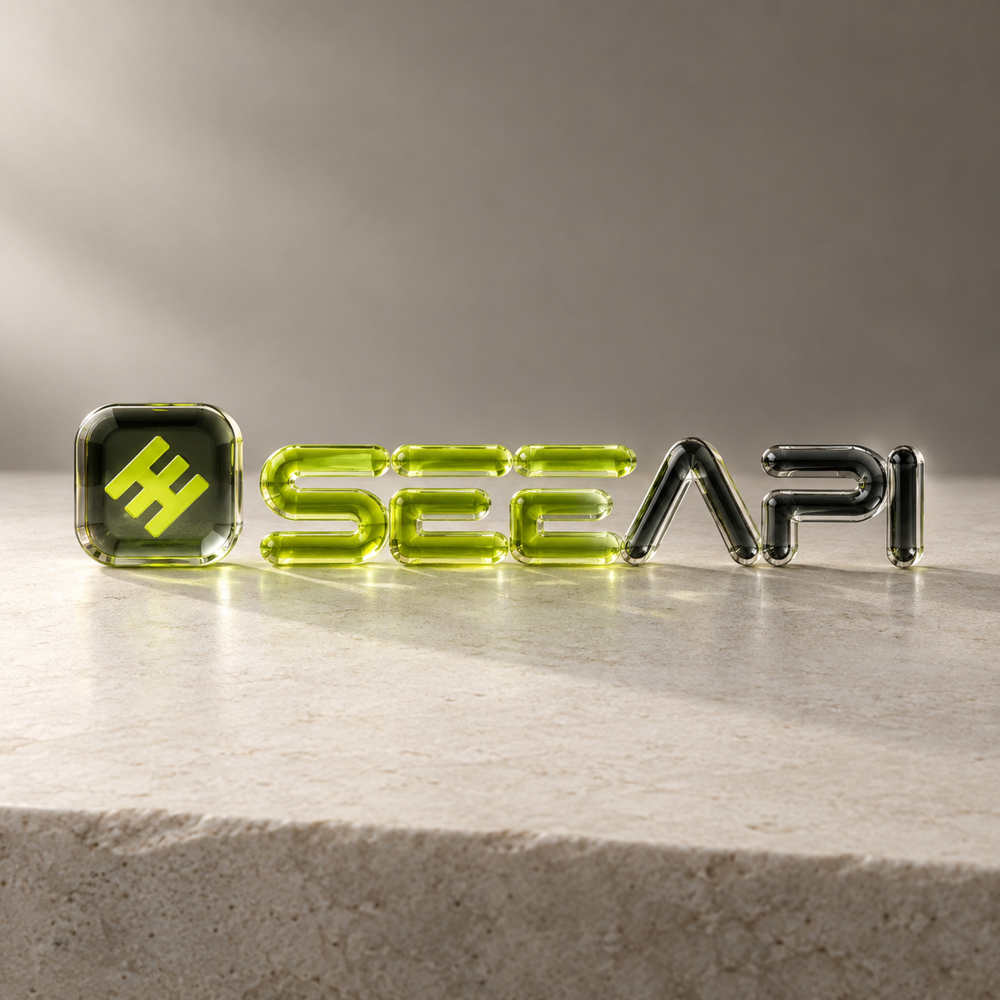](assets/p08-glass-material-remix/seeapi-glass-result.png)

#### 👇 Workflow

`Object reference → glass material image`

#### 🔖 Full Prompt

```text
Transform the main object in the uploaded image into translucent glass while preserving its overall silhouette, proportions, orientation, color, and defining structural details.

Place it on a pale stone surface against a warm gray studio background. Show believable glass thickness, subtle internal reflections, softened refraction through curved areas, and a grounded contact shadow. Use a large soft light from the left and a faint rim light from behind. Keep the full object visible. Do not add extra parts, labels, text, or unrelated props.
```

<sub>(by SeeAPI)</sub>

<a id="p04-product-photo-to-campaign-visual"></a>

### 📌 3.8. Product Photo to Campaign Visual

#### 👀 Preview

[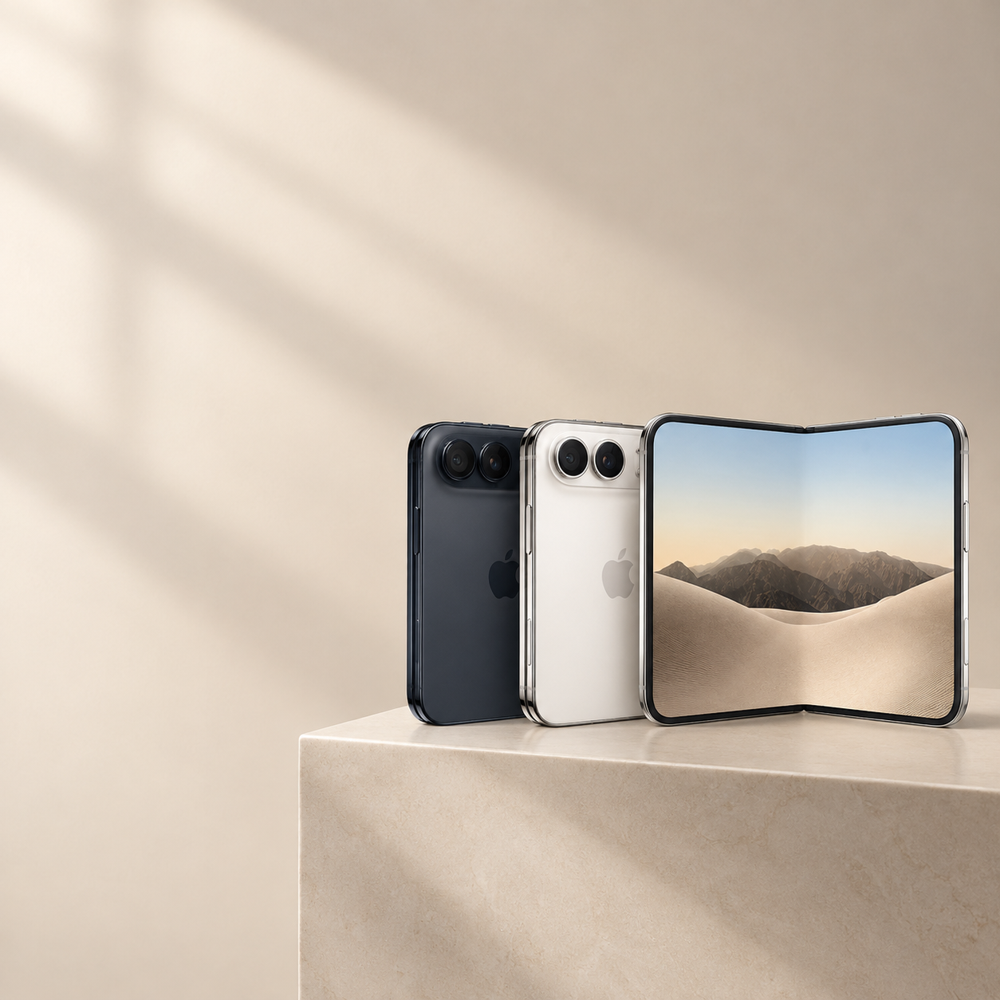](assets/p04-product-campaign/product-campaign-result.png)

#### 👇 Workflow

`Product reference → campaign image`

#### 🔖 Full Prompt

```text
Edit the uploaded product photograph. Preserve the product's silhouette, proportions, orientation, packaging, logo placement, and all visible label wording.

Replace the surrounding scene with a [background color and material] studio background and a [platform material] platform. Add soft window light from the upper left and a natural contact shadow beneath the product. Keep the product on the right half of the frame and leave the left half uncluttered for copy to be added later.

Do not add text, extra products, decorative ingredients, or a new label. Do not crop any part of the product. Landscape composition.
```

<sub>(by SeeAPI)</sub>

<a id="p55-miniature-country-chocolate-bar"></a>

### 📌 3.9. Miniature Country Chocolate Bar

#### 👀 Preview

[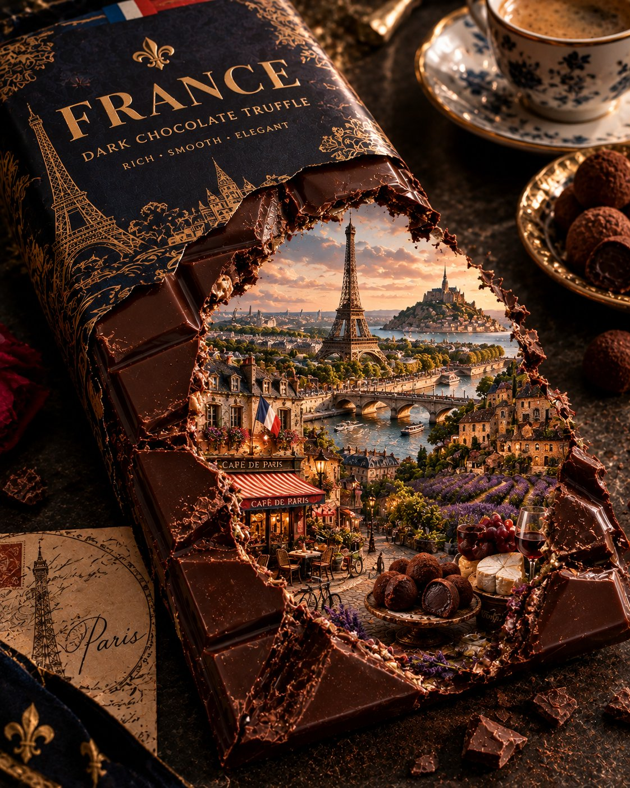](assets/p55-miniature-country-chocolate-bar/source-example-01.jpg)

[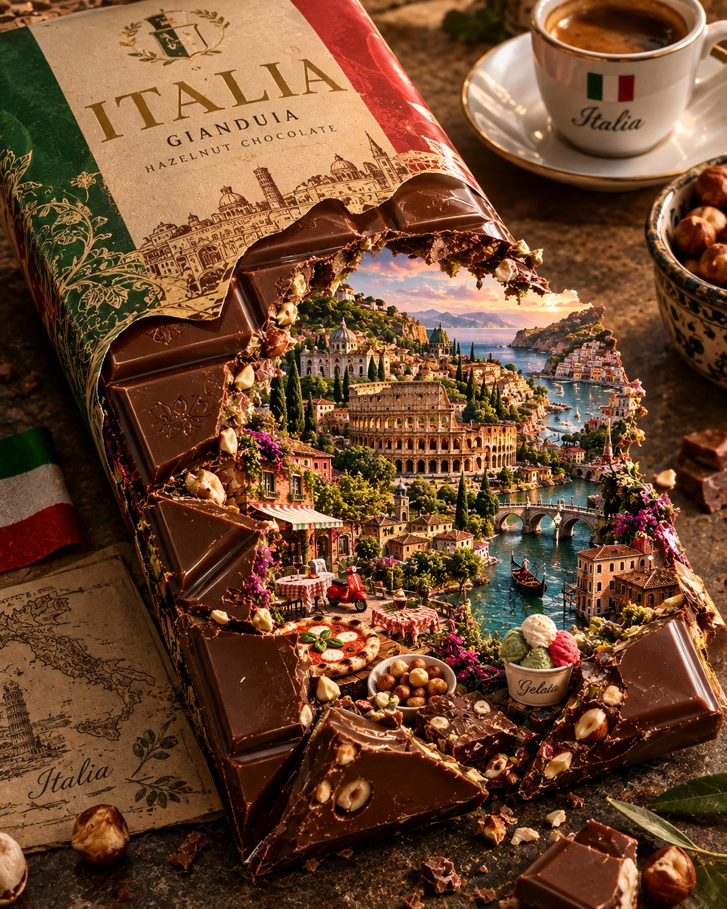](assets/p55-miniature-country-chocolate-bar/source-example-02.jpg)

#### 👇 Workflow

`Country details → miniature chocolate-bar product image`

#### 🔖 Full Prompt

```text
Create a breathtaking, photorealistic luxury food-art image of [COUNTRY] transformed into a giant premium chocolate bar.

The chocolate bar lies diagonally on an elegant dark stone surface, photographed from a slightly elevated cinematic angle. Its wrapper is inspired by the visual identity, colors, patterns, and cultural aesthetic of [COUNTRY], while remaining sophisticated and premium.

The chocolate bar is dramatically broken open in the center.

From inside the broken chocolate, an incredibly detailed miniature 3D version of [COUNTRY] emerges as if the entire country is sculpted inside the chocolate.

Include:

[FAMOUS LANDMARK] as the central focal point

[FAMOUS NATURAL LANDSCAPE] surrounding it

tiny recognizable local architecture

miniature streets and transportation

[FAMOUS LOCAL FOOD] as tiny decorative elements

native flowers, trees, mountains or coastline

subtle cultural details unique to the country

Make the chocolate itself extremely realistic: glossy cocoa surface, crisp snapped edges, creamy layered interior, tiny chocolate crumbs, delicate melting chocolate, realistic highlights and shadows.

Create a magical transition where chocolate pieces gradually become mountains, buildings and landscape, making it look as though the entire country has been hidden inside the chocolate bar.

Premium commercial food photography, cinematic lighting, ultra-detailed miniature world, realistic materials, macro photography, shallow depth of field, atmospheric perspective, sophisticated composition, rich textures, 8K photorealism, visually irresistible, surreal but believable.

Composition: vertical 4:5, centered hero object, dramatic perspective, clean luxurious background, strong visual contrast, no people, no subtitles, no watermark, no unnecessary text.
```

<sub>(by [@Naiknelofar788](https://x.com/Naiknelofar788/status/2100164588721651910)) · [Source: X](https://x.com/Naiknelofar788/status/2100164588721651910)</sub>

<a id="p67-cola-and-mentos-highway-dashcam"></a>

### 📌 3.10. Cola and Mentos Highway Dashcam

#### 👀 Preview

[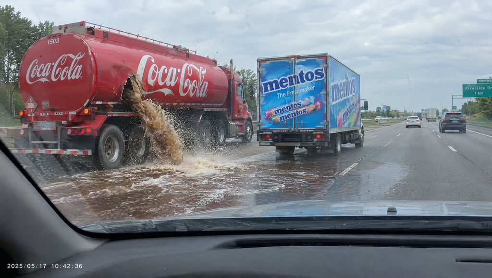](assets/p67-cola-and-mentos-highway-dashcam/source-example-01.jpg)

#### 👇 Workflow

`Text → branded highway dashcam still`

#### 🔖 Full Prompt

```text
DIRECTIVE:
Produce one still that reads as a real in-car dashcam frame grabbed from a moving car on a highway. Optical dashcam capture, wide windshield view, windshield glass, A-pillar, a slice of dashboard/hood — lived-in dashcam JPEG, not cinema, not HDR.

BEAT / COMPOSITION:
Looking forward through the windshield. On the LEFT side of the road (left lane or left shoulder, clearly in frame): TWO branded trucks close together.

COCA-COLA TRUCK (LEFT, CRITICAL):
A full-size Coca-Cola tanker / delivery truck, official Coca-Cola red livery and logos readable. It has a breakdown: a torn ragged hole in the tank wall. A thick, heavy jet of dark-brown Coca-Cola is blasting out of that hole onto the asphalt — lots of liquid, puddle spreading, foam, spray in the air, wet road shine. The truck is stopped or crawling, hazard situation.

MENTOS TRUCK (BESIDE IT, CRITICAL):
Right next to the Coca-Cola truck (same left cluster, slightly ahead or alongside): a closed box truck / delivery truck with large, unmistakable MENTOS branding on the side (Mentos logo, candy rolls artwork). Rear and side doors CLOSED. No candy spilling. You can clearly read that it is a Mentos truck.

CAMERA PACK:
Fixed dashcam behind the windshield, slight barrel wide, dashboard or hood bottom of frame, windshield dirt/reflections, timestamp overlay optional, daytime road, other traffic farther ahead. Real consumer dashcam still.

LIGHT:
Daylight, overcast or sun, real road color, cola looking like dark soda not black oil.

PHOTOGRAPHIC CHARACTER:
Unstaged dashcam grab — physically grounded trucks, readable brands, the leak is the event.
```

<sub>(by [@ECLIPSEINTEL001](https://x.com/ECLIPSEINTEL001/status/2100730298543550674)) · [Source: X](https://x.com/ECLIPSEINTEL001/status/2100730298543550674)</sub>

<a id="p75-loreva-coastal-fragrance-ad"></a>

### 📌 3.11. Loreva Coastal Fragrance Ad

#### 👀 Preview

[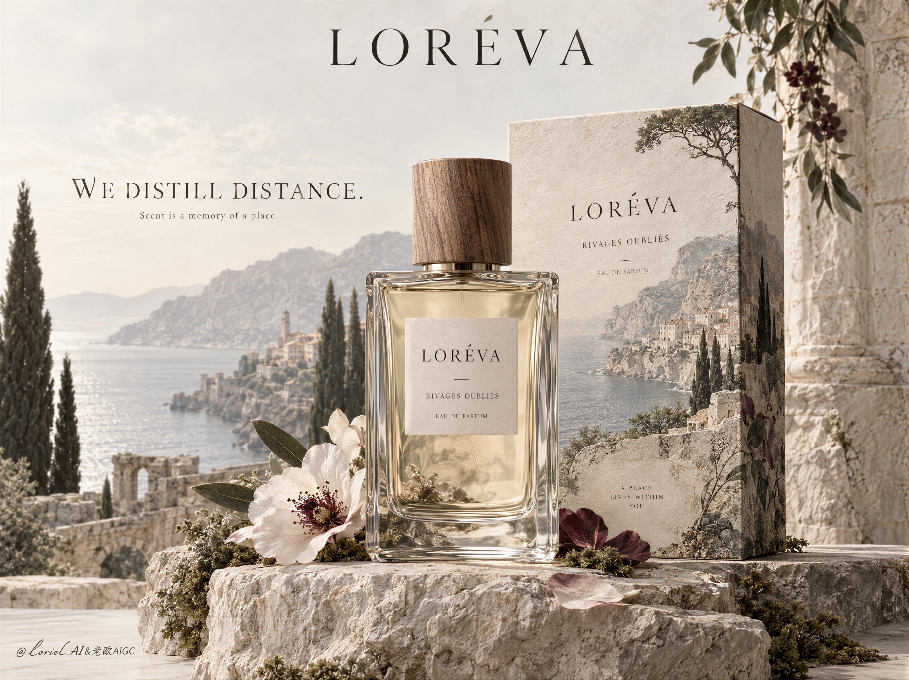](assets/p75-loreva-coastal-fragrance-ad/source-example-01.jpg)

#### 👇 Workflow

`Composition reference + text → coastal fragrance campaign`

#### 🔖 Full Prompt

```text
Create a museum-grade fragrance advertising hero image for a fictional couture perfume house named LORÉVA, designed as a single elevated editorial composition where a real perfume bottle and its packaging become the center of a poetic landscape installation. Preserve the structural intelligence of the reference as pure design logic: one centered rectangular glass perfume bottle in the foreground, one slightly taller packaging box behind it, a sculptural mineral pedestal beneath, and a softly dissolved destination-world unfolding behind and partly through the product. The final image must be more artistic, more restrained, and more luxurious than a conventional fragrance ad, reading like a collectible gallery poster and a high-fashion website hero at the same time.

The product is the absolute hero. The bottle must be photoreal and exquisitely rendered: thick transparent glass walls, elegant proportions, pale luminous fragrance liquid, subtle refraction and reflection, crisp shoulder edges, a warm natural wood cap with visible grain, and a clean label with refined typography. The packaging box behind it must feel like a premium paper object with tactile matte texture and softly weathered printed artwork, extending the same atmospheric landscape language as if the scent’s world lives inside the packaging. The bottle must dominate through clarity, stillness, and material precision, while the box functions as a quiet architectural support.

The concept is that scent contains a place, but the place is rendered as memory rather than illustration. Build a pale, cultured, painterly-photoreal Mediterranean landscape rising behind and around the product: faded coastal mountains, distant shoreline, cypress silhouettes, softened stone villages, mineral air, and restrained botanical traces. This world should feel washed in time, almost like a restored fresco or hand-tinted landscape memory, not a literal travel postcard. The environmental imagery should dissolve gently into the pale background and partially into the box surface, creating an impression that perfume is a vessel for atmosphere, distance, and silence.

At the base, build a sculpted still-life pedestal using pale rock, moss, weathered stone, muted dried stems, one or two softly toned flowers, and delicate translucent petals. These elements must feel curated and minimal, never crowded. The still-life should support the bottle like a fragrance altar rather than decorative styling. Reduce any unnecessary prop abundance and let emptiness play an active role in the composition.

Color hierarchy: 60% parchment ivory, limestone beige, chalk white, and pale mineral paper tones; 20% moss green, cypress green, dry olive, and soft botanical grey-green; 15% muted wine, dusty plum, faded sienna, and floral burgundy accents; 5% clear glass highlights and crisp dark typography. Lighting is soft and intelligent: diffused daylight from the front-left, refined shadow pooling under the glass, subtle highlight lines along bottle edges, a quiet glow through the liquid, and atmospheric depth in the landscape field. Keep contrast low but sophisticated, with volume and separation achieved through material response rather than harsh dramatic lighting.

Typography must be colder, fewer, and more elevated. Place the brand name "LORÉVA" at the top center in a refined high-contrast serif with generous breathing room. On the left open space, place only one statement line in elegant serif capitals: "WE DISTILL DISTANCE." Add one very small supporting line beneath it, brief and intelligent, about scent, memory, and place. Keep all other interface text minimal or nearly absent. Typography should feel like part of a luxury exhibition layout, not a commercial web banner, and must never compete with the bottle.

Material semantics must be explicit and exquisite: thick glass refraction, matte paper carton fibers, natural wood grain, soft stone powder, translucent petal veins, restrained floral depth, and atmospheric landscape pigment softness. The fusion between object and world must feel seamless, as if the fragrance has condensed an entire geography into one vessel. Every element should feel intentional, rarefied, and calm.

Rendering target: photoreal luxury perfume campaign, fine-art still-life precision, editorial sophistication, high-end print finish, product-dominant hierarchy, restrained visual poetry, elegant negative space, and international gallery-level aesthetic.

Structured exclusion constraints: no real fragrance brand names, no copied text, no cluttered florals, no excessive decorative crystals, no distorted bottle geometry, no warped label, no unreadable typography, no random letters, no muddy color, no dirty haze, no busy prop styling, no style drift, no cheap beauty-commerce look, no AI artifacts.
```

<sub>(by [@ou_zhen599](https://x.com/ou_zhen599/status/2101557541318910089)) · [Source: X](https://x.com/ou_zhen599/status/2101557541318910089)</sub>

## 🎨 Posters & Artistic Styles

<a id="p53-adaptive-vintage-city-travel-poster"></a>

### 📌 4.1. Adaptive Vintage City Travel Poster

#### 👀 Preview

[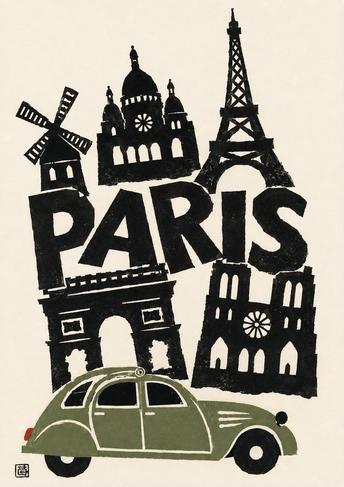](assets/p53-adaptive-vintage-city-travel-poster/source-example-01.jpg)

[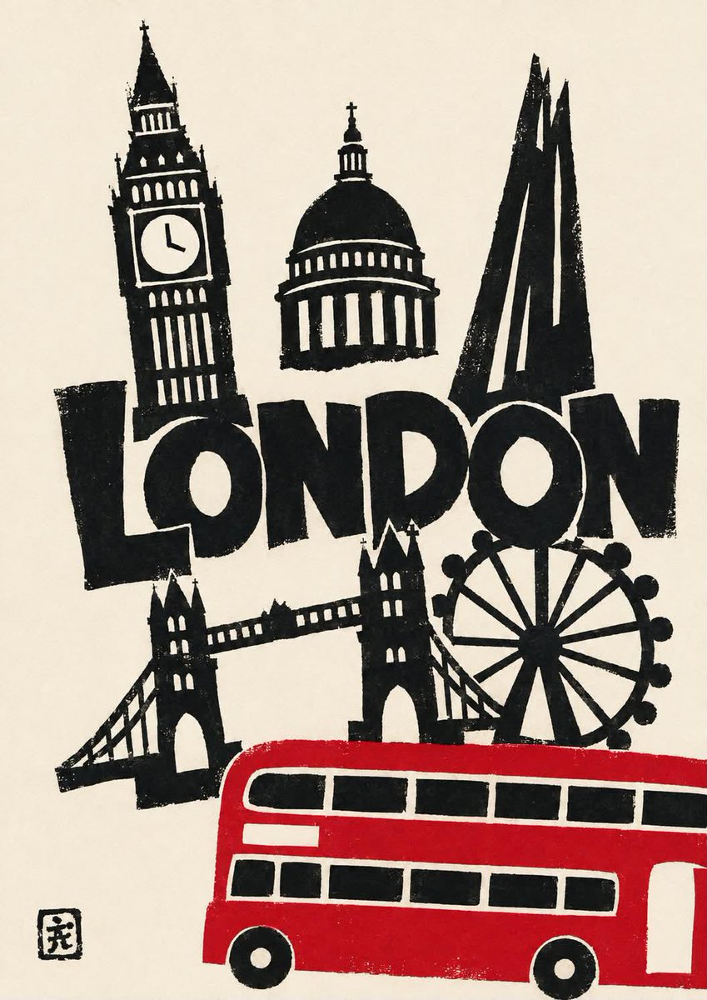](assets/p53-adaptive-vintage-city-travel-poster/source-example-02.jpg)

[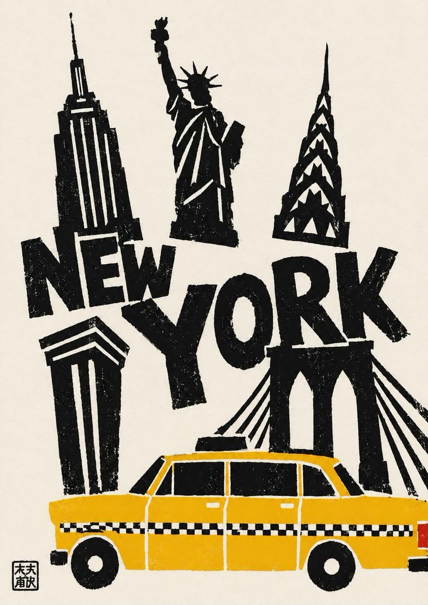](assets/p53-adaptive-vintage-city-travel-poster/source-example-03.jpg)

[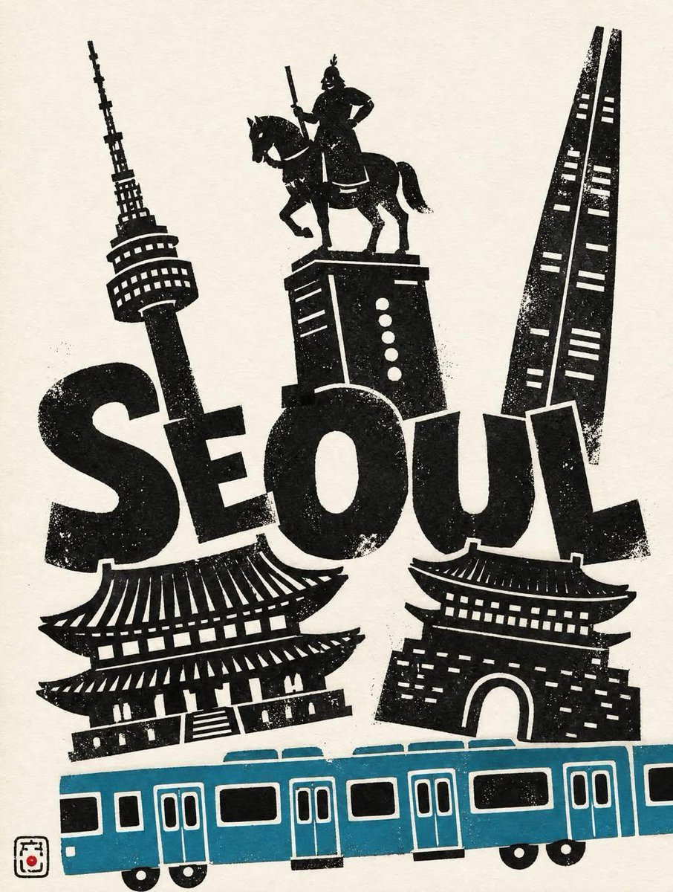](assets/p53-adaptive-vintage-city-travel-poster/source-example-04.jpg)

#### 👇 Workflow

`City name + style references → vintage travel poster`

#### 🔖 Full Prompt

```text
{
  "input": {
    "city_name": "{{USER_INPUT_CITY}}"
  },

  "reference_style": {
    "use_uploaded_reference_images": true,
    "reference_images_define": [
      "overall composition",
      "hand-cut screenprint aesthetic",
      "bold black graphic silhouettes",
      "limited color palette",
      "vintage travel poster character",
      "rough ink texture",
      "slightly imperfect handmade edges",
      "large oversized city typography",
      "layered landmark arrangement",
      "bottom transportation element",
      "cream/off-white paper background",
      "minimal editorial composition"
    ],
    "do_not_copy": [
      "specific landmarks",
      "specific city name",
      "specific vehicle",
      "specific color combinations",
      "exact typography arrangement",
      "exact landmark placement"
    ]
  },

  "generation": {
    "type": "vintage_city_travel_poster",
    "aspect_ratio": "3:4",
    "resolution": "high",
    "orientation": "portrait",

    "city_adaptation": {
      "primary_rule": "Everything must be redesigned around the user's city_name.",
      "identify_city": true,
      "research_visual_identity": true,

      "landmarks": {
        "count": "4-7",
        "selection": "Automatically select the most recognizable and visually distinctive landmarks of the specified city.",
        "prioritize": [
          "major landmark",
          "historic architecture",
          "modern architectural icon",
          "religious or cultural landmark",
          "bridge or monument",
          "recognizable skyline element"
        ],
        "rendering": "Convert each landmark into simplified bold black screenprint silhouettes while preserving its recognizable architectural identity."
      },

      "transportation": {
        "automatically_select": true,
        "instruction": "Choose a transportation vehicle strongly associated with the specified city, such as a taxi, tram, bus, metro train, tuk-tuk, cable car, rickshaw, classic car, ferry, or other iconic local transport.",
        "placement": "large foreground element along the bottom edge",
        "style": "simplified vintage screenprint illustration"
      },

      "colors": {
        "automatically_adapt": true,
        "instruction": "Select a restrained 2-4 color palette inspired by the city's visual identity, local transportation, flag, architecture, or cultural colors.",
        "black": "dominant graphic ink color",
        "background": "warm aged cream paper",
        "accent_colors": "city-specific and muted, never overly saturated"
      },

      "typography": {
        "text": "{{USER_INPUT_CITY}}",
        "case": "uppercase",
        "style": "large bold irregular condensed display lettering",
        "placement": "integrated prominently between or behind the landmarks",
        "texture": "rough printed ink",
        "alignment": "slightly imperfect and organic",
        "rule": "The city name must be perfectly spelled and clearly readable."
      },

      "secondary_text": {
        "enabled": false,
        "instruction": "Do not add arbitrary slogans, dates, tourist phrases, descriptions, or extra readable text."
      },

      "local_details": {
        "automatically_adapt": true,
        "instruction": "Add subtle visual details that immediately reinforce the identity of the specified city without overcrowding the composition."
      }
    },

    "composition": {
      "layout": "editorial vintage travel poster",
      "landmarks": "arranged dynamically around the typography",
      "typography": "large central visual anchor",
      "foreground": "one iconic city transportation element",
      "depth": "flat graphic layering with minimal overlap",
      "negative_space": "generous cream-colored negative space",
      "balance": "asymmetrical but visually balanced",
      "cropping": "allow selected landmarks or transportation to naturally extend toward the edges"
    },

    "art_direction": {
      "medium": "hand-pulled screenprint / linocut-inspired travel poster",
      "visual_language": [
        "bold silhouettes",
        "flat shapes",
        "rough ink edges",
        "visible print grain",
        "subtle ink distress",
        "slight registration imperfections",
        "handmade imperfections",
        "graphic editorial design",
        "mid-century travel poster influence"
      ],
      "linework": "strong, chunky and simplified",
      "texture": "authentic paper grain and uneven ink coverage",
      "finish": "physical printed artwork rather than digitally perfect vector art"
    },

    "background": {
      "color": "warm ivory / aged cream",
      "texture": "subtle natural paper fibers",
      "pattern": "none",
      "gradient": false
    },

    "quality": {
      "photorealism": false,
      "vector_perfection": false,
      "digital_gloss": false,
      "clean_modern_ui": false,
      "high_detail": true,
      "print_ready_appearance": true
    }
  },

  "constraints": {
    "user_controls_only": [
      "city_name"
    ],
    "model_controls": [
      "landmark selection",
      "landmark arrangement",
      "transportation",
      "color palette",
      "local visual details",
      "typographic composition",
      "graphic hierarchy"
    ],
    "must_have": [
      "correct city name",
      "recognizable landmarks from that city",
      "city-specific transportation or mobility element",
      "warm cream paper background",
      "bold black screenprint forms",
      "large city typography",
      "vintage handmade print texture",
      "cohesive travel-poster composition"
    ],
    "avoid": [
      "landmarks from other cities",
      "generic buildings",
      "generic tourist imagery",
      "photorealistic rendering",
      "3D rendering",
      "glossy gradients",
      "neon colors",
      "modern corporate poster design",
      "random text",
      "misspelled city name",
      "extra slogans",
      "watermarks",
      "logos",
      "AI artifacts",
      "overly clean vector edges"
    ]
  },

  "output_instruction": "Create a single finished vintage screenprint travel poster representing {{USER_INPUT_CITY}}. Preserve the artistic language and visual restraint of the supplied references, but completely redesign the landmarks, transportation, color accents and local details so they authentically belong to the specified city."
}
```

<sub>(by [@Maercihh](https://x.com/Maercihh/status/2099757585264251102)) · [Source: X](https://x.com/Maercihh/status/2099757585264251102)</sub>

<a id="p51-rebel-streetwear-editorial-poster"></a>

### 📌 4.2. Rebel Streetwear Editorial Poster

#### 👀 Preview

[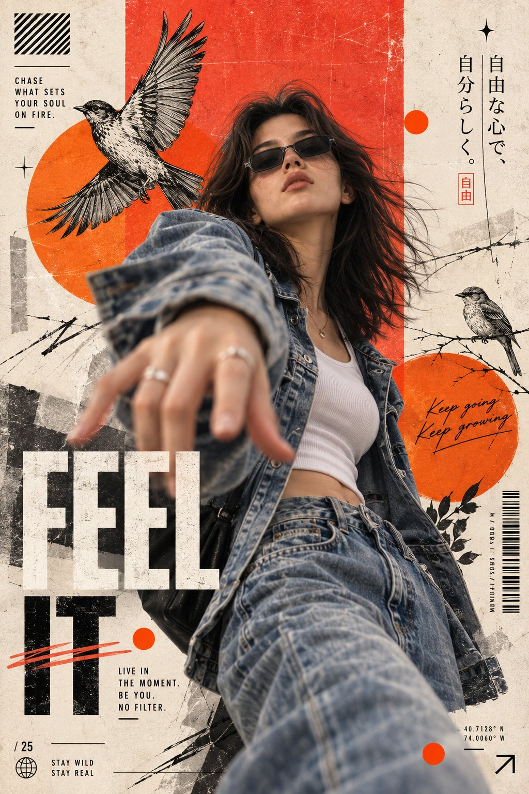](assets/p51-rebel-streetwear-editorial-poster/source-example-01.jpg)

#### 👇 Workflow

`Text → editorial fashion poster`

#### 🔖 Full Prompt

```text
Create an ultra-realistic, high-end editorial fashion poster featuring a young woman with long, messy dark brown hair, wearing narrow black sunglasses, a faded blue denim jacket, a white fitted crop top, and relaxed blue jeans.

She is captured from a dramatic low-angle perspective, leaning forward and reaching one hand toward the camera. Her hand is close to the lens, creating a strong perspective and slight motion blur. Her head is tilted upward, with a confident, rebellious expression. Her hair flows naturally in the wind.

The background is a vintage mixed-media collage with a textured cream paper base, large distressed red and orange geometric circles and rectangles, hand-drawn black-and-white birds in flight, fine botanical branches, and subtle grunge marks.

Typography and graphic design: oversized bold white text reading “FEEL” across the lower-left section, with large black text reading “IT” underneath. Add small editorial text such as “CHASE WHAT SETS YOUR SOUL ON FIRE,” “LIVE IN THE MOMENT. BE YOU. NO FILTER,” and “KEEP GOING, KEEP GROWING.” Include vertical Japanese typography on the right, thin decorative lines, abstract symbols, barcode graphics, handwritten brush lettering, and minimalist editorial details.

Color palette: warm cream, distressed red, orange, black, white, and muted denim blue. Add vintage paper grain, screen-print texture, faded ink, subtle scratches, and authentic collage imperfections.

Composition: vertical fashion magazine cover, dramatic low-angle shot, dynamic subject placement, layered graphic elements, professional art direction, realistic skin texture, cinematic lighting, premium streetwear editorial aesthetic.

Aspect ratio: 2:3 vertical, ultra-detailed, 4K photorealistic.
```

<sub>(by [@harboriis](https://x.com/harboriis/status/2099734295539790133)) · [Source: X](https://x.com/harboriis/status/2099734295539790133)</sub>

<a id="p50-minimal-watercolor-paper-cover"></a>

### 📌 4.3. Minimal Watercolor Paper Cover

#### 👀 Preview

[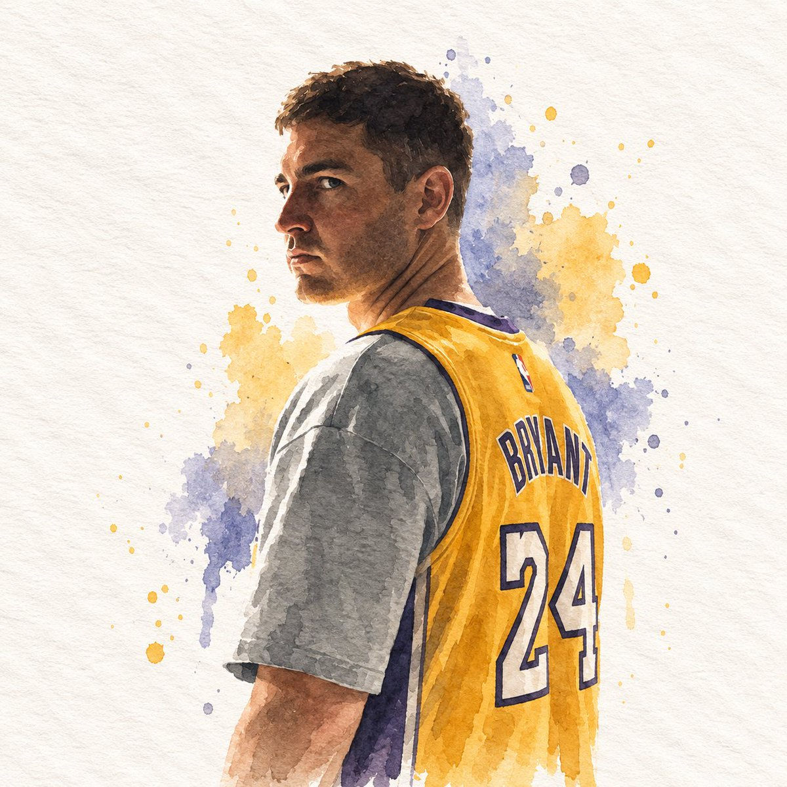](assets/p50-minimal-watercolor-paper-cover/source-example-01.jpg)

#### 👇 Workflow

`Reference image → watercolor paper-cover illustration`

#### 🔖 Full Prompt

```text
## DIRECTIVE
Generate a single watercolor paper-cover illustration. Use the attached reference image only as a source to extract subject, silhouette, pose, objects, colors, and canvas proportion. Do not place, collage, overlay, split, or attach the original photograph anywhere in the frame. The entire canvas is the illustration.

## FORMAT
Match the exact aspect ratio and orientation of the attached reference image.
If the reference is horizontal, the illustration is horizontal.
If the reference is vertical, the illustration is vertical.
If the reference is square, the illustration is square.
One full-bleed handmade paper illustration.
No top/bottom split.
No photographic insert.
No diptych.
No letterboxing or added bars.

## ASPECT RATIO ADAPTATION
The output canvas must inherit the size relationship of the reference image.
Recompose the extracted elements to occupy that same proportion with intention.
Do not stretch, squash, or pad the drawing to fake another format.
Do not keep the original photograph's empty margins as dead space.
Use the full reference proportion as an editorial page: subject, a few supporting shapes, and paper ground arranged for that specific width and height.

## SUBJECT EXTRACTION
Study the attached reference image.
Preserve only:
- the most recognizable subject
- essential silhouette and proportions
- key pose or gesture
- important objects
- the core narrative relationship between people and objects

Highly simplify.
Remove unnecessary details.
Retain only the visual information needed for immediate recognition.

Never copy photographic texture, pores, lens blur, or camera grain into the illustration.
Never redraw the photograph as a painted photo.
Never keep the original photo visible.

## MEDIUM
Minimalist hand-drawn watercolor on paper.

Use:
- delicate, slightly imperfect hand-drawn lines
- transparent watercolor washes
- a small number of bold, clearly defined flat color shapes
- rough paper texture
- visible handmade brush marks
- slightly irregular, organic edges
- subtle pooling, bloom, and pigment granulation
- slight imperfections that make it feel genuinely handmade

The main illustrated subject should be small and carefully composed, occupying approximately 20–35% of the canvas.
Leave a large amount of negative space around the illustration, distributed according to the reference proportion.

## PAPER GROUND
The background should primarily resemble:
- rough white paper
- warm off-white paper
- pale natural paper
- minimal editorial book-cover stock

Use only a few lines or small watercolor shapes to suggest the surrounding environment.
Do not fill the page with a full scene.
Do not paint a photographic background.

## COLOR PALETTE
Extract the dominant colors directly from the attached reference image.
Compress the palette into no more than 4 main colors.
Keep the colors restrained, sophisticated, and harmonious.
Use bold but controlled flat watercolor blocks.
Avoid excessive color variation.
Preserve subtle paper grain and handmade brush texture.
The illustration should feel like a simplified watercolor interpretation of the reference, not a copy of it.

## TYPOGRAPHY
A small amount of simple typography may be included when it naturally fits.
Possible elements: a short title, keyword, object name, location, year, number, or short phrase.
Text should be minimal, understated, and editorial.
Place type in the negative space created by the reference proportion.
Do not force text into the composition if it does not naturally fit the subject.
No logos. No watermarks. No captions describing the image.

## VISUAL LANGUAGE
Quiet. Poetic. Refined. Minimal. Innocent. Relaxed. Artistic. Thoughtful. High-recognition. Premium.
Art-book cover. Independent publishing. Contemporary editorial design. Thoughtful picture book.

## NEGATIVE PROMPT
No original photograph in the frame, no split layout, no top photo / bottom drawing, no collage, no photomontage, no attached reference image, no photorealism, no camera look, no lens blur, no cinematic portrait, no beauty retouch, no extra people, no identity-heavy realism, no crowded composition, no full-bleed painted scene, no forced 3:4, no forced square, no letterboxing, no black bars, no stretched or squashed drawing, no unused margins copied from the photograph, no excessive detail, no more than four main colors, no loud typography, no logos, no watermarks, no HUD.
```

<sub>(by [@impaulxyz](https://x.com/impaulxyz/status/2099770445595545766)) · [Source: X](https://x.com/impaulxyz/status/2099770443808821443) · Inspired by [@icreatelife](https://x.com/icreatelife/status/2099343607492702258)</sub>

<a id="p48-misty-autumn-lakeside-at-sunrise"></a>

### 📌 4.4. Misty Autumn Lakeside at Sunrise

#### 👀 Preview

[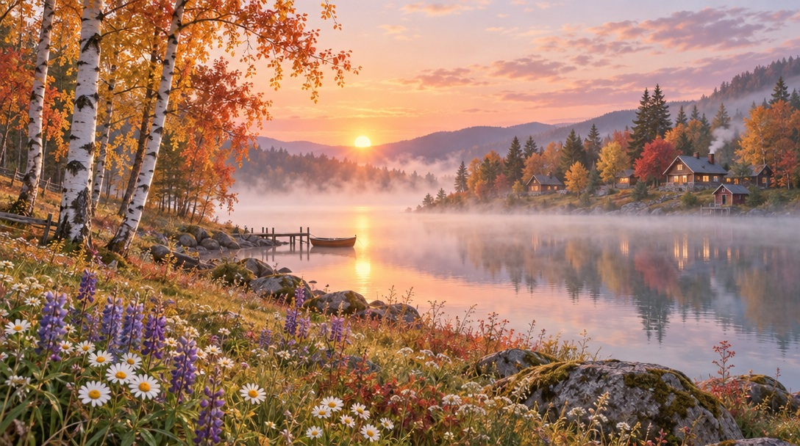](assets/p48-misty-autumn-lakeside-at-sunrise/source-example-01.jpg)

#### 👇 Workflow

`Text → landscape image`

#### 🔖 Full Prompt

```text
A tranquil, pastel-toned landscape featuring a serene lakeside at sunrise, with soft mist hovering over the water. In the foreground, a vibrant meadow filled with wildflowers such as daisies and lupines leads to a cluster of birch trees with autumn-colored leaves. Across the misty lake, cozy wooden cottages nestle among more colorful trees, all bathed in the gentle, warm glow of the rising sun. The overall style is dreamy and delicate, evoking a peaceful, nostalgic mood.
```

<sub>(by [@churvikv](https://x.com/churvikv/status/2099793774700376379)) · [Source: X](https://x.com/churvikv/status/2099793774700376379)</sub>

<a id="p44-halftone-travel-collage-poster"></a>

### 📌 4.5. Halftone Travel Collage Poster

#### 👀 Preview

[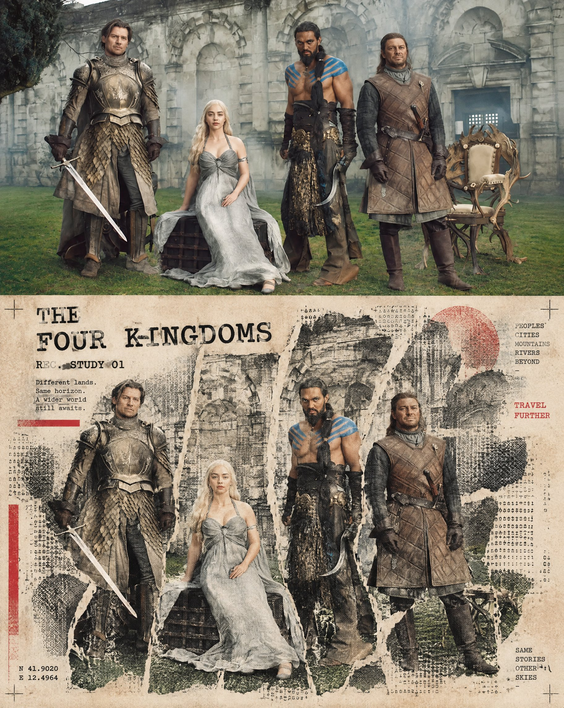](assets/p44-halftone-travel-collage-poster/source-example-01.jpg)

[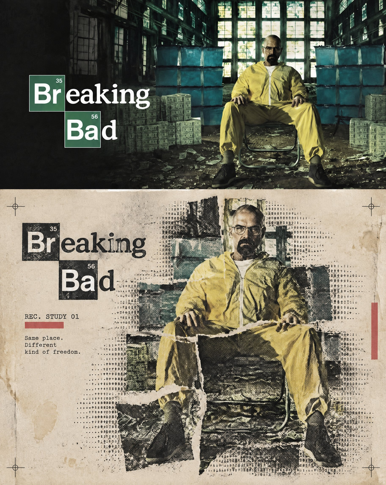](assets/p44-halftone-travel-collage-poster/source-example-02.jpg)

[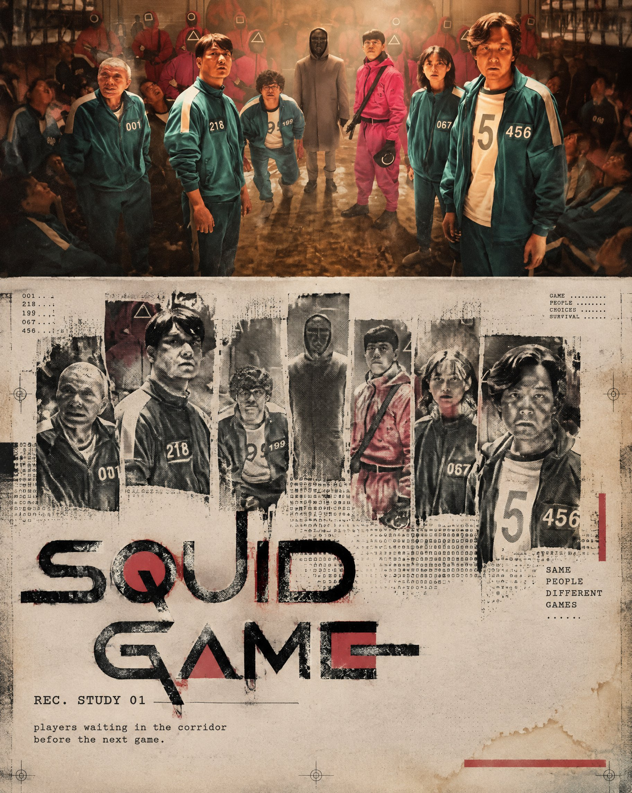](assets/p44-halftone-travel-collage-poster/source-example-03.jpg)

#### 👇 Workflow

`Portrait reference → halftone collage poster`

#### 🔖 Full Prompt

```text
Turn this portrait photo into a single high-end halftone travel-collage poster. Output one poster per uploaded photo — never merge multiple photos into one frame.
FORMAT

3:4 vertical canvas. Split into two roughly equal zones — real photo on top, printed collage below — divided by one clean, sharp horizontal line. Do not stretch, warp, or reposition the figure to force the proportions.
TOP HALF — THE REAL SHOT

Preserve the original photo faithfully: same identity, face, expression, pose, hands, clothing, personal items, background structure, natural light and shadow, original color mood. Add only a light high-end color grade and the faintest film grain. Do not redraw or reinterpret the person.
BOTTOM HALF — THE PRINTED RECONSTRUCTION

Same warm gray old-paper background. Rebuild the same figure as a printed collage: torn photographic slices + fixed-width ASCII character fields + photocopy halftone dots.

Keep face, hands, hairstyle, clothing, and one signature item recognizable — identity must survive the breakdown.
Torn-edge photo fragments carry the face and key structural lines; fabric, shadow, and background dissolve outward into ASCII characters, black halftone dots, and fractured print grain.
Texture: rough white paper-fiber edges, slight print misregistration, old paper stains, a couple of crop marks, one restrained red calibration bar.
Color: warm gray paper + black ink + the photo’s own muted original colors + the single red accent. Never fully desaturate.
Figure fills roughly 60–88% of the frame width — always leave 22–38% of the paper untouched and empty, so it reads as archival print, not a packed terminal screen.
Add one readable fixed-width title pulled from the photo’s theme, plus the line "REC. STUDY 01" and one short observational caption. A few loose ASCII glyphs can trace the figure’s edge as texture only — never used to fake body detail or invent specs.

MOOD

Early digital systems meets analog photocopy meets underground zine meets modern travel editorial. The figure should feel like it’s surfacing — half photograph, half character, half print — restrained, archival, a little experimental.
AVOID

Solid black terminal backgrounds, walls of dense code, cyberpunk neon, fully hidden faces, random symbols with no meaning, invented technical readouts, garbled fake text, author credits, brand logos, QR codes, watermarks.
```

<sub>(by [@ShamiWeb3](https://x.com/ShamiWeb3/status/2099316312426381491)) · [Source: X](https://x.com/ShamiWeb3/status/2099316312426381491)</sub>

<a id="p43-foodie-cities-in-sculptural-typography"></a>

### 📌 4.6. Foodie Cities in Sculptural Typography

#### 👀 Preview

[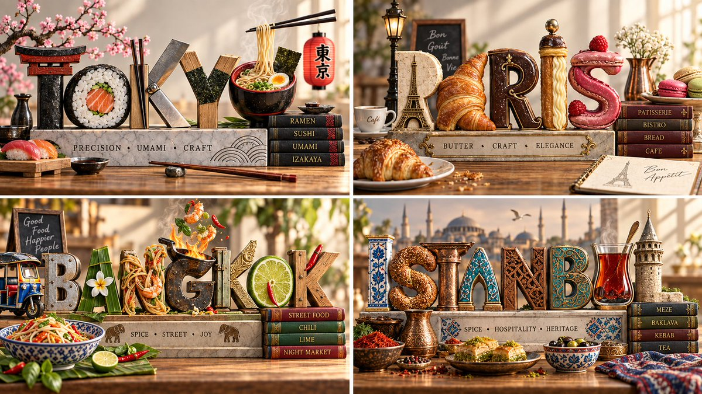](assets/p43-foodie-cities-in-sculptural-typography/source-example-01.jpg)

#### 👇 Workflow

`Place or culture parameter → sculptural typography image`

#### 🔖 Full Prompt

```text
WITH identity AS (     SELECT        derive_display_name([PLACE_OR_CULTURE])          AS display_name,         infer_signature_foods([PLACE_OR_CULTURE])        AS foods,         infer_signature_materials([PLACE_OR_CULTURE])    AS materials,         infer_landmarks([PLACE_OR_CULTURE])              AS landmarks,         infer_objects([PLACE_OR_CULTURE])                AS objects,         infer_palette([PLACE_OR_CULTURE])                AS palette,         infer_three_values([PLACE_OR_CULTURE])           AS values,         infer_keyword_stack([PLACE_OR_CULTURE], 4)       AS keywords ),  glyph_assignment AS (     SELECT        glyph,         argmax(             source_item,             shape_match(glyph, source_item)             * cultural_relevance(source_item)             * visual_uniqueness(source_item)         ) AS source_material     FROM letters(display_name)     CROSS JOIN cultural_pool(foods, materials, objects) )  SELECT render FROM editorial_travel_stilllife_archive WHERE hero_typography = build_3d_word(     display_name,     material_per_glyph = glyph_assignment.source_material ) AND foreground = infer_culinary_stilllife([PLACE_OR_CULTURE]) AND background = infer_soft_focus_architecture([PLACE_OR_CULTURE]) AND base = 'premium sculptural plinth' AND base_caption = join(values, ' • ') AND side_stack = keywords AND lighting = 'warm sunlit premium editorial' AND styling = 'travel magazine × culinary still life × crafted typography' ORDER BY    cultural_specificity DESC,     glyph_legibility DESC,     material_variety DESC,     tactile_realism DESC,     composition_balance DESC LIMIT 1;
```

<sub>(by [@Gdgtify](https://x.com/Gdgtify/status/2099299591485354266)) · [Source: X](https://x.com/Gdgtify/status/2099299591485354266)</sub>

<a id="p40-desert-motorcycle-editorial-poster"></a>

### 📌 4.7. Desert Motorcycle Editorial Poster

#### 👀 Preview

[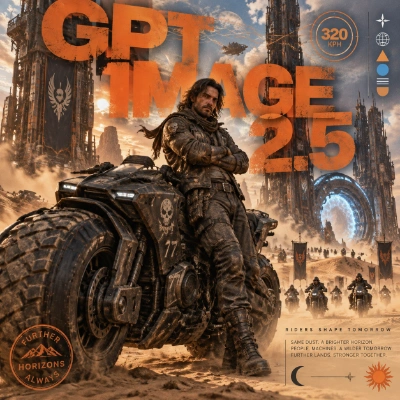](assets/p40-desert-motorcycle-editorial-poster/source-example-01.webp)

#### 👇 Workflow

`Portrait reference → editorial poster`

#### 🔖 Full Prompt

```text
Use the uploaded portrait as the identity reference for the main person. Preserve their recognizable face, age, skin tone, gender presentation, hairstyle, and body proportions. Do not replace their identity with a generic model or impose a different ethnicity, gender, or body type.

Create a square 1:1 editorial fashion poster of this person in [motorcycle outfit], standing with arms crossed beside a large black armored motorcycle in a futuristic desert rally scene. Keep a natural, anatomy-appropriate relaxed stance. Rusty mechanical towers, glowing energy gates, drifting sand, cinematic depth, realistic materials, and fine film grain.

Place the exact title "[poster title]" in oversized burnt-orange industrial sans-serif lettering, weaving behind and in front of scene elements without covering the face. Add abstract graphic accents without lettering. Use an asymmetric layout with burnt orange, black, desert beige, and electric blue. The title is the only text: no captions, extra labels, or watermarks.
```

<sub>(by [Comfy-Org](https://github.com/Comfy-Org/workflow_templates/blob/main/templates/api_openai_gpt_image_25_sunburst_t2i.json)) · [Source: GitHub](https://github.com/Comfy-Org/workflow_templates/blob/main/templates/api_openai_gpt_image_25_sunburst_t2i.json) · Reference adaptation by SeeAPI</sub>

<a id="p39-neon-motorsport-poster"></a>

### 📌 4.8. Neon Motorsport Poster

#### 👀 Preview

[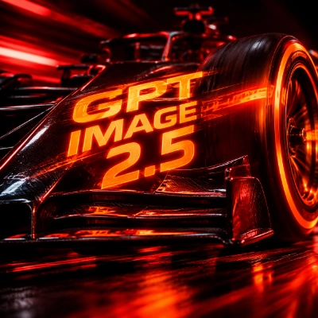](assets/p39-neon-motorsport-poster/source-example-01.webp)

#### 👇 Workflow

`Text → image`

#### 🔖 Full Prompt

```text
1:1 square poster, an extreme close-up, high-contrast shot of a racing car front nose, aerodynamic wing and tire rim, cutting through darkness with bright red motion blur and glowing orange light. The words “GPT IMAGE 2.5” are projected directly onto the car body in brilliant neon orange, overlapping the front wing and tire rim. Intense red and black palette, cinematic low key, sharp reflections, dramatic low angle, shallow depth of field, high-speed motorsport aesthetic. No sidebar, no extra UI panels, no technical symbols, no barcode, no additional text except “GPT IMAGE 2.5”.
```

<sub>(by [Comfy-Org](https://github.com/Comfy-Org/workflow_templates/blob/main/templates/api_openai_gpt_image_25_flare_t2i.json)) · [Source: GitHub](https://github.com/Comfy-Org/workflow_templates/blob/main/templates/api_openai_gpt_image_25_flare_t2i.json)</sub>

<a id="p34-woodland-clearing"></a>

### 📌 4.9. Woodland Clearing

#### 👀 Preview

[](assets/p34-woodland-clearing/source-example-01.jpg)

#### 👇 Workflow

`Text → image`

#### 🔖 Full Prompt

```text
Photo of a clearing in the woods with lots of green foliage, highly detailed
```

<sub>(by [@mark_k](https://x.com/mark_k/status/2097411028510179759)) · [Source: X](https://x.com/mark_k/status/2097411028510179759)</sub>

<a id="p32-dog-compositing-into-a-street-scene"></a>

### 📌 4.10. Dog Compositing into a Street Scene

#### 👀 Preview

[](assets/p32-dog-compositing-into-a-street-scene/source-example-01.jpg)

#### 👇 Workflow

`Street scene + dog reference → composite image`

#### 🔖 Full Prompt

```text
Place the dog from the second image into the setting of image 1, right next to the woman, use the same style of lighting, composition and background. Do not change anything else.
```

<sub>[Source: Reddit](https://www.reddit.com/r/ChatGPT/comments/1wcj1ud/gpt_image_25_prompt_guide_2026_23_9_official_edit/)</sub>

<a id="p28-fashion-movements-across-four-decades"></a>

### 📌 4.11. Fashion Movements Across Four Decades

#### 👀 Preview

[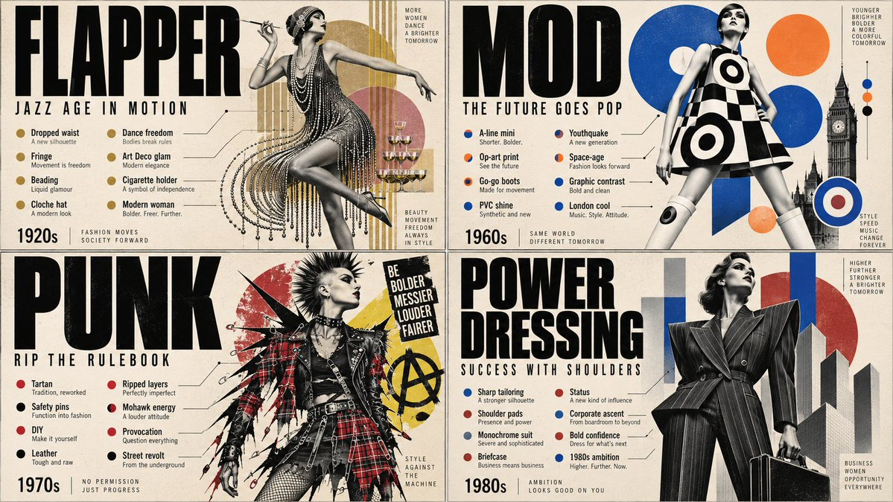](assets/p28-fashion-movements-across-four-decades/source-example-01.jpg)

#### 👇 Workflow

`Text → image`

#### 🔖 Full Prompt

```text
2x2 grird, do this for 4 fashion movement of various decades, 16:9 class EditorialPoster:     def __init__(self, topic):         self.topic = topic         self.resolution = self.resolve_auto_fields(topic)              def resolve_auto_fields(self, topic):         # Module 2: Copy & Facts         self.title = generate_title(topic, max_words=5)         self.tagline = generate_tagline(topic, min_words=3, max_words=8)         self.labels = extract_key_points(topic, count=6-12, relationship="components") # principles/stages/types                  # Module 3: The Surreal Character Engine         self.mechanism = infer_verb(topic) # e.g., "filtering", "branching", "accumulating"         self.base_form = select_organism(self.mechanism) # human, animal, or object         # CRITICAL: Transformation must be structural, not just accessories         self.transformation = invent_structural_alteration(self.base_form, self.mechanism)         self.pose = select_pose(topic, attitude="intriguing_uncanny")                  # Module 5: Geometry & Palette         self.geometry = select_geometric_family(topic) # rays, arcs, ribbons, grids         self.palette = derive_accent_colors(topic, count=2-6, mood="flat_matte_weathered")      def verify_character_logic(self):         # The "Thumbnail & Concept" Check         assert is_structural(self.transformation), "Module 3: Must be anatomy/proportion, not accessories."         assert fits_sentence(self.transformation, self.mechanism), "Module 3: Logic check failed."         assert visible_at_thumbnail(self.transformation), "Module 3: Must read at small scale."         assert not is_generic_cute_scary(self.pose), "Module 3: Avoid default emotional tropes."      def render(self):         self.verify_character_logic()                  # Module 1 & 6: Style Kernel         canvas = Canvas(aspect="1:1", bg="warm_ivory", texture="subtle_analog_grain")                  # Hero: Grayscale, sculptural shading, stippling/halftone         hero = render_grayscale_sculptural(self.base_form, self.transformation, self.pose,                                             shading="fine_stippling", texture="tactile_print")                  # Module 4: Adaptive Layout         layout = adaptive_composition(             hero=hero,              title=self.title, # Oversized, black, condensed, uppercase             labels=self.labels, # Compact, high contrast             geometry=self.geometry, # Connects hero to info             palette=self.palette # Flat, matte accents         )                  return canvas.compose(layout, typography="extreme_contrast_hierarchy")  EditorialPoster($ TOPIC).render()
```

<sub>(by [@Gdgtify](https://x.com/Gdgtify/status/2098228786156196084)) · [Source: X](https://x.com/Gdgtify/status/2098228786156196084)</sub>

<a id="p25-three-panel-dialogue-comic"></a>

### 📌 4.12. Three-Panel Dialogue Comic

#### 👀 Preview

[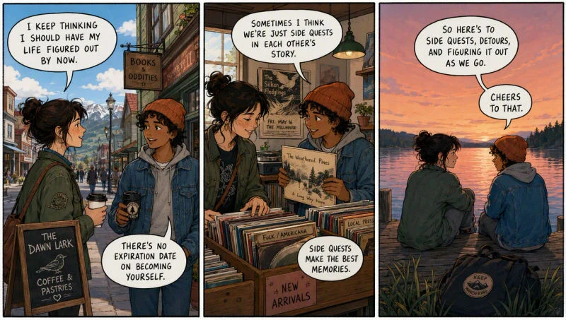](assets/p25-three-panel-dialogue-comic/source-example-01.webp)

#### 👇 Workflow

`Text → image`

#### 🔖 Full Prompt

```text
A three-panel comic strip with hand-lettered speech balloons, ink and flat color
```

<sub>(Collected from [SeeAPI](https://www.aiimage.net/prompts/)) · [Source: SeeAPI](https://www.aiimage.net/prompts/)</sub>

<a id="p09-paper-folk-story"></a>

### 📌 4.13. Paper Folk Story

#### 👀 Preview

[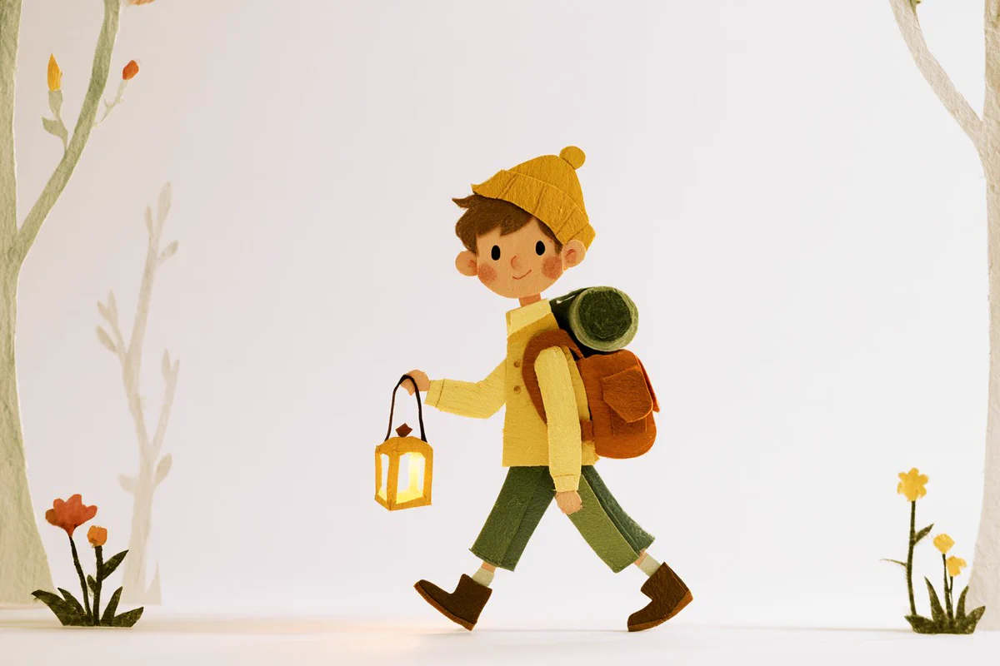](https://x.com/azed_ai/status/2096191635348705726)

#### 👇 Workflow

`Text → paper-cut character image`

#### 🔖 Full Prompt

```text
Paper cut-out animation of a [subject] [simple action], full-body character, layered paper shapes, handmade paper texture, visible cut edges, soft shadows between layers, flat colorful paper tones, slightly imperfect handcrafted details, minimal paper-collage scenery, charming folk story aesthetic, gentle stop-motion feel, poetic children’s book atmosphere, clean white background
```

<sub>(by @azed_ai) · [Source: X](https://x.com/azed_ai/status/2096191635348705726) · [Source: X](https://x.com/azed_ai/status/2096191635348705726)</sub>

<a id="p07-paper-cut-storybook-scene"></a>

### 📌 4.14. Paper-Cut Storybook Scene

#### 👀 Preview

[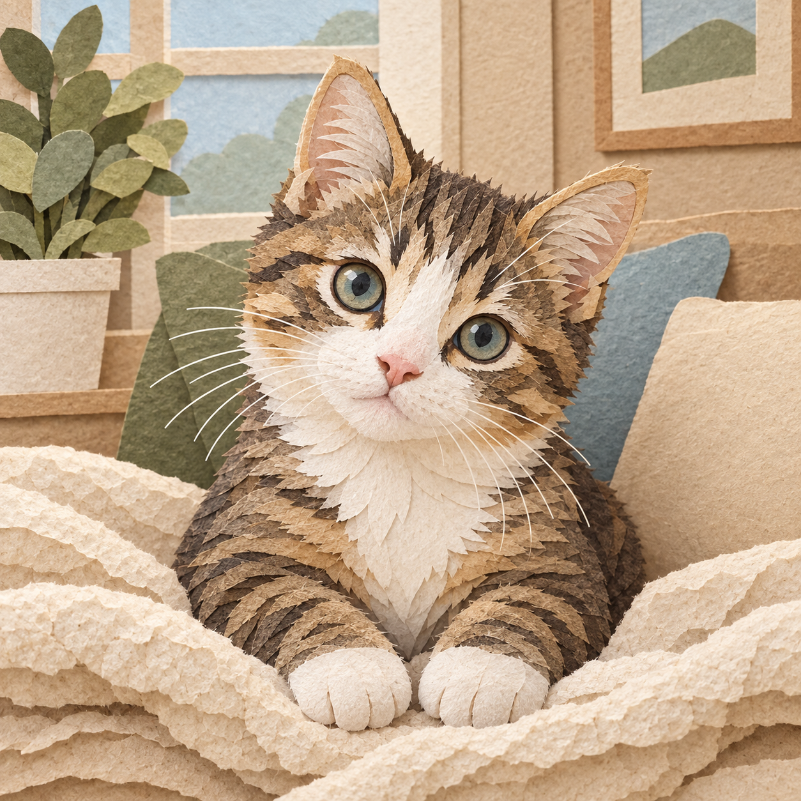](assets/p07-paper-cut-storybook/paper-cut-character-result.png)

#### 👇 Workflow

`Text / optional character reference → paper-cut image`

#### 🔖 Full Prompt

```text
Create a storybook scene made entirely from layered cut paper, set in [environment]. A character defined by [character description] performs [anatomy-appropriate action] near [focal object]. If a character reference is uploaded, preserve its identity, anatomy, proportions, colors, and distinctive features while translating its appearance into cut paper.

Use visible paper fibers, crisp cut edges, gently bent paper elements, and real shadows between the layers. Limit the palette to [color palette]. Compose the scene like a shallow theatrical set viewed from the front, with a clear foreground, middle ground, and background. No text, glossy plastic, or photorealistic surface textures. Square composition.
```

<sub>(by SeeAPI)</sub>

<a id="p05-editorial-poster-with-exact-copy"></a>

### 📌 4.15. Editorial Poster with Exact Copy

#### 👀 Preview

[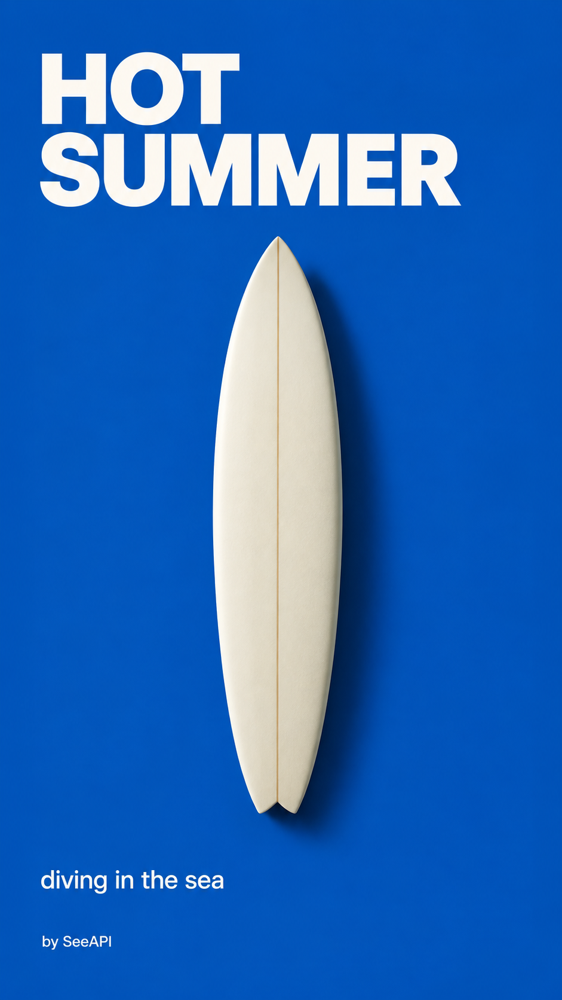](assets/p05-editorial-poster/summer-poster-result.png)

#### 👇 Workflow

`Text → poster image`

#### 🔖 Full Prompt

```text
Design a portrait exhibition poster on [paper color and texture]. A large sculptural [central object] in [object color] occupies the middle third of the composition, lit from the upper left with a soft shadow.

Include only this exact text, using the supplied values without brackets:
Top, large bold sans-serif: "[main title]"
Below the sculpture, smaller: "[subtitle]"
Bottom, small: "[date or supporting line]"

Use generous margins, a strict left-aligned text grid, and strong separation between the title, sculpture, and supporting copy. Keep every word fully visible. No extra lettering, logos, frames, or watermarks.
```

<sub>(by SeeAPI)</sub>

<a id="p03-miniature-world-in-an-everyday-object"></a>

### 📌 4.16. Miniature World in an Everyday Object

#### 👀 Preview

[](assets/p03-miniature-world/miniature-world-result.png)

#### 👇 Workflow

`Text → miniature scene image`

#### 🔖 Full Prompt

```text
Create a miniature [world or scene theme] built inside an open [everyday container], resting on a real [supporting surface]. Include [main structures], [landscape details], and [focal feature], all physically contained within the object. The container's interior forms the backdrop, with materials appropriate to its real construction.

Show the whole container from a three-quarter overhead angle. Make the scale relationship unmistakable through realistic seams, edges, fittings, and a life-size [scale reference object] beside it. Use [lighting mood], realistic miniature materials, and shallow depth of field that keeps the scene readable. No floating structures or text. Landscape composition.
```

<sub>(by SeeAPI)</sub>

<a id="p62-minimal-chinese-roof-poster"></a>

### 📌 4.17. Minimal Chinese Roof Poster

#### 👀 Preview

[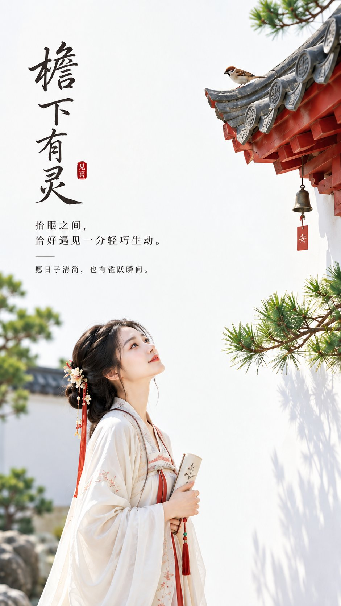](assets/p62-minimal-chinese-roof-poster/source-example-01.jpg)

#### 👇 Workflow

`Text → minimalist Chinese-style poster with title space`

#### 🔖 Full Prompt

```text
Theme: Minimalist cover poster with an Eastern Zen sensibility
Style branch: New Chinese style with a feminine aesthetic
Main subject: A woman in historical dress stands beneath a pale roof ridge, looking up at a small sparrow perched on the corner of the eaves
Mood: Lively, quiet, with an Eastern sense of playfulness
Setting and motifs: Crescent-white wall, touches of crabapple red on the eaves, pine-needle green plants, sparrow, woman
Composition and space: Vertical 9:16 composition; the eaves enter diagonally from above, the figure sits off to one side near the bottom, and a broad expanse of pale wall at the top forms a title area
Color control: Crescent white for the background and wall, crabapple red for the eaves and small accents, pine-needle green for a few plants; keep the sparrow naturally light brown. Avoid making the whole image predominantly red or green
Lighting and texture: Bright natural light, clean image, crisp edges, lightly graphic new Chinese-style poster feel
Aspect ratio: 9:16
Additional requirements: Keep the composition playful yet minimal. The sparrow should be just a lively accent; do not make the background complex. Place suitable artistic text in the negative space.
```

<sub>(by [@liyue_ai](https://x.com/liyue_ai/status/2100097638326780122)) · [Source: X](https://x.com/liyue_ai/status/2100097638326780122) · English translation by SeeAPI</sub>

<a id="p72-spring-ridge-leaf-collage-slice"></a>

### 📌 4.18. Spring Ridge Leaf-Collage Slice

#### 👀 Preview

[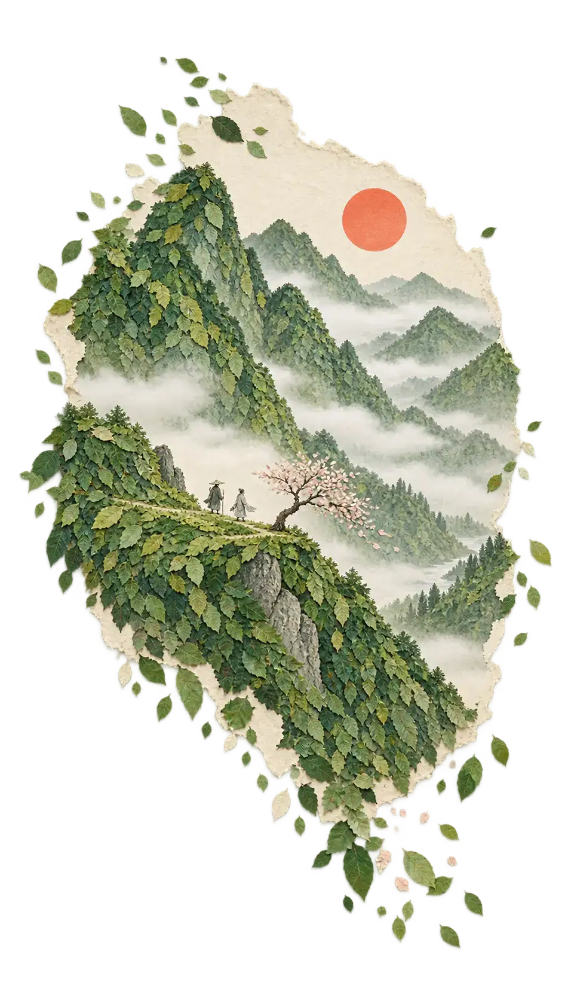](assets/p72-spring-ridge-leaf-collage-slice/source-example-01.webp)

#### 👇 Workflow

`Text → transparent leaf-collage scene slice`

#### 🔖 Full Prompt

```text
An Eastern-minimal illustration forming one irregularly shaped scene slice floating free with no background at all: the area surrounding the slice is completely transparent (alpha = 0) - not white, not colored, no surface, no checkerboard pattern. The slice holds one small complete spring scene: layered mountain ridges rendered as dense collages of thousands of tiny individual leaves in fresh greens, a creamy paper ground inside the slice carrying calm negative space, two miniature ink-drawn figures walking the ridge line beside a single small tree, a flat coral sun disc placed high, and soft mist bands drifting between the ridges. At its boundary the artwork ends the way the collage runs out: leaf fragments thin out and scatter, the paper edge turns ragged, and small clusters of leaves trail into the transparency, so the artwork looks finished at its heart and unfinished at its rim.

The slice sits fully intact with clear transparent margin on every side; the transparency extends uniformly to all four borders of the canvas. Soft even light with delicate leaf relief only within the slice. No text appears anywhere - all surfaces that would carry writing are blank. 9:16 vertical portrait composition.
```

<sub>(by [@rafael_nascimento](https://alosem.com/i/spring-ridge-walk-leaf-collage-slice-1d5e0d44)) · [Source: Alosem](https://alosem.com/i/spring-ridge-walk-leaf-collage-slice-1d5e0d44)</sub>

<a id="p73-pressed-flower-wren-cutout"></a>

### 📌 4.19. Pressed-Flower Wren Cutout

#### 👀 Preview

[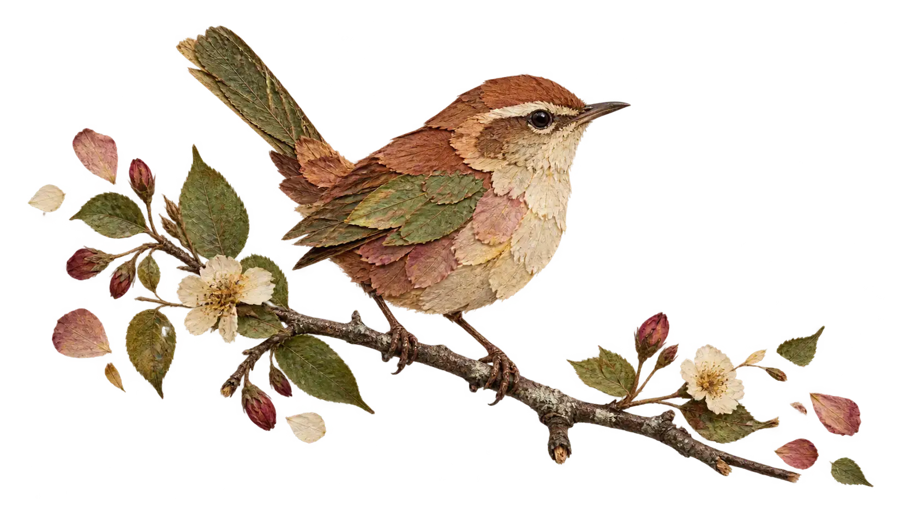](assets/p73-pressed-flower-wren-cutout/source-example-01.webp)

#### 👇 Workflow

`Text → transparent pressed-flower wren cutout`

#### 🔖 Full Prompt

```text
A pressed-flower collage artwork (oshibana) forming one irregularly shaped scene slice floating free with no background at all: the area surrounding the slice is completely transparent (alpha = 0) - not white, not colored, no surface, no checkerboard pattern. The slice holds one small complete scene composed entirely from real pressed flowers, petals, leaves, and stems: a small wren perched on a slender real pressed twig, its body built from layered rust, ochre, and dusty-rose petals with a cream petal breast, moss-green leaf pieces for wing and tail, and a tiny dried-grass eye-line, the twig textured with natural bark irregularity. Every element keeps the honest character of pressed botanicals - natural irregular petal edges, fine veining, delicate layered lift. At its boundary the piece ends the way pressed arrangements end: a few loose petals, tiny leaf fragments, and one small dried blossom scatter onto the transparency, so the artwork looks finished at its heart and unfinished at its rim.

The slice sits fully intact with clear transparent margin on every side; the transparency extends uniformly to all four borders of the canvas. Soft even light with delicate dimensional petal shadows only within the slice. No text appears anywhere. 16:9 wide composition.
```

<sub>(by [@rafael_nascimento](https://alosem.com/i/pressed-flower-wren-on-twig-slice-4712aff7)) · [Source: Alosem](https://alosem.com/i/pressed-flower-wren-on-twig-slice-4712aff7)</sub>

<a id="p74-colossal-squid-harbor-poster"></a>

### 📌 4.20. Colossal Squid Harbor Poster

#### 👀 Preview

[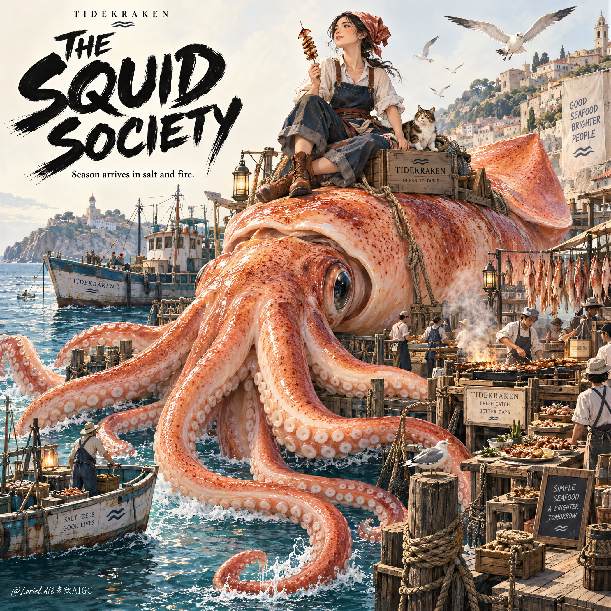](assets/p74-colossal-squid-harbor-poster/source-example-01.jpg)

#### 👇 Workflow

`Composition reference + text → illustrated squid harbor poster`

#### 🔖 Full Prompt

```text
Create a premium illustrated seafood advertising poster for a fictional coastal gourmet brand named TIDEKRAKEN, refined into a more elevated, more luxurious Orbit-plus-Transit direction. Design it as a single vertically composed commercial poster where a colossal fresh squid is the absolute hero ingredient, dominating the frame with sculptural elegance, while a curated micro-world of harbor life unfolds across its body, tentacles, docks, and surrounding water. Preserve the core structural brilliance of the reference as visual logic only: a monumental central squid, a seated adult female mascot on top, a bold title area in the upper-left, and richly layered miniature scenes distributed with disciplined rhythm around the product. The result must feel less like a cute festival cartoon and more like a globally awarded illustrated gourmet campaign: sophisticated, collectible, witty, and highly art-directed.

The squid is the central product icon and must feel irresistibly premium. Render it in a refined editorial illustration style with exquisite marine texture: warm coral-peach flesh, subtle paprika speckling, moist surface highlights, fleshy tentacle weight, elegant suction cup structure, clean natural anatomy, and a grand sculptural silhouette that reads instantly from afar. It is not grotesque, not comic-horror, and not chaotic; it is a majestic ingredient transformed into a monumental gourmet landscape. Every micro-scene on and around the squid must reinforce its desirability as the star ingredient.

The world built around the squid should be more curated and selective than before. Miniature harbor scenes still exist, but with stronger hierarchy and more breathing room: a few refined dock platforms, elegant seafood grilling stations, tasting tables, small fishing boats, hanging catch lines, and tiny market figures arranged with intentional spacing. Reduce low-value noise. Let the finest scenes feel like editorial vignettes rather than random crowd clutter. The lower tentacles should create graceful sweeping arcs that guide the eye through the poster like calligraphic strokes, supporting premium flow and graphic rhythm.

At the top of the squid sits an adult woman illustrated in a polished coastal editorial style, calm and inviting rather than overly playful. She wears a refined workwear-inspired outfit: headscarf, rolled sleeves, apron elements, relaxed trousers, and warm-toned footwear, all simplified into elegant shape language. She holds a squid skewer as a symbolic product cue. Her figure must be clearly adult, proportionally correct for an illustration, with balanced shoulders, natural seated weight, readable hands, five fingers when visible, and a poised posture. She acts as a brand ambassador, but she must remain secondary to the squid.

The environment should feel like a high-end harbor-food universe rather than a noisy fairground. Use pale open background space in the upper field to preserve poster sophistication. Around the lower half, integrate selective sea zones, weathered fishing boats, quiet gulls, rope textures, floating platforms, and a few smoke plumes from grills. Keep the micro-scenery rich but elegant, with better visual editing and more negative space than a dense children’s illustration. Think gourmet seasonal poster, not comic chaos.

Color hierarchy: 50% warm squid coral, shell pink, sea-salt peach, and grilled paprika tones; 20% marine blue, harbor teal, and muted weathered navy; 20% parchment white, mineral cream, and sun-faded neutral space; 10% charcoal ink linework, muted rust details, and typography. Use crisp linework, subtle gouache-watercolor fill behavior, restrained texture, and premium print clarity. The rendering should feel handcrafted and intelligent, with clean contour discipline and refined color separation. Make the palette slightly dustier, more elegant, and more internationally editorial.

Typography must be bolder in authority but more sophisticated in finish. In the upper-left, create a large custom black brush-lettered title block with stronger luxury poster rhythm, such as "SQUID SOCIETY" or "THE SQUID TABLE", stacked with dynamic but controlled shape energy. Beneath it, place only one short supporting line, minimal and sharp, such as "Season arrives in salt and fire." Reduce all other slogan text. Use only a few tiny designed signs inside the miniature market world, and keep them sparse, clean, and intentional. Typography must feel like part of the poster’s graphic composition, not scattered novelty signage.

Material and food cues must be luxurious and appetizing: glossy grilled glaze, charred edges on skewers, weathered dock wood, moist sea reflections, rope fibers, painted boats, smoke ribbons from seafood grills, clean market crates, and elegant plating details. The squid must remain fresh, premium, and desirable at every scale. The entire poster should feel like a Cannes-winning gourmet campaign that turns one iconic ingredient into a complete seasonal universe.

Output goal: one finished illustrated poster, premium commercial quality, product-dominant hierarchy, refined micro-storytelling, controlled negative space, elegant coastal energy, strong silhouette readability, bold collectible title design, and world-class poster finish.

Exclusion and quality constraints: no horror squid, no gore, no rotten seafood, no muddy textures, no low-end cartoon look, no chaotic crowd clutter, no deformed tentacles, no broken suction cups, no anatomy collapse, no childlike mascot proportions, no malformed hands, no extra fingers, no missing fingers, no fused fingers, no unreadable text, no random letters, no cheap festival flyer aesthetic, no style drift, no AI slop, no real brand names, no real person names.
```

<sub>(by [@ou_zhen599](https://x.com/ou_zhen599/status/2101586769250783463)) · [Source: X](https://x.com/ou_zhen599/status/2101586769250783463)</sub>

<a id="p76-avelora-coastal-bridge-car-poster"></a>

### 📌 4.21. Avelora Coastal Bridge Car Poster

#### 👀 Preview

[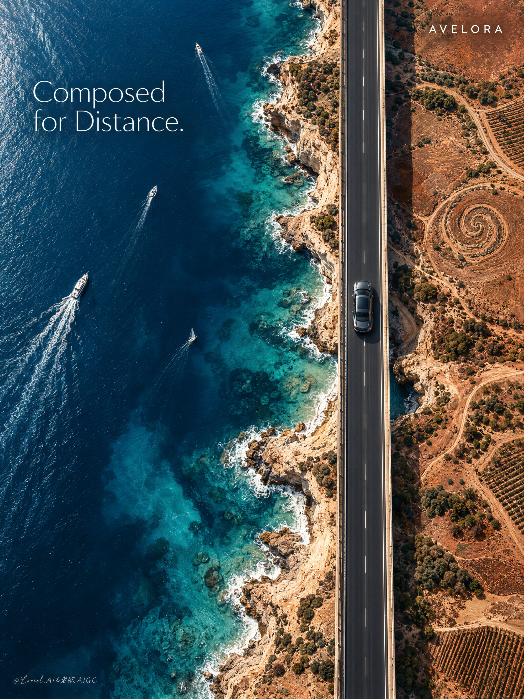](assets/p76-avelora-coastal-bridge-car-poster/source-example-01.jpg)

#### 👇 Workflow

`Composition reference + text → aerial car poster`

#### 🔖 Full Prompt

```text
Create a premium automotive art-poster campaign for a fictional luxury grand touring brand named AVELORA, designed as a single vertical aerial composition with a monumental top-down perspective. Preserve the structural intelligence of the reference as pure visual architecture: a vast field of luminous coastal water on the left, a sun-scorched earthmass on the right, and a severe linear bridge running vertically near the right side of frame. The real hero product is a graphite metallic grand touring sedan traveling along the bridge, visually small yet compositionally dominant through placement, contrast, and the disciplined emptiness around it. The final image must feel more artistic, more elevated, and more like a museum-grade international advertising poster than a conventional car campaign.

The concept is that motion has carved a silent score into the landscape. The sea, coastline, agricultural geometry, shoreline curvature, wake lines, and land traces must imply rhythm, resonance, and orchestral order without becoming illustrative or literal. The image should feel like geography composed into music. The bridge reads like a single decisive line across a living canvas, and the car reads like the only note that matters.

On the left, the sea must be deep, mineral, and painterly in a photoreal way: saturated but elegant Mediterranean blue, teal depth shifts, pale wave edges, and elongated white wake trails from a few distant boats that feel like gestural strokes across the surface. On the right, the land must be dry, textural, and sculptural: terracotta fields, oxidized ochre soil, dusty umber, pale sand pockets, and one subtle spiral or calligraphic land trace embedded into the terrain as if the earth itself remembers movement. The coastline should feel naturally cut, irregular, and beautiful, with white shore foam and believable erosion lines. Every macro-shape must feel designed, but never artificial.

The car is a real premium sedan, highly photoreal and precisely engineered: low and elegant body line, dark panoramic roof glass, subtle metallic reflections, crisp window trim, refined wheel design, realistic tire contact, and a calm sense of speed rather than aggressive motion blur. The vehicle must remain legible despite its scale, through controlled road contrast, precise shadow, and exact positioning on the bridge. The bridge surface is immaculate dark asphalt with thin pale lane markings, engineered edges, and minimal structural interruption, rendered as a pure modernist line slicing through sea and land.

Color hierarchy: 55% luminous deep blue and teal water, 25% warm copper, rust, terracotta, and mineral earth, 10% charcoal bridge and graphite car, 10% soft white wake lines and typography. Lighting is high aerial daylight but refined into fine-art tonality: crisp coastal sun, sculpted texture in water and soil, exact white foam edges, very subtle atmospheric diffusion, and strong micro-contrast without harsh over-sharpening. The image must feel clean, expensive, breathable, and globally premium.

Typography must be fewer, colder, and more refined than before. Use only two text elements total. In the upper-left open water area, place one elegant headline: "Composed for Distance." Set in a modern refined sans-serif or restrained high-fashion serif-sans blend, bright white, carefully kerned, with quiet authority. In the upper-right, use a minimal brand block only: "AVELORA". No extra descriptors, no website, no explanatory copy, no information clutter. The typography should feel like a gallery-grade editorial intervention, suspended in the negative space, never competing with the landscape or the car.

Material semantics must be explicit and elevated: mineral-rich water depth, chalky coastline, dry agricultural soil, engineered asphalt, metallic automotive paint, reflective glass, subtle undercar shadow, and fine aerial photographic texture. The entire composition must read as a product-led luxury campaign where the car transforms the landscape into an emotional instrument of movement.

Rendering target: photoreal luxury automotive campaign, aerial fine-art realism, conceptually intelligent composition, premium editorial poster finish, clean negative space, restrained typography, world-class print quality, and seamless harmony between engineering, terrain, and visual poetry.

Structured exclusion constraints: no real car brands, no copied slogans, no garbled typography, no unreadable text, no extra vehicles cluttering the bridge, no low-resolution car, no distorted coastline, no cartoon music symbols, no warped bridge geometry, no muddy water, no dirty haze, no cheap tourism poster look, no oversaturated travel aesthetic, no style drift, no AI artifacts, no duplicate boats, no visual clutter.
```

<sub>(by [@ou_zhen599](https://x.com/ou_zhen599/status/2101556753762586720)) · [Source: X](https://x.com/ou_zhen599/status/2101556753762586720)</sub>

<a id="p82-culinary-vapor-monument-poster"></a>

### 📌 4.22. Culinary Vapor Monument Poster

#### 👀 Preview

[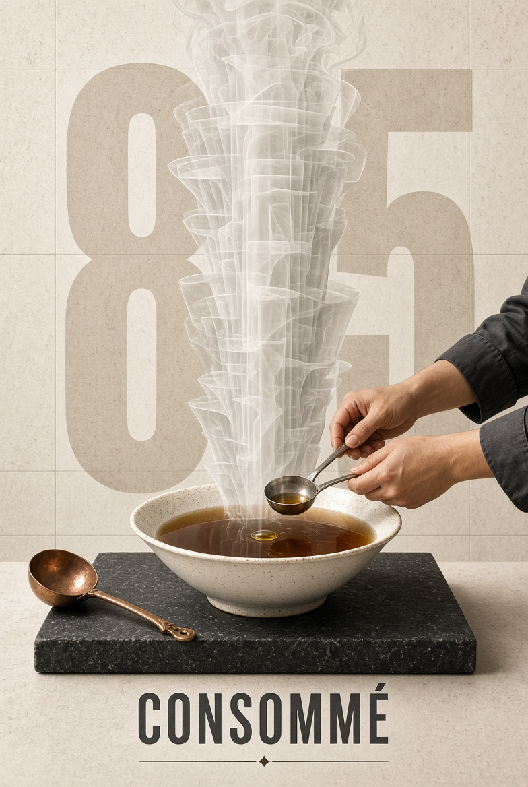](assets/p82-culinary-vapor-monument-poster/source-example-01.jpg)

[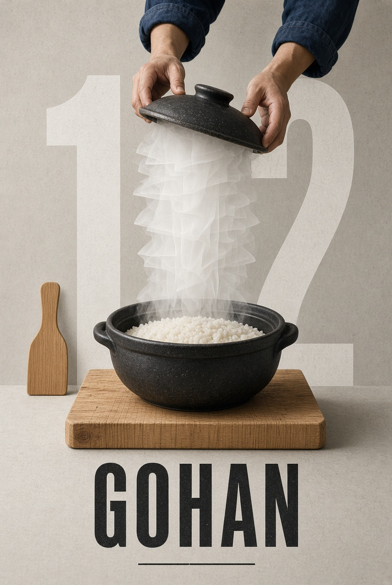](assets/p82-culinary-vapor-monument-poster/source-example-02.jpg)

#### 👇 Workflow

`Dish variables → culinary vapor poster`

#### 🔖 Full Prompt

```text
Vertical culinary monument poster. A single [DISH] is plated on [SURFACE] and centered under a tall rising column of [VAPOR] that becomes the main graphic structure of the image. The vapor is architectural: stacked translucent planes, not fluffy cartoon steam. [HUMAN] appears only as hands and forearms entering from [ENTRY], wearing [SLEEVES], performing [ACTION]. Background is a flattened [KITCHEN PLANE] with one useful object: [UTENSIL]. Palette: [PALETTE]. Oversized numeral “[NUMBER]” behind the vapor. Dish name “[DISH NAME]” in tight condensed type at the foot. Heat, measure, stillness. 4:5
```

<sub>(by [@miratechtool](https://x.com/miratechtool/status/2101560392589758614)) · [Source: X](https://x.com/miratechtool/status/2101560392589758614)</sub>

<a id="p90-photo-to-illustration-editorial-poster"></a>

### 📌 4.23. Photo-to-Illustration Editorial Poster

#### 👀 Preview

[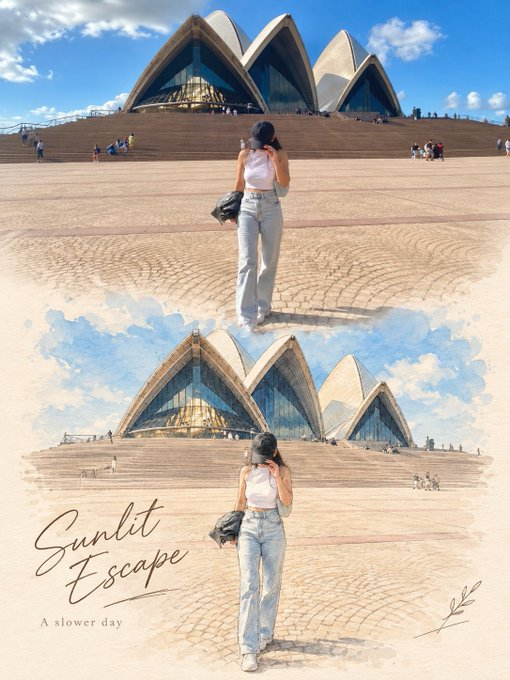](assets/p90-photo-to-illustration-editorial-poster/source-example-01.jpg)

[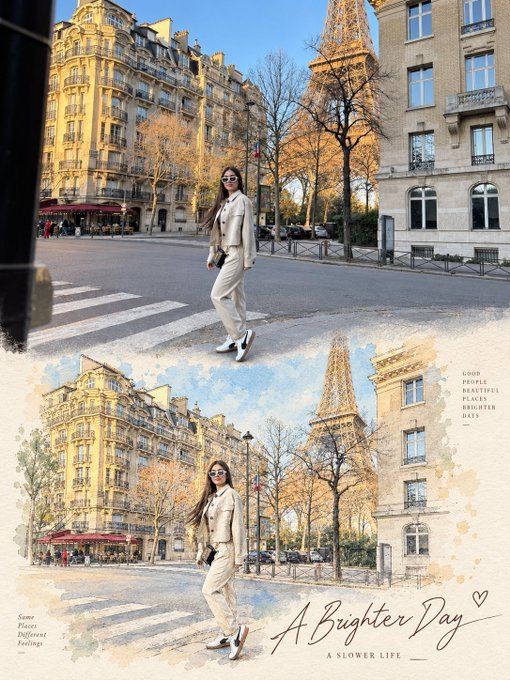](assets/p90-photo-to-illustration-editorial-poster/source-example-02.jpg)

#### 👇 Workflow

`Photo reference → photo-and-illustration editorial poster`

#### 🔖 Full Prompt

```text
Use the uploaded image as the exact reference. Preserve the original subjects, identities, poses, composition, colors, lighting, background, and key details. Do not add, remove, or rearrange major elements.

Create a vertical 3:4 editorial poster with two sections:

- Top half: keep the original photo natural, sharp, and essentially unchanged.
- Bottom half: recreate the exact same scene as a refined hand-drawn illustration in soft watercolor, colored pencil, and fine ink sketch style.

Keep the same subjects, positions, perspective, and recognizable details. Use soft pastel tones, a warm off-white paper background, subtle paper texture, and a premium editorial / art-book / postcard feel. Add a soft seamless transition between the photo and illustration.

Add minimal elegant typography: a handwritten-style title and a small simple subtitle. Use context-appropriate text such as “A Brighter Day” and “A Slower Life”, or for pets/family “Good Friends”, “Brighter Days”, or “Happier Tails ♡”.

Optional: add a few subtle hand-drawn decorative details like tiny petals, leaves, hearts, or sketch marks only if they naturally fit.

Do not change identities or the scene, and do not make the lower section look like photorealism, 3D, anime, or cartoon.
```

<sub>(by [@miratechtool](https://x.com/miratechtool/status/2102656456478589340)) · [Source: X](https://x.com/miratechtool/status/2102656456478589340)</sub>

<a id="p91-cinematic-paper-memory-poster"></a>

### 📌 4.24. Cinematic Paper Memory Poster

#### 👀 Preview

[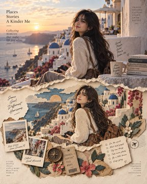](assets/p91-cinematic-paper-memory-poster/source-example-01.jpg)

[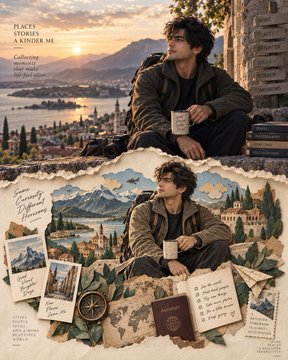](assets/p91-cinematic-paper-memory-poster/source-example-02.jpg)

#### 👇 Workflow

`Text → cinematic portrait and layered paper-memory poster`

#### 🔖 Full Prompt

```text
Create a premium 4:5 editorial art poster featuring an original character and a visually rich personal story.

The upper section should be a highly realistic cinematic portrait of the character in a natural environment connected to their story. Give the character a distinctive appearance, authentic expression, realistic skin texture, believable clothing, and carefully composed environmental details. The scene should feel like a frame from a sophisticated travel or lifestyle magazine.

Gradually transform the lower section of the same composition into an intricate handcrafted layered paper-cut artwork. Reinterpret the character, surroundings, landmarks, objects, and small narrative elements entirely through cut and sculpted paper. Use stacked paper layers, finely cut silhouettes, subtle embossing, folded and torn edges, tactile fibers, miniature details, and realistic depth created by delicate shadows.

Let the paper artwork visually continue elements from the photograph above, almost as if the real world is unfolding into a miniature handmade world. Include visual motifs connected to the character’s city, profession, passion, travels, or personal journey rather than simply copying the photographic scene.

Use a sophisticated palette of warm ivory, parchment, muted earth tones, dusty neutrals, and restrained accent colors, with visible paper grain and handcrafted imperfections. Add elegant editorial typography with a refined serif typeface, a short fictional name or title, and minimal supporting text.

Composition: sophisticated magazine cover aesthetic, strong visual hierarchy, generous negative space, balanced symmetry, premium art direction, subtle cinematic lighting, tactile realism, museum-quality paper craftsmanship.

The key visual idea is: a real cinematic moment evolving into a handcrafted paper memory.

No reference image, no existing celebrity likeness, no copied composition. Create the character, environment, and narrative from scratch while maintaining a polished, recognizable visual identity throughout.
```

<sub>(by [@j_smeaton99](https://x.com/j_smeaton99/status/2102653995919487110)) · [Source: X](https://x.com/j_smeaton99/status/2102653995919487110)</sub>

<a id="p93-collectible-souvenir-box-travel-posters"></a>

### 📌 4.25. Collectible Souvenir Box Travel Posters

#### 👀 Preview

[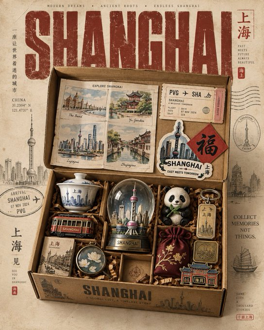](assets/p93-collectible-souvenir-box-travel-posters/source-example-01.jpg)

[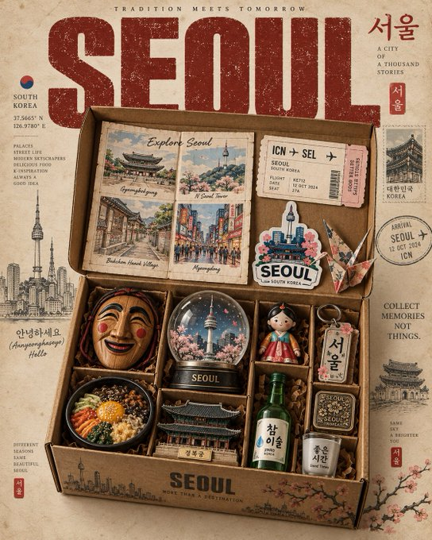](assets/p93-collectible-souvenir-box-travel-posters/source-example-02.jpg)

[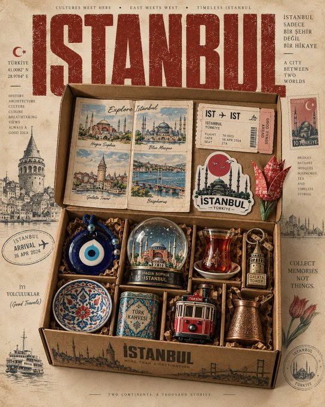](assets/p93-collectible-souvenir-box-travel-posters/source-example-03.jpg)

[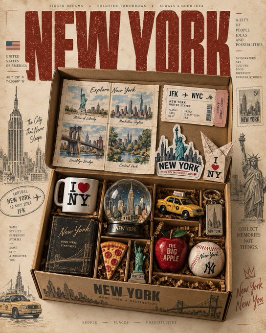](assets/p93-collectible-souvenir-box-travel-posters/source-example-04.jpg)

#### 👇 Workflow

`Country variable → collectible souvenir-box travel poster`

#### 🔖 Full Prompt

```text
Create a premium 4:5 vertical Instagram travel poster for [COUNTRY], designed as part of a cohesive collectible “Souvenir Box” series.

Show an open vintage cardboard travel box containing exactly 10 culturally authentic souvenirs from [COUNTRY]: 1 hero object, 2–3 supporting objects, and additional smaller keepsakes. Choose objects with varied materials, sizes, shapes, and cultural significance.

Include exactly 4 paper elements:

- A folded illustrated map showing 4 different destinations
- A perforated vintage travel ticket
- A die-cut [COUNTRY] destination sticker
- One culturally appropriate paper-craft element

Use a warm textured-paper background with subtle fibers and imperfections. Place huge distressed condensed “[COUNTRY]” typography behind the box.

Develop a unique color palette inspired by the country's landscape, architecture, traditional crafts, and culture, using a dominant tone, secondary tone, warm neutral, accent, and dark text color.

Style

Premium tactile 3D collectible illustration + vintage international travel poster + editorial magazine cover + nostalgic packaging design. Use soft studio lighting, realistic contact shadows, subtle ambient occlusion, material grain, paper texture, and handmade imperfections. Keep it sophisticated and tactile rather than glossy CGI.

Add restrained travel ephemera: 4–7 stamps/badges/labels, an arrival mark, postage details, route arrows, coordinates, small travel metadata, a culturally appropriate local-language phrase, and:

“COLLECT MEMORIES NOT THINGS.”

Maintain a clear hierarchy:

COUNTRY title → hero souvenir → supporting objects → remaining keepsakes → graphic details.

Use strong negative space, balanced composition, rich but controlled detail, and excellent thumbnail readability.

Every country must receive a fresh, original composition based on its own cultural identity. Never copy another reference's layout, objects, typography arrangement, or visual composition.
```

<sub>(by [@Goodmanprotocol](https://x.com/Goodmanprotocol/status/2102630540293837041)) · [Source: X](https://x.com/Goodmanprotocol/status/2102630540293837041)</sub>

<a id="p99-photo-to-expressive-oil-painting"></a>

### 📌 4.26. Photo-to-Expressive Oil Painting

#### 👀 Preview

**Reference 1**

[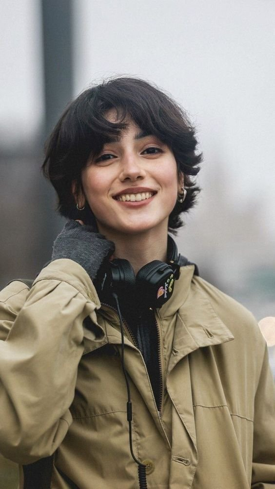](assets/p99-photo-to-expressive-oil-painting/source-example-01.jpg)

**Painted result 1**

[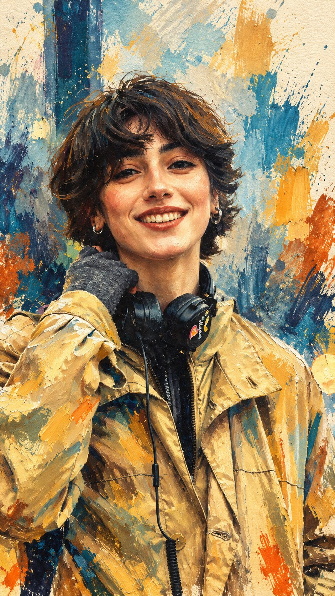](assets/p99-photo-to-expressive-oil-painting/source-example-02.jpg)

**Reference 2**

[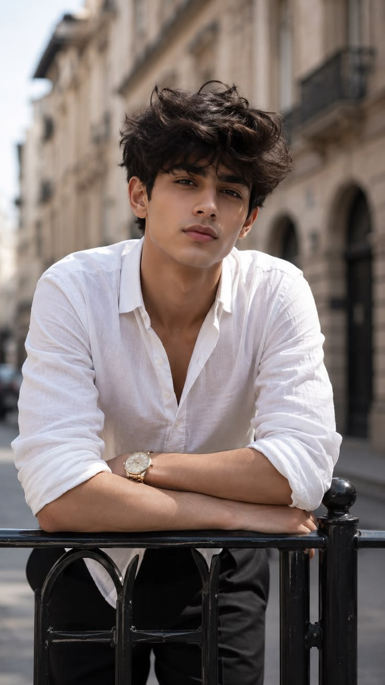](assets/p99-photo-to-expressive-oil-painting/source-example-03.jpg)

**Painted result 2**

[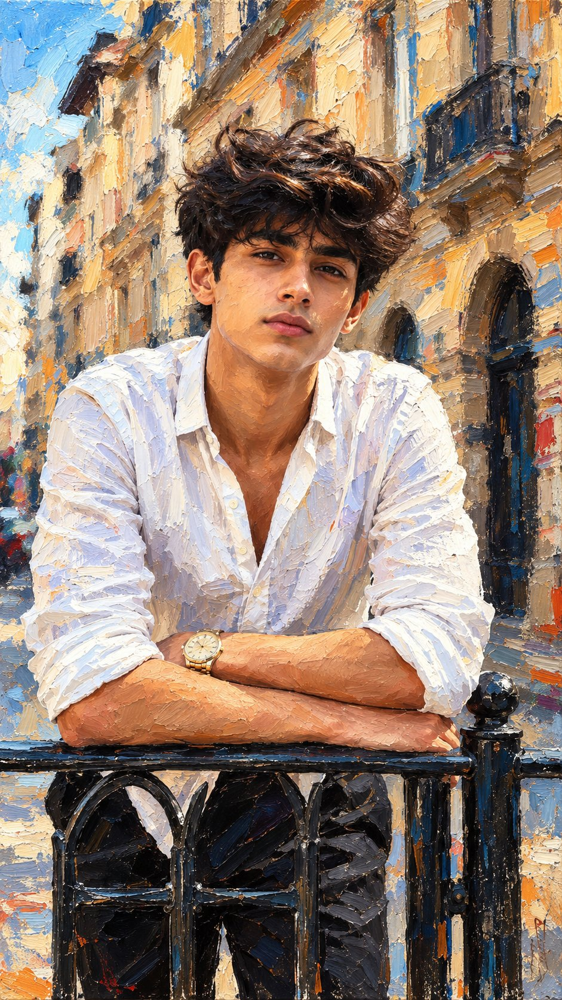](assets/p99-photo-to-expressive-oil-painting/source-example-04.jpg)

#### 👇 Workflow

`Photo reference → expressive oil-and-gouache painting`

#### 🔖 Full Prompt

```text
Use the uploaded real photograph as the absolute source image. Transform the entire photograph into a sophisticated, highly detailed full fine-art painting while preserving the exact identity and visual structure of the original image.

The result must clearly remain the same person, same face, same facial features, same facial proportions, same hairstyle, same pose, same body proportions, same clothing, same hand position, same expression, same camera angle, same framing, same background composition, and same overall scene. Do not redesign or reinterpret the subject's identity, anatomy, pose, or composition.

IMPORTANT: This is a transformation of the uploaded real photograph into a painting, NOT a new image generation. Every visible element from the original photograph should be retained and converted into painted form.

Transform the entire image into a bold contemporary expressive oil-and-gouache fine-art painting with an authentic handcrafted appearance. Replace the photographic surface completely with rich physical paint. Use thick visible brushstrokes, expressive impasto, palette-knife marks, layered pigments, dry-brush textures, painterly edges, subtle paint buildup, and visible canvas texture.

Preserve the person's face with high accuracy. Facial identity must remain recognizable and consistent with the source photograph. Carefully retain the exact eyes, eye spacing, eyebrows, nose shape, lips, jawline, cheek structure, skin tone, facial proportions, hairstyle and expression. Render the face with refined painterly detail while allowing visible brushwork and natural paint texture.

Transform the hair completely into expressive painted strokes while maintaining the original hairstyle, volume, direction, length, and shape. Use a mixture of fine individual brush marks and larger energetic strokes to create realistic yet artistic hair texture.

Transform the clothing completely into painted fabric while preserving its exact design, colors, folds, seams, logos or symbols, proportions, and position from the original photograph. Use thick layered paint and expressive strokes to describe the fabric and folds without changing the clothing itself.

Transform the hands and fingers into anatomically accurate painted forms while preserving their exact position, gesture, proportions, skin tone, and relationship to the face.

Transform the entire background into the same scene rendered as physical artwork. Preserve the original objects, colors, shapes, perspective, lighting direction, and composition, but reinterpret their surfaces through expressive paint. Do not replace the background with a different environment.

Use a rich contemporary palette with deep cobalt blue, vivid golden yellow, warm orange, red, turquoise, cream, earthy brown, and natural skin tones, matching the colors already present in the source image. Allow colors to overlap naturally through visible brushwork.

The painting should feel like a hand-painted gallery artwork created with oil paint, gouache, and palette knives on textured canvas, combining realistic figurative painting with energetic modern expressionism.

Surface and brushwork: thick impasto, tactile paint, visible bristle marks, palette-knife strokes, dry-brush details, layered translucent washes, broken color, rough painted edges, natural pigment variation, canvas grain, subtle imperfections, handcrafted physical artwork.

Lighting: preserve the original photograph's lighting and shadows, translating them into painted highlights, midtones, and shadows rather than changing the lighting setup.

Composition: preserve the exact original composition, framing, camera perspective, subject placement, proportions, and aspect ratio. Do not crop, zoom, rotate, extend, or rearrange the image.
```

<sub>(by [@harboriis](https://x.com/harboriis/status/2103015777360392379)) · [Source: X](https://x.com/harboriis/status/2103015777360392379)</sub>

<a id="p100-split-photo-and-hand-painted-editorial-poster"></a>

### 📌 4.27. Split Photo and Hand-Painted Editorial Poster

#### 👀 Preview

[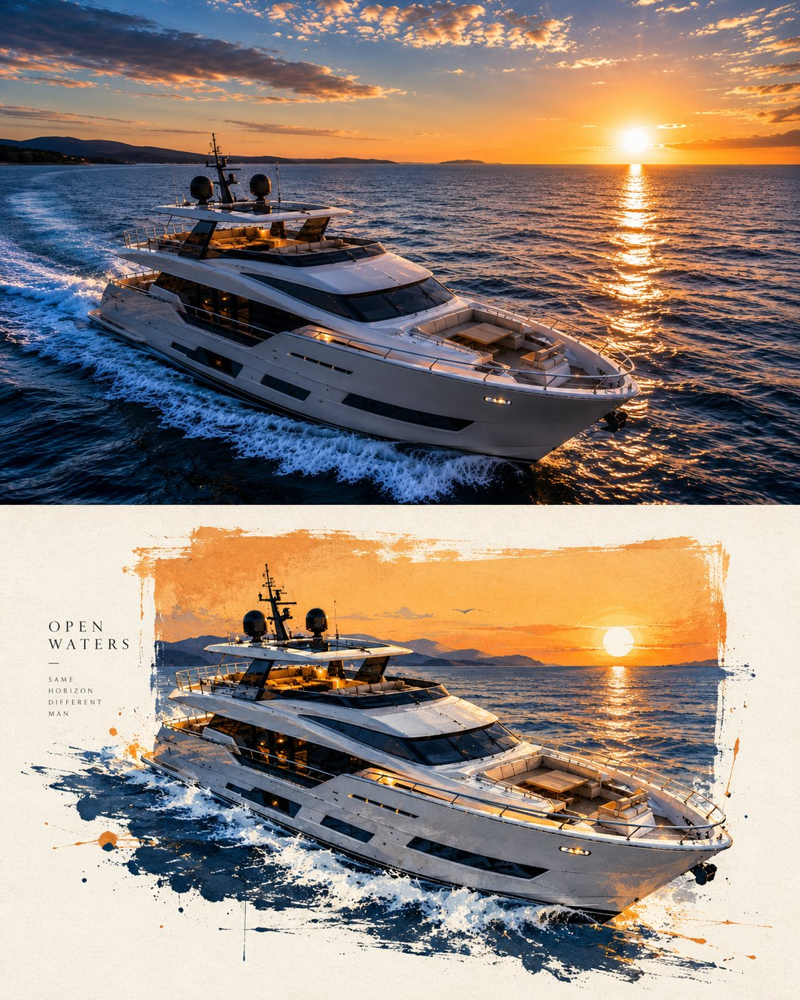](assets/p100-split-photo-and-hand-painted-editorial-poster/source-example-01.jpg)

[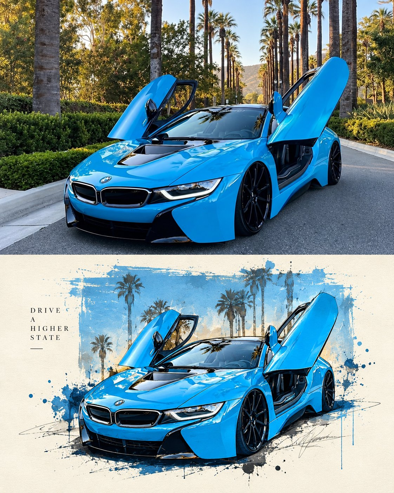](assets/p100-split-photo-and-hand-painted-editorial-poster/source-example-02.jpg)

#### 👇 Workflow

`Photo reference → split photo-and-painted editorial poster`

#### 🔖 Full Prompt

```text
Create a separate high-end poster for each uploaded photo, never combining multiple images. Use a 4:5 vertical format, divided into two equal sections: 50% upper and 50% lower.

UPPER HALF — ORIGINAL PHOTO
Preserve the subject’s identity, proportions, posture, structure, texture, lighting, and natural atmosphere. Apply only subtle premium color grading inspired by art magazines and gallery photography. Expand the background naturally if needed, but never distort or alter the subject.

LOWER HALF — ARTISTIC RECONSTRUCTION
Reinterpret the image using only its most recognizable elements—subject, silhouette, posture, structure, movement, and key visual relationships. Remove most of the original background and unnecessary details. Use cropping, simplification, scaling, repositioning, and negative space to create a stronger artistic composition while keeping the connection to the original photo immediately recognizable.

Place the reconstruction on a warm white/off-white paper background with an irregular rectangular hand-painted color field. Keep generous white margins around it, with subtle brush marks, smudges, imperfect edges, and uneven paint texture. Allow a few important lines, shapes, leaves, or details to break outside the color field for a refined break-the-frame effect.

Use strong negative space and avoid filling the composition. The subject can be centered, offset, cropped, suspended, or edge-aligned depending on its natural visual direction.

The lower artwork should feel hand-drawn and editorial, using simplified color blocks, selective outlines, minimal details, and moderate abstraction rather than realism. Extract 2–4 memorable colors from the original photo and build a cohesive, bright yet restrained palette.

Add only minimal editorial typography when appropriate—short words or phrases inspired by the subject, location, action, or emotion, placed subtly within the negative space.

Overall, create a premium contemporary art-magazine/gallery aesthetic focused on negative space, handmade color fields, artistic reduction, break-the-frame composition, and visual storytelling. Avoid clutter, excessive background details, literal duplication, stiff layouts, hard edges, and template-like designs. Less is more.
```

<sub>(by [@Goodmanprotocol](https://x.com/Goodmanprotocol/status/2102996979005743175)) · [Source: X](https://x.com/Goodmanprotocol/status/2102996979005743175)</sub>

<a id="p102-surreal-seaside-clock-still-life"></a>

### 📌 4.28. Surreal Seaside Clock Still Life

#### 👀 Preview

[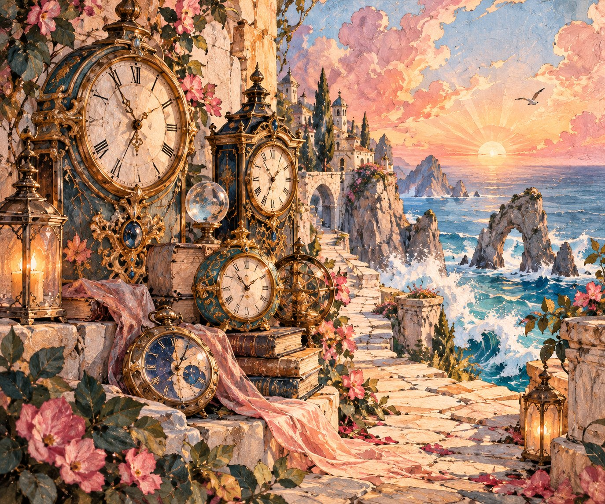](assets/p102-surreal-seaside-clock-still-life/source-example-01.jpg)

#### 👇 Workflow

`Text → surreal seaside clock still life`

#### 🔖 Full Prompt

```text
Create a set of ornate clocks arranged like a surreal still life on a bright seaside path above exaggerated surf and decorative rock shapes. Use a warm sunrise palette without making the image overly golden. Build in a sense of visual spellcraft through luminous details and impossible beauty. Blend stylized sketch artwork with acrylic painting, combining expressive drawn lines, visible hand-work and lightly rough artistic texture with bold painted surfaces, crisp brushwork and strong color structure, using a color story built around soft candy color. Let foreground details partially frame the main idea without turning into a border. Keep it clearly stylized and illustrative, with no readable text.
```

<sub>(by [@CliffWade](https://x.com/CliffWade/status/2102771495495688586)) · [Source: X](https://x.com/CliffWade/status/2102771495495688586)</sub>

## 🏡 Home & Interior Design

<a id="p42-bedroom-redesign-from-your-photo"></a>

### 📌 5.1. Bedroom Redesign from Your Photo

#### 👀 Preview

| Before | After |
|---|---|
| [](assets/p42-bedroom-redesign/reference.png) | [](assets/p42-bedroom-redesign/result.png) |

#### 👇 Workflow

`Bedroom photo → redesigned bedroom`

#### 🔖 Full Prompt

```text
Redesign this ordinary bedroom into a more stylish, cohesive, and professionally decorated interior while preserving the original room structure, layout, window position, bed placement, and overall perspective. Transform it into a warm, modern, inviting bedroom with improved furniture styling, layered bedding, refined color coordination, tasteful wall art, soft textiles, subtle decor accents, and better visual balance. Add a more polished interior-design feel with realistic materials, clean organization, elegant lighting, and a cozy lived-in atmosphere. Keep the result realistic and believable, like a real home makeover photo, not CGI. Maintain natural proportions and realistic lighting, and make the room look significantly upgraded while still clearly based on the original image.
```

<sub>(by SeeAPI)</sub>

## 📊 Infographics & Practical Design

<a id="p30-spanish-infographic-translation"></a>

### 📌 6.1. Spanish Infographic Translation

#### 👀 Preview

[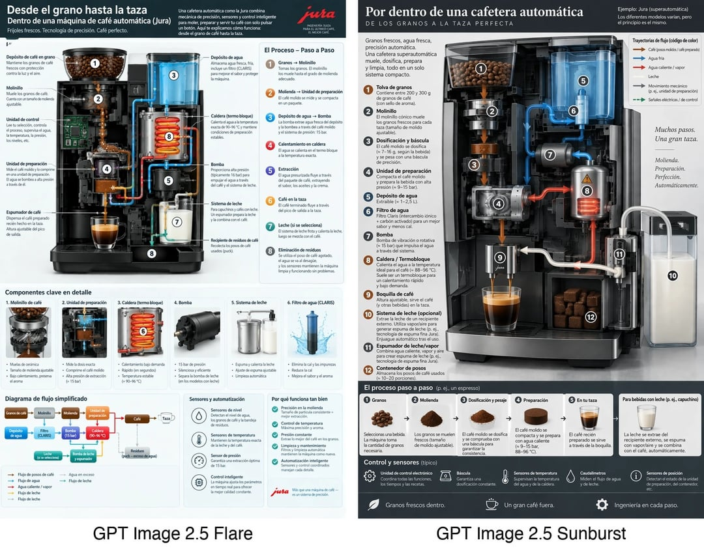](assets/p30-spanish-infographic-translation/source-example-01.jpg)

#### 👇 Workflow

`Infographic reference → Spanish infographic`

#### 🔖 Full Prompt

```text
Translate the text in the infographic to Spanish. Do not change any other aspect of the image.
```

<sub>[Source: Reddit](https://www.reddit.com/r/ChatGPT/comments/1wcj1ud/gpt_image_25_prompt_guide_2026_23_9_official_edit/)</sub>

<a id="p26-ornate-award-certificate"></a>

### 📌 6.2. Ornate Award Certificate

#### 👀 Preview

[](assets/p26-ornate-award-certificate/source-example-01.webp)

#### 👇 Workflow

`Text → image`

#### 🔖 Full Prompt

```text
An award certificate, ornate border, name and date in calligraphic script
```

<sub>(Collected from [SeeAPI](https://www.aiimage.net/prompts/)) · [Source: SeeAPI](https://www.aiimage.net/prompts/)</sub>

<a id="p24-boarding-pass-layout"></a>

### 📌 6.3. Boarding Pass Layout

#### 👀 Preview

[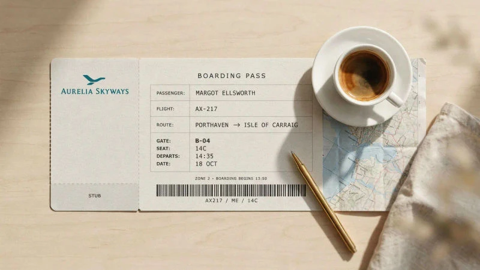](assets/p24-boarding-pass-layout/source-example-01.webp)

#### 👇 Workflow

`Text → image`

#### 🔖 Full Prompt

```text
A boarding pass mockup, passenger, gate, seat and time legible in a clean grid
```

<sub>(Collected from [SeeAPI](https://www.aiimage.net/prompts/)) · [Source: SeeAPI](https://www.aiimage.net/prompts/)</sub>

<a id="p23-national-park-trail-map"></a>

### 📌 6.4. National Park Trail Map

#### 👀 Preview

[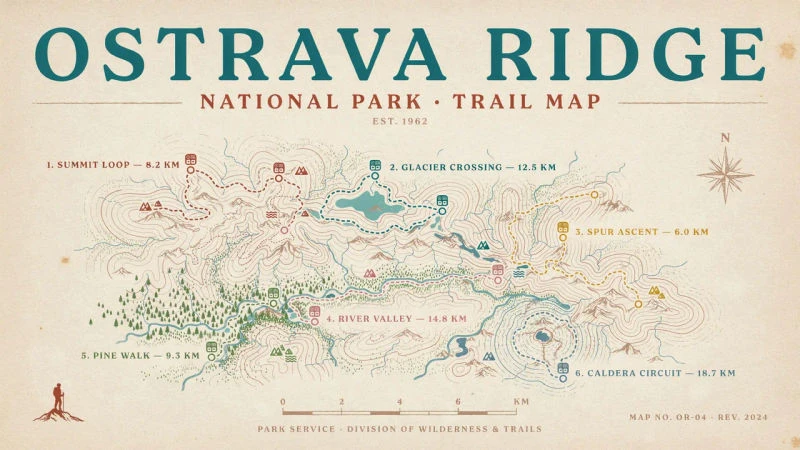](assets/p23-national-park-trail-map/source-example-01.webp)

#### 👇 Workflow

`Text → image`

#### 🔖 Full Prompt

```text
A national park trail map poster, six routes labelled with names and distances
```

<sub>(Collected from [SeeAPI](https://www.aiimage.net/prompts/)) · [Source: SeeAPI](https://www.aiimage.net/prompts/)</sub>

<a id="p20-cellular-respiration-classroom-diagram"></a>

### 📌 6.5. Cellular Respiration Classroom Diagram

#### 👀 Preview

[](assets/p20-cellular-respiration-classroom-diagram/source-example-01.webp)

#### 👇 Workflow

`Text → image`

#### 🔖 Full Prompt

```text
Create a simple biology diagram titled "Cellular Respiration at a Glance" for high school students.

Show how glucose turns into energy inside a cell. Include glycolysis, the Krebs cycle, and the electron transport chain. Use arrows to connect the steps, and label the main molecules: glucose, pyruvate, ATP, NADH, FADH2, CO2, O2, and H2O. Make it look like a clean classroom handout or slide, with a white background, simple icons, clear labels, and easy-to-read text.

Avoid tiny text, extra decoration, or anything that makes the diagram hard to understand.
```

<sub>[Source: Reddit](https://www.reddit.com/r/ChatGPT/comments/1wcatvx/gpt_image_25_prompt_guide_2026_13_8_rules_and_8/)</sub>

<a id="p19-farmers-market-mobile-app-mockup"></a>

### 📌 6.6. Farmers Market Mobile App Mockup

#### 👀 Preview

[](assets/p19-farmers-market-mobile-app-mockup/source-example-01.webp)

[](assets/p19-farmers-market-mobile-app-mockup/source-example-02.webp)

#### 👇 Workflow

`Text → image`

#### 🔖 Full Prompt

```text
Create a realistic mobile app UI mockup for a local farmers market.
Show today’s market with a simple header, a short list of vendors with small photos and categories, a small “Today’s specials” section, and basic information for location and hours.
Design it to be practical, and easy to use. White background, subtle natural accent colors, clear typography, and minimal decoration.
It should look like a real, well-designed, beautiful app for a small local market.
Place the UI mockup in an iPhone frame.
```

<sub>[Source: Reddit](https://www.reddit.com/r/ChatGPT/comments/1wcatvx/gpt_image_25_prompt_guide_2026_13_8_rules_and_8/)</sub>

<a id="p14-automatic-coffee-machine-infographic"></a>

### 📌 6.7. Automatic Coffee Machine Infographic

#### 👀 Preview

[](assets/p14-automatic-coffee-machine-infographic/source-example-01.webp)

[](assets/p14-automatic-coffee-machine-infographic/source-example-02.webp)

#### 👇 Workflow

`Text → image`

#### 🔖 Full Prompt

```text
Create a detailed Infographic of the functioning and flow of an automatic coffee machine like a Jura.
From bean basket, to grinding, to scale, water tank, boiler, etc.
I'd like to understand technically and visually the flow.
```

<sub>[Source: Reddit](https://www.reddit.com/r/ChatGPT/comments/1wcatvx/gpt_image_25_prompt_guide_2026_13_8_rules_and_8/)</sub>

<a id="p86-global-dish-ingredient-provenance-map"></a>

### 📌 6.8. Global Dish Ingredient Provenance Map

#### 👀 Preview

[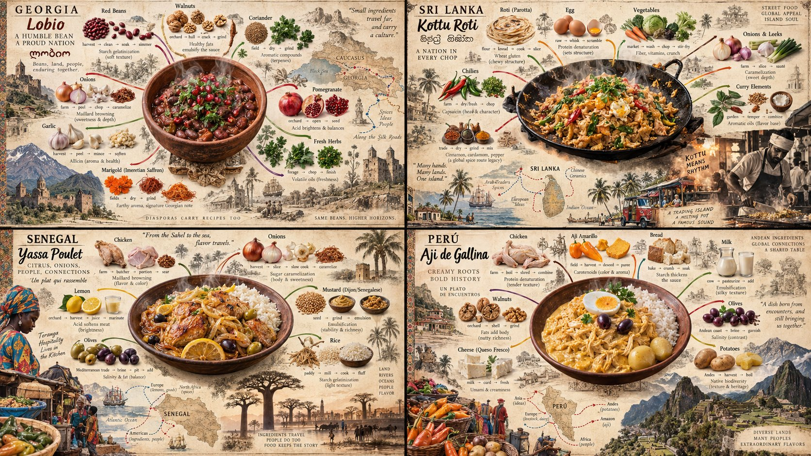](assets/p86-global-dish-ingredient-provenance-map/source-example-01.jpg)

#### 👇 Workflow

`Four dish variables → ingredient provenance map`

#### 🔖 Full Prompt

```text
16:9, $ DISH: [A, B, C, D, each a lesser known under rated dishes from various countries around the world] $ VIEW: "ingredient provenance network converging on final plating" $ MEDIUM: "gastronomic manuscript with supply-chain cartography" Gastronomic manuscript of [$DISH], presented as a convergence diagram where every ingredient's journey is traced from origin to plate. At the center floats the finished dish in exquisite photorealistic detail — steam rising, textures glistening, plated on period-appropriate serveware — rendered as a luminous focal point.   Radiating outward from the dish like spokes of a wheel, each ingredient traces a provenance line back to its source. A tomato's line flows through a market stall, a distribution warehouse, a farm field, to the specific cultivar's genetic origin in the Andes. A spice's line crosses ocean trade routes on a miniature age-of-sail map. Each line is rendered in the ingredient's characteristic color — saffron gold, basil green, chili red — and varies in thickness according to the ingredient's proportional importance in the recipe.
```

<sub>(by [@Gdgtify](https://x.com/Gdgtify/status/2101941248022249841)) · [Source: X](https://x.com/Gdgtify/status/2101941248022249841)</sub>

<a id="p87-voxel-brain-teaser-posters"></a>

### 📌 6.9. Voxel Brain Teaser Posters

#### 👀 Preview

[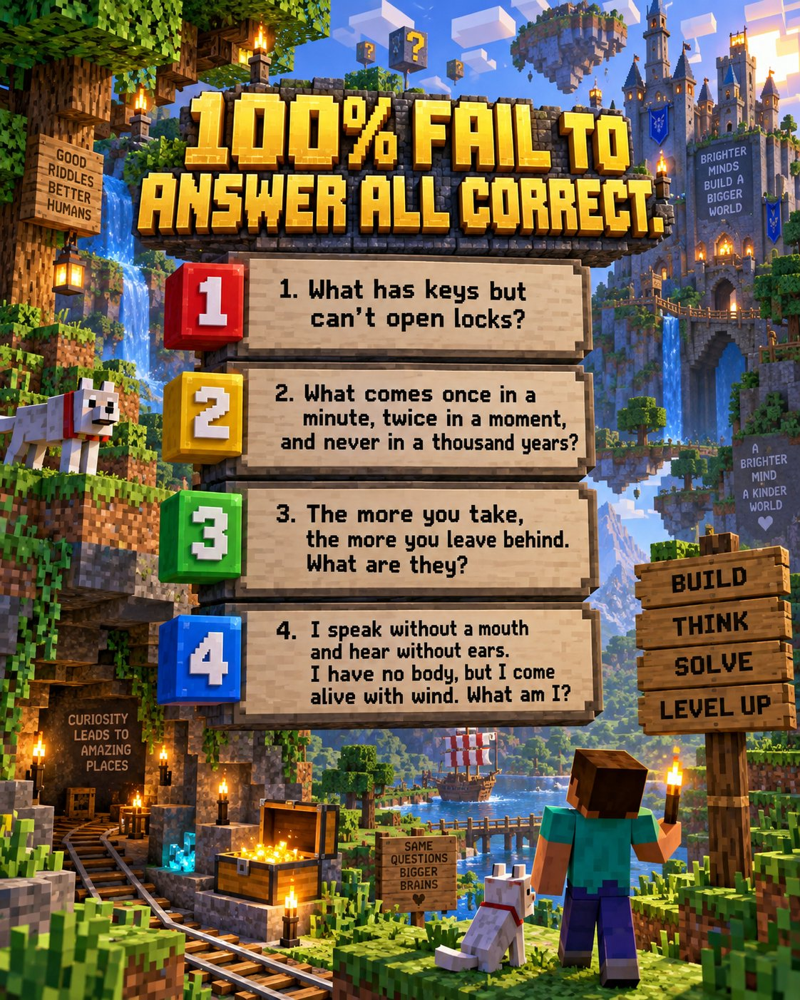](assets/p87-voxel-brain-teaser-posters/source-example-01.jpg)

[](assets/p87-voxel-brain-teaser-posters/source-example-02.jpg)

[](assets/p87-voxel-brain-teaser-posters/source-example-03.jpg)

#### 👇 Workflow

`Topic variable → voxel puzzle posters`

#### 🔖 Full Prompt

```text
4 images, 4:5, mindboggling hard math, science, logic, riddle questions that would make IQ 150 people cry. INPUT: $ TOPIC # Build a difficulty field D over the topic. D = infer_conceptual_depth($ TOPIC) # Sample 4 questions at increasing thresholds of D. Q1 = generate_question($ TOPIC, difficulty='easy') Q2 = generate_question($ TOPIC, difficulty='medium') Q3 = generate_question($ TOPIC, difficulty='hard') Q4 = generate_question($ TOPIC, difficulty='brutal') # Render voxel poster with Q1–Q4.
```

<sub>(by [@Gdgtify](https://x.com/Gdgtify/status/2101753259325063485)) · [Source: X](https://x.com/Gdgtify/status/2101753259325063485)</sub>

<a id="p89-endangered-animal-infographic"></a>

### 📌 6.10. Endangered Animal Infographic

#### 👀 Preview

[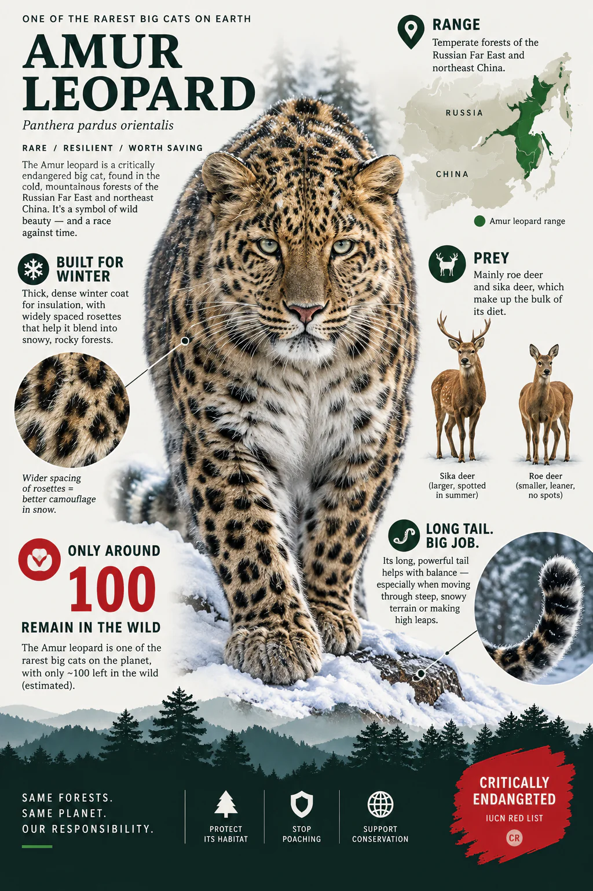](assets/p89-endangered-animal-infographic/source-example-01.webp)

#### 👇 Workflow

`Animal research → illustrated infographic`

#### 🔖 Full Prompt

```text
Create a visually rich infographic about an endangered animal. Start by finding one online, research its habitat, diet, and unique traits. Present information through annotated visuals and structured callouts, not generic sections. Style it like a bold graphic illustration: a detailed, photorealistic central animal as the focal point, supported by diagrams, callouts, and concise text elements. Use clean backgrounds and a mix of photorealism with strong graphic elements (shapes, icons, color blocking) in a layered composition. Make it dense, tactile, and professionally authored.
```

<sub>[Source: Vanikya](https://vanikya.ai/gpt-image-2-5#education-poster)</sub>

<a id="-5-creative-cases"></a>

<a id="-gif--video-workflows"></a>

## 🎬 GIF & Video Workflows

<a id="c01-pixel-art-character-gif-by-seeapi"></a>

### 📌 7.1. Pixel Art Character GIF

#### 👀 Preview

[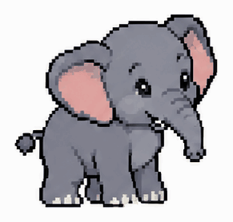](assets/01-pixel-art-gif/elephant-roll.gif)

**Elephant sprite sheet**

[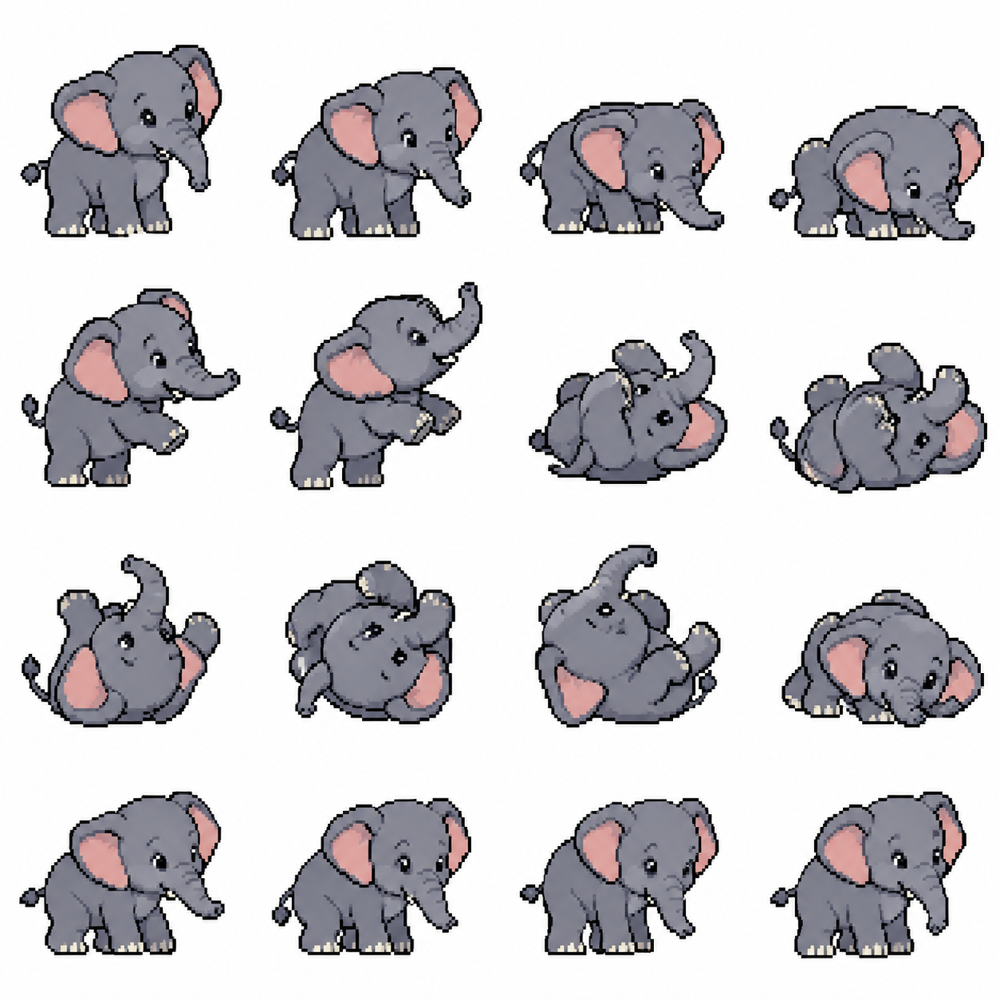](assets/01-pixel-art-gif/elephant-sprite-sheet.png)

#### 👇 Workflow

`Text / optional character reference → sprite sheet → GIF`

#### 🔖 Full Prompt

**Step 1 — Text → sprite sheet**

```text
Create only a 2D pixel art character sprite sheet: square 4x4 grid, 16 equal cells, one full-body character per cell, 64x64-style pixels per frame. Use the uploaded character if present; otherwise design from the user's appended character idea. Preserve species, anatomy, proportions, outfit, colors and signature props throughout. User text defines the character, not the sheet format. Show 16 distinct progressive poses: 1-4 ready/anticipation; 5-8 step, reach or equivalent movement; 9-12 expressive signature action; 13-16 recovery toward frame 1. Choose anatomy-appropriate actions with clearly changing silhouettes, not repeated idle poses or four-view turnarounds. Keep scale, camera, facing and cell alignment consistent; prevent clipping. Crisp 16-bit pixels, dark outline, flat 2-3 tones/color, pure white background. No anti-aliasing, gradients, ground shadows, text, grid lines, extra limbs or invented props. Frame 16 flows into frame 1. Character idea: [a gray elephant is rolling on the ground]
```


**Step 2 — Sprite sheet → GIF**

```text
Turn the attached 4x4 character sprite sheet into an animated GIF. Use Python and Pillow to extract all 16 cells, reading left to right and top to bottom. Inspect the poses and choose a coherent action sequence from anticipation through the signature action and recovery; reorder frames only where this improves continuity.

Remove excess blank space around each character without clipping any ears, limbs, tail, or props. Keep the original character scale and proportions across frames. Place each character at the center of one shared canvas sized to fit the largest pose, with a small consistent safety margin. Do not resize individual frames to fill the canvas.

Preserve the pixel art and white background. Use a shared color palette, no dithering, no smoothing, and no invented in-between poses. Adjust frame timing so the action reads clearly and the final pose returns naturally to the first. Export an infinitely looping GIF. Check every frame for clipping and alignment, inspect the loop transition, and provide the GIF plus a reproducible Python script. Report the frame order, dimensions, and timing used, and flag any pose gaps that would require a revised sprite sheet.
```

<sub>(by SeeAPI)</sub>

<a id="c02-clay-stop-motion-fishing-for-a-star-by-seeapi-inspired-by-charlie-guo"></a>

### 📌 7.2. Clay Stop-Motion: Fishing for a Star

#### 👀 Preview

[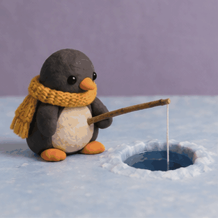](assets/02-clay-stop-motion/penguin-star-stop-motion.gif)

**Penguin star contact sheet**

[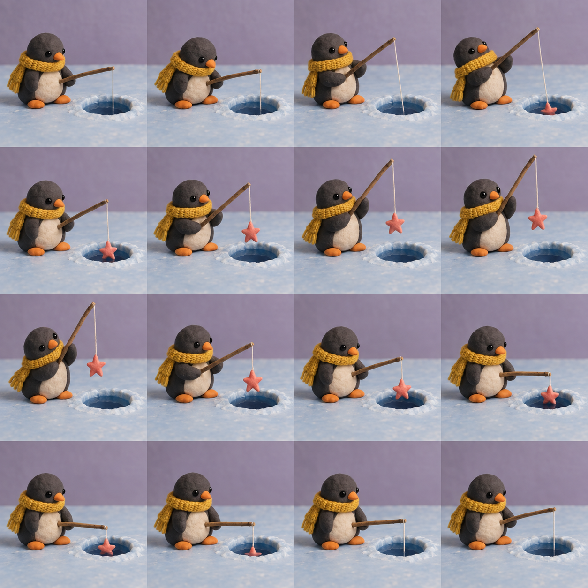](assets/02-clay-stop-motion/penguin-star-contact-sheet.png)

#### 👇 Workflow

`Reference image / Text → clay-style image → contact sheet → GIF`

#### 🔖 Full Prompt

**Step 1A — Reference image → clay-style image**

```text
Edit the uploaded image into a handcrafted clay stop-motion still. Preserve the character’s identity, species, anatomy, proportions, clothing, colors, signature props, pose, and scene composition. Translate surfaces into tactile modeling clay with subtle fingerprints, slightly imperfect sculpted edges, soft miniature-set shadows, and fabric texture where appropriate. Keep a single coherent scene with all important elements visible. No added characters, props, text, contact sheet, or animation frames. This is one clay-style starting image.
```

**Step 1B — Text → clay-style image (without a reference)**

```text
Create one handcrafted clay stop-motion starting image of [character description] in [setting], preparing to [simple action]. Use anatomy-appropriate poses and only [required props]. Place the character and props so the intended action can occur clearly in one locked-camera shot. Tactile modeling clay, subtle fingerprints, slightly imperfect sculpted shapes, soft miniature-set lighting, and a clean readable composition. Keep all subjects and props fully inside the frame with space for movement. No text, montage, contact sheet, or multiple frames.
```


**Step 2 — Clay-style image → contact sheet**

```text
Use the uploaded clay-style image as the strict identity, material, set, lighting, and camera reference. Create one square 4-by-4 contact sheet containing exactly sixteen equally sized square frames in reading order, with no gutters, grid lines, labels, or text.

Animate this action: [simple action]. Frames 1–4 establish the starting pose and anticipation; frames 5–8 begin the main movement; frames 9–12 show the action’s peak; frames 13–16 recover toward the starting pose for a loop. Use distinct, incremental, anatomy-appropriate poses with changing silhouettes. Keep the reference character’s species, proportions, outfit, colors, and props unchanged. Do not invent additional limbs, characters, or props.

Preserve one locked camera, consistent subject scale, fixed set placement, background, lighting, and scene geometry across every cell. Keep moving elements inside each cell with a small safety margin. Maintain physical contact and continuous grips on props. Retain tactile clay, handmade surface imperfections, and a gently stepped stop-motion feel. Frame 16 should flow naturally into frame 1. No camera movement, motion blur, duplicated idle frames, or changing scenery.
```


**Step 3 — Contact sheet → GIF**

```text
Use Python and Pillow to turn the attached 4x4 stop-motion contact sheet into a looping GIF. Split it into 16 equal-sized frames, reading left to right and top to bottom. If the image dimensions are not divisible by four, round the cell boundaries and use a consistent crop size, trimming at most one edge pixel where necessary.

Keep the complete miniature scene in every frame. Preserve one shared crop and the original image scale. Do not crop to the penguin's silhouette or recenter it independently: the ice hole, horizon, and floor must remain in place. Do not add camera movement, interpolated poses, optical flow, or crossfades.

Use a shared 256-color palette with no dithering. Start with 140 ms per frame, hold the reveal briefly, and use a short pause at the loop boundary. Preserve the source order unless the poses clearly require a change. Export an infinitely looping GIF and provide a reproducible script with the exact frame order and durations.

Inspect the character, rod, line, star, ice hole, and first-to-last transition. Report visible drift or missing motion honestly; if source frames need correction, explain what should be regenerated rather than describing the GIF as perfectly seamless.
```

<sub>(by SeeAPI; inspired by [Charlie Guo](https://x.com/charlierguo/status/2097399137142772071)) · [Source: X](https://x.com/charlierguo/status/2097399137142772071)</sub>

<a id="c04-character-to-storyboard-to-film-by-seeapi-inspired-by-elcine"></a>

### 📌 7.3. Character to Storyboard to Film

#### 👀 Preview

**Inez reference**

[](assets/04-storyboard-video/inez-reference.png)

**Lighthouse storyboard**

[](assets/04-storyboard-video/lighthouse-storyboard.png)

**Shot 01**

[](assets/04-storyboard-video/shot-01.png)

**Shot 02**

[](assets/04-storyboard-video/shot-02.png)

**Shot 03**

[](assets/04-storyboard-video/shot-03.png)

**Shot 04**

[](assets/04-storyboard-video/shot-04.png)

#### 👇 Workflow

`Text → character reference → storyboard → individual shot images → video clips → edited video`

#### 🔖 Full Prompt

**Step 1 — Text → character reference**

```text
Generate one landscape 3:2 clean single-character full-body identity reference portrait. Original protagonist INEZ, a lighthouse mechanic aged about 60, warm tan skin, short silver-gray curly hair, round tortoiseshell glasses, kind lined face, navy wool chore coat over an ochre knitted sweater, charcoal trousers and weathered dark brown work boots. Her hands are empty and visible, arms relaxed, head and boots fully inside the frame with ample margins. She stands in a neutral three-quarter pose against a simple warm gray studio backdrop. No other characters or props, no collage or additional views, no text.
Visual style: tactile miniature stop-motion film design, felted wool costume, subtly sculpted expressive face, cinematic soft overcast coastal light, muted navy and ochre palette, believable anatomy. Preserve the subject as a clearly older adult woman, no glamour retouching.
```

**Step 2 — Character reference → storyboard**

```text
Use the uploaded full-body portrait of INEZ as the strict identity and visual-style reference. Preserve her older adult face, short silver-gray curls, round tortoiseshell glasses, navy wool coat, ochre sweater, charcoal trousers, and brown work boots. Create one 16:9 storyboard sheet divided into an EXACT 2x2 grid of four equal 16:9 cinematic panels, no gutters, panel labels, numbers, captions, text, or borders. Reading order is left to right, top to bottom. This is a four-shot narrative storyboard, NOT consecutive animation frames.

Original story: in a tiny coastal lighthouse workshop, Inez revives one palm-sized brass mechanical seabird with an attached winding key, then lets it fly out of an already-open window. Tactile miniature stop-motion film look, felted wool clothing, sculpted face, softly weathered brass, overcast coastal daylight. The same wooden workbench runs beneath one arched OPEN window on the RIGHT of the room; cool sea beyond. One brass mechanical bird only, two hinged wings, one small attached winding key on its left flank. No loose tools or unrelated objects.

Panel 1, establishing medium-wide shot: Inez is on the LEFT of the workbench looking down at the inert bird resting on the bench at center-right. Both bird wings are folded. Her hands rest on the bench on either side of the bird without touching the key. The open window is visible on the right. This is the first moment before repair.
Panel 2, close-up from the same side of the bench: one of Inez's hands gently braces the bird body; her other hand holds the small attached winding key on its left flank, ready to turn. Both wings remain folded. Show enough ochre sleeve and navy cuff to link her costume. Brass bird geometry must match panel 1, not a different bird. Key remains attached.
Panel 3, medium shot: Inez smiles at the same bird standing on the bench, both hinged wings now partly unfolded, head lifted. Her hands are withdrawn and clearly separate from its wings. Bird has not taken off. Same window on right, same lighting and clothes.
Panel 4, medium-wide shot toward the open window: Inez remains on the LEFT with an open supporting palm near the window sill. The same brass bird rests on the RIGHT sill with wings poised for takeoff toward the open sea, still physically supported. Maintain the single window and its already-open state. Inez's face is visible in three-quarter profile, quietly proud. This is the beginning of the release shot, before the bird flies away.

Keep causal continuity, a single recognizable protagonist, one bird, stable costume, stable room geography, plausible hands, and a clear visual link between the close-up and wide shots. No magic beams, glowing eyes, extra characters, flying tools, missing glasses, unreadable writing, duplicate birds, grid overlays, or photoreal human replacement.
```

**Step 3 — Individual shot images → video clips → edited video**

```text
Create a 12-second, 16:9 miniature stop-motion-style short film called The Last Flight, with four shots and clear tactile stepped motion. Do not render the title as text. C04-R01 is the identity reference for Inez. C04-B01 is a storyboard for planning only, not a frame sheet to animate directly. C04-K01 through C04-K04 are individual shot-start references. Never show the grid or multiple panels in the video.

Continuity: Inez is the same older woman with silver curls, round tortoiseshell glasses, navy coat and ochre sweater. There is one palm-sized brass mechanical seabird, two hinged wings, and one attached winding key on its left flank. The wooden bench is below a single already-open arched window on room-right. Overcast sea light stays constant. The bird progresses from inert to wound to active to airborne; it never duplicates or changes species.

Shot 1, 0–3 seconds, start from C04-K01: locked medium-wide shot. Inez notices the folded, inert brass bird on the bench, leans slightly closer, and reaches toward its attached key. The open window remains visible on the right. Cut on her reaching hand to the matching close-up.
Shot 2, 3–6 seconds, start from C04-K02: locked close-up. One hand braces the bird; the other gives its attached key one slow half-turn. The key remains attached and her fingers keep contact. A small mechanical click prompts the bird's head to lift slightly. Cut on this first movement to the wider reaction.
Shot 3, 6–9 seconds, start from C04-K03: medium shot. The bird unfolds its two wings, takes two short steps toward the right, and Inez offers her open palm beside it. She smiles, keeping her glasses and outfit unchanged. Cut in the direction of the bird's movement to the open-window shot; the short move to the sill is an intentional edit, not a teleport within a shot.
Shot 4, 9–12 seconds, start from C04-K04: medium-wide shot. From the sill, the bird pushes off with both feet and makes two small mechanical wingbeats, flying out through the already-open window toward screen-right. Inez withdraws her supporting palm and follows it with her gaze. End with her quiet smile and the open sea. The bird stays the same small brass object as it recedes. No reset or loop.

No camera movement is required. Prioritize readable action over extra cuts. Optional audio: low coastal wind, a winding click, two soft metallic wing flutters; no dialogue, captions, or lip-sync. If audio generation is unavailable, export silent clips.

Negative prompt: visible storyboard grid, collage animation, extra bird, detached key, changing bird design, wardrobe morph, missing glasses, extra fingers, hand-wing fusion, closed window, flight through glass, unmotivated room change, continuous-shot teleport, photoreal skin, fast montage, crossfades, text or logos.

Limited-input fallback: generate four separate 3-second clips using only the matching C04-K image as that clip's first frame and the corresponding shot paragraph above plus the continuity and negative instructions. Trim to three seconds per clip and join with straight cuts. If the generator requires a longer minimum duration, generate that duration and select a coherent three-second segment; the 12-second timing is an editing target, not a claim about a particular model's supported settings.
```

<sub>(by SeeAPI; inspired by [el.cine](https://x.com/EHuanglu/status/2097519538632024103)) · [Source: X](https://x.com/EHuanglu/status/2097519538632024103)</sub>

<a id="c05-distant-observer-a-robot-in-the-rain-by-seeapi-inspired-by-pablo-prompt"></a>

### 📌 7.4. Distant Observer: A Robot in the Rain

#### 👀 Preview

**Rainy street draft**

[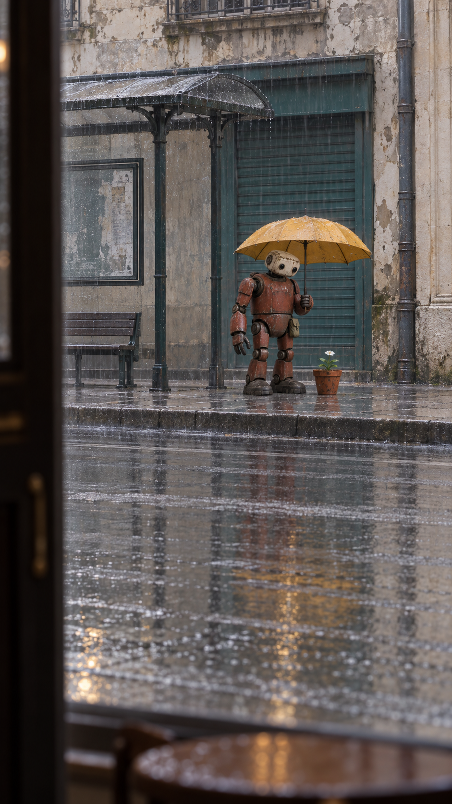](assets/05-distant-observer/rainy-street-draft.png)

**Rainy street opening**

[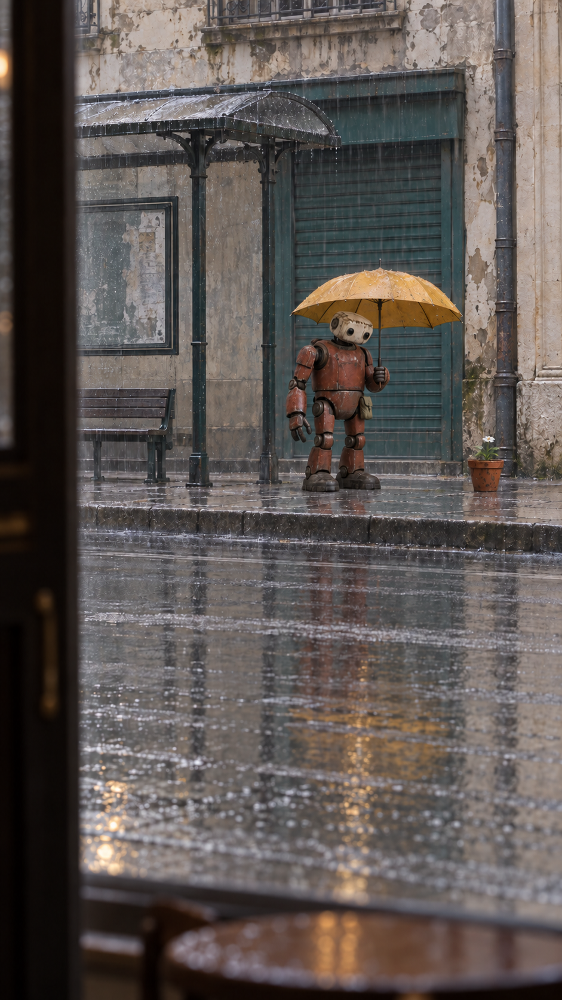](assets/05-distant-observer/rainy-street-opening.png)

**Robot reference**

[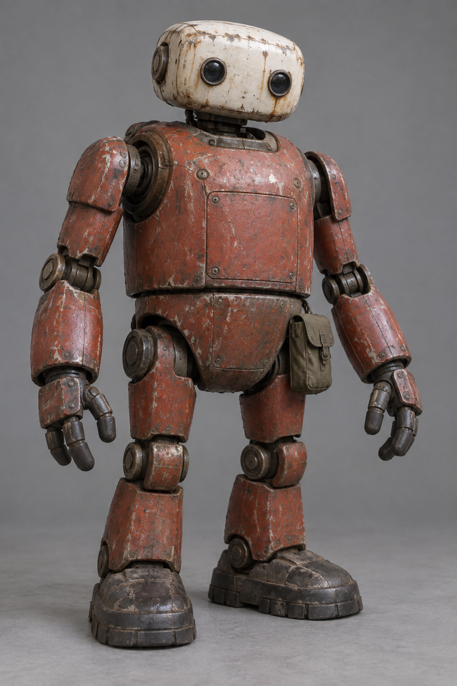](assets/05-distant-observer/robot-reference.png)

#### 👇 Workflow

`Text → character reference → scene image → corrected scene image → video`

#### 🔖 Full Prompt

**Step 1 — Text → character reference**

```text
Create one portrait 2:3 full-body character identity reference photograph of an original friendly obsolete street-maintenance robot. It is a physically built practical movie prop, about 2 meters tall, with a stocky weathered rust-red steel torso, off-white rounded rectangular head, exactly two small round dark glass eyes, no mouth, two thick articulated arms, exactly three blunt fingers on each hand, two short sturdy legs, and broad dark rubber feet. Its plates show chipped paint and light rain marks, never military armor. One small olive canvas pouch is strapped at its left hip. No writing, badges, logos, screens, weapons, or human face.
The robot stands upright in a relaxed front three-quarter pose on a plain mid-gray studio floor and seamless backdrop. Both empty hands, full head, and both feet are clearly visible with ample margins. No props in the hands, no umbrella in this identity reference. Keep one single robot, no collage, no turnaround grid, no other subject.
Photoreal practical-effects cinematography, tactile metal and canvas, soft overcast illumination, understated warmth. Design a unique humble municipal helper with rounded proportions, not an existing franchise robot.
```

**Step 2 — Character reference → scene image**

```text
Use the uploaded robot portrait as the strict identity reference C05-R01: preserve the rust-red stocky steel body, off-white rounded rectangular head, two round dark eyes, no mouth, two arms, three blunt fingers per hand, two legs, rubber feet, and single olive pouch at its left hip.

Create one photoreal 9:16 vertical first frame with the visual feeling of a candid distant observation of a fictional scene. The camera is sheltered inside an unoccupied cafe doorway across a narrow rain-soaked street, about 25 meters from the robot. Use a moderate telephoto perspective with compressed depth and natural lens softness, not a wide-angle close-up. A dark out-of-focus door jamb occupies only the left 8% of the image and a soft blurred ledge crosses the bottom 5%; neither covers the robot or the flowerpot. No people or camera equipment are visible.

On the far sidewalk, the robot stands just right of center beneath its one OPEN mustard-yellow umbrella. The robot's body from head to feet occupies only 24–28% of the entire image height; keep it visibly small in a much larger urban environment. Its lowered gaze is directed at one terracotta flowerpot on the ground immediately to its right, containing one short green plant with one small white flower. The pot is close enough for the robot to shelter it by lowering and moving the umbrella a short distance. The hand nearest the pot holds the umbrella shaft at chest height; the free hand hangs at its side. The umbrella is currently above the robot, NOT already above the pot. Show the shaft continuously attached to the canopy and gripped by one hand.

Quiet old tram-stop frontage with a closed teal shutter behind the robot, damp pale plaster walls, a curb, a wet road occupying much of the lower middle frame, soft rain and broad puddle reflections. No readable shop names, road text, logos, vehicles, pedestrians, or other plants. The setting and wet empty space should dominate. Overcast afternoon daylight, subdued colors except the rust-red robot, yellow umbrella, and terracotta pot. The umbrella and flowerpot remain separate and fully visible. Natural slightly imperfect observer framing, no surveillance overlays, timestamp, cinematic black bars, or exaggerated bokeh. This is an ordinary street seen from afar, with one unexpected quiet act about to happen; not a hero portrait.
```

**Step 3 — Scene image → corrected scene image**

```text
Edit this distant rainy street frame with one local correction only. Move the existing terracotta pot and its single white flower to the RIGHT along the same sidewalk plane, so the ENTIRE pot and flower are visibly outside the yellow umbrella canopy's rightmost edge and receiving rain. Place the pot center at approximately 89% of image width, preserving its current size and its grounded contact with the sidewalk. Leave a visible horizontal rain-filled gap between the canopy's right edge and the flower. Remove the pot completely from its old position; there must still be exactly one pot and one flower.

Keep everything else unchanged: exact camera distance and framing, small robot size and pose, its two eyes and olive pouch, umbrella angle and connected shaft, hand grip, shutter, building, wet road, rain, bench, foreground doorway and blurred ledge, light, texture, and image dimensions. Do not move or enlarge the robot, change the umbrella, add characters, or crop the image. This frame is BEFORE the robot moves its umbrella over the pot.
```

**Step 4 — Corrected scene image → video**

```text
Animate C05-K01 as the exact first frame of an 8-second photoreal 9:16 distant-observer video, one uninterrupted shot. C05-R01 is optional robot identity reference only if the tool supports an extra reference slot. If only one image is allowed, use C05-K01. Preserve its street layout, wet road, teal shutter, foreground doorway edge, robot size, umbrella, and flowerpot.

The camera remains inside the doorway across the street at the same approximately 25-meter distance. Match the robot's exact small standing scale in C05-K01 (about 18% of frame height in the supplied example), rather than enlarging it to meet a numerical target. As it bends, allow its projected height to decrease naturally; never enlarge it or move the camera to compensate. The viewer should feel they happened to notice a small event on the far sidewalk. Only very slight low-amplitude handheld drift, under 1% of frame width; no zoom, push-in, tracking toward the subject, close-up, camera cut, or dramatic rack focus. Foreground occlusion remains at the edges, never over the action.

0–2 seconds: the rust-red robot pauses under its open yellow umbrella and tilts its off-white head down toward the single terracotta pot and white flower beside it. Rain continues falling; the flower stem nods slightly. Keep exactly two eyes, no mouth, one olive hip pouch, and the same physical body proportions.
2–6 seconds: the robot bends at the knees and waist, using the hand already gripping the umbrella shaft to lower and move the still-open umbrella toward the pot. The umbrella moves as one rigid connected canopy-and-shaft assembly. Keep its grip continuous and do not swap hands. The free hand rests against its own thigh. The feet remain planted on the sidewalk. Finish with the canopy visibly centered above the pot while most of the robot's head and shoulders are outside its cover in the rain. The umbrella does not shrink, fold, detach, or touch the flower.
6–8 seconds: the robot holds the umbrella steady over the pot and quietly watches the flower. Rain remains visible around the canopy, and puddle rings continue on the road. End on this small act of care from the same distant viewpoint. The robot never notices or looks into the camera. No return to the starting pose and no loop.

Photoreal practical-effects character with believable joint motion, damp metal, soft daylight, and restrained movement. Optional audio: rain recorded from the sheltered camera position, with very faint mechanical movement at a distance; no close-miked dialogue, music cue, or dramatic sound effect. If audio is not supported, export silently.

Negative prompt: growing subject, automatic zoom, face close-up, moving across the street, camera orbit, film cuts, eye contact with camera, waving at viewer, extra robot or person, extra umbrella, second flowerpot, umbrella changing size, detached shaft, grip swap, additional fingers, floating feet, sunlight transition, dry pavement, disappearing rain, added text, watermark, timestamp, CCTV interface.
```

<sub>(by SeeAPI; inspired by [Pablo Prompt](https://x.com/pabloprompt/status/2097382752622436744)) · [Source: X](https://x.com/pabloprompt/status/2097382752622436744)</sub>

<a id="c06-frosted-glass-poster-to-360-orbit-by-seeapi"></a>

### 📌 7.5. Frosted Glass Poster to 360° Orbit

#### 👀 Preview

[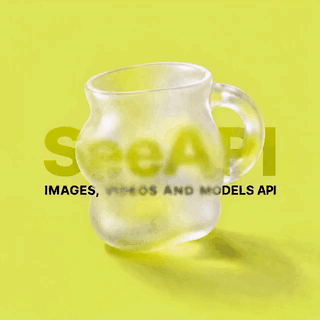](assets/06-360-orbit/frosted-glass-mug-orbit.mp4)

**Frosted glass mug poster**

[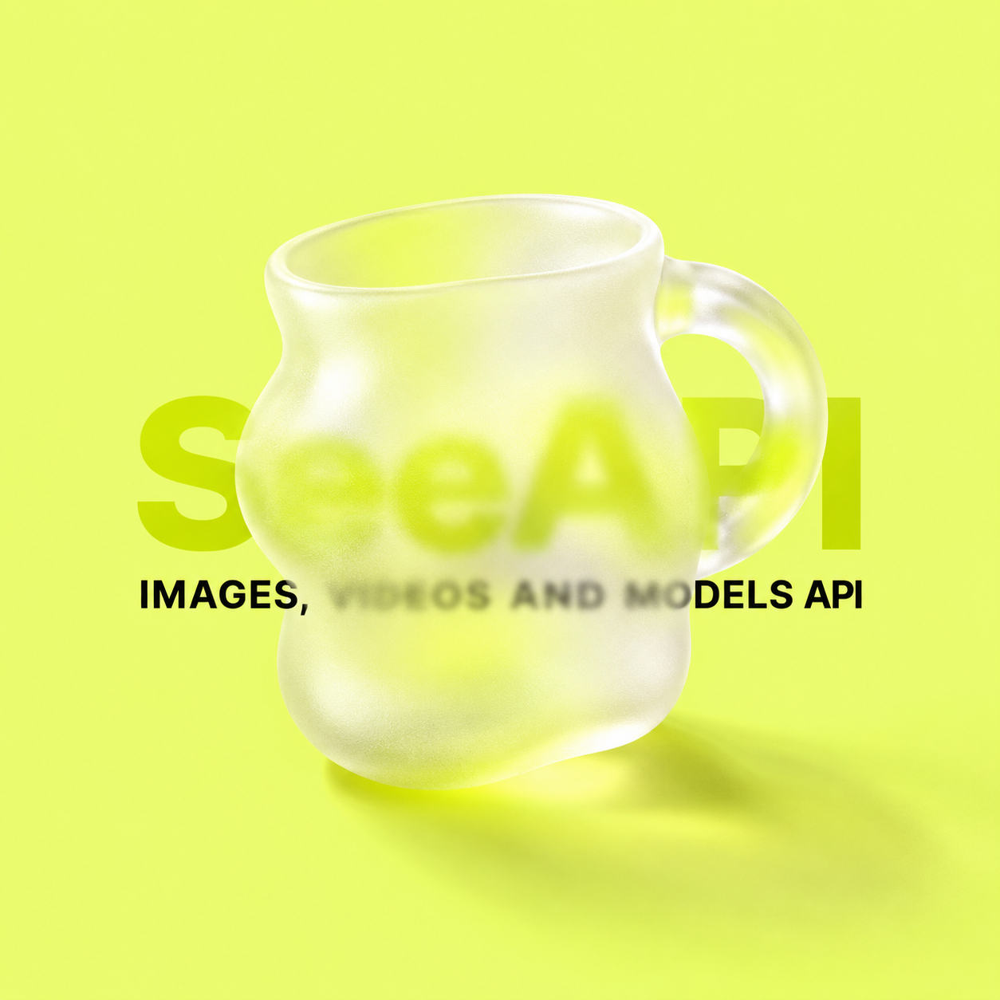](assets/06-360-orbit/frosted-glass-mug-poster.png)

#### 👇 Workflow

`Text → poster image → 360° orbit video`

#### 🔖 Full Prompt

**Step 1 — Text → poster image**

```text
A minimalist futurist exhibition poster with an ultra-light cool yellow background (#e7ff48).

At the center of the poster is a fluid 3D metaball shaped mug in full form, rendered in frosted glass with delicate grainy noise.
The fluid gradient transitions from light yellow (#E7FF48) to Pearl White (#FFFFFF), giving it a silky glass-like appearance.

High-position softbox lighting casts long, soft colored shadows and a subtle halo.

The fluid overlaps with the text: letters obscured by the frosted glass appear with a gentle Gaussian blur.
- The main title, the light yellow “SeeAPI” logo, is centered and partially obscured by the fluid. The covered letters are slightly blurred through the frosted glass.
- The subtitle, in bold all-caps modern sans-serif pure black font, reads: “Images, videos and models API”, placed below the main title. It is also partially overlapped by the fluid and blurred in those areas, while the rest remains sharp.

The overall layout is clean with generous whitespace, balanced composition, sharp focus, and HDR high dynamic range.
```

**Step 2 — Poster image → 360° orbit video**

```text
Create a 6-second, square 1:1 product film in ONE continuous shot, using C06-R01 as the exact opening composition. The hook is one complete 360-degree camera orbit around the same sculptural frosted-glass mug, revealing its fluid silhouette, hollow rim, single attached handle, and changing transmitted light. Preserve the minimalist futurist exhibition-poster aesthetic and cool yellow #E7FF48 to pearl-white palette.

Keep exactly one mug with the source image's proportions, asymmetric metaball contours, glass thickness, open top, and one continuous handle. The mug remains stationary in world space at its original height relative to the surface; its position, shape, and orientation do not animate. Infer unseen surfaces conservatively as a continuation of that same mug, without adding decoration or a second handle.

SHOT 1: Starting at the supplied three-quarter view, move the camera clockwise as seen from above through one uninterrupted circular orbit: front three-quarter to side, rear, opposite side, and back to the exact starting view. Complete the full 360 degrees within the six seconds. Keep the camera radius, elevation, focal length, and aim at the mug's center fixed, with no camera roll. Let the motion begin promptly and run at a smooth near-constant pace so every side is shown; settle briefly only after returning to the starting angle. Keep the whole mug and handle within the frame at a stable scale. Let the single handle naturally become hidden by the body and reappear according to perspective; it must never split or jump between sides.

The high softbox and seamless cool-yellow studio environment remain fixed in world space. Highlights, visible glass thickness, refraction, and the projected soft shadow change coherently as the camera travels. Preserve the fine frosted grain as surface texture, not flickering noise. The glass stays frosted and translucent throughout, with a restrained halo and no melting or opacity transformation.

Typography is a screen-aligned exhibition graphic behind the rendered mug, not lettering printed on the mug and not a physical sign that the camera orbits. Keep the source layout, font, spacing, colors, and exact visible text fixed: "SeeAPI" and "IMAGES, VIDEOS AND MODELS API". As the mug's projection changes, only the regions seen through its frosted glass receive gentle refraction and soft blur; unobscured text stays sharp. Never rotate, mirror, rewrite, or move the letters with the mug. At the final angle, restore the original overlap and blur pattern.

End at the source camera angle, scale, lighting, and composition with zero residual camera motion. If a last-frame slot is available, use C06-R01 there as well while retaining the full-orbit instruction. The result should reveal actual changing viewpoints of a volumetric object, not rotate the flat poster, spin the mug on a turntable, or substitute a zoom or layered 2D drift. No scene cuts. Silent output is suitable.
```

**Step 3 — 360° orbit video — negative prompt**

```text
Partial orbit, camera reversing before completing the circle, stationary-camera turntable spin, flat poster rotation, simple zoom or 2D parallax, jump cut hiding the back, extra mug, extra handle, detached handle, sealed mug opening, changing rim shape, melting glass, changing product scale, camera roll, tilt drift, sudden opacity changes, random sparkling particles, unstable grain, moving or misspelled lettering, mirrored text, text printed onto the mug, extra captions, watermarks, background color change, mismatched final viewpoint.
```

**Step 4 — Alternative: poster image → supplied video**

```text
Create image-to-video sequence in one continuous shot. Use the uploaded image as the opening frame. Preserve the original subject’s identity, appearance, proportions, clothing or surface details, visual style, lighting, and environment.

SHOT 1 — CAMERA-LED ORBIT: Starting from the exact viewpoint of the source image, physically move the camera to the right along a smooth circular arc of approximately 120 degrees around the main subject. The subject is the fixed spatial center of the orbit. Maintain a nearly constant camera-to-subject distance, camera height, and focal length, gently panning inward to keep the subject consistently framed. Begin the camera travel immediately, sustain a confident, fluid movement, and ease smoothly into the final viewpoint.

Make the changing camera position unmistakable: progressively reveal new sides of the subject, with coherent perspective changes and natural occlusion and reveal. Nearby foreground elements move across the frame faster than distant background elements. Background structures remain anchored in the same physical locations while their apparent positions and angles change naturally with the moving viewpoint. Preserve a stable horizon and consistent scene geometry.

Keep the subject in the same location and maintain its original overall orientation within the environment. For a person or animal, allow subtle breathing, a natural blink, a slight expression change, and a small relaxed posture adjustment. A brief, limited glance toward the passing camera is allowed; the head and torso then settle rather than continuing to track the lens. Let the camera naturally reveal a three-quarter or side view. For an inanimate object, keep it stationary.

Preserve contact with the floor, seat, railing, or other supporting surfaces. Keep environmental motion delicate and motivated by the original scene. Maintain consistent world-space lighting, with highlights and reflections responding naturally to the changing viewing angle.

The dominant visible motion is the camera traveling around the subject. Finish on the newly revealed angle with the same subject and environment intact. Smooth cinematic motion, clear spatial depth, restrained subject animation, and no cuts.
```

<sub>(by SeeAPI)</sub>

## 📝 Sources, Reuse & Maintenance

This collection includes original prompts by SeeAPI, collected prompts, and adaptations. Each case credits its author and source below the full prompt, with translation or adaptation credits where applicable.

See [Sources & Rights](docs/sources-and-rights.md) for case-specific reuse terms and example-image provenance.

Maintained by SeeAPI, with ongoing updates to prompts and examples in English and Simplified Chinese. **External submissions are not open at this stage.**

## 🙏 Acknowledgments

- [YouMind — Awesome Seedance 2.0 Prompts](https://github.com/YouMind-OpenLab/awesome-seedance-2-prompts): inspiration for the collection’s organization and featured examples.

- [ZeroLu — Awesome Nano Banana Pro](https://github.com/ZeroLu/awesome-nanobanana-pro): inspiration for the category-based organization of this collection.
