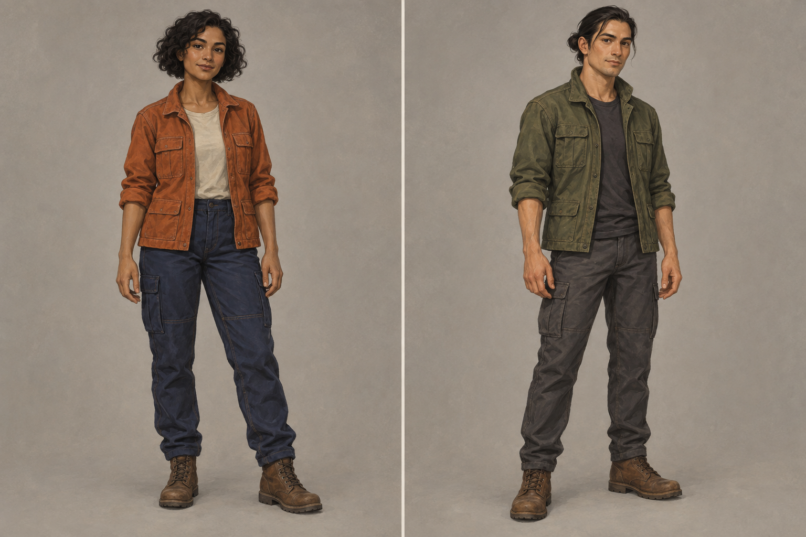
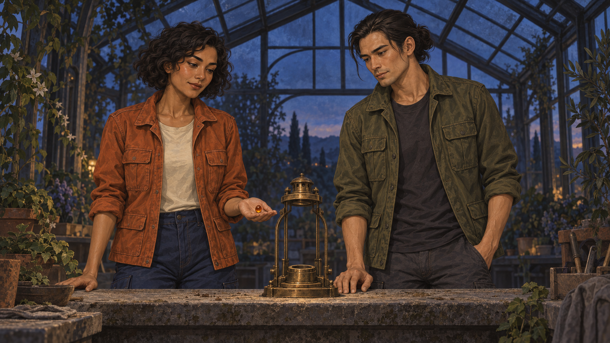
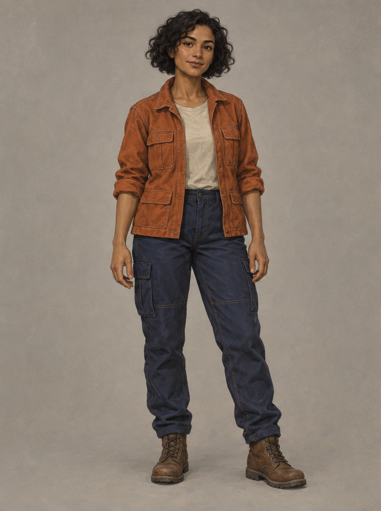
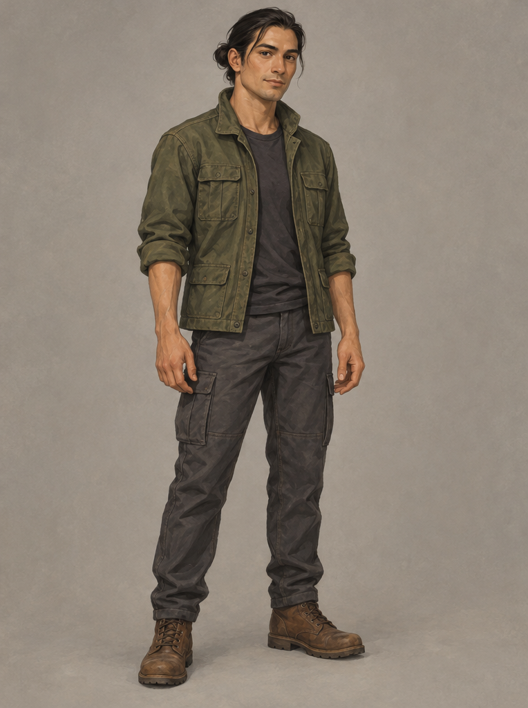

# C03. Two Characters, One Scene

**by SeeAPI** · Inspired by [TechieSA](https://x.com/TechieBySA/status/2096196085198839832)

## 👀 Preview

**Character reference sheet**



**Greenhouse opening**



**Mira reference**



**Ren reference**



Video pending. Illustrative stills use an unexposed model ID; the video prompt follows the visible seed-bearing hand.

## 👇 Workflow

`Text → two character references → opening image → video`

## 🔖 Full Prompt

**Step 1 — Text → two character references**

Split the generated two-panel sheet into Mira and Ren portraits.

```text
Generate a widescreen 3:2 character reference diptych, exactly two equal vertical panels with a plain warm gray background, no border or text. The panels will be cropped into two separate identity reference images. Each panel contains exactly one full-body adult original human character, head to boots fully visible with ample margins, both at identical scale.
Left panel: MIRA, an adult woman aged about 30, medium-brown skin, short curly black bob, oval face, dark eyes, rust-orange utility jacket over cream shirt, navy work trousers, brown ankle boots. No jewelry, no hat, no props. Arms relaxed and hands fully visible.
Right panel: REN, an adult man aged about 32, light olive skin, straight dark hair tied in a small low bun, clean-shaven angular face, dark eyes, moss-green utility jacket over charcoal shirt, charcoal trousers, brown work boots. No jewelry, no hat, no props. Arms relaxed and hands fully visible.
Style: cinematic hand-painted animation concept art, softly textured gouache backgrounds, clear expressive faces, grounded anatomy, restrained warm colors, diffuse studio lighting. Neutral front three-quarter standing poses. These are original greenhouse caretakers, no celebrities, no existing film characters. Do not blend identities, duplicate people, invent props, add text or crop limbs.
```

**Step 2 — Two references → opening image**

Upload Mira first, Ren second.

```text
Use the two uploaded character portraits as separate strict identity references: image 1 is MIRA, the woman with a rust-orange jacket; image 2 is REN, the man with a moss-green jacket. Preserve each person's face, hairstyle, skin tone, age, body proportions, and entire outfit. Do not merge or swap their identities.

Create a single cinematic 16:9 opening frame in the same hand-painted animation style. A glass greenhouse at blue hour, quiet foliage at the edges, dark blue glass roof overhead, a waist-high stone workbench across the foreground. Mira stands on the LEFT, Ren on the RIGHT, facing slightly inward toward one small unlit brass lantern fixed at the center of the bench. Mira's open right palm holds exactly one small amber glass seed just left of the lantern. Ren's left hand rests beside the lantern base, leaving the empty circular socket clearly visible. All hands remain distinct. Both faces are clearly readable in a medium-wide shot.

The lantern is attached to the bench and cannot move; its socket is empty. The amber seed has not been inserted yet. Soft cool dusk light and a faint warm reflection from the seed. Calm anticipation, grounded anatomy, subtle gouache texture, no text, no labels, no montage, no extra people, no duplicate seed, no costume changes, no oversized hands. This is the first frame before the action, not the finished glowing result.
```

**Step 3 — Opening image → video**

Use the greenhouse image as the first frame; portraits are optional identity references.

```text
Create an 8-second cinematic hand-painted animation, 16:9, one continuous medium-wide shot. C03-K01 is the exact first frame and controls composition, greenhouse, bench, lantern, and initial hand positions. C03-R01 locks Mira's identity and rust-orange outfit; C03-R02 locks Ren's identity and moss-green outfit. If only one image is supported, use C03-K01 alone. Mira stays on screen-left, Ren on screen-right. Preserve both faces, hairstyles, skin tones, ages, clothes, and body proportions throughout.

0–2 seconds: Mira looks from the single amber seed on her seed-bearing palm to the empty lantern socket. Ren watches the socket, his visible hand resting beside the fixed base. Gentle breathing; leaves shift slightly in the greenhouse draft. The camera stays locked.
2–5 seconds: Mira uses the thumb and index finger of her free hand to lift the seed from her open seed-bearing palm, then seats it in the lantern's circular socket. Show one continuous transfer and contact. Ren does not take the seed or move the lantern. Once the seed is seated, its amber light gradually illuminates the lantern and nearby faces.
5–8 seconds: Mira withdraws the hand that placed the seed; the seed remains visibly seated. Both look at the illuminated lantern and exchange a small satisfied smile. Warm reflections settle on the glass roof. End on the two distinct characters and the lit lantern. Do not reset the action or loop.

Keep movement restrained and expressive, with coherent hand anatomy and stable painted textures. No scene cuts. Optional audio: faint greenhouse wind, a soft glass click at contact, and a gentle electrical hum after illumination; no dialogue or lip-sync. If audio is unavailable, export silently.

Negative prompt: face swap, merged people, outfit morphing, duplicate seed, disappearing seed, extra fingers or arms, passing objects through solid glass, floating lantern, premature illumination, camera orbit, zoom, captions, text, logos, unrelated cuts, flickering identities.
```

[← Back to this case in the README](../README.md#c03-two-characters-one-scene)
