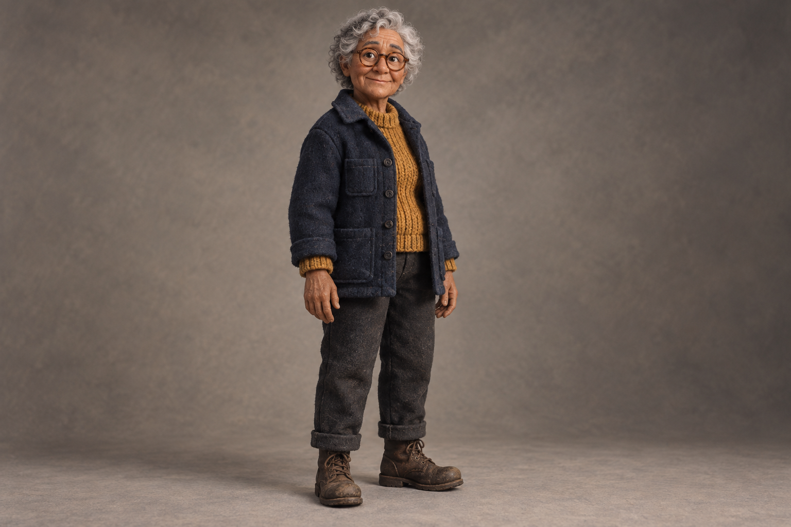
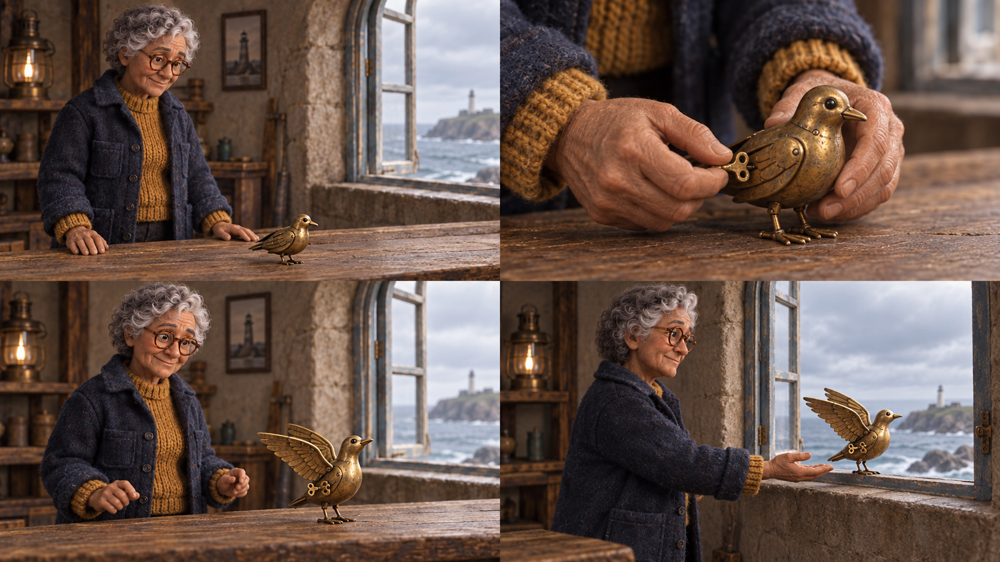
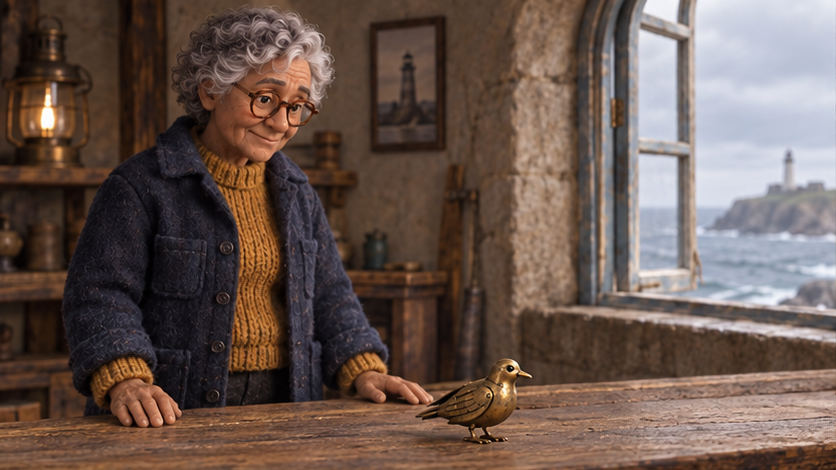
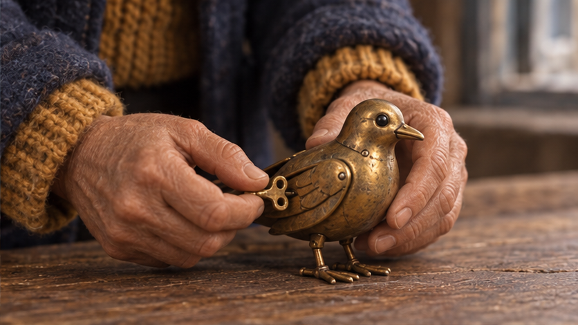
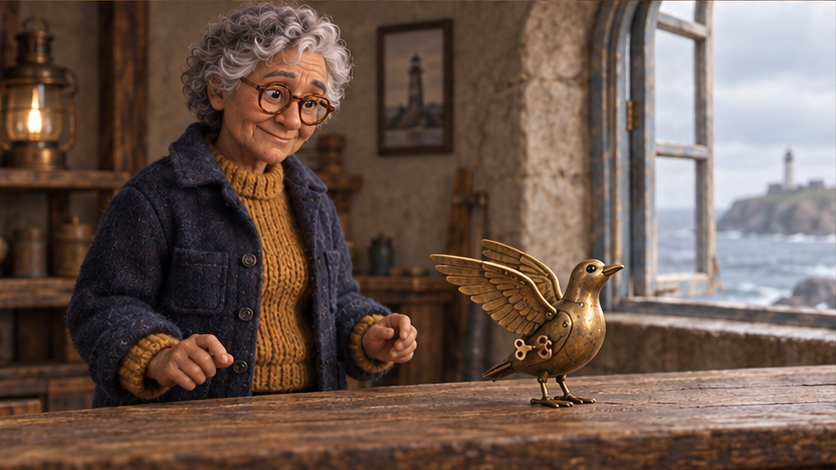
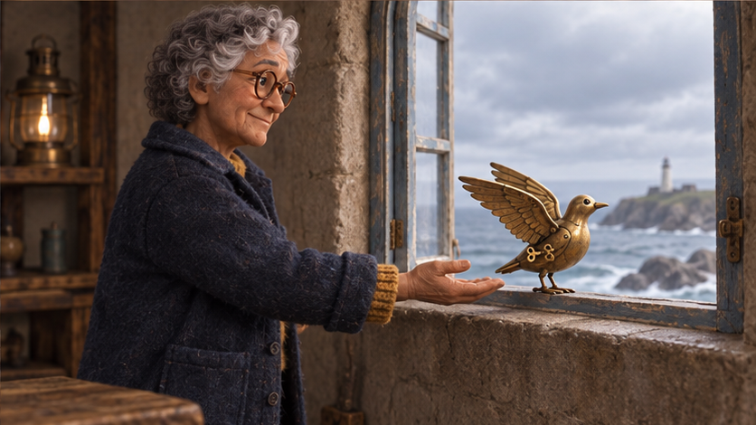

# C04. Character to Storyboard to Film

**by SeeAPI** · Inspired by [el.cine](https://x.com/EHuanglu/status/2097519538632024103)

## 👀 Preview

**Inez reference**



**Lighthouse storyboard**



**Shot 01**



**Shot 02**



**Shot 03**



**Shot 04**



Video pending. Illustrative stills use an unexposed model ID; inspect bird and key continuity between shots.

## 👇 Workflow

`Text → character reference → storyboard → individual shot images → video clips → edited video`

## 🔖 Full Prompt

**Step 1 — Text → character reference**

Generate Inez’s identity image.

```text
Generate one landscape 3:2 clean single-character full-body identity reference portrait. Original protagonist INEZ, a lighthouse mechanic aged about 60, warm tan skin, short silver-gray curly hair, round tortoiseshell glasses, kind lined face, navy wool chore coat over an ochre knitted sweater, charcoal trousers and weathered dark brown work boots. Her hands are empty and visible, arms relaxed, head and boots fully inside the frame with ample margins. She stands in a neutral three-quarter pose against a simple warm gray studio backdrop. No other characters or props, no collage or additional views, no text.
Visual style: tactile miniature stop-motion film design, felted wool costume, subtly sculpted expressive face, cinematic soft overcast coastal light, muted navy and ochre palette, believable anatomy. Preserve the subject as a clearly older adult woman, no glamour retouching.
```

**Step 2 — Character reference → storyboard**

Upload Inez’s reference, then crop the 2 × 2 storyboard into four separate shot images.

```text
Use the uploaded full-body portrait of INEZ as the strict identity and visual-style reference. Preserve her older adult face, short silver-gray curls, round tortoiseshell glasses, navy wool coat, ochre sweater, charcoal trousers, and brown work boots. Create one 16:9 storyboard sheet divided into an EXACT 2x2 grid of four equal 16:9 cinematic panels, no gutters, panel labels, numbers, captions, text, or borders. Reading order is left to right, top to bottom. This is a four-shot narrative storyboard, NOT consecutive animation frames.

Original story: in a tiny coastal lighthouse workshop, Inez revives one palm-sized brass mechanical seabird with an attached winding key, then lets it fly out of an already-open window. Tactile miniature stop-motion film look, felted wool clothing, sculpted face, softly weathered brass, overcast coastal daylight. The same wooden workbench runs beneath one arched OPEN window on the RIGHT of the room; cool sea beyond. One brass mechanical bird only, two hinged wings, one small attached winding key on its left flank. No loose tools or unrelated objects.

Panel 1, establishing medium-wide shot: Inez is on the LEFT of the workbench looking down at the inert bird resting on the bench at center-right. Both bird wings are folded. Her hands rest on the bench on either side of the bird without touching the key. The open window is visible on the right. This is the first moment before repair.
Panel 2, close-up from the same side of the bench: one of Inez's hands gently braces the bird body; her other hand holds the small attached winding key on its left flank, ready to turn. Both wings remain folded. Show enough ochre sleeve and navy cuff to link her costume. Brass bird geometry must match panel 1, not a different bird. Key remains attached.
Panel 3, medium shot: Inez smiles at the same bird standing on the bench, both hinged wings now partly unfolded, head lifted. Her hands are withdrawn and clearly separate from its wings. Bird has not taken off. Same window on right, same lighting and clothes.
Panel 4, medium-wide shot toward the open window: Inez remains on the LEFT with an open supporting palm near the window sill. The same brass bird rests on the RIGHT sill with wings poised for takeoff toward the open sea, still physically supported. Maintain the single window and its already-open state. Inez's face is visible in three-quarter profile, quietly proud. This is the beginning of the release shot, before the bird flies away.

Keep causal continuity, a single recognizable protagonist, one bird, stable costume, stable room geography, plausible hands, and a clear visual link between the close-up and wide shots. No magic beams, glowing eyes, extra characters, flying tools, missing glasses, unreadable writing, duplicate birds, grid overlays, or photoreal human replacement.
```

**Step 3 — Individual shot images → video clips → edited video**

Upload the matching shot image for each clip, not the full storyboard. Assemble clips in shot order.

```text
Create a 12-second, 16:9 miniature stop-motion-style short film called The Last Flight, with four shots and clear tactile stepped motion. Do not render the title as text. C04-R01 is the identity reference for Inez. C04-B01 is a storyboard for planning only, not a frame sheet to animate directly. C04-K01 through C04-K04 are individual shot-start references. Never show the grid or multiple panels in the video.

Continuity: Inez is the same older woman with silver curls, round tortoiseshell glasses, navy coat and ochre sweater. There is one palm-sized brass mechanical seabird, two hinged wings, and one attached winding key on its left flank. The wooden bench is below a single already-open arched window on room-right. Overcast sea light stays constant. The bird progresses from inert to wound to active to airborne; it never duplicates or changes species.

Shot 1, 0–3 seconds, start from C04-K01: locked medium-wide shot. Inez notices the folded, inert brass bird on the bench, leans slightly closer, and reaches toward its attached key. The open window remains visible on the right. Cut on her reaching hand to the matching close-up.
Shot 2, 3–6 seconds, start from C04-K02: locked close-up. One hand braces the bird; the other gives its attached key one slow half-turn. The key remains attached and her fingers keep contact. A small mechanical click prompts the bird's head to lift slightly. Cut on this first movement to the wider reaction.
Shot 3, 6–9 seconds, start from C04-K03: medium shot. The bird unfolds its two wings, takes two short steps toward the right, and Inez offers her open palm beside it. She smiles, keeping her glasses and outfit unchanged. Cut in the direction of the bird's movement to the open-window shot; the short move to the sill is an intentional edit, not a teleport within a shot.
Shot 4, 9–12 seconds, start from C04-K04: medium-wide shot. From the sill, the bird pushes off with both feet and makes two small mechanical wingbeats, flying out through the already-open window toward screen-right. Inez withdraws her supporting palm and follows it with her gaze. End with her quiet smile and the open sea. The bird stays the same small brass object as it recedes. No reset or loop.

No camera movement is required. Prioritize readable action over extra cuts. Optional audio: low coastal wind, a winding click, two soft metallic wing flutters; no dialogue, captions, or lip-sync. If audio generation is unavailable, export silent clips.

Negative prompt: visible storyboard grid, collage animation, extra bird, detached key, changing bird design, wardrobe morph, missing glasses, extra fingers, hand-wing fusion, closed window, flight through glass, unmotivated room change, continuous-shot teleport, photoreal skin, fast montage, crossfades, text or logos.

Limited-input fallback: generate four separate 3-second clips using only the matching C04-K image as that clip's first frame and the corresponding shot paragraph above plus the continuity and negative instructions. Trim to three seconds per clip and join with straight cuts. If the generator requires a longer minimum duration, generate that duration and select a coherent three-second segment; the 12-second timing is an editing target, not a claim about a particular model's supported settings.
```

[← Back to this case in the README](../README.md#c04-character-to-storyboard-to-film)
