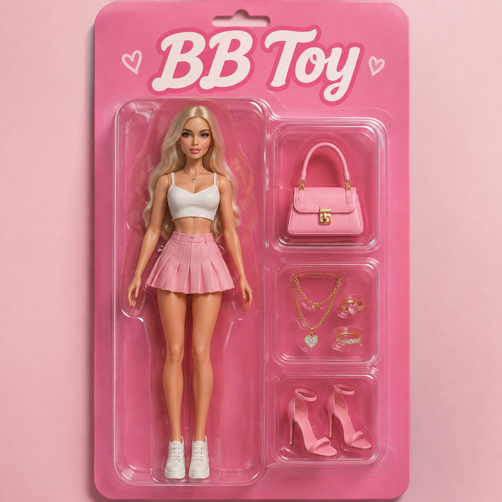

# P02. Collectible Figure Packaging

## 👀 Preview

[](../assets/p02-collectible-figure-packaging/collectible-packaging-result.png)

## 👇 Workflow

`Text / optional character reference → packaging image`

## 🔖 Full Prompt

```text
Create a studio product photograph of an original collectible character toy called "[toy name]" inside a clear blister package on a [backing color] cardboard backing.

Use the uploaded person or character as the identity reference if provided; otherwise design a character based on [character description]. Preserve the reference's identifying features, anatomy, proportions, and colors. Use [outfit or surface details], retaining the reference appearance unless a change is explicitly requested.

Arrange exactly three accessories in separate compartments to the figure's right: [accessory 1], [accessory 2], and [accessory 3]. Keep the figure fully visible. Place the exact title "[toy name]" at the top in large, readable lettering. Use realistic molded plastic, controlled reflections, and soft studio shadows. No additional text or unrelated brand logos. Portrait composition.
```

*Replace `[toy name]`, `[backing color]`, `[character description]`, `[outfit or surface details]`, `[accessory 1]`, `[accessory 2]`, `[accessory 3]` with your own content before generating.*
