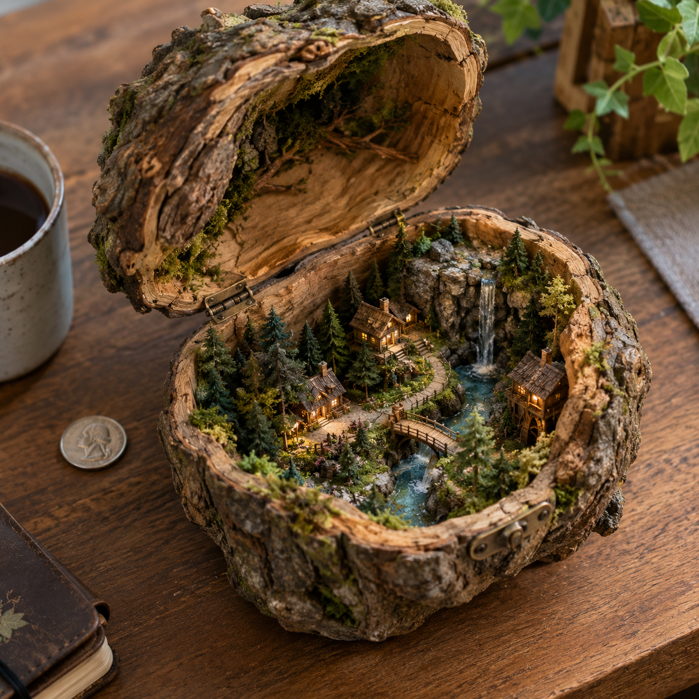

# P03. Miniature World in an Everyday Object

## 👀 Preview

[](../assets/p03-miniature-world/miniature-world-result.png)

## 👇 Workflow

`Text → miniature scene image`

## 🔖 Full Prompt

```text
Create a miniature [world or scene theme] built inside an open [everyday container], resting on a real [supporting surface]. Include [main structures], [landscape details], and [focal feature], all physically contained within the object. The container's interior forms the backdrop, with materials appropriate to its real construction.

Show the whole container from a three-quarter overhead angle. Make the scale relationship unmistakable through realistic seams, edges, fittings, and a life-size [scale reference object] beside it. Use [lighting mood], realistic miniature materials, and shallow depth of field that keeps the scene readable. No floating structures or text. Landscape composition.
```

*Replace `[world or scene theme]`, `[everyday container]`, `[supporting surface]`, `[main structures]`, `[landscape details]`, `[focal feature]`, `[scale reference object]`, `[lighting mood]` with your own content before generating.*
