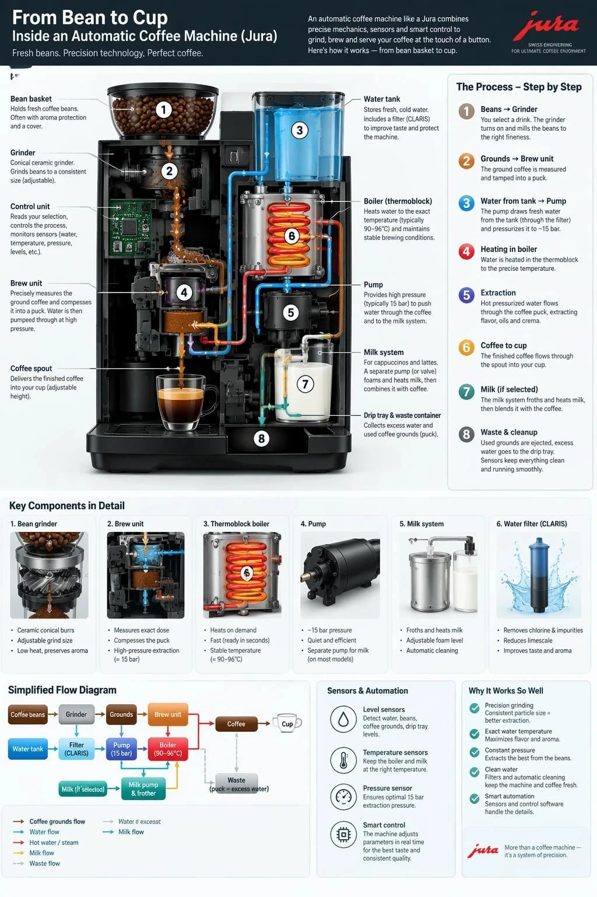
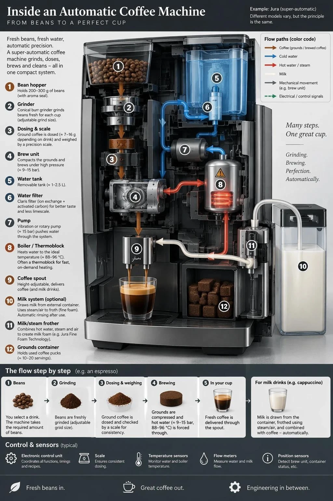

# P14. Automatic Coffee Machine Infographic

## 👀 Preview

[](../assets/p14-automatic-coffee-machine-infographic/source-example-01.webp)

[](../assets/p14-automatic-coffee-machine-infographic/source-example-02.webp)

## 👇 Workflow

`Text → image`

## 🔖 Full Prompt

```text
Create a detailed Infographic of the functioning and flow of an automatic coffee machine like a Jura.
From bean basket, to grinding, to scale, water tank, boiler, etc.
I'd like to understand technically and visually the flow.
```

<sub>[Source: Reddit](https://www.reddit.com/r/ChatGPT/comments/1wcatvx/gpt_image_25_prompt_guide_2026_13_8_rules_and_8/)</sub>
