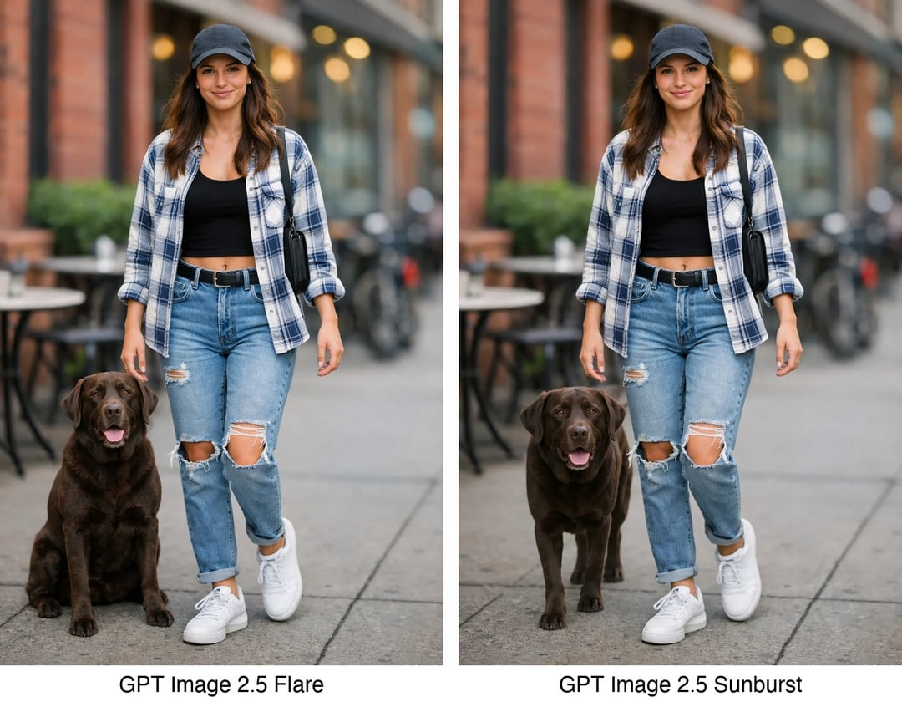

# P32. Dog Compositing into a Street Scene

## 👀 Preview

[](../assets/p32-dog-compositing-into-a-street-scene/source-example-01.jpg)

## 👇 Workflow

`Street scene + dog reference → composite image`

## 🔖 Full Prompt

```text
Place the dog from the second image into the setting of image 1, right next to the woman, use the same style of lighting, composition and background. Do not change anything else.
```

<sub>(Author unconfirmed) · [Source: Reddit](https://www.reddit.com/r/ChatGPT/comments/1wcj1ud/gpt_image_25_prompt_guide_2026_23_9_official_edit/)</sub>
