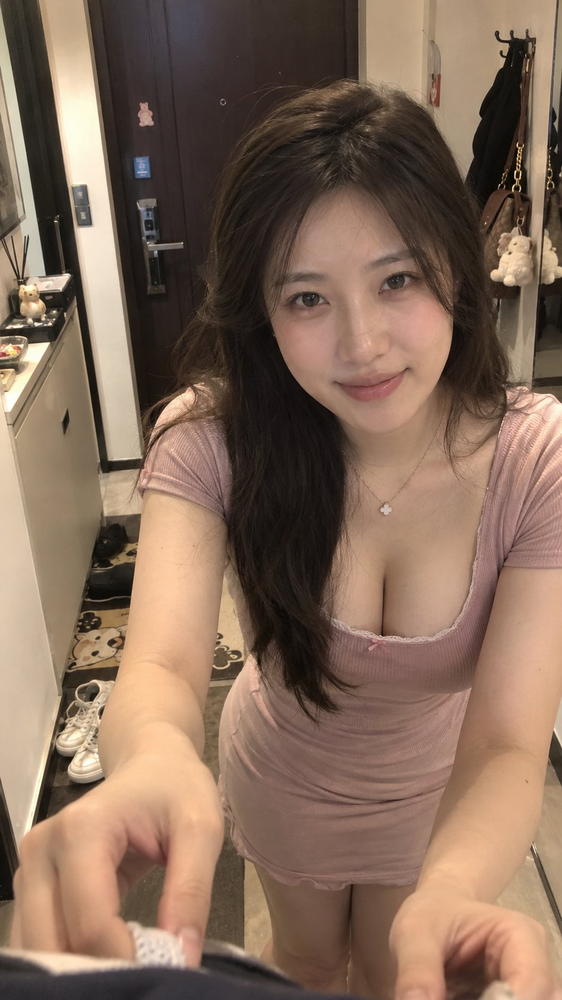

# P60. 玄关整理衣领的亲密视角人像

[English](../p60-intimate-hallway-pov-portrait.md) | [简体中文](p60-intimate-hallway-pov-portrait.md)

## 👀 预览

[](../../assets/p60-intimate-hallway-pov-portrait/source-example-01.jpg)

## 👇 工作流

`文字 → 玄关亲密视角人像`

## 🔖 完整提示词

```text
风格方向： 出门前亲密整理情绪
场景方向： 玄关 / 全身镜旁
服装方向： 雾粉色修身短袖家居裙或约会裙
气质标签： 温柔、轻熟、亲近、认真、甜
身形方向： 丰腴自然曲线
线条强调： 强
镜头方向： 女生站在镜头前很近的位置，身体偏向镜头，双手抬到镜头前方，像正在帮男友整理衣领或拉平衣服，整理完后抬眼看向镜头
画幅比例： 9:16
互动重点： 镜头直接承担“男友身体位置”，会产生非常明显的恋爱 POV；近距离也更容易自然呈现肩颈、胸腰轮廓。
```

<sub>(by [@liyue_ai](https://x.com/liyue_ai/status/2100152524884058399)) · [来源平台： X](https://x.com/liyue_ai/status/2100152524884058399) · 英文由 SeeAPI 翻译</sub>
